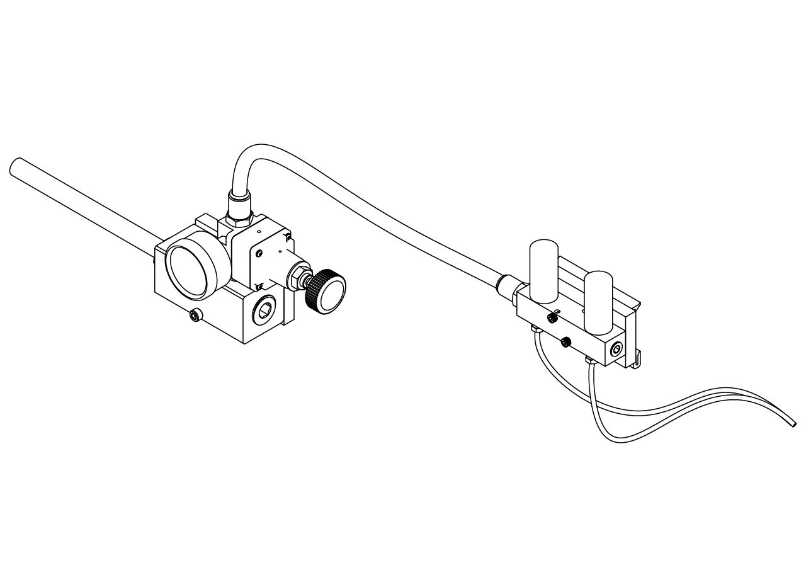
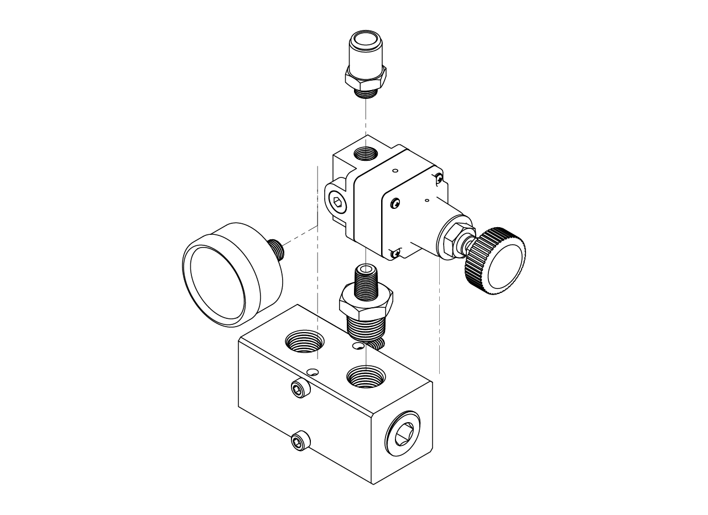
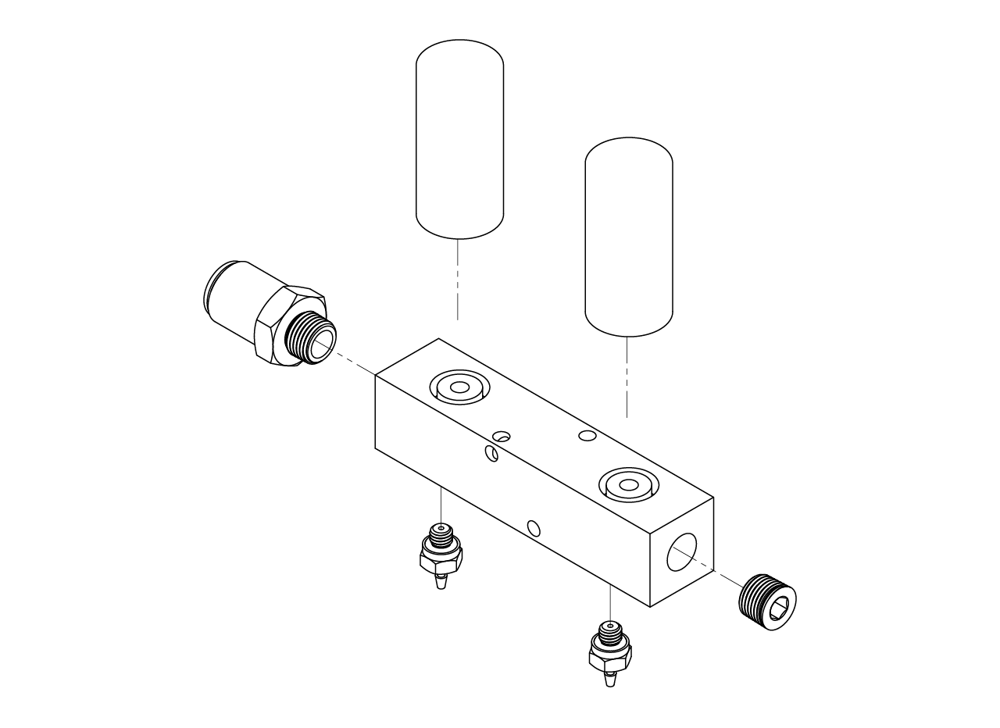
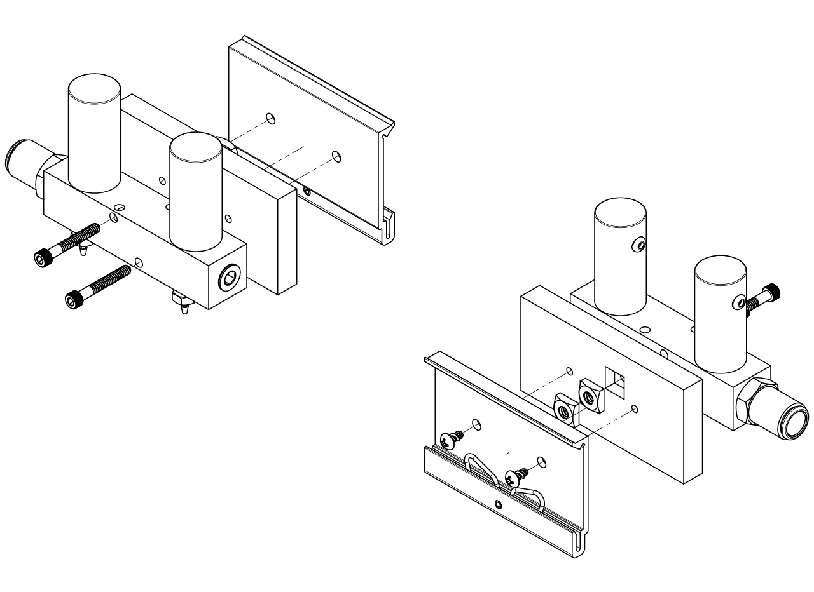
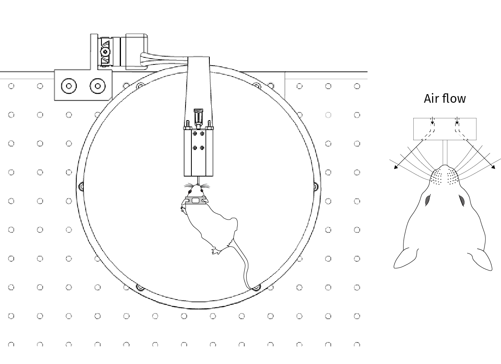

# {{ $frontmatter.title }}

The air puffs module has two main parts: air pressure regulation and valve control, and stimulus delivery.

## Pressure regulator assembly

1. Remove the screw from the front of the miniature compressed air regulator (with the inlet down and the regulator screw on the right) and screw in the pressure gauge. Put the straight reducer, 3/8 x 1/8 NPT male, on the inlet of the regulator and a push-to-connect tube fitting for 3/8" tube OD x 1/8 NPT male on the outlet. Then screw the assembly into the second outlet of the air supply manifold.

:::tip
 Make sure to attach this assembly before screwing the air supply manifold to the T-slotted frame.
:::

## Control manifold assembly

1. Have a machine shop make the air puffs control manifold in aluminum. With the small 10-32 holes facing down, insert a hex drive plug, 1/8 NPTF, at the right end, a pair of 1/16" tube ID x 10-32 male barbed tube fittings at the bottom, a push-to-connect tube fitting for 3/8" tube OD x 1/8 NPT male at the left, and finally a pair of subminiature solenoid valves for air from Gems Sensors & Controls (EG2020-06MM-B-G1-204).

2. Place a couple of 10-24 square nuts at the back of the manifold-to-DIN-rail-clip adapter; if needed, apply some pressure so they go all the way into the holes (you can use a hammer for this). Then use a couple of 6-32 x 1" long screws to screw the manifold to the adapter. After that, use a couple of number 6 size, 1/4" long thread-forming screws to attach a 75 mm DIN rail mounting clip to the adapter. Place the entire assembly into the bottom DIN rail, somewhere between the hole for the tubing and the air supply manifold.

3. Connect the manifold outputs to the tube fittings at the back of the spout holder inside the rig using Tygon PVC tubing for food, beverage and dairy, 1/16" ID, 1/8" OD. If you installed a hose and cable carrier, route the tubes through it.

4. Connect the valves to the proper outputs of the solenoid valve driver in the control module.
