# {{ $frontmatter.title }}

The air supply module consists of a manifold connected to the main lab air supply and an air flow control valve on the manifold whose output goes to an air flowmeter. The flowmeter provides a constant flow of air, through an adapter in the cabinet panel, to the cup that makes the Styrofoam ball float. The manifold also supplies air to other modules, such as the air puffs, and another manifold can be added if other modules require an air supply.

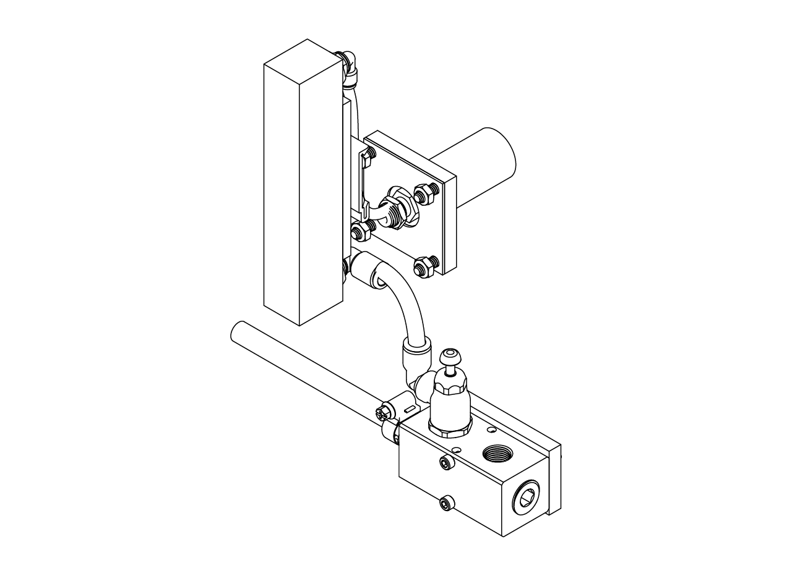

## Manifold assembly

If the air puffs are going to be used, we recommend adding the pressure gauge during this step; otherwise, put a plug instead of the gauge on the second outlet of the manifold. First, install a 1/2 NPT plug and a push-to-connect straight adapter for air, for 3/8" tube OD x 1/2 NPT male, in the manifold. Then install the pressure gauge, or another plug if the air puffs are not going to be installed. Finally, install a 3/8 NPT male inlet x 3/8" push-to-connect female outlet air flow control valve into the first outlet of the manifold.

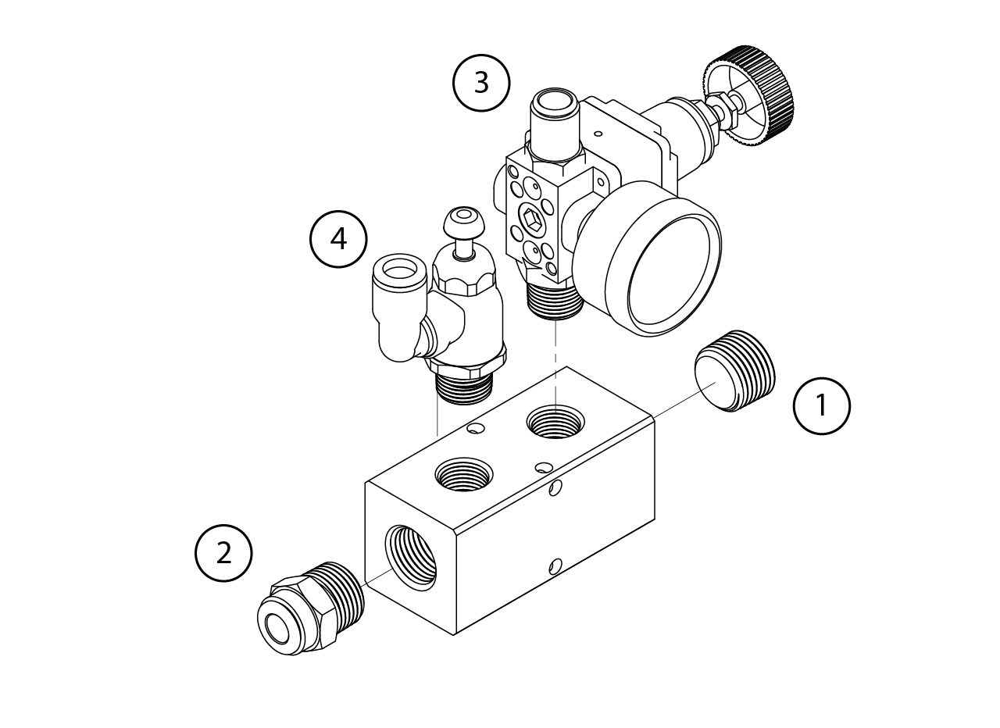

Once assembled, place the manifold in the lower T-slotted profile at the left side of the cabinet (the same as the DIN rails). First, insert a pair of T-slotted framing drop-in nuts with spring tab, 5/16"-18 thread size, into the profile. Then, place a pair of 10-24 square nuts at the back of the 3D printed frame-to-manifold adapter and screw the adapter to the frame with 5/16"-18 x 1/2" long low-profile screws.

Attach the manifold to the adapter using a pair of 10-24 x 1-7/8" long screws.

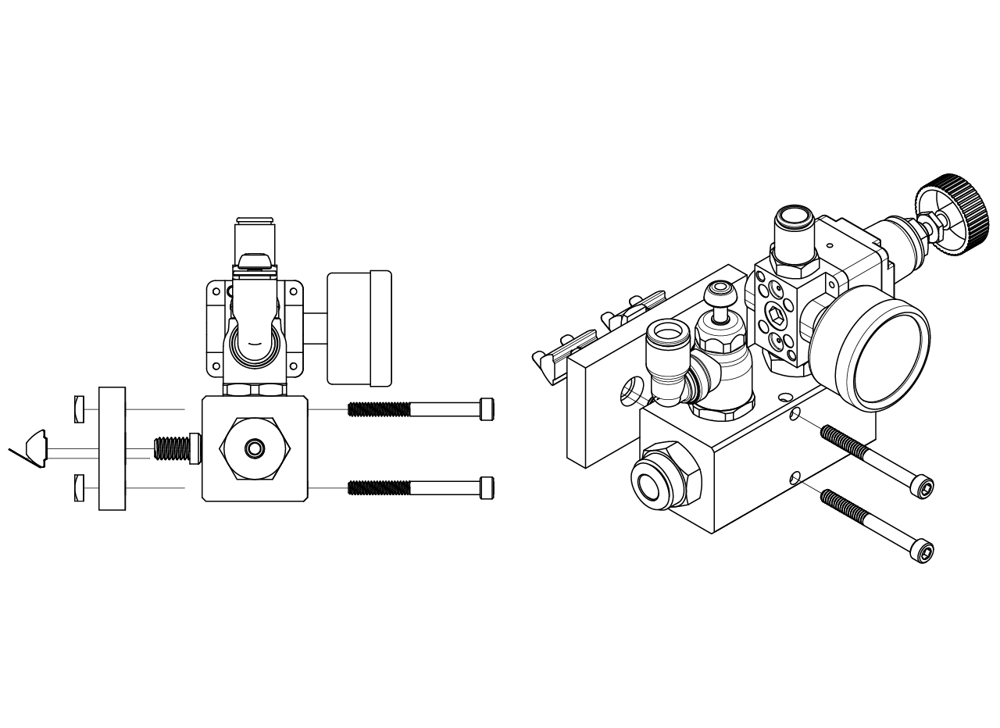

## Air flowmeter assembly

To assemble the air flowmeter, first attach a push-to-connect 90 degree swivel elbow for air, for 1/4" tube OD x 1/4 NPT male, to the top outlet, and a push-to-connect 90 degree swivel elbow for air, for 3/8" tube OD x 1/4 NPT male, to the bottom inlet. Then, use a couple of 10-32 x 5/16" long screws to attach the air-flowmeter-to-DIN-mounting-clip adapter to the air flowmeter. Finally, use number 8 x 5/16" long rounded head thread-forming screws to attach a spring clip DIN rail mounting adapter.

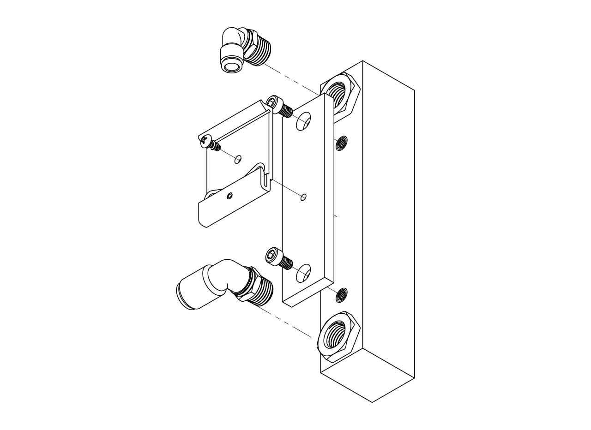

Attach the air flowmeter to the DIN rail by hooking in the bottom part first, then pushing it up and forward at the same time.

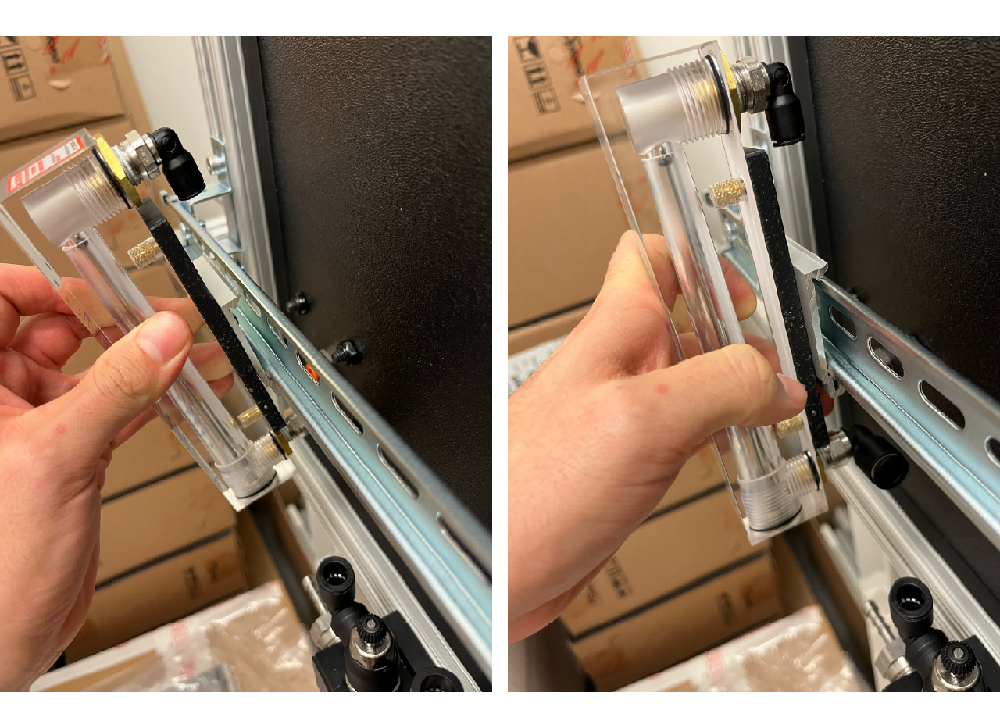

Then, insert one end of a firm polyurethane air tube, 1/4" ID, 3/8" OD, into the inlet of the air flowmeter until it clicks and the tube can't come out of the connector. Measure the distance to the outlet connector of the air flow control valve (bottom of the connector, as seen in the pictures below), cut the tube and connect it.

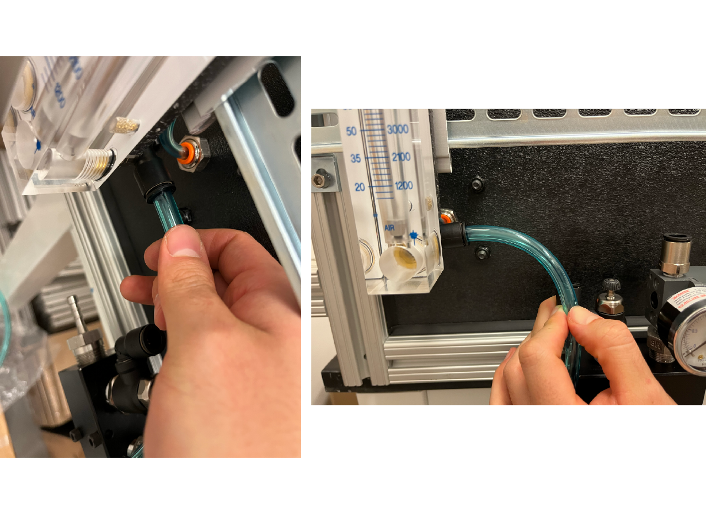

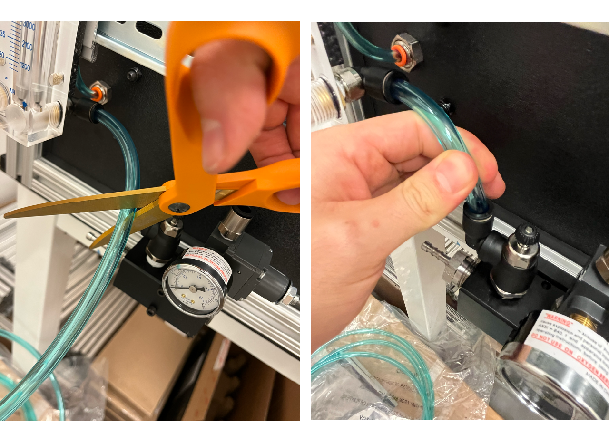

## Air flow adapter

To install the air flow adapter, first screw the push-to-connect through-wall adapter, 1/4" tube OD x 1/4 NPT female, into the cabinet hole. Then, from inside the cabinet, screw the 1/4 NPT male air nozzle into the adapter, fit the air-supply-to-ball-adapter panel gasket and the 3D printed hose-to-panel adapter over it, and attach them to the panel with four 1/4"-20 x 3/4" long screws and four 1/4"-20 locknuts. Follow the same procedure as above to connect a firm polyurethane air tube, 1/8" ID, 1/4" OD, from the flowmeter outlet to the cabinet inlet.

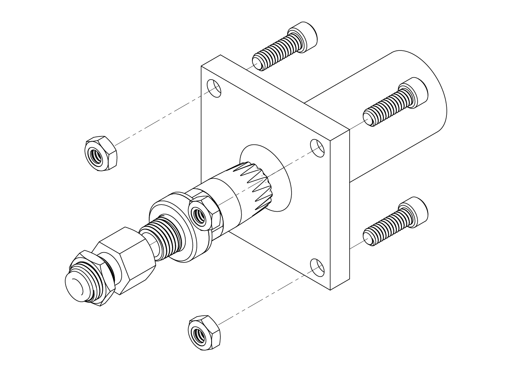

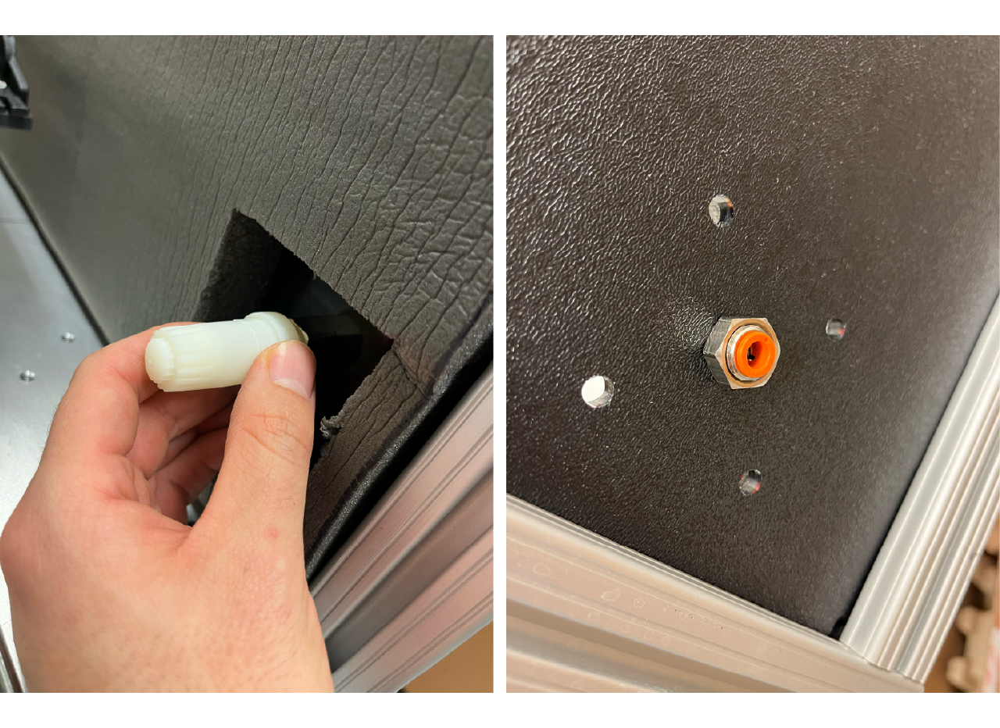

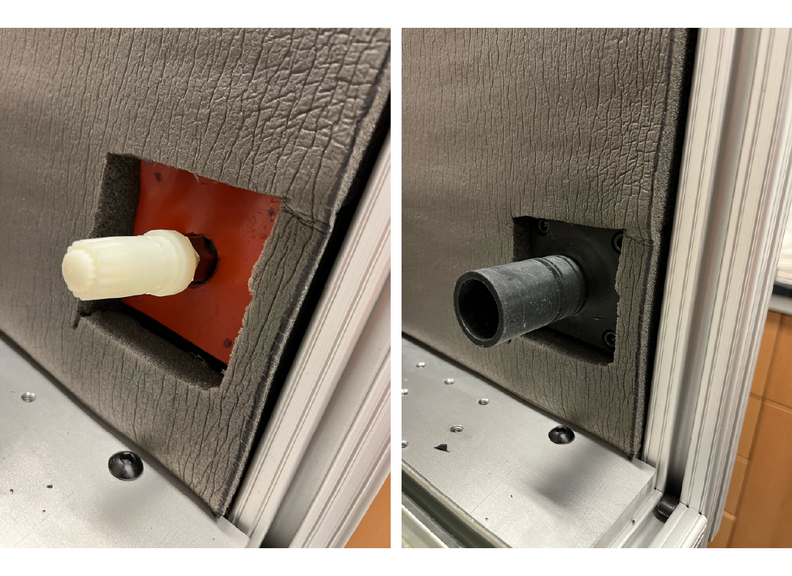

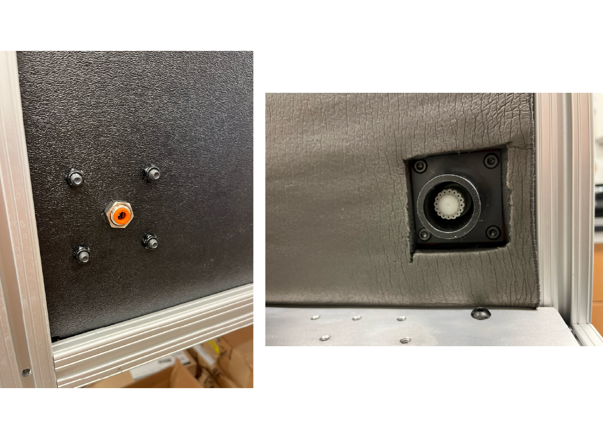

Take a very flexible PVC duct hose, 1 1/4" ID, 1 1/2" OD, attach a PVC screw-on fitting for 1 1/4" ID to one end and connect it to the adapter in the cabinet. Pull the stage all the way out, measure the length of hose needed, cut it and attach a fitting to the other end. Finally, connect it to the cup on the stage.
