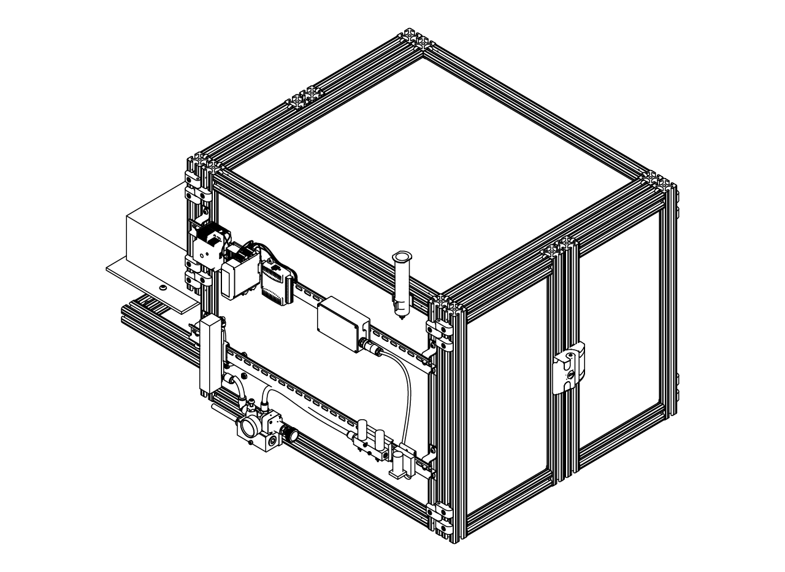

# {{ $frontmatter.title }}

<figure>
  
</figure>

## Introduction

This website is a central repository for the documentation regarding the **building** of mini virtual reality training rigs as part of BRAIN CoGS at Princeton Neuroscience Institute.

Building documentation is divided into modules, each module contains a detailed explanaiton of the building process. The STEP files for of the entire rig can be found <a href='./assets/drawings/Training mini VR rig.step.zip'>here</a>. And a list of parts can be found [here](https://docs.google.com/spreadsheets/d/e/2PACX-1vSSVNJ8194nIha6Z6vqLnmFLNS-IRL88ZfY1aRPxX1KbcyrDNHXVJ4QOEmY1oKVSrLkx7DTxyjK0ceC/pubhtml#) or [downloaded in xlsx format](https://docs.google.com/spreadsheets/d/e/2PACX-1vSSVNJ8194nIha6Z6vqLnmFLNS-IRL88ZfY1aRPxX1KbcyrDNHXVJ4QOEmY1oKVSrLkx7DTxyjK0ceC/pub?output=xlsx)

If you need any other file, any other format, need help or just wanted to reach out don't hesitate to contact [Juan Luna](mailto:jl4459@princeton.edu) or any other memeber of the BRAIN CoGS team.

## Recommended steps to assembly.

1. Begin with the assembly of the bottom part of the cabinet (steps 1-6 of [cabinet assembly](/building/cabinet.html#cabinet-assembly)). In parallel, you can start with the construction of the [screen](/building/projection.html#screen-building).
2. Follow the intructions to assemble the [stage](/building/stage.html) and [install](/building/stage.html#stage-installation) it in the cabinet. 
3. Screw the [mirror](/building/projection.html#mirror) and the [pillars](/building/projection.html#screen-assembly), but not the top plates that will hold the screen.
4. Install the [air supply hose adapter](/building/air-supply.html#air-flow-adapter) on the side panel and make the holes on the panel if necessary, install the side panels on the cabinet (step 8 of [cabinet assembly](/building/cabinet.html#cabinet-assembly)).
5. Make the hole on the back panel for the projector if necessary, install the back panel and slide down the frame (step 7 of [cabinet assembly](/building/cabinet.html#cabinet-assembly)) and insert the joining strip along the out edges of the panels.
6. Place the adapters on top of the pillars and install the screen (step 2 of [screen assembly](/building/projection.html#screen-assembly)).
7. Assemble the top portion of the cabinet (step 8 of [cabinet assembly](/building/cabinet.html#cabinet-assembly)).
8. Install the DIN rails (steps 11 of [cabinet assembly](/building/cabinet.html#cabinet-assembly)) and the [air supply](/building/air-supply.html), [air puffs](/building/air-puffs.html) if using, and [control](/building/control.html) module.
9. Install the [positioning system](/building/positioning.html) in the stage of the rig.
10. Assemble and install the doors (steps 9-10 of [cabinet assembly](/building/cabinet.html#cabinet-assembly)).
