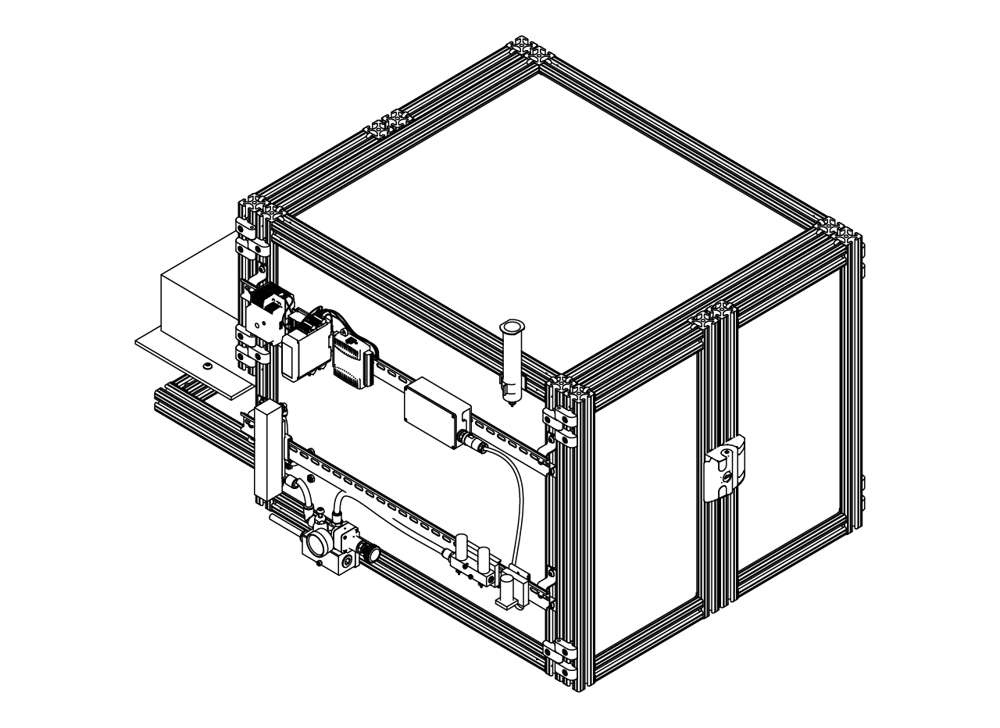

# {{ $frontmatter.title }}

## Introduction

This website is the central repository for documentation on **building** the mini virtual reality training rigs as part of BRAIN CoGS at Princeton Neuroscience Institute.

The building documentation is divided into modules, and each module explains its building process in detail. The STEP files for the entire rig can be downloaded <a href='/building/drawings/Training-mini-VR-rig.step.zip' download>here</a>. The list of parts can be viewed [here](https://docs.google.com/spreadsheets/d/e/2PACX-1vSSVNJ8194nIha6Z6vqLnmFLNS-IRL88ZfY1aRPxX1KbcyrDNHXVJ4QOEmY1oKVSrLkx7DTxyjK0ceC/pubhtml#) or [downloaded in XLSX format](https://docs.google.com/spreadsheets/d/e/2PACX-1vSSVNJ8194nIha6Z6vqLnmFLNS-IRL88ZfY1aRPxX1KbcyrDNHXVJ4QOEmY1oKVSrLkx7DTxyjK0ceC/pub?output=xlsx).

If you need any other file or format, need help, or just want to reach out, don't hesitate to contact [Juan Luna](mailto:jl4459@princeton.edu) or any other member of the BRAIN CoGS team.

## Recommended assembly order {#recommended-steps-to-assembly}

1. Begin with the assembly of the bottom part of the cabinet (steps 1-6 of [cabinet assembly](/building/cabinet.html#cabinet-assembly)). In parallel, you can start with the construction of the [screen](/building/projection.html#screen-building).
2. Follow the instructions to assemble the [stage](/building/stage.html) and [install](/building/stage.html#stage-installation) it in the cabinet.
3. Screw the [mirror](/building/projection.html#mirror) and the [pillars](/building/projection.html#screen-assembly), but not the top plates that will hold the screen.
4. Install the [air supply hose adapter](/building/air-supply.html#air-flow-adapter) on the side panel (drill the holes in the panel if necessary), then install the side panels on the cabinet (step 8 of [cabinet assembly](/building/cabinet.html#cabinet-assembly)).
5. Cut the hole in the back panel for the projector if necessary, install the back panel, slide it down the frame (step 7 of [cabinet assembly](/building/cabinet.html#cabinet-assembly)) and insert the joining strip along the outer edges of the panels.
6. Place the adapters on top of the pillars and install the screen (step 2 of [screen assembly](/building/projection.html#screen-assembly)).
7. Assemble the top portion of the cabinet (step 8 of [cabinet assembly](/building/cabinet.html#cabinet-assembly)).
8. Install the DIN rails (step 11 of [cabinet assembly](/building/cabinet.html#cabinet-assembly)) and the [air supply](/building/air-supply.html), [air puffs](/building/air-puffs.html) (if used) and [control](/building/control.html) modules.
9. Install the [positioning system](/building/positioning.html) on the rig's stage.
10. Assemble and install the doors (steps 9 and 12 of [cabinet assembly](/building/cabinet.html#cabinet-assembly)).
