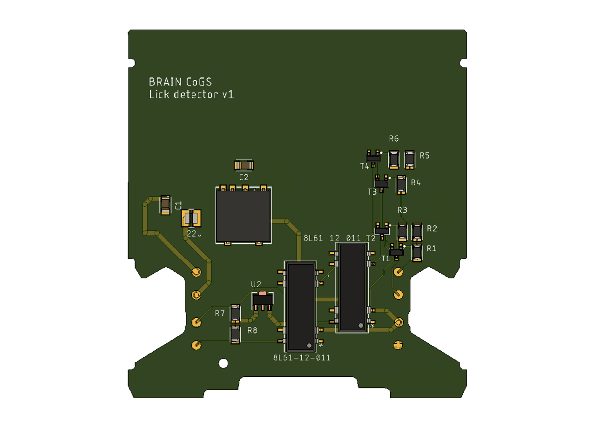
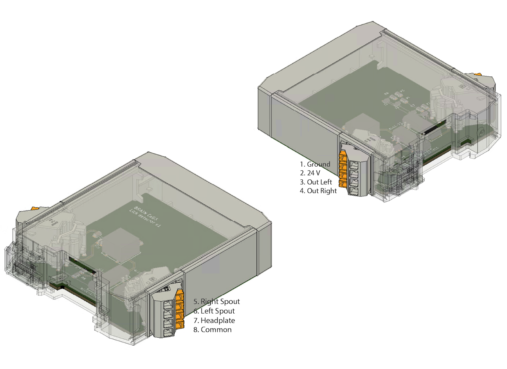

# {{ $frontmatter.title }}

The lick detection module is based on a simple transistor design (Slotnick 2009), which we modified to detect licks on 2 spouts in the same module. We also added a DC-DC converter to isolate the circuit from the power source, and a 5 V voltage regulator after the relays to get a TTL signal at the output of both circuits.

[comment]: # (Add diagram of the modified circuit with the explanation of the inputs and outputs)

The module was designed this way for a specific task that requires two spouts, but it can also be used with one spout (e.g. to count the number of licks during a task). Below is an example of a setup using two lick spouts in a decision-making task developed by a member of the BRAIN CoGS team.

[comment]: # (Drawing of the two lick spout setting)

## Two lick detection module assembly

Have the PCB made [here](https://www.pcbway.com/project/shareproject/Two_spouts_lick_detector_059c7e07.html) (or download the Gerber files and have it made elsewhere). The step-by-step soldering instructions for the solenoid valve driver in the [control module](/building/control.html#solenoid-valve-driver-assembly) also apply to this module; just use the appropriate components and place them as labeled on the PCB.

| Label | Part No. | Description |
| ----------- | ----------- | ----------- |
| R1, R2, R4, R5 | [AC1206FR-0710ML](https://www.digikey.com/en/products/detail/yageo/AC1206FR-0710ML/5897214) | 10 MΩ resistors |
| R3, R6 | [AC1206FR-0747KL](https://www.digikey.com/en/products/detail/yageo/AC1206FR-0747KL/5897559) | 47 kΩ resistors |
| R7, R8 | [AC1206FR-0710KL](https://www.digikey.com/en/products/detail/yageo/ac1206fr-0710kl/5897213) | 10 kΩ resistors |
| T1, T2, T3, T4 | [MMBT2222LT1G](https://www.digikey.com/en/products/detail/onsemi/mmbt2222lt1g/919595) | NPN BJT transistor |
| 8L61-12-011 (2) | [8L61-12-011](https://www.digikey.com/en/products/detail/coto-technology/8l61-12-011/1914969) | Reed relay, SPDT, 250 mA, 12 V |
| U2 | [UA78L05ACPKE6](https://www.digikey.com/en/products/detail/texas-instruments/ua78l05acpke6/9860880) | Linear voltage regulator |
| No label (middle big square) | [TRS 2-2412](https://www.digikey.com/en/products/detail/traco-power/trs-2-2412/9383650) | Isolated DC-DC converter module |
| C1 | [CL31B475KBHNNNE](https://www.digikey.com/en/products/detail/samsung-electro-mechanics/cl31b475kbhnnne/3888447) | 4.7 µF ceramic capacitor |
| C2 | [CL31C151JBCNNNC](https://www.digikey.com/en/products/detail/samsung-electro-mechanics/cl31c151jbcnnnc/3888469) | 150 pF ceramic capacitor |
| 22 micro | [IFSC1008ABER220M01](https://www.digikey.com/en/products/detail/vishay-dale/ifsc1008aber220m01/2744218) | 22 µH shielded inductor |

After assembling the module, apply the labels as shown in the picture below.

The table below describes each pin of the lick detector module.

| PIN | Description |
| ----------- | ----------- |
| 1. GROUND | Input - ground |
| 2. 24V | Input - 24V DC  |
| 3. OUT LEFT | Output - TTL output pin for the left spout |
| 4. OUT RIGHT | Output - TTL output pin for the right spout |
| 5. RIGHT SPOUT | Input - Connect the right spout to this pin |
| 6. LEFT SPOUT | Input - Connect the left spout to this pin |
| 7. HEADPLATE | Input - Connect the head plate to this pin |
| 8. COMMON | Input - Connect the ground from the NI-DAQ (or any other acquisition device) to this pin |

### Soldering a cable to the feeding spout and head plate holder {#soldering-a-cable-to-the-feeding-spout-and-headplate-holder}

[comment]: # (If possible, please add photos of the process)

1. Sand off the outer layer of the stainless steel spout on one side, near the Luer lock connector (as far as possible from the connector tip). Do the same on the head plate holder wherever you want to attach the cable (we recommend the arm without the tapped hole, so heat-shrink tubing fits over it).

2. Clean the sanded surface with isopropyl alcohol and let it dry. In the meantime, prepare the coaxial cable (we recommend a [26](https://www.digikey.com/en/products/detail/molex-temp-flex/1000660054/4368709) or [28](https://www.digikey.com/en/products/detail/molex/1001935047/8566104) AWG coaxial cable like these) by removing the jacket and the shield, then strip a portion of the insulation to expose the conductor. Repeat on the other end of the cable.

3. Put a small drop of flux on the sanded surface and place the tip of the soldering iron on it (the tip might stick to the stainless steel; that's normal). Keep heating the surface and use solder wire (we found leaded solder works best) to solder the coaxial cable to the spout and the head plate holder.

4. Cover the solder joint with heat-shrink tubing.

To close the detection circuit, you need a contact on the mouse's body. We solder a lead to the head plate holder (repeating steps 1-4), but this can be adapted to other setups.
