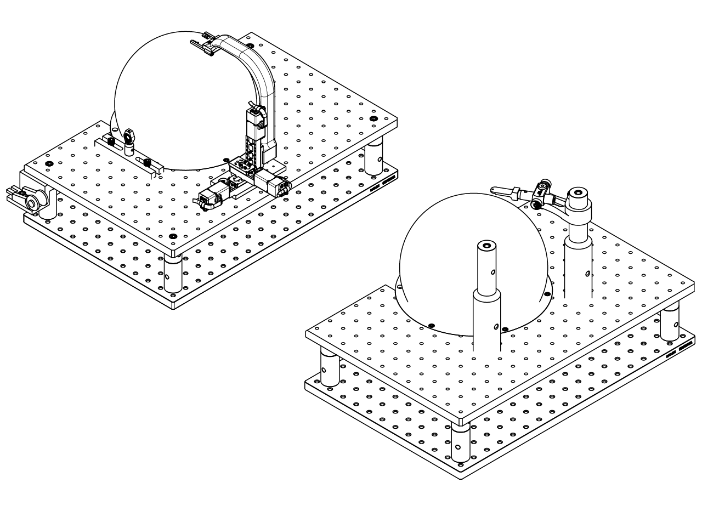
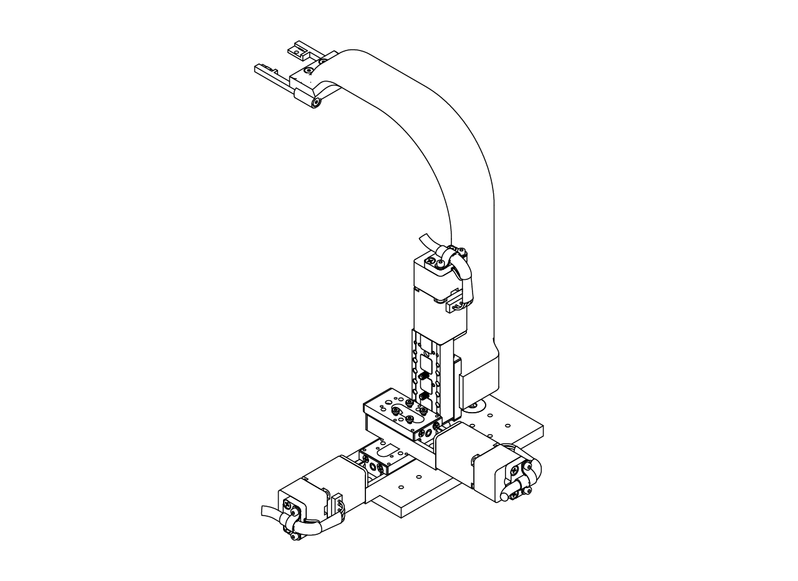
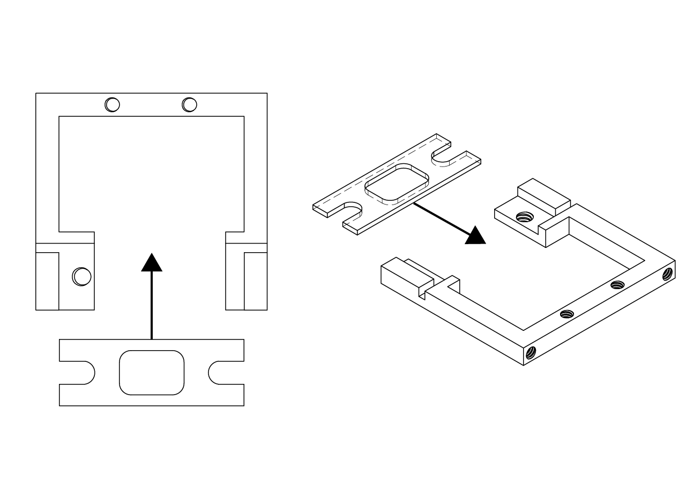
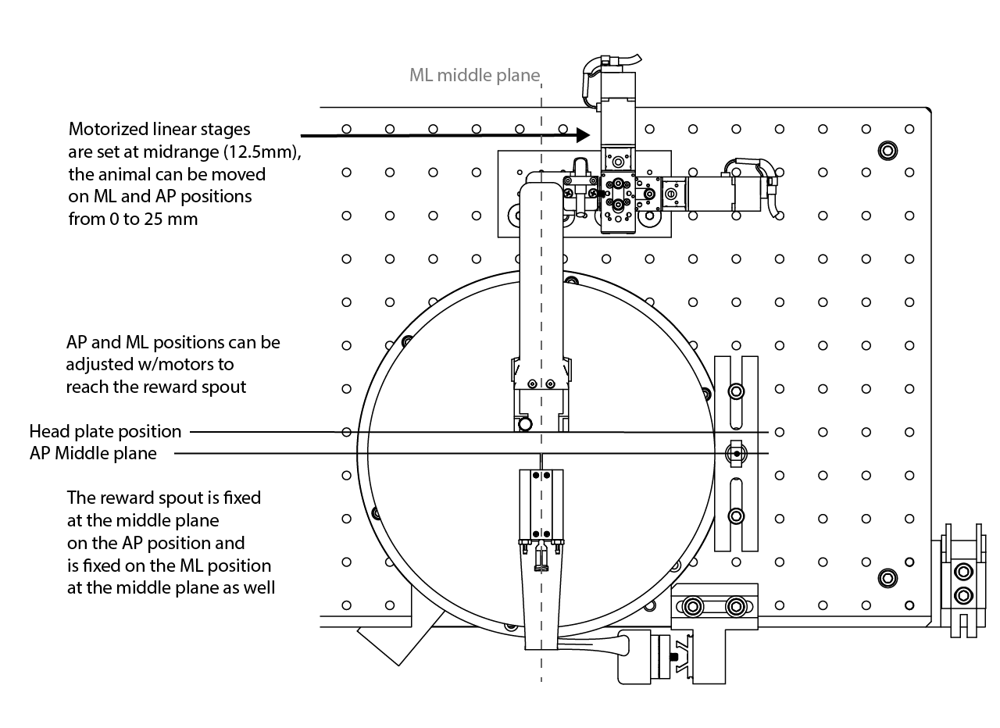
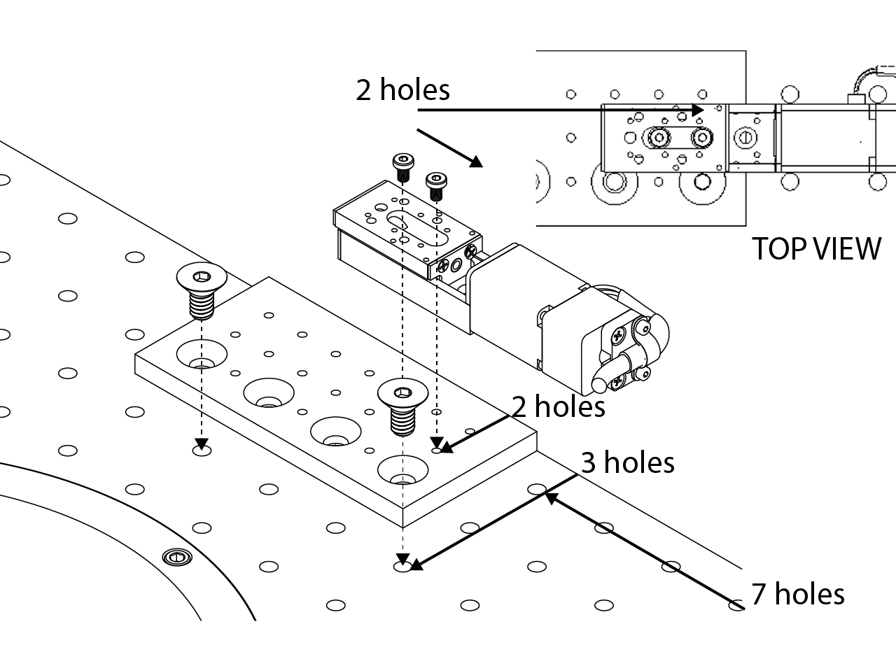
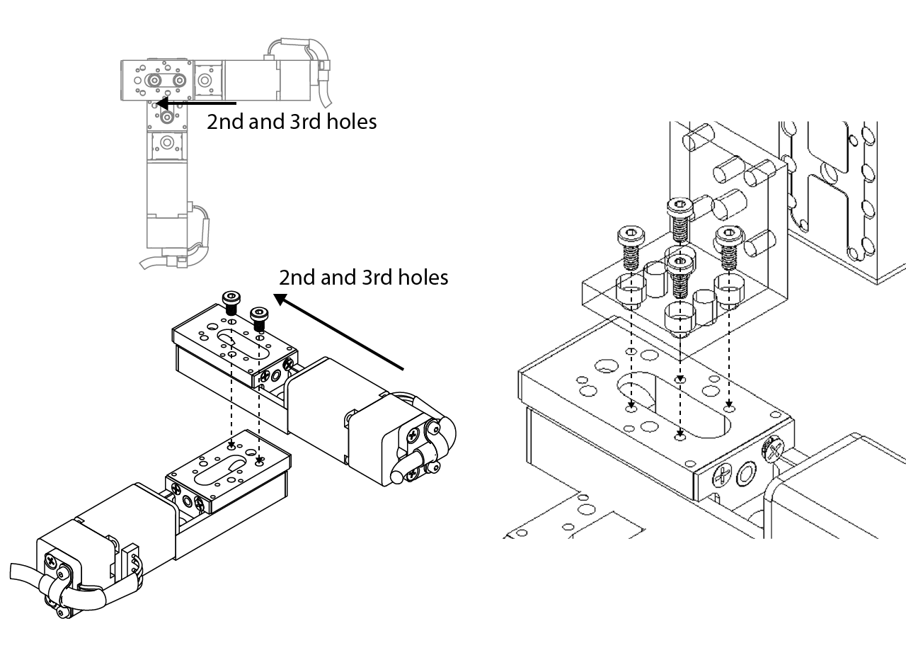
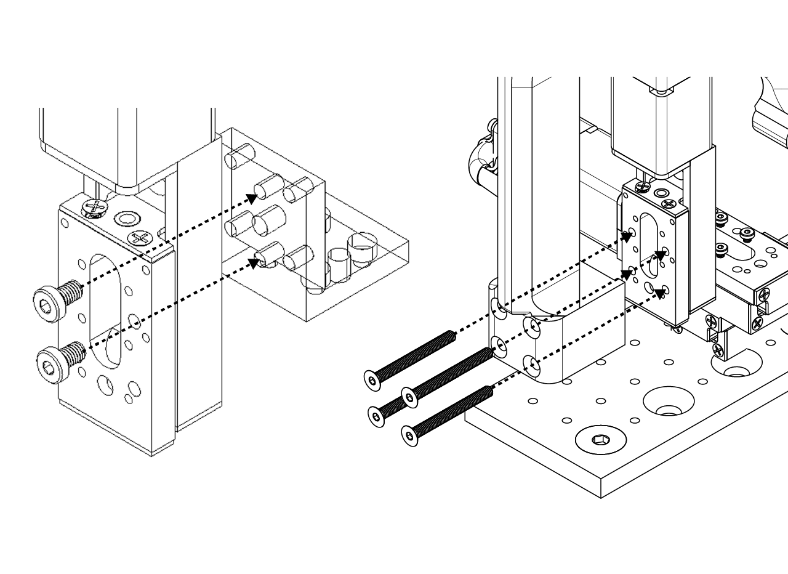
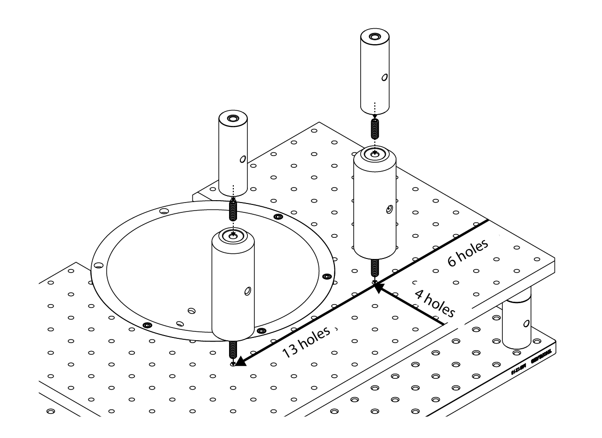
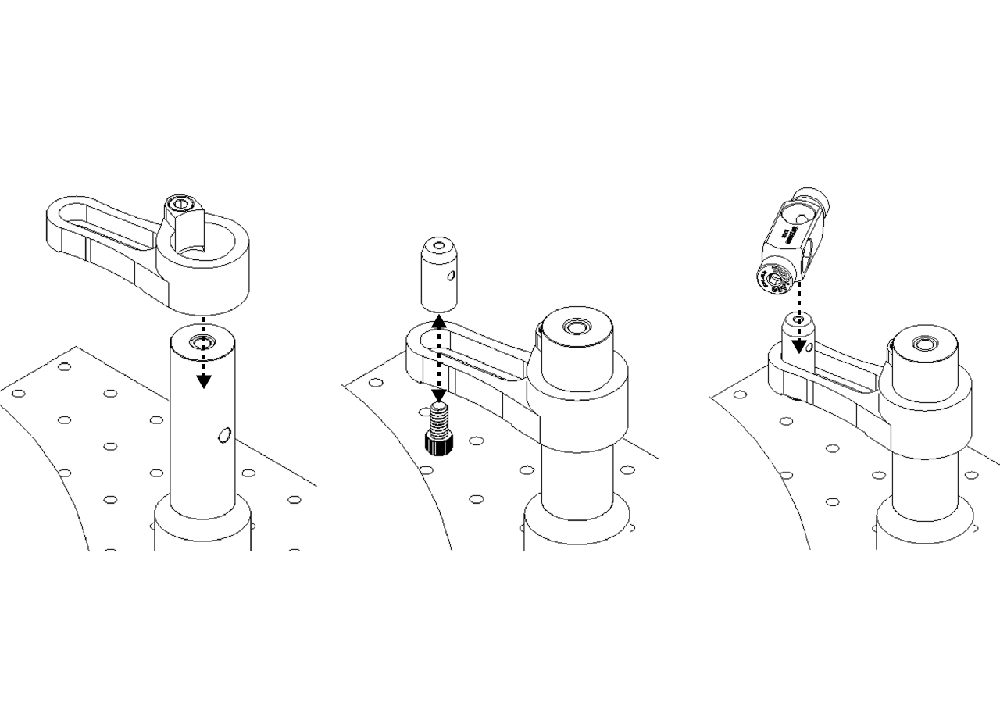
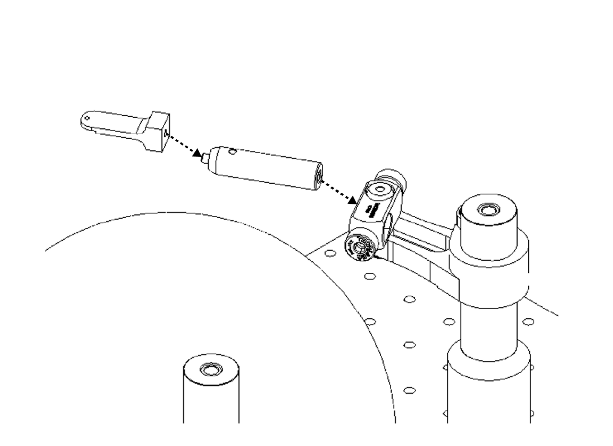

# {{ $frontmatter.title }}

The positioning system holds the subject within the projection boundaries and in the correct posture. It is also designed for high repeatability, so that each subject trained on the same rig can have its own coordinates. Two positioning systems are currently used at our facilities: an automated positioning system that ensures repeatable, personalized positioning for each subject across training rigs and sessions, and a manual positioning system, which consists of low-cost Thorlabs components and a positioning tool developed in house.

The animal's position on the ball should prioritize the correct running posture within the boundaries of the projection calibration. The projection is calibrated assuming the animal's eyes are 0.256" behind the center of the ball on the X axis, 1" above the top of the ball on the Y axis, and centered along the Z axis. An error of up to 0.5" is acceptable.

 and [Federico Claudi](https://zenodo.org/record/3925997#.YOcrtUwpDRY))](./assets/images/positioning/animal-position.png)

## Automated positioning system

The automated positioning system consists of a set of motorized stages in an XYZ configuration. We use the small form factor 25 mm linear stage (LSA25) from Zaber Technologies. We designed an arm that hangs from the top motor (height control), 3D printed in glass-bead-filled Nylon 12 (PA12, MJF) by Shapeways, with a stainless steel head plate holder at its end. The whole assembly is attached to the stage breadboard with a custom adapter.

The head plate holder has to be designed to fit the head plate in use, to minimize variability in the pitch, roll and yaw of the head plate and in the animal's position. This way, the motors achieve better repeatability when adjusting the anteroposterior, dorsoventral and mediolateral position of the animal.

With the motorized stages at midrange, the positioning system sits at the expected anteroposterior (AP) and mediolateral (ML) position of the head plate, as shown in the picture below.

To assemble the positioning system, first attach the custom breadboard adapter to the top stage breadboard at the position shown below, using 82 degree countersink, 1/4"-20 thread, 1/2" long flat head screws. Then attach the first motorized stage at the position shown in the image below, using low-profile M3 x 0.5 mm thread, 5 mm long screws.

Attach the second (AP position) motorized linear stage to the first one using the same kind of screws at the position shown in the image below. Then, attach the Z adapter from Zaber Technologies (AB106) to the stage at the position shown below, using low-profile M2 x 0.4 mm thread, 5 mm long socket head screws.

Attach the third (DV position) motorized linear stage to the AB106 Zaber adapter at the position indicated in the image below, using low-profile M3 x 0.5 mm thread, 5 mm long screws. Finally, screw the 3D printed arm to the DV motorized linear stage using M3 x 0.5 mm thread, 30 mm long hex drive flat head screws, as shown below.

One of the most important variables for mice in the VR tasks is the DV position (height): the mice need to be comfortable enough to run properly on top of the Styrofoam ball. The automated positioning system lets you set a custom height for each subject. The full coordinates of each subject can also be stored in a database and retrieved before training, which improves repeatability and reduces the time needed to set up the subjects.

## Manual positioning system

The manual positioning system consists of Thorlabs and custom-made parts. To assemble it, first attach a 4" post (either PSR-4.0 from Siskiyou or RS4 from Thorlabs) to the top stage breadboard at the position shown in the image below. Then, attach a 3" post (RS3 from Thorlabs) on top of the previously installed post.

Slide a Thorlabs RB2 down the right post (looking at the stage from behind) and screw it in place, then attach a TR1 to the RB2 clamp with a 4-40 screw. Then slide a Thorlabs RA90 down the TR1 post and tighten it, as indicated in the image below.

Finally, screw the custom stainless steel head plate adapter to a TR2 post from Thorlabs, then attach it to the RA90 and tighten it, as shown below.

We designed a positioning tool that uses the 2 pillars of the mini VR rig's stage as its reference. The tool is a 3D printed part holding a glued-on transparency, with marker lines for the Y position of the animal (1st and 2nd notches of the tool) and the Z line (A and B arrows on the tool). With this tool, the user can easily set the animal's X and Y position; the height must then be fine-tuned so the animal can run comfortably.

The tool also has room for magnets, fixed with epoxy resin in the pillar holes, so that it sits steadily on top of the pillars.

::: warning
The pillars must be placed in the correct holes of the breadboard as shown in the figure, otherwise the distance from the center of the ball could be wrong.
:::

)](./assets/images/positioning/positioning-tool.png)
