# {{ $frontmatter.title }}

 The projection module consists of the screen assembly inside the cabinet and a projector mounted on the outside of the cabinet, at the back. The projector throws the image onto a spherical mirror attached to the cabinet below the screen, which reflects the image onto the dome screen.

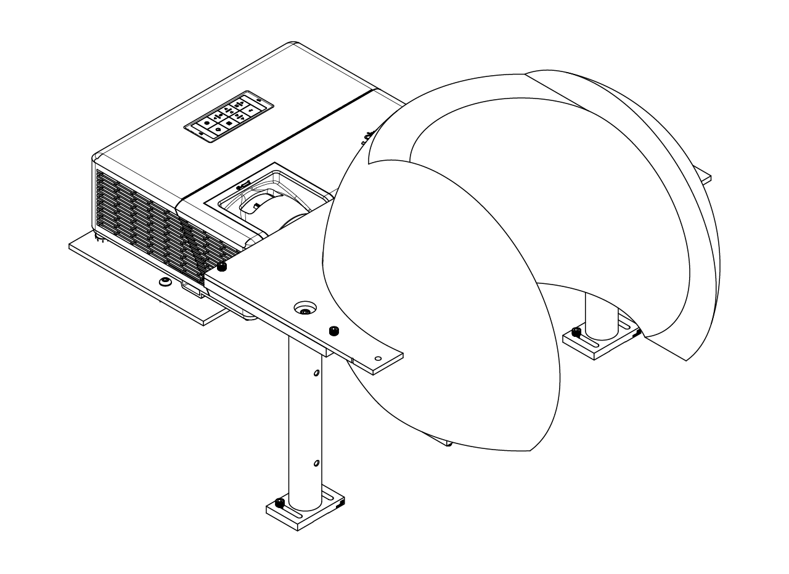

 ## Mirror

The spherical mirror is custom made by Thorlabs (item number LA1740-P01-SP). Contact them for a quote before placing the order, and ask about price breaks if you're planning to build more than 5 training rigs (the price can drop by up to 50% for 5 to 10 pieces).

We mount the spherical mirror on a custom aluminum base made by a machine shop. The assembly instructions are below.

1. Start by assembling the mirror holder, which consists of the custom holder, one 1" diameter 2" long post (RS1), one 1" diameter 1.5" long post (RS2) and a BA2 post base from Thorlabs. Use a screwdriver thin enough to pass through the hole at the center of the post, and apply enough force to screw the pieces together properly.

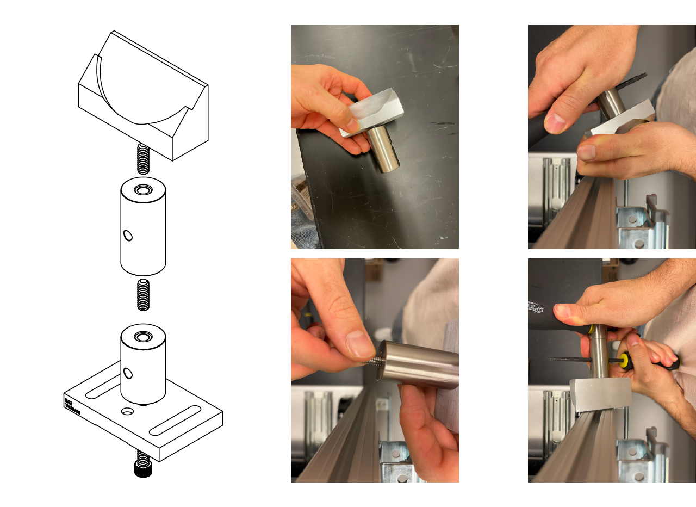

2. To align the pieces, screw on the base, but not all the way. Then, place the pieces on a flat surface and make sure that both the mirror base and the BA2 post base lie completely flat on it. Hold them down with one hand so they stay that way, and tighten the base screw with the other.

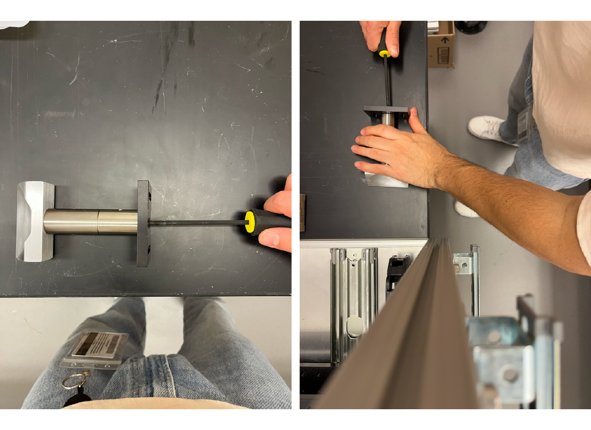

3. Use a file to roughen the surface that will hold the mirror, then clean it with ethanol. Apply structural epoxy to the aluminum base, following the instructions for your specific type. Wearing nitrile gloves, carefully place the mirror on top of the base and apply some pressure so it sits flat on the base surface, then clean up any epoxy that leaks out. Let the epoxy cure for 24 hours.

::: tip
  Apply just enough epoxy in the middle of the aluminum base. Don't spread it all over, since it could leak out once you place the mirror and press on it.
:::

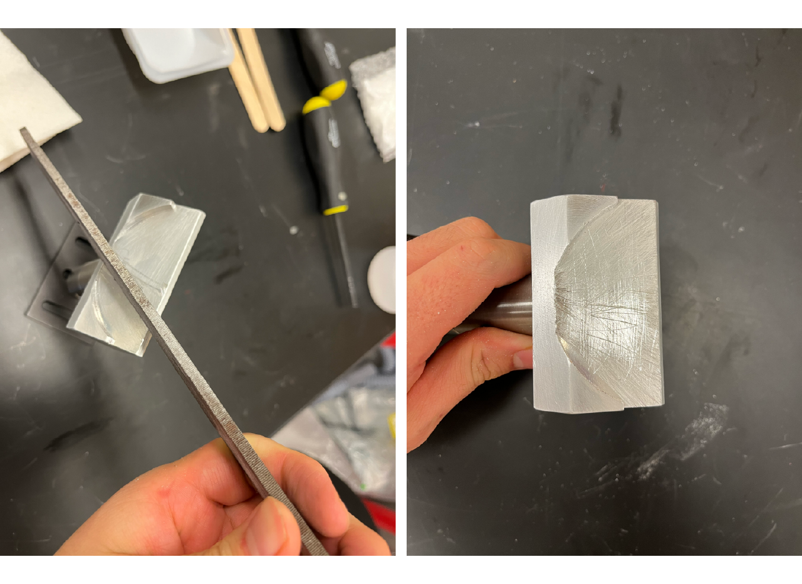

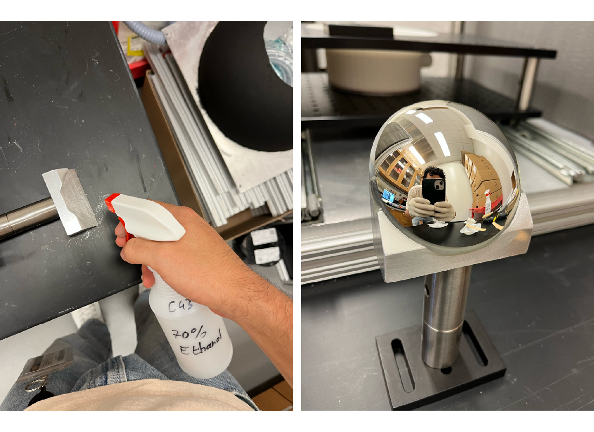

4. Screw the mirror and its base to the cabinet bottom plate with 1/4"-20 screws, placing the base as far from the stage as it can go (push it all the way toward the projector, then screw it down), as shown below.

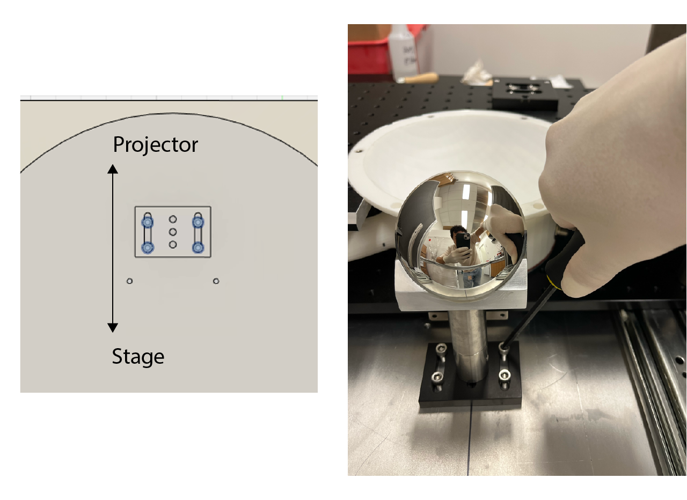

 ## Projector

 The projector is installed at the back of the cabinet, on top of a T-slotted frame structure. To assemble it, place a couple of T-slot fasteners on the frame at the back of the cabinet. Then, loosely screw on the projector's aluminum plate, set it 1 1/4" from the edge of the plate to the intersection of the frames as shown in the pictures below, and tighten the screws. Finally, screw the projector to the aluminum plate.

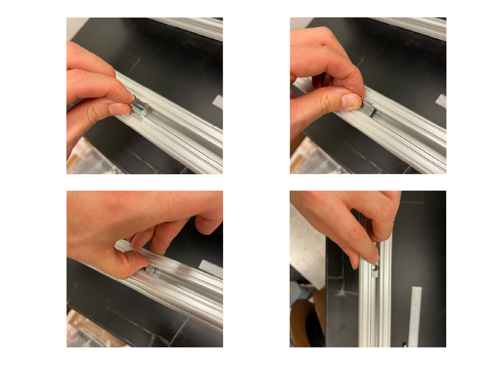

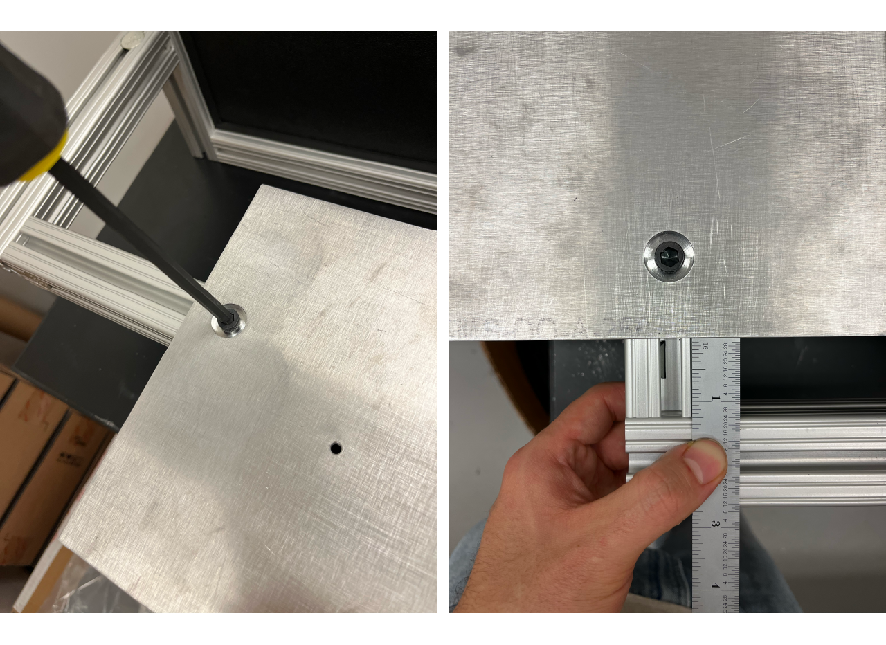

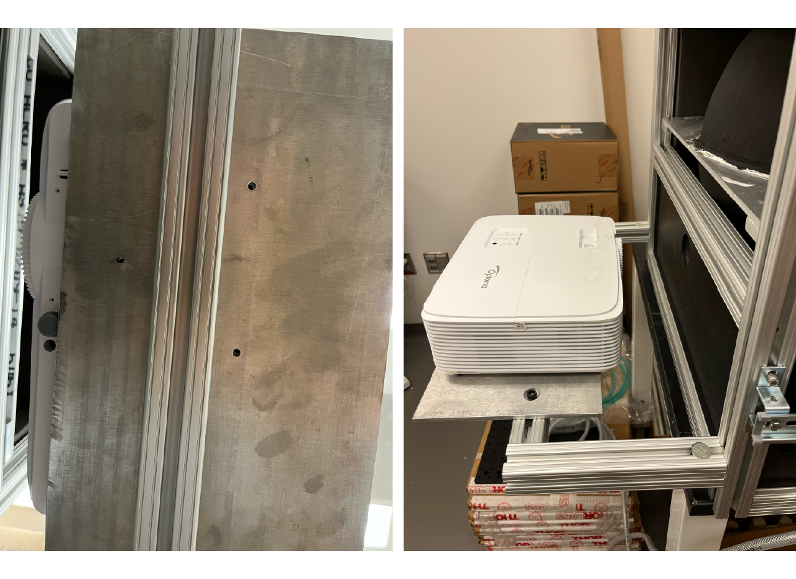

 ## Screen building

 Building the screen can take up to 5 days. We describe the process step by step, grouped by the day we did them and with the time each day took us. We recommend following this schedule so the materials can dry properly; you can use the drying time to assemble other modules in parallel.

 The first step in building the projection module is making the dome screen. A Styrofoam ball with an 18" outer diameter and a 16" inner diameter is made by an external supplier. For ease of transport, the screens were shipped as half spheres.

 ### Day 1 [time: ~3 hours].

 1. If the balls are shipped in halves, first mark the equator on each half sphere. Use a thread to measure the outer diameter of the screen (it should be around 18") and mark its middle (around 9"). Hold the thread at the bottom of the half sphere and mark the sphere where the thread's middle (9") mark falls. We use a laser level to project a straight line through both marks and draw the line with a Sharpie.

 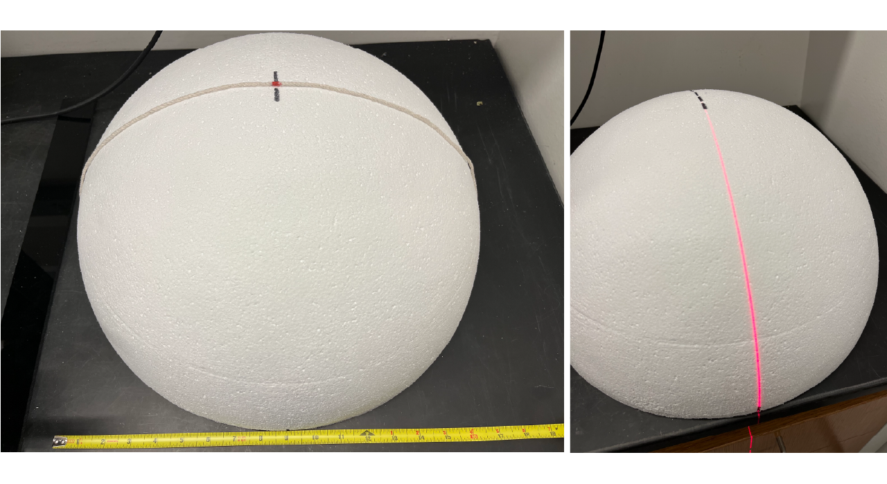

 2. Use 3M Foam Fast 74 CA spray adhesive to glue the half spheres together. Spray both surfaces from 3 to 5 inches away and wait 1 minute, then join the half spheres, making sure the drawn equator lines match. Apply pressure to the joint and leave it to dry and harden for at least 15 minutes.

 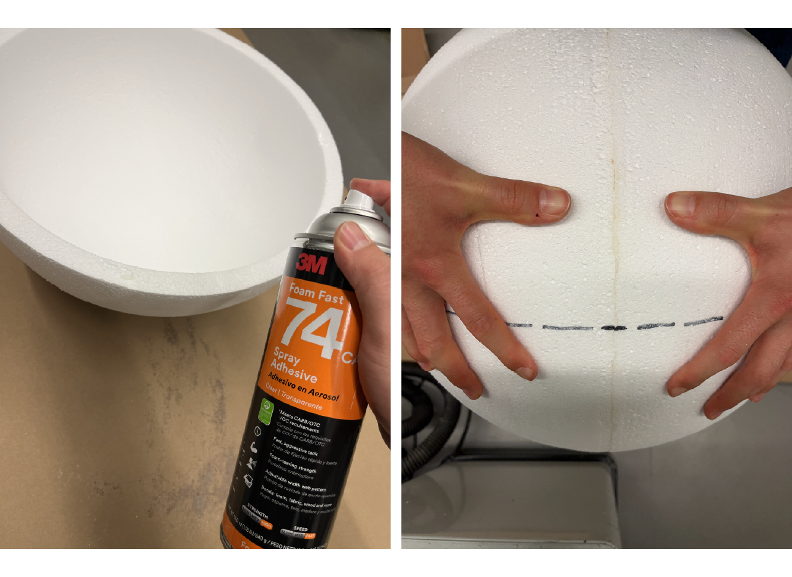

 3. Use lightweight joint compound to fill the seam and any holes the adhesive might have caused. Spread it evenly with a hand applicator, keeping the surface as smooth as possible. Let the joint compound dry for 30 minutes to 1 hour.

 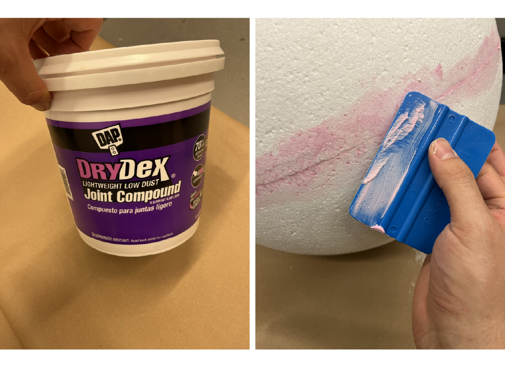

 4. Place the aluminum plate on a flat surface, raised with enough space underneath to fit the screen. Use a Sharpie to draw a straight line joining the marks on the aluminum plate (at the middle of the circle), as seen in the pictures. Place the screen in the plate, aligning the equator with the plate and the meridian (the seam where the half spheres were joined) with the line marked on the plate.

    ::: tip
    Sometimes the diameter of the ball doesn't match the plate. You can tape some paper or cardboard to fill the gap between the screen and the plate so it hangs properly.
    :::

 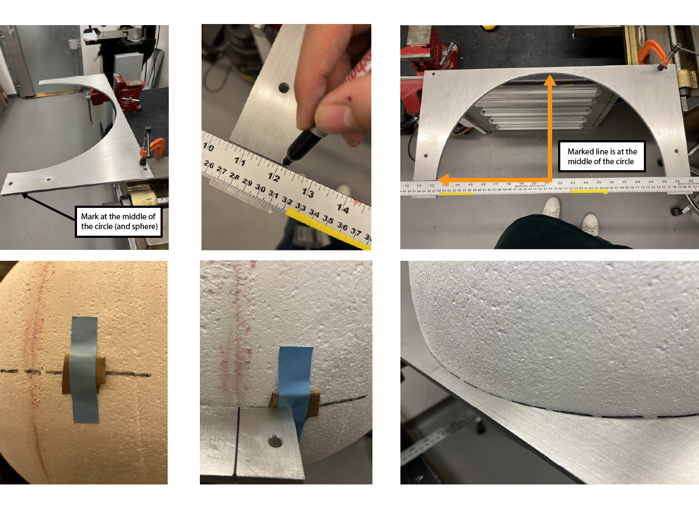

 5. Glue about 5 inches of the sides and the back of the ball with an electric glue gun and wait for it to harden. Once it has cooled, remove the taped paper/cardboard, turn the plate over and glue the whole screen to the aluminum plate, then wait for it to harden. Turn the plate over once more and finish gluing the top part of the screen to the plate.

 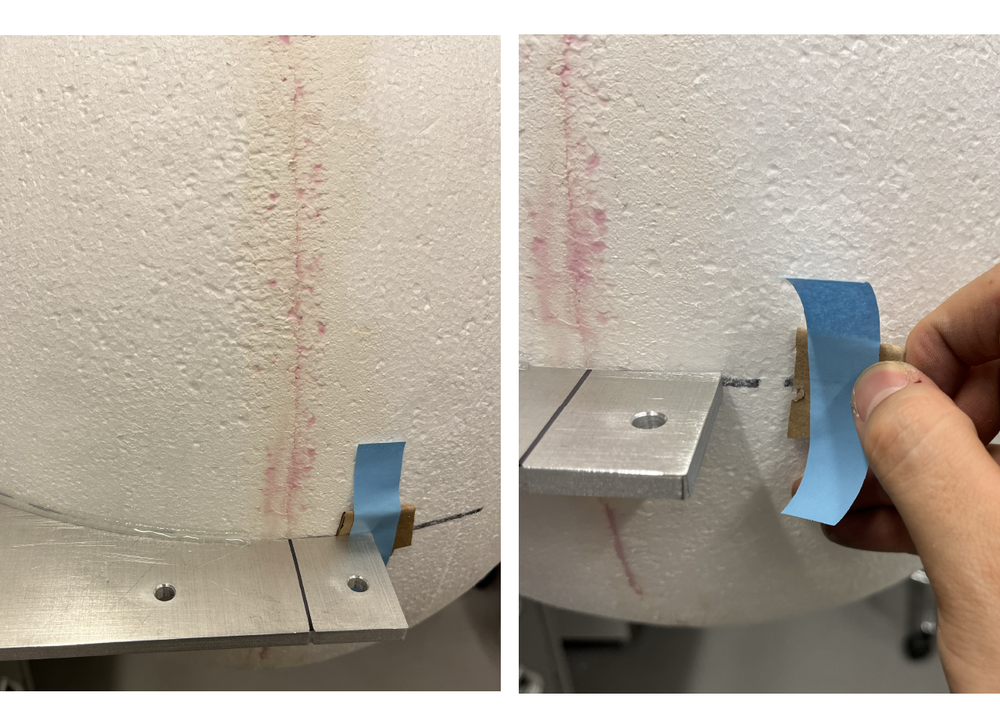

 ### Day 2 [time: ~3 hours]

 1. Place the screen with the plate on a flat surface. We use a couple of 14" long (1" diameter) pillars; other supports work too, as long as the ball hangs freely from the plate with enough space (at least ~6") between the bottom of the screen and the surface. We place the pillars diagonally for stability.

    Mark a line 4.75" below the equator of the screen. As a marking tool, we use a Thorlabs BA2 base and 1/2" post (with a post holder) plus a 90 degree 1/2" post holder that holds a Sharpie. We set the height of the post to 4.75" below the equator and mark the screen by sliding the tool around, keeping it flat on the surface.

 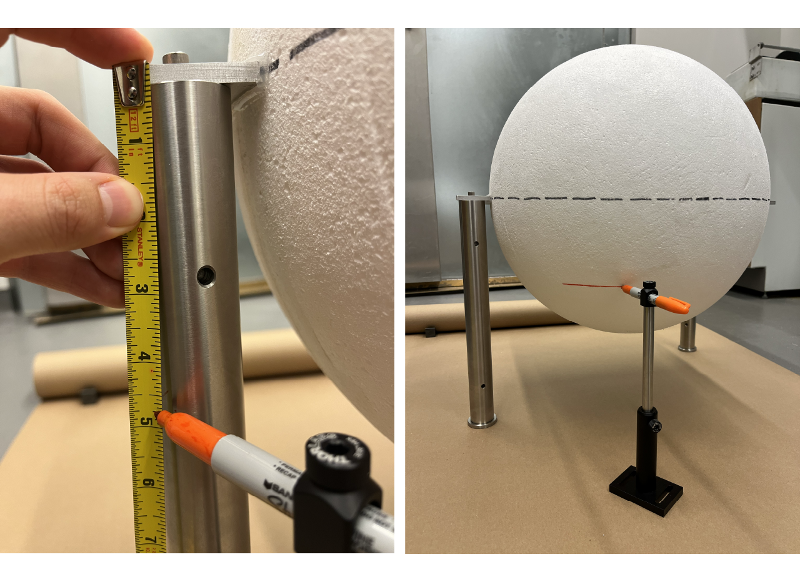

 2. Mark the middle of the screen across the meridian, using the same method as in step 1 of day 1. Then place the laser level on the flat surface facing the screen, project the vertical laser line and align it with both midpoint marks across the meridian. Draw a line from the top to the bottom of the screen (at least down to the bottom line).

 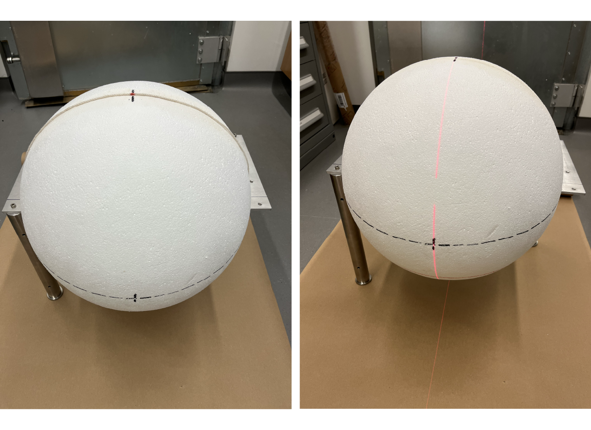

 3. From the seam between the two half spheres, measure 4" toward the top and 4.75" to each side, mark those points, and draw a half circle through the 3 points by hand.

 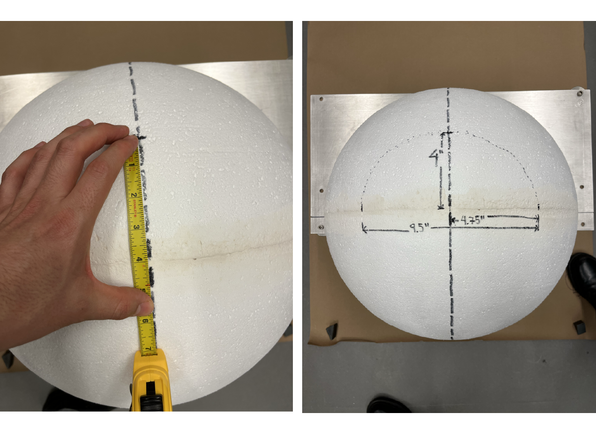

 4. Mark points 4.75" and 6" from the midline, along the seam of the spheres (at the top) and along the equator. Use the laser level to project a line from the top marks to the marks on the equator, and draw a dotted line along it with a marker.

 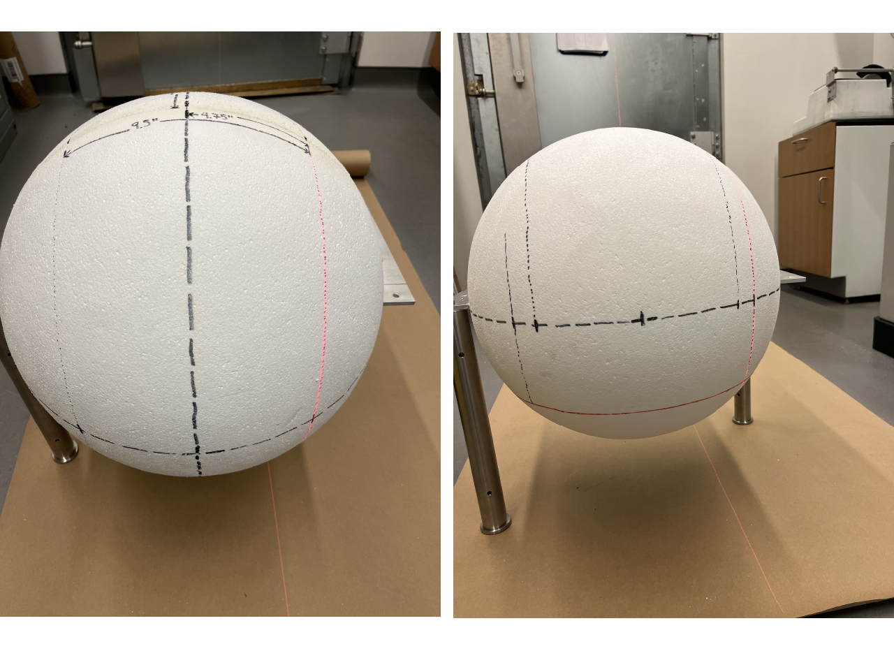

 5. Mark points 2.5" above the equator along the 4.75" and 6" lines.

 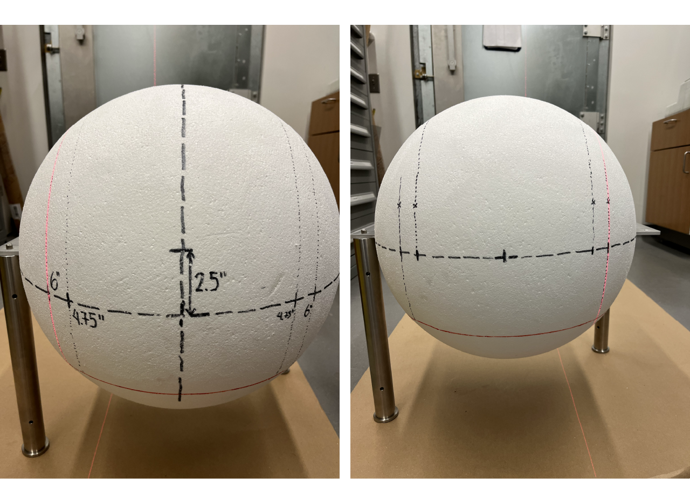

 6. With a marker (we used a different color to make them stand out), join the following intersections of the dotted lines, as shown in the pictures below.

      - (A & I) The intersection between the bottom 4.75" line from the equator and the 6" line from the meridian.
      - (B & H) The intersection between the top 2.5" line from the equator and the 6" line from the meridian.
      - (C & G) The intersection between the top 2.5" line from the equator and the 4.75" line from the meridian.
      - (D & F) The intersection between the top joint of the sphere and the 4.75" line from the meridian.
      - (E) The intersection between the top 4" mark from the top joint of the sphere and the meridian.

      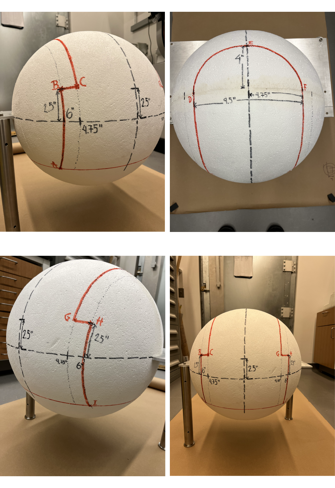

 7. Use a Styrofoam cutter (we use the *RoMech 200 W Pro Electric Hot Knife foam cutter*) to cut the sphere along the marked lines. We recommend holding the sphere by its aluminum plate with a bench vise or C-clamps. Follow these steps:

     - Cut the bottom part of the sphere following the line marked at 4.75" below the equator.
     - Cut the line from intersection (B) toward (A).
     - Cut the line from intersection (D) toward (C).
     - Cut the line from intersection (B) toward (C).
     - Repeat the steps for the other side.

      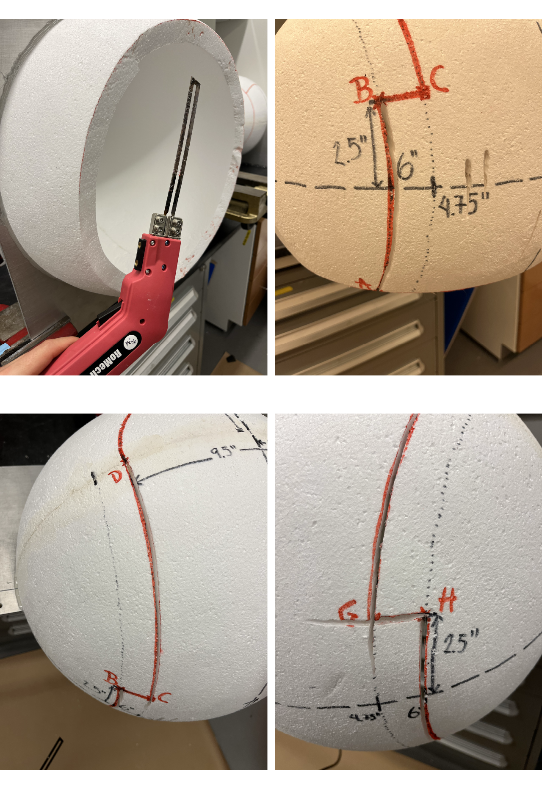

     - Cut the line from intersection (D) toward (F).
     - Remove the cut-out Styrofoam piece as shown in the picture below.

      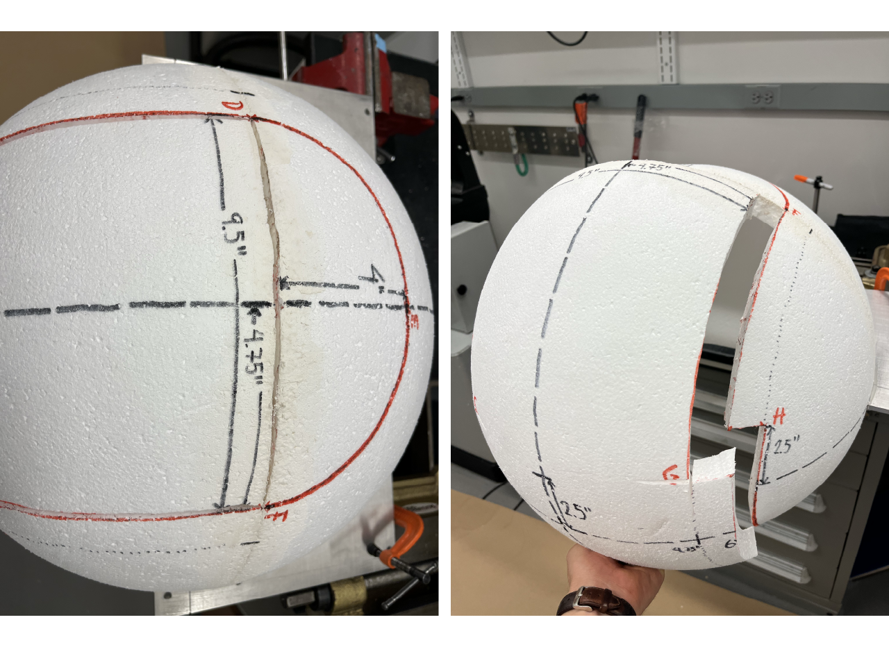

     - Cut a line from the mark (E) toward the bottom of the sphere.
     - Cut a line from intersection (D) toward (E) and remove the cut-out Styrofoam piece.
     - Cut a line from intersection (F) toward (E) and remove the cut-out Styrofoam piece.

      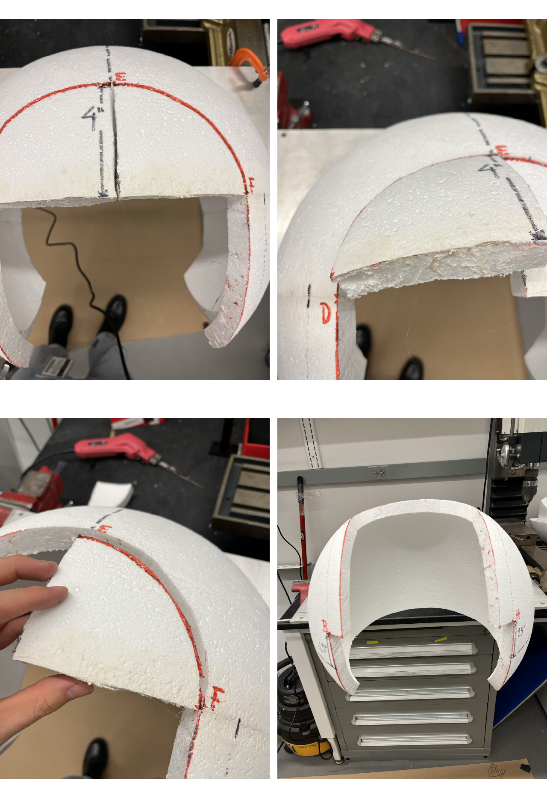

 8. From the inside of the screen, apply joint compound to the seam between the half spheres using a curved rubber wipe-down knife. Let it dry overnight and apply a second coat if necessary for a smooth surface.

 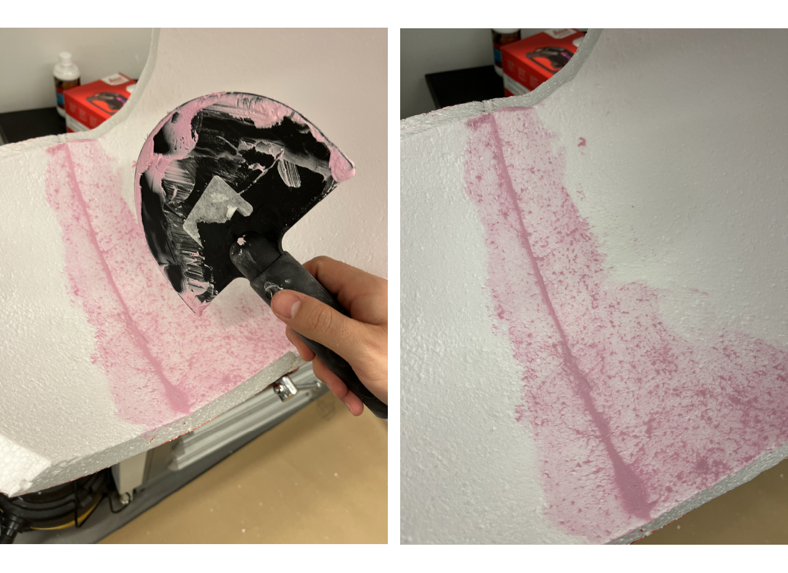

 ### Day 3 [time: ~1 hour]

 1. Apply All Purpose FoamCoat + Bounce from Hot Wire Foam Factory, following the mixing instructions (make sure the mix is thin enough to work with but thick enough to act as a protective layer). Apply one coat to the outside of the sphere; if the layer seems too thin, apply a second one. We recommend coating the top part of the sphere above the aluminum plate first, then the bottom part, and finally the cut edges (everything except the inner surface of the sphere). Let it dry for 24 hours.

 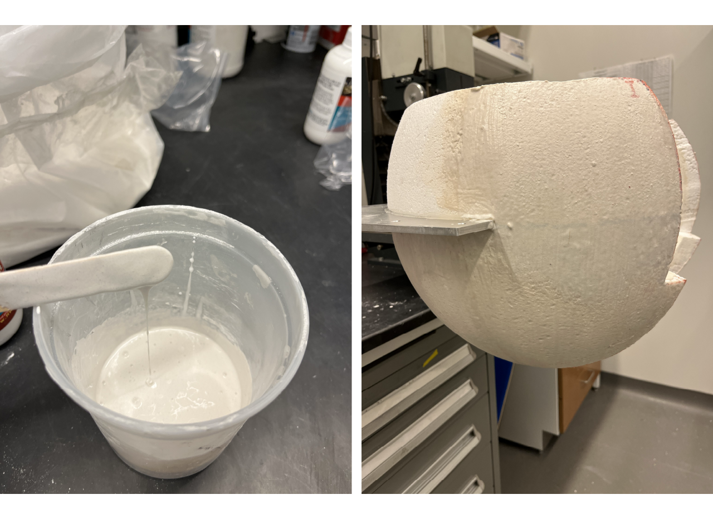

 ### Day 4 [time: ~1/2 hour each layer plus drying time]

 1. Apply white lightweight spackling to the inner surface of the sphere with a curved rubber wipe-down knife, covering the surface imperfections as much as you can. Let it dry for ~3 hours (or more, depending on ambient temperature and humidity); when it is dry, it shouldn't stick to your hand. Sand the surface and apply another layer. Repeat 2 to 3 times until the screen surface is smooth.

 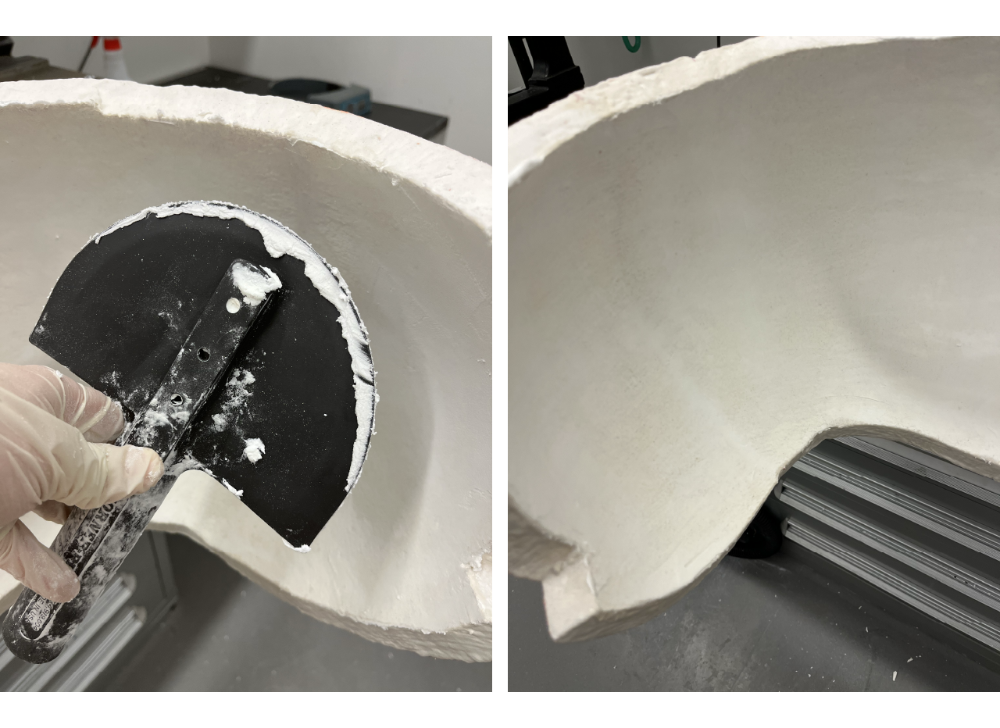

 ### Day 5 [time: ~1/2 hour each layer plus drying time]

 1. Paint the outside of the screen with black matte paint (we recommend Paint On Screen's black Wall and Ceiling Ambient Light Rejecting Acoustic Dampening paint) using a 3" or 4" brush. Do not paint the edges of the screen yet. Apply 2 coats of paint to the outside.

 2. Use a roller to paint the inside of the screen. Apply 1 coat of primer (we recommend Paint On Screen's Leveling Primer) and 2 to 3 coats of silver paint (we use Paint On Screen's S1 Screen Plus).

 3. Using a 1" brush, paint the edges of the sphere with black matte paint.

 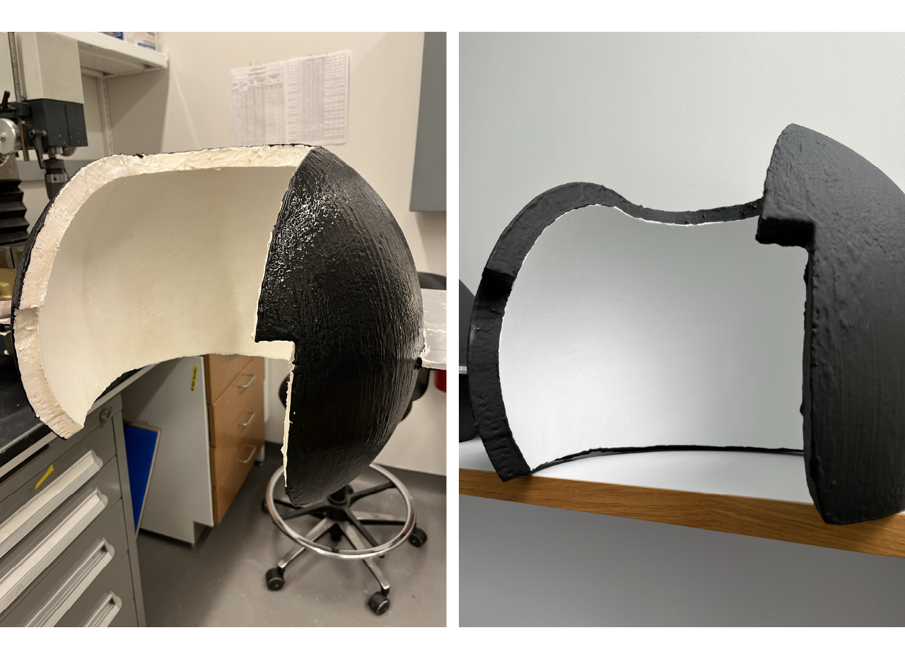

  ## Screen assembly

Once the screen is built, follow these instructions to install it in the cabinet.

1. Assemble the 1.5" diameter, 10" long posts (P10) by screwing a Thorlabs mounting base (BA2) to the bottom of each. Then install the posts on the cabinet bottom plate with 1/4"-20 screws, at the position closest to the projector, as shown in the picture below.

 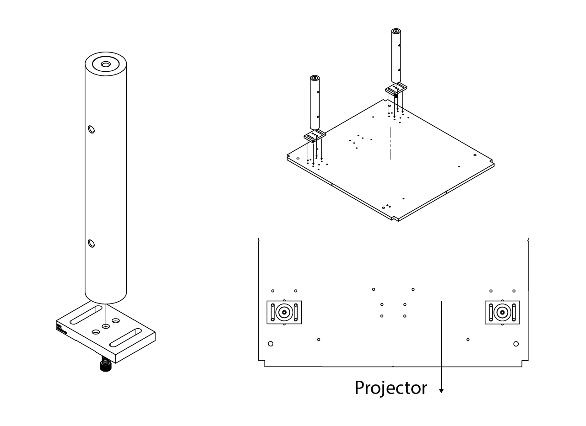

2. Have a machine shop make the custom aluminum screen-plate-to-post adapters, then screw them to the screen plate and place it over the posts. Screw the screen tightly to the posts.

 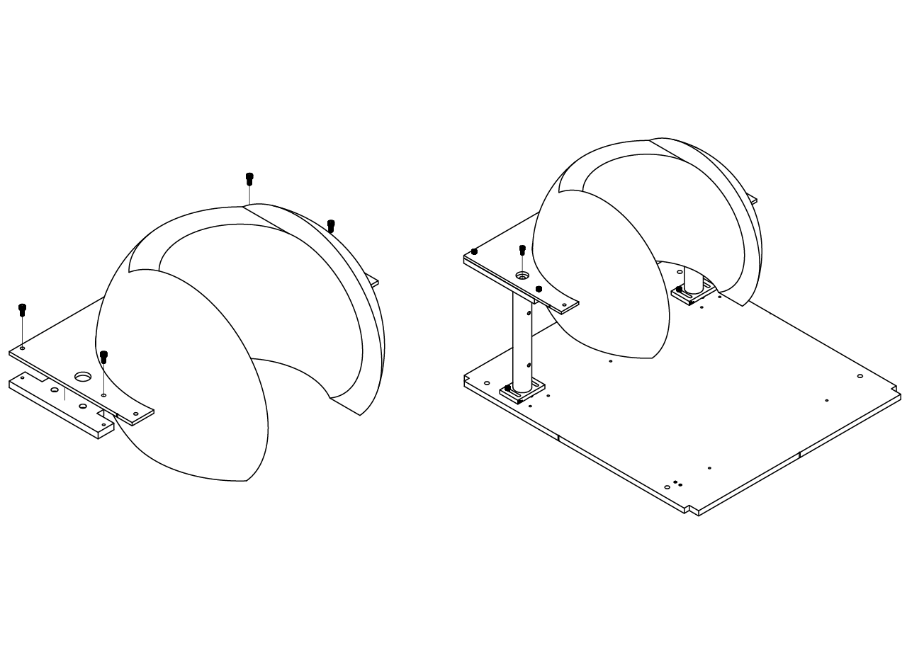

 <!-- ## Parts list

 1. 18" OD 16" ID Styrofoam half ball from Fifty-Five Manufacturing/Global Foam Company.
 2. Alignment Laser: 3 Beams, 0 Dots, 0 Lines, Red, 200 ft Range w/o Detector from [Grainger](https://www.grainger.com/product/BOSCH-Alignment-Laser-3-Beams-450W78?internalSearchTerm=Alignment+Laser%3A+3+Beams%2C+0+Dots%2C+0+Lines%2C+Red%2C+200+ft+Range+w%2Fo+Detector&suggestConfigId=8&searchBar=true&opr=THKS)
 3. 3M Foam Fast 74 CA spray adhesive from [Grainger](https://www.grainger.com/product/3M-Spray-Adhesive-3MA18)
 4. Lightweight Spackling from [Grainger](https://www.grainger.com/product/DAP-Lightweight-Spackling-Pail-5E113)
 5. Hand Applicator from [Grainger](https://www.grainger.com/product/3M-Hand-Applicator-Blue-6KHT0)
 6. Wipe Down Knife from [Grainger](https://www.grainger.com/product/KRAFT-TOOL-Wipe-Down-Knife-6-1-2-in-Blade-35EM57)
 7. Glue Gun from [Grainger](https://www.grainger.com/product/3M-Glue-Gun-AE-II-1VAK8)
 8. Hot Melt Adhesive from [Grainger](https://www.grainger.com/product/FASTENMASTER-Hot-Melt-Adhesive-FLEX40-52PF30)
 9. RoMech Foam Cutter - Pro Electric Hot Knife (200W) from [Amazon](https://www.amazon.com/RoMech-Foam-Cutter-Styrofoam-Accessories/dp/B07JBQ58L2)
 10. All purpose foam coat - 3 lbs are enough for ~3 rigs from [Hot wire factory](https://hotwirefoamfactory.com/025_All_Purp_FoamCoat.html)
 11. Bounce Rubberizer - 32 oz are enough for ~3 rigs from [Hot wire factory](https://hotwirefoamfactory.com/025B0-BounceRubberizer.html)
 12. Premium Lightweight Joint Compound from [Grainger](https://www.grainger.com/product/DAP-Premium-Lightweight-Joint-10L498)
 13. Black Wall and Ceiling Ambient Light Rejecting Acoustic Dampening from [Paint on screen](https://paintonscreen.com/products/wall-and-ceiling-ambient-light-rejecting-acoustic-dampening-studio-grey?variant=29416888893463)
 14. 3" or 4" Paint brush from [Grainger](https://www.grainger.com/product/WOOSTER-Paint-Brush-Flat-Sash-Brush-14A035)
 15. Leveling Primer from [Paint on screen](https://paintonscreen.com/products/leveling-primer?variant=1618182144029)
 16. S1 Screen Plus paint from [Paint on screen](https://paintonscreen.com/products/s1-screen-plus?variant=1616223731741)
 17. Mini paint roller kit from [Grainger](https://www.grainger.com/product/PREMIER-Mini-Paint-Roller-Kit-3-in-29UT49)
 18. 1" Paint brush from [Grainger](https://www.grainger.com/product/SHUR-LINE-Paint-Brush-Angle-Sash-Brush-48WL96)

 ## Drawing

 1. aluminum plate -->
