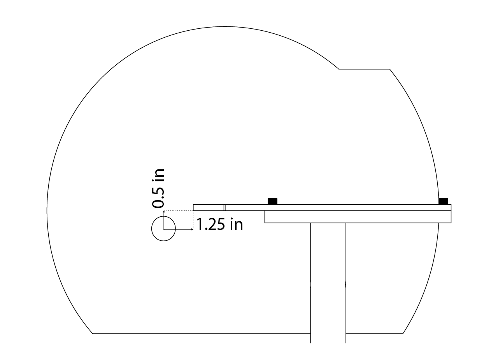

# {{ $frontmatter.title }}

The pupillometry module consist on a monochrome camera mounted at the side of the screen pointing laterally to the face of the mice, the lens used allows to frame the pupil with enough detail to be processed by markeless pose estimation software. The field of view obtained with the lens allows to track sniffing and whisking, altough that is out of the scope of this building guide.

[comment]: # (Add an image with the camera set up)

## Camera set up

We use a Teledyne FLIR FFY-U3-04S2M-S camera, the small factor allows to place it right below the aluminum plate holding the screen without taking much space on the rig. We use a 0.4 MP, 121 FPS, monochromatic camera with an IR light source; a mono camera has better sensitivity and allow us to capture the details of the pupil better than the color sensor. Despite the fact that pupillometry can be detected at 30 Hz, we decided to use a 0.4 MP 121 FPS camera to have the flexibility in case we need another kind of measurement (whiskers move), but using the 1.6 MP 60 FPS camera should work fine for pupillometry and should result in a better image resolution.

1. Make a 1" hole on the screen at the position showed below. If you're setting up a pupillometry module on a built screen first mark the position where the hole is going to be made, then use a precision knife to remove the outer part of the screen (make sure not to introduce the knife all the way into the other side), remove the outer part using your fingers and then use your fingers to remove the styrofoam up to the inner part of the screen (the paint layer). Then, use the precision knife to cut the paint layer in the inner part of the screen, this way the hole from the inside out will be cleaner and the smaller size possible (it will adjust to the diameter of the lens).

::: tip

Despite the fact that the screen has a hole in one of the sides, we didn't observe any behavioral impact in any of the pilot -or subsequent- sessions. The position and the fact that the hole is tailored to the diameter of the lens can be the reason.

:::

<figure>
  
</figure>

2. Set up the camera and position it on the aluminum plate.

[comment]: # (Image of the thorlabs parts and how to assemble them in fusion 360, and a couple of photos on the final result)

3. Connect it to the computer.

## Light source set up

Explain how to set up the light source at the top of the rig.

[comment]: # (Drawing on how to assemble the Thorlabs parts and a photo if I have of the result)

## Image focus and camera positioning

Explain step by step how to focus the image and screw all the parts to get the camera in position.

[comment]: # (Image of how the mice should look)

## FLIR Spinnaker Support Installation and Configuration Manual in MATLAB

### Installation Instructions

1. **Open MATLAB**:
   - Launch the MATLAB application on your computer.

2. **Access Add-Ons**:
   - In the main MATLAB window, access the "Add-Ons" menu.

3. **Search and Download FLIR Spinnaker Support**:
   - Use the search bar to find "FLIR Spinnaker Support".
   - Check the version of MATLAB you have installed.
   - Download the corresponding version of the program by selecting the "Full exe" option.

4. **Run the Program**:
   - Execute the downloaded installer.
   - Accept the terms and conditions of the software.
   - In the configuration section, select "Application Developer".
   - Uncheck the "GigE Driver" option twice.
   - Proceed with the software installation.

5. **Add the Package to MATLAB**:
   - Open the directory of the downloaded package: `C:\\Users\ephys\AppData\Roaming\MathWorks\MATLAB Add-Ons\Toolboxes\FLIR Spinnaker Support by Image Acquisition Toolbox\FLIR Spinnaker Support by Image`.

6. **Open the README File**:
   - Locate and open the "README" file in the package directory.
   - Change the driver registry patch as instructed, ensuring you use the patch for MATLAB version 2022a.

7. **Verification**:
   - Run all the stages described in the README file to verify that FLIR Spinnaker support is functioning correctly.

8. **Configure Rig Parameters**:
   - Return to the "Rig Parameters" configuration.
   - Add the necessary elements according to the specific instructions for your work environment.

#### Additional Note:
Ensure you follow each step precisely and verify the compatibility of each component with your installed MATLAB version to avoid issues during the software installation and configuration.

## Explanation of the processing and how to set up the pipeline

<!-- TODO: change link -->
Check <a href="https://braincogs.github.io/software/pupillometry_guide.html"> Pupillometry Pipeline Guide </a> for more information.