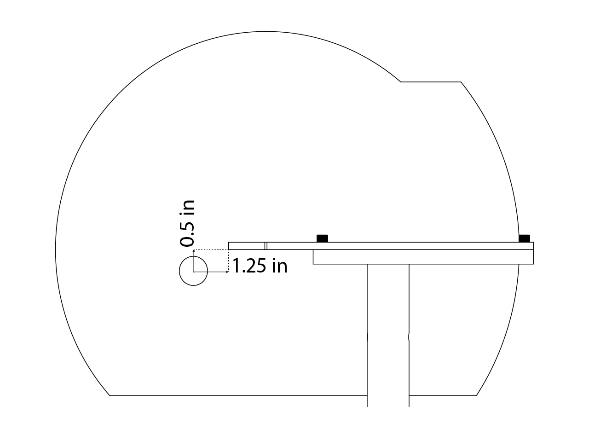

# {{ $frontmatter.title }}

The pupillometry module consists of a monochrome camera mounted at the side of the screen, pointing at the side of the mouse's face. The lens frames the pupil in enough detail for markerless pose estimation software to process it. Its field of view also allows tracking sniffing and whisking, although that is beyond the scope of this building guide.

[comment]: # (Add an image with the camera set up)

## Camera setup {#camera-set-up}

We use a Teledyne FLIR FFY-U3-04S2M-S camera; its small form factor lets us place it right below the aluminum plate holding the screen without taking up much space in the rig. It is a 0.4 MP, 121 FPS monochrome camera, used with an IR light source; a mono sensor is more sensitive and captures the details of the pupil better than a color sensor. Although pupillometry only needs 30 Hz, we chose the 0.4 MP, 121 FPS camera for flexibility in case we need other measurements (such as whisker movement). The 1.6 MP, 60 FPS camera should work fine for pupillometry and gives a higher image resolution.

1. Make a 1" hole in the screen at the position shown below. If you're adding a pupillometry module to an existing screen, first mark where the hole will go, then cut into the outer part of the screen with a precision knife (don't push the knife all the way through to the other side). Remove the outer part and then the Styrofoam with your fingers, down to the inner surface of the screen (the paint layer). Then cut through the paint layer from the inside with the precision knife. This way the hole is cleaner when seen from the inside and as small as possible (fitted to the diameter of the lens).

::: tip

Although the screen has a hole on one side, we didn't observe any behavioral impact in any of the pilot (or later) sessions, possibly because of its position and because the hole is fitted to the diameter of the lens.

:::

2. Set up the camera and position it on the aluminum plate.

[comment]: # (Image of the thorlabs parts and how to assemble them in fusion 360, and a couple of photos on the final result)

3. Connect the camera to the computer.

## Light source setup {#light-source-set-up}

Explain how to set up the light source at the top of the rig.

[comment]: # (Drawing on how to assemble the Thorlabs parts and a photo if I have of the result)

## Image focus and camera positioning

Explain step by step how to focus the image and screw all the parts to get the camera in position.

[comment]: # (Image of how the mice should look)

## Installing and configuring FLIR Spinnaker support in MATLAB {#flir-spinnaker-support-installation-and-configuration-manual-in-matlab}

### Installation instructions {#installation-instructions}

1. **Open MATLAB**:
   - Launch the MATLAB application on your computer.

2. **Access Add-Ons**:
   - In the main MATLAB window, access the "Add-Ons" menu.

3. **Search for and download FLIR Spinnaker Support**:
   - Use the search bar to find "FLIR Spinnaker Support".
   - Check which version of MATLAB you have installed.
   - Download the corresponding version of the program by selecting the "Full exe" option.

4. **Run the Program**:
   - Execute the downloaded installer.
   - Accept the terms and conditions of the software.
   - In the configuration section, select "Application Developer".
   - Uncheck the "GigE Driver" option twice.
   - Proceed with the software installation.

5. **Add the package to MATLAB**:
   - Open the directory of the downloaded package: `C:\Users\ephys\AppData\Roaming\MathWorks\MATLAB Add-Ons\Toolboxes\FLIR Spinnaker Support by Image Acquisition Toolbox\FLIR Spinnaker Support by Image`.

6. **Open the README File**:
   - Locate and open the "README" file in the package directory.
   - Apply the driver registry patch as instructed, making sure you use the patch for MATLAB R2022a.

7. **Verification**:
   - Run all the steps described in the README file to verify that FLIR Spinnaker support works correctly.

8. **Configure Rig Parameters**:
   - Return to the "Rig Parameters" configuration.
   - Add the necessary elements according to the specific instructions for your work environment.

#### Additional note {#additional-note}

Follow each step precisely and check that each component is compatible with your installed MATLAB version, to avoid issues during installation and configuration.

## Processing and pipeline setup {#explanation-of-the-processing-and-how-to-set-up-the-pipeline}

See the [Pupillometry Pipeline Guide](/software/pupillometry_guide.html) for more information.
