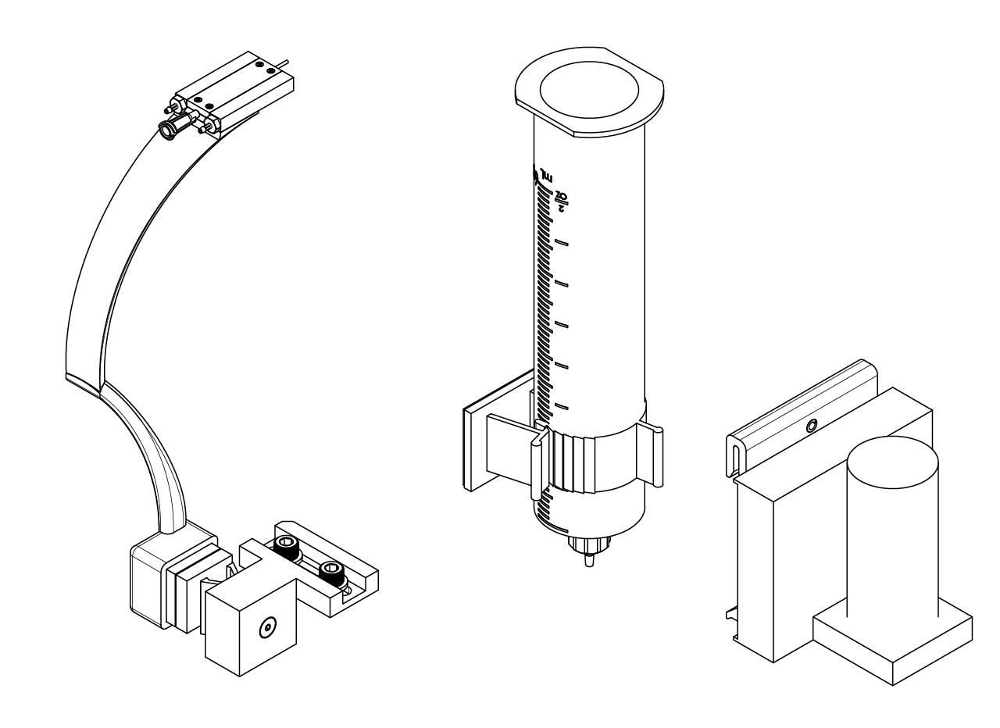
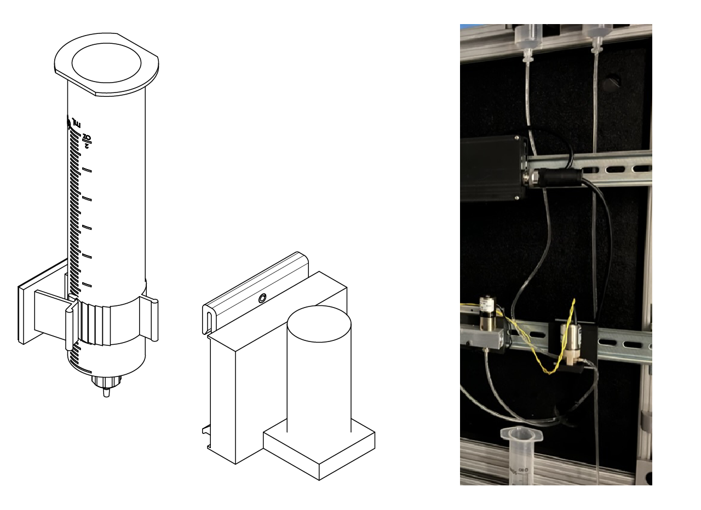
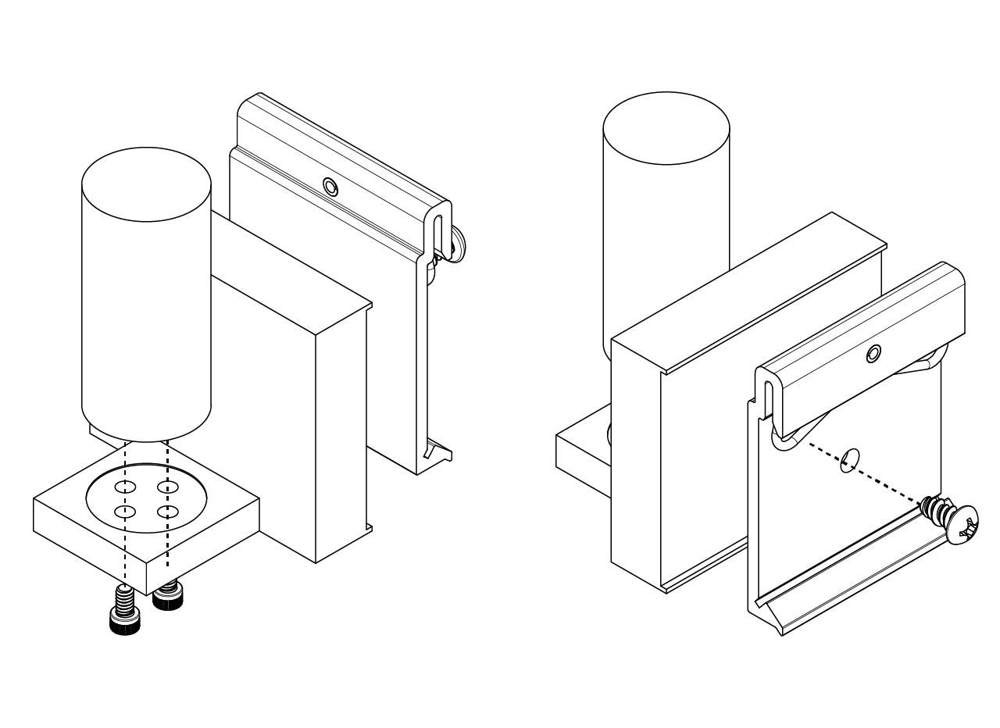
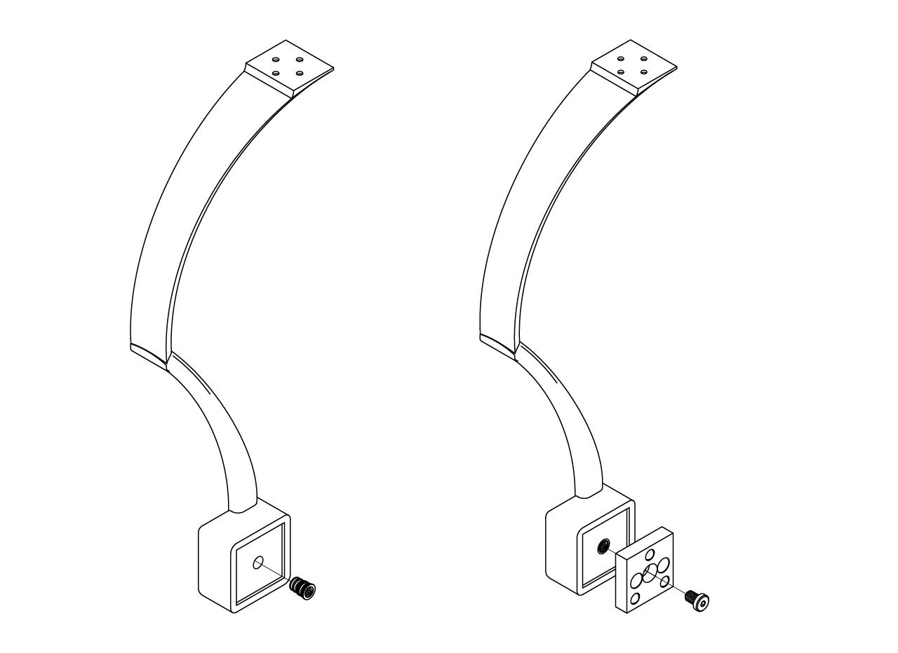
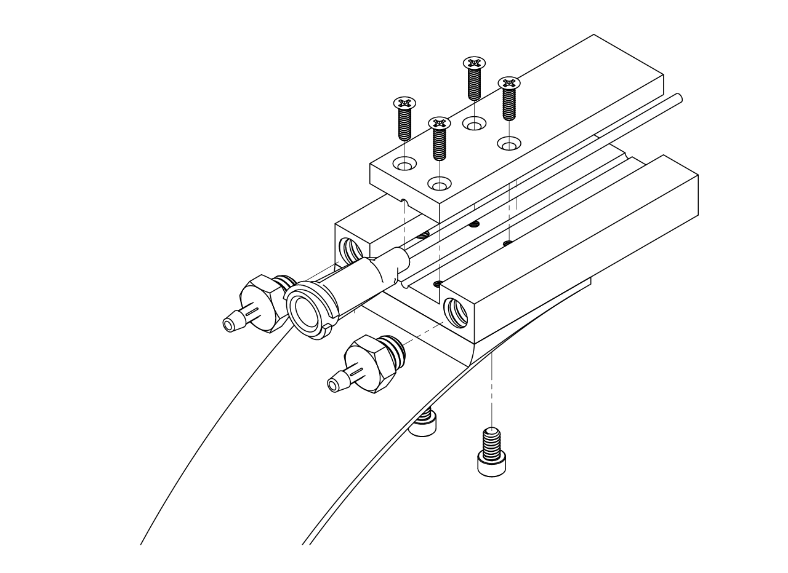
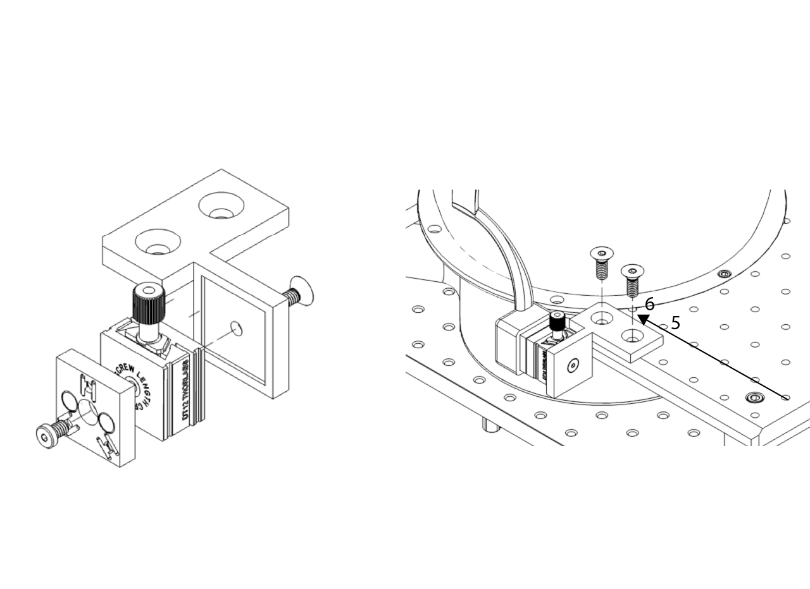
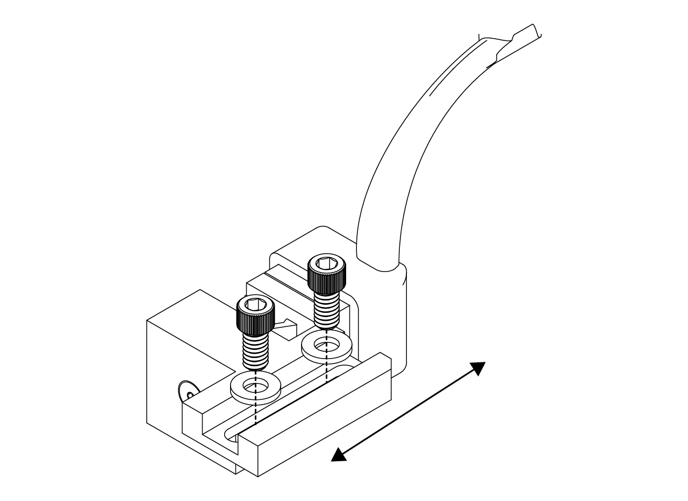

# {{ $frontmatter.title }}

The reward module consist on a open srynge that holds the reward liquid that will be dispensed to the mice through a lick spout controlled by a solenoid valve.

<figure>
  
  
<figcaption><small>Reward spout module</small></figcaption>

</figure>

## Solenoid valve assembly

The solneoid valve assembly consist of a standard plastic 60 mL srynge placed at the top of the rig conncected to a solenoid valve driver using Tygon PVC (for dairy) tubing. Since it's a gravity based module, it is recommended to place the srygne as high as possible. The srynge can be placed in the top frame of the rig cabinet using a 15/16" cable holder (you could use some thorlabs parts placed at the top of the rig to adjust the height of the srynge and place it in a higher position), remove the plunger from the srynge and use a luer lock to 1/16" ID tubing fitting to connect the srynge to the solenoid valve driver (we use the 003-0096-900 model from Parker).

<figure>
  
  
<figcaption><small>Reward srynge and solenoid valve driver, reward module assembly on the right.</small></figcaption>

</figure>

To fix the reward solenoid valve to the DIN rail we use a 3D printed part, to which the solenoid valve is attached using 4-40 x 3/16" long screws and a DIN valve clip using a Rounded Head Thread-Forming Screws no. 8 5/16" long. Assemble them as shown in the picture below and attach it to the bottom DIN rail.

<figure>
  
</figure>

Finally, connect the srynge to the IN plug of the solenoid valve driver and connect the OUT plug to the srynge inside the rig  using 1/16" ID 1/8" OD Tygon soft tubing for food, beverages and dairy.

::: tip

Ee don't use the cable carrier for this tubing because it has to be replaced every month and it makes maintenance time consuming.

:::

## Lick spout holder assembly

The lick spout holder is designed to be fixed in the sagital and coronal position and adjustable in the Z (height) position. This way the variability in the position of both the mice and the spout is reduced. To this end, we designed a 3D printed arm that holds a spout holder, which also serves as the air puffs delivery system, that is attached to a kinetic base to make it easy to place and remove when the styrofoam ball need to be taken out. The kinetic base is screwed to a dovetail translation stage with 1/4" travel to adjust the height of the spout.

To assemble, follow the next steps.

1. Have printed the arm (we recommend an external service and PA12GB material) and install a 8-32 thread size, 0.312" installed length heath insert for plastic in the hole at the lower part of the arm that is going to be attached to the kinetic base. Then, screw the top part of the KB1X1 kinetic base from Thorlabs to the arm using an 8-32 thread size, 1/4" long low-profile screw.

:::tip
 To install the heat insert follow the instructions in the step 3 of the bottom plate assembly in the [stage](/building/stage) section.
:::

<figure>
  
</figure>

2. Install the 1/16" tube ID x 10-32 thread male pipe in the back of the spout holder and place it into the arm using a pair of 2-56 thread size, 5/32" long screws. Put the FNS-18-2-2 straight feeding needle from Kent scientific on the spout holder and fix the top part of the holder using a four 100 degree countersink, 0-80 thread, 7/32" long screws.

<figure>
  
</figure>

3. Print or have printed the breadboard to DT12 adapter and screw the DT12 dovetail translation stage from Thorlabs to the adapter using a 8-32 thread size, 3/8" long flat head screw, making sure the screw to move the stage is facing up (to the ceiling of the rig). Attach at the other end the bottom part of the KB1X1 kinetic base from Thorlabs using an 8-32 thread size, 1/4" long low-profile screw. Finally, install into the breadboard using a pair of 1/4"-20 thread size, 11/16" long flat head screw.

<figure>
  
</figure>

::: tip

Due to inaccuracies in the 3D printed part the spout might be out of position, if this problem is present it is recommended to use a different printed breadboard to DT 12 adapter as shown in the picture below, this way the position of the reward spout can be adjusted.

<figure>
  
</figure>

:::

3. Finally place the arm with the spout holder in place by connecting the top and bottom parts of the kinetic base.