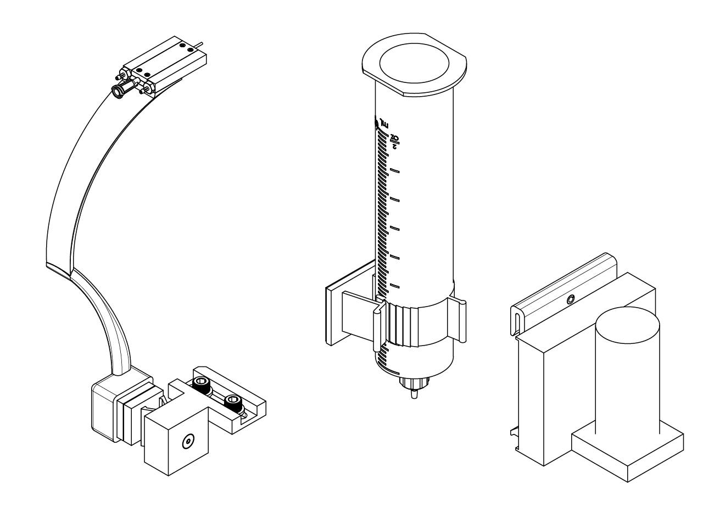
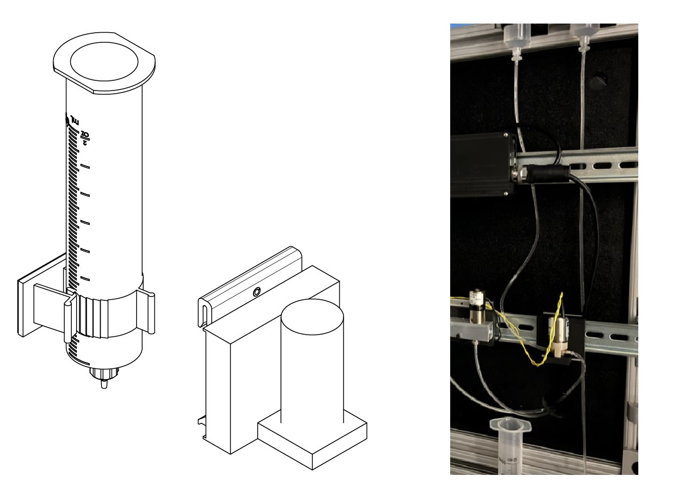
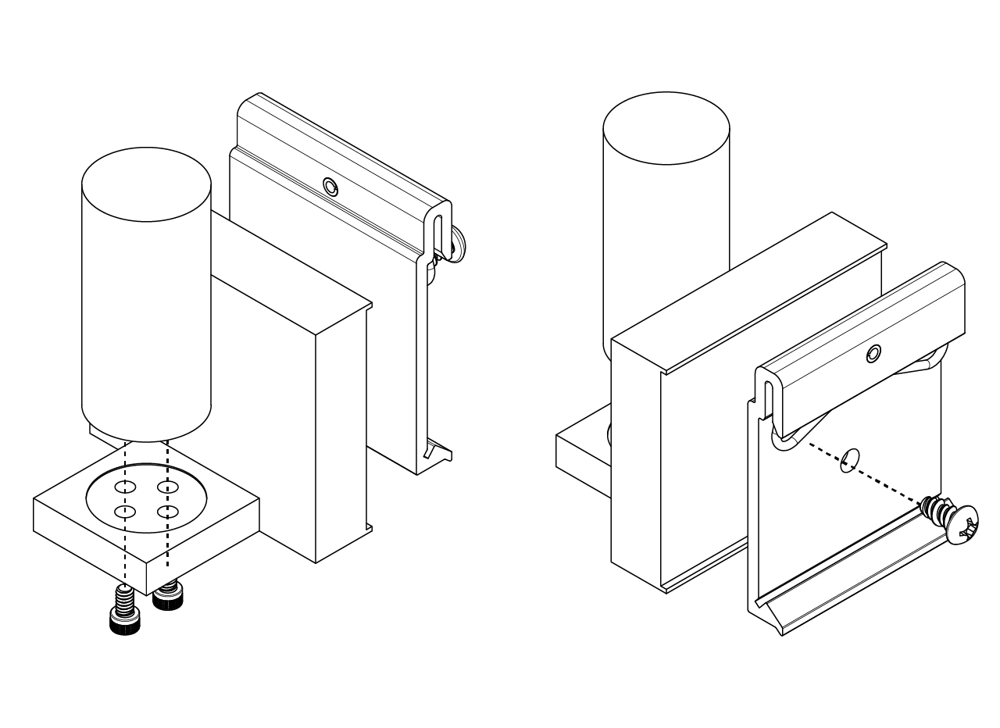
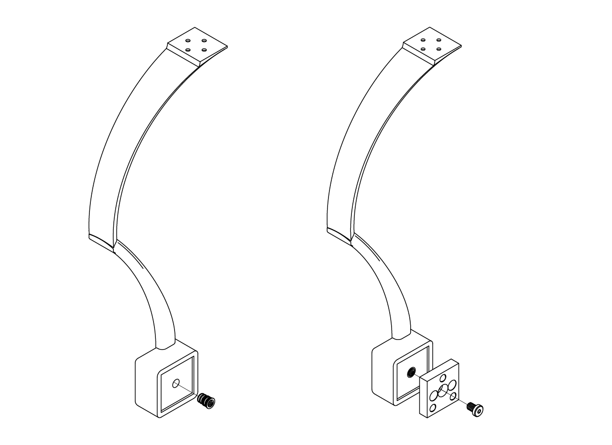
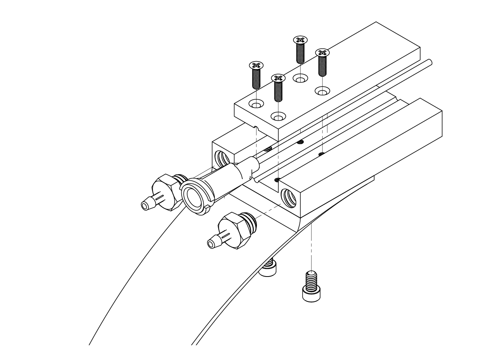
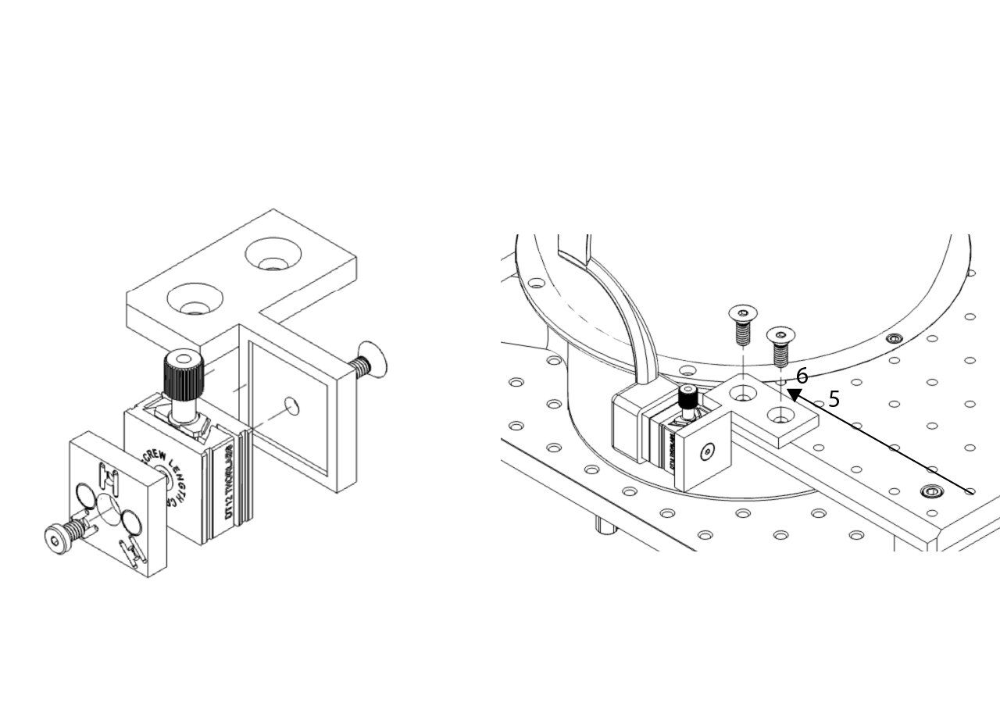
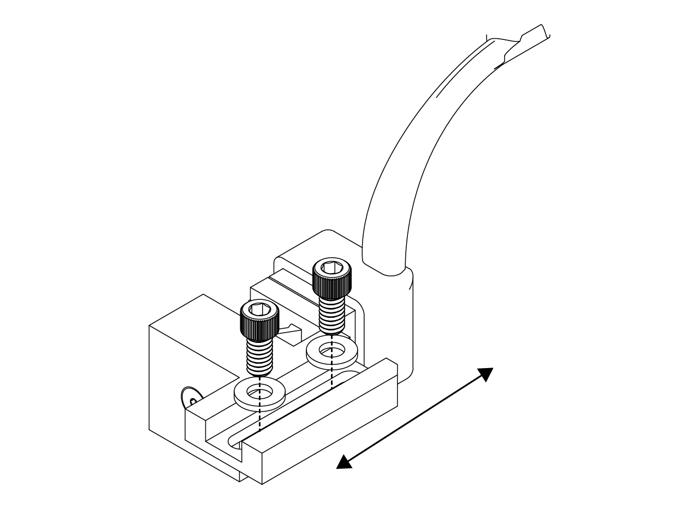

# {{ $frontmatter.title }}

The reward module consists of an open syringe holding the reward liquid, which is dispensed to the mice through a lick spout controlled by a solenoid valve.

## Solenoid valve assembly

The solenoid valve assembly consists of a standard plastic 60 mL syringe at the top of the rig, connected to a solenoid valve with Tygon PVC (dairy) tubing. Since the module is gravity fed, we recommend placing the syringe as high as possible. The syringe can be mounted on the top frame of the rig cabinet with a 15/16" cable holder (you can use some Thorlabs parts on top of the rig to raise the syringe higher). Remove the plunger from the syringe and use a Luer lock to 1/16" ID tubing fitting to connect the syringe to the solenoid valve (we use the 003-0096-900 model from Parker).

To mount the reward solenoid valve on the DIN rail, we use a 3D printed part. The solenoid valve is attached to it with 4-40 x 3/16" long screws, and a DIN rail clip with no. 8, 5/16" long rounded head thread-forming screws. Assemble them as shown in the picture below and attach the assembly to the bottom DIN rail.

Finally, connect the syringe to the IN port of the solenoid valve and connect the OUT port to the spout inside the rig, using 1/16" ID, 1/8" OD Tygon soft tubing for food, beverage and dairy.

::: tip

We don't route this tubing through the cable carrier because it has to be replaced every month, and that would make maintenance time consuming.

:::

## Lick spout holder assembly

The lick spout holder is fixed in the sagittal and coronal planes and adjustable in Z (height), which reduces the variability in the relative position of the mouse and the spout. To this end, we designed a 3D printed arm that holds the spout holder (which also serves as the air puff delivery system). The arm is attached to a kinematic base, so it is easy to remove and replace when the Styrofoam ball needs to be taken out. The kinematic base is screwed to a dovetail translation stage with 1/4" of travel to adjust the height of the spout.

To assemble it, follow these steps.

1. Print the arm or have it printed (we recommend an external service and PA12GB material) and install an 8-32 thread, 0.312" installed length heat-set insert for plastic in the hole in the lower part of the arm that attaches to the kinematic base. Then, screw the top part of the Thorlabs KB1X1 kinematic base to the arm with an 8-32 thread, 1/4" long low-profile screw.

:::tip
 To install the heat-set insert, follow step 3 of the bottom plate assembly in the [stage](/building/stage) section.
:::

2. Install the 1/16" tube ID x 10-32 male barbed fitting in the back of the spout holder and attach the holder to the arm with a pair of 2-56 thread, 5/32" long screws. Put the FNS-18-2-2 straight feeding needle from Kent Scientific in the spout holder and fix the top part of the holder with four 100 degree countersink, 0-80 thread, 7/32" long screws.

3. Print the breadboard-to-DT12 adapter or have it printed, and screw the Thorlabs DT12 dovetail translation stage to the adapter with an 8-32 thread, 3/8" long flat head screw, making sure the stage's adjustment screw faces up (toward the ceiling of the rig). Attach the bottom part of the Thorlabs KB1X1 kinematic base to the other end with an 8-32 thread, 1/4" long low-profile screw. Finally, install the assembly on the breadboard with a pair of 1/4"-20 thread, 11/16" long flat head screws.

::: tip

Due to inaccuracies in the 3D printed part, the spout might be out of position. If so, we recommend using the alternative printed breadboard-to-DT12 adapter shown in the picture below, which lets you adjust the position of the reward spout.

:::

4. Finally, put the arm with the spout holder in place by joining the top and bottom parts of the kinematic base.
