# {{ $frontmatter.title }}

The stage holds a 3D printed cup where the optical flow sensor is placed at the bottom and a hose is connected to deliver a constant air flow to make a styrofoam ball float at the top. The mice is head fixed on top of the ball, allowing it to run, while the optical flow sensor update the virtual world projected on the screen.

<figure>
  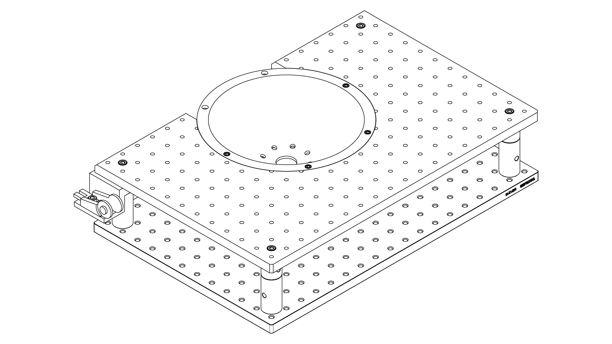
  
<figcaption><small>Stage assembly with 3D printed cup.</small></figcaption>

</figure>

The stage consist on a pair of optical breadboards attached by a set of posts. The posts lenght is calculated so that the stage has the proper height at which the mice will be positioned and the projection will be calibrated. The top optical breadboard is modified to insert the cup that will direct the constant air flow to the bottom of the styrofoam ball and will make it float, allowing the mice to freely move and run.

We send the optical breadboard to be modified at a machine shop. To assemble the stage you have to first screw the 4 posts by attaching a 1" diameter 1" long post to a 1" diamater 2" long post using a 1/4" set screw (alternatively, you can use a 1" diamater 3" long post). Then attach both the top plate and the bottom plate to each end of the 4 posts using 1/4" screws.

<figure>
  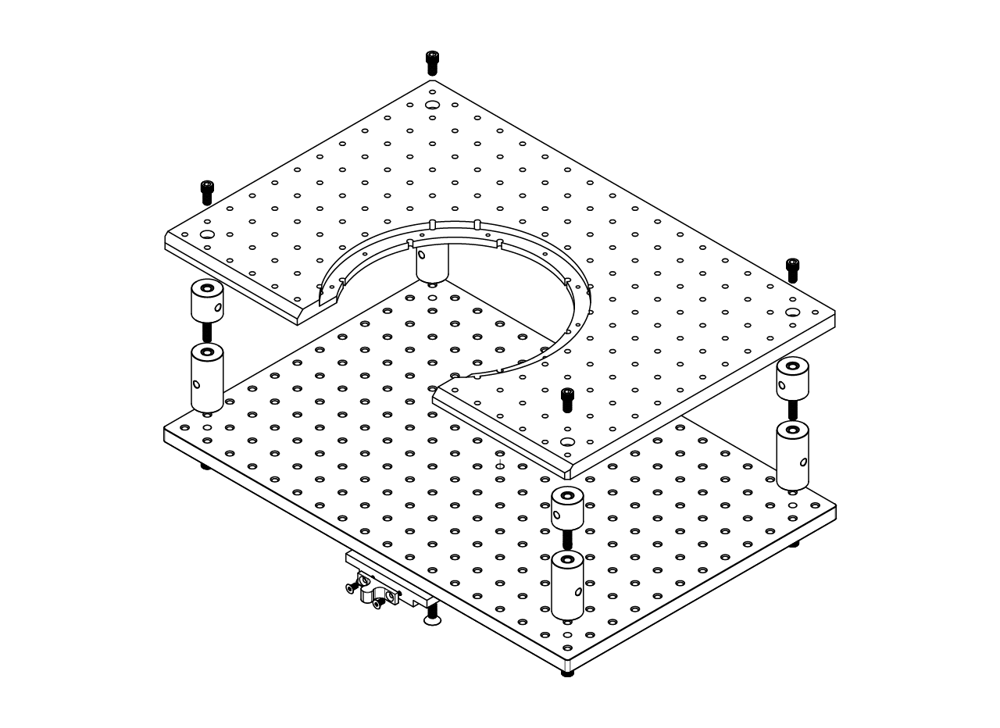
</figure>

Send the adapter to be made at a machine shop, then attach the latch holder to the adapter using a pair of M4 x 0.7mm, 8mm long screws. Attach the adapter to the bottom part of the bottom plate, in the intersection of the middle columns and the second row as shown in the picture below.

<figure>
  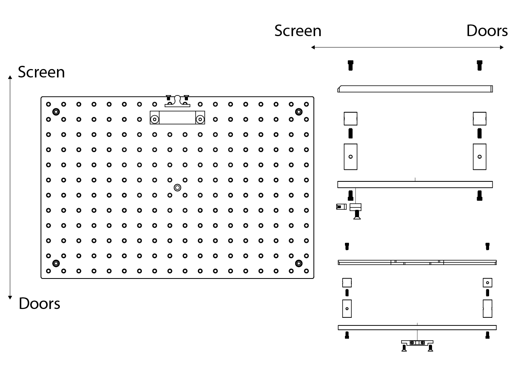
</figure>

## Stage installation

Install the stage into the cabinet using 1/4"-20 1/2" long low profile socket head screws from the bottom of the drawer slider into the breadboard (the stage can be installed in the cabinet before or after placing the 3D printed cup). Extend the drawer all the way out and place the stage on top of it, align it according to the image below.

<figure>
  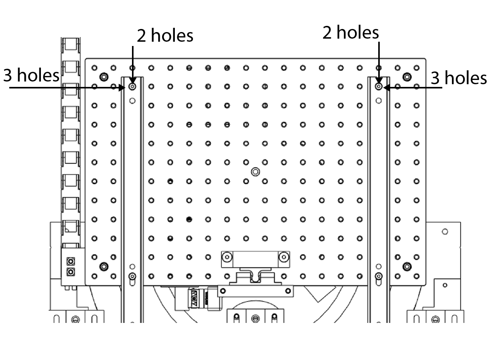
</figure>

## Cup with optical flow sensor

The cup has 2 main components, the cup itself that includes a circular arm through which a constant air flow will be introduced to the inner part and a connector that will transmit the power and data from the sensor to the arduino that is part of the control module of the training mini VR. The second main component is the bottom plate, that has attached the optical flow sensor, a mirror, and a LED printed circuit board (PCB).

<figure>
  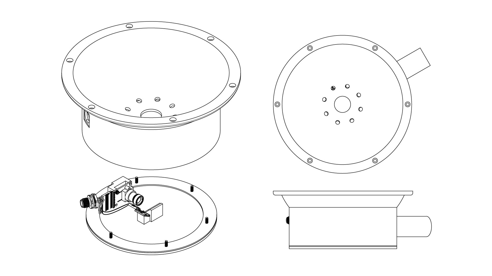
  
<figcaption><small>Cup with optical flow sensor.</small></figcaption>

</figure>

### Cup assembly

We use a 3D printing external service to manufacture the cup, Nylon 12 works fine and ideally the top curved surface of the cup should be smooth (smoothing it manually with fine sandpaper does the work).

1. Use a transparent epoxy to place a small ammount aroung the circular hole in the middle of the cup from the bottom up and place the 30 mm gorilla glass window, gently press the window making sure the epoxy covers the edges to avoid air leakage but making sure it doesn't spread into the middle of the mirror.

<figure>
  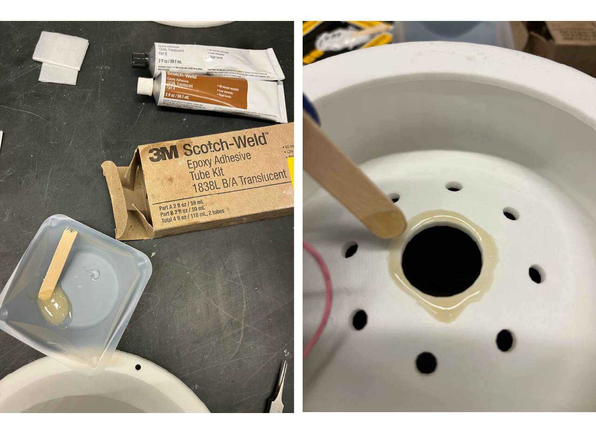
</figure>

<figure>
  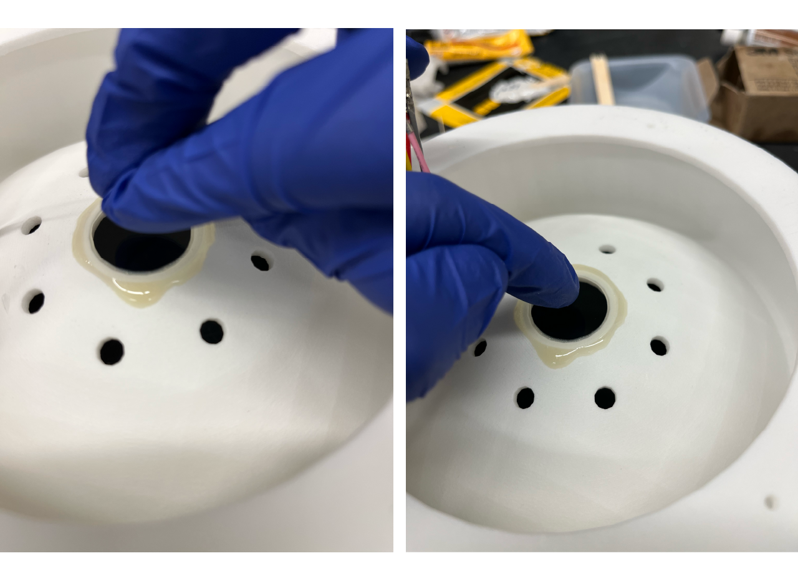
</figure>

2. Cut the cables from the 8 pin connector to 4 inches and remove the tip of the plastic protective cover, also remove the unused lead (in this case the dark purple/ brown cable), cut the black and red 26 AWG cables at 3 inches and remove the plastic cover from the tips as well. Place a female crimp pin in each cable one at the time and use the crimping tool following the instructions [here](https://www.pololu.com/product/1928). For the grey and red cables, crimp the black and red 26 AWG cables with them respectively; as shown in the picture below.

    ::: warning
    Leads colors might change depending on the connector used, just make sure to follow the same color code across the circuit.
    :::

<figure>
  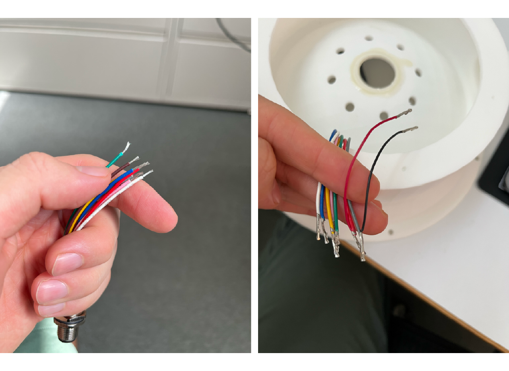
</figure>

 3. Insert each crimped cable into the housing with the correct position, according to the following picture.

    ::: tip
    The strain relief barrel sometimes ends up a little overly flattened, making it too wide to fit comfortably into the crimp pin housing. In such situations, you can use a pair of pliers to gently squeeze the wider axis of the barrel into a more cylindrical shape that will slide easily into the housing. This tip is taken directly from the [source](https://www.pololu.com/product/1928)
    :::

 <figure>
  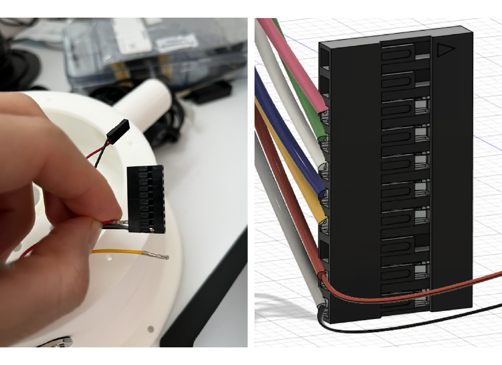
 </figure>

4. Insert the connector into the cup hole and screw.

 <figure>
  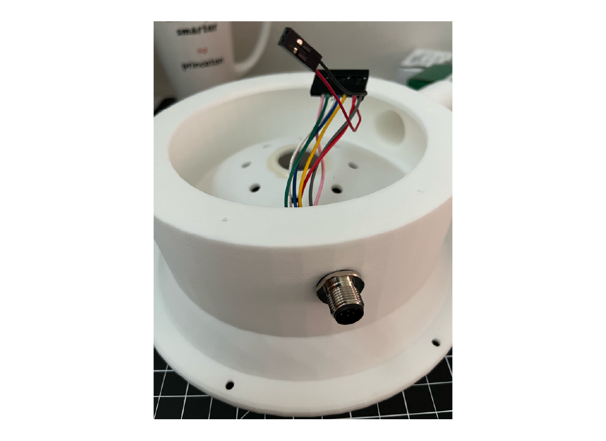
 </figure>

### Bottom plate assembly

The bottom plate design is sent to a machine shop to be made in aluminum. The bottom plate will hold the optical flow sensor which, due to space constrains, is place horizontally in the front part of the plate (toward the mice and the back to the screen) facing a 45 degrees mirror right below the gorilla glass window, instead of being placed directly at the bottom of the styrofoam ball. We also add a printed circuit board with a resistance and an IR LED to illuminate the bottom part of the ball.

1. We send the sensor holder to be made at a machine shop in aluminum, but i could also be 3D printed. Solder the 90 degrees angled pins to the optical flow sensor, then use a pair of 4-40 1/4" long screws to screw the sensor to the sensor holder (one at the top left and one at the bottom right is enough).

2. We use an external service to make our PCBs using the GERBER files, some options are PCBway or OSH park. Add some solder to the pads, then place the IR LED on top, making sure the pin ID matches the PCB ID mark as seen in the picture below (the ID pin is a small dent on one of the square corners of the LED, you might need a magnifying glass for this) and use a fine tip to solder it to the PCB. Repeat the process with the resistance and finally solder the pins.

 <figure>
  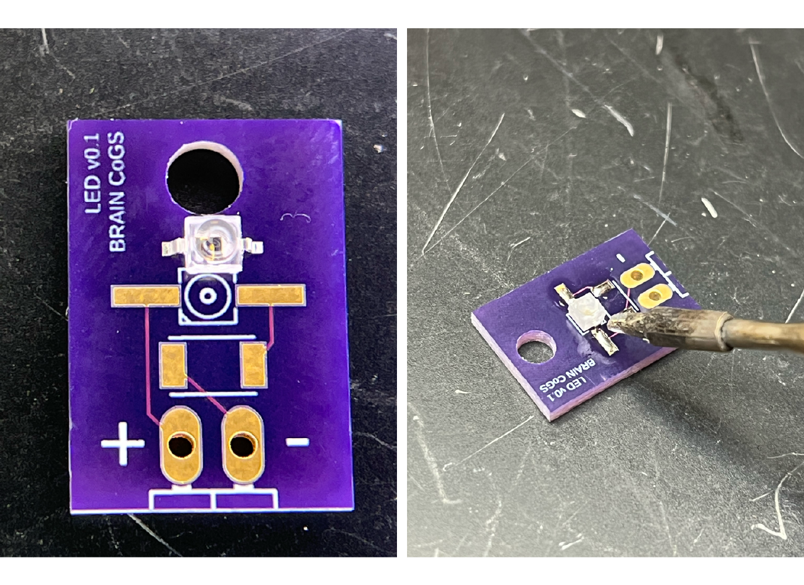
 </figure>

3. Use the heat insert installation tool to install a 4-40 x 0.17" long heat insert in the mirror and IR LED printed holder. Insert the correct tip into the soldering iron, then place the insert in the tip and connect it to a wall outlet; wait for a few seconds until it is hot and place it in the holes of the mirror holder. Press until the whole insert is inside and the surface is flat.

 <figure>
  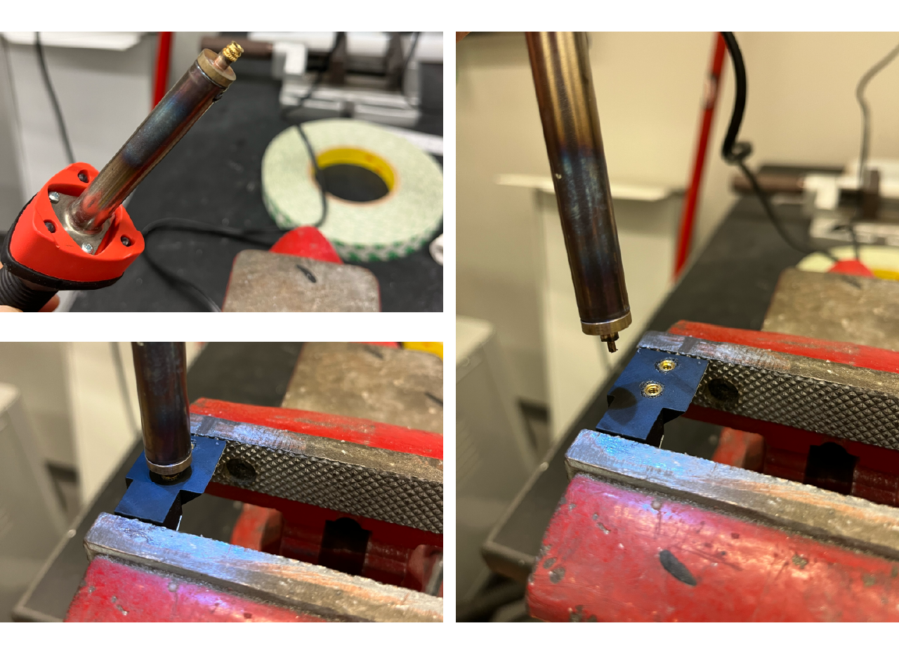
 </figure>

4. Cut a first surface mirror in a 1" x 0.75" square. Use a strong 2 side tape and cut some squares to fill both of the surfaces of the mirror and IR LED holder. Paste both the mirror and the PCB.

 <figure>
  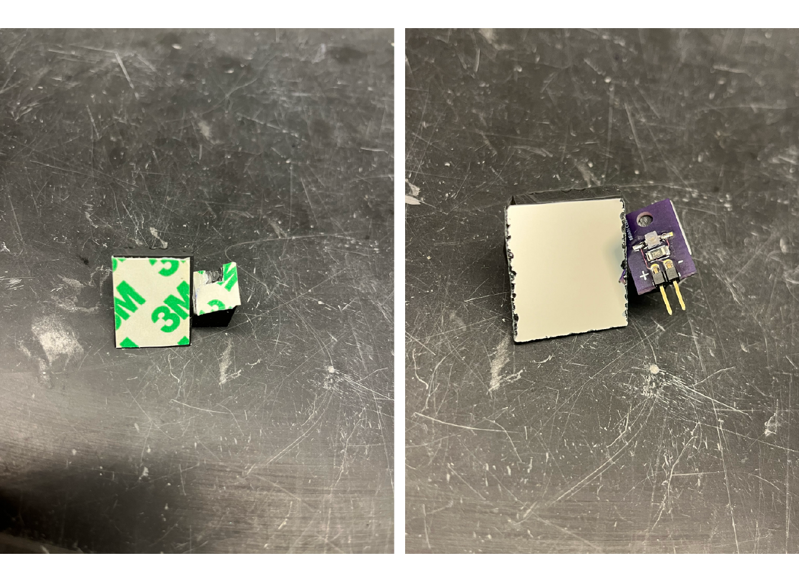
 </figure>

5. Screw the sensor and the mirror to the aluminum bottom plate.

### Assembly

1. Laser cut a rubber gasket to be placed between the aluminum plate and the cup. Connect the cables from the connector to the optical flow sensor, making sure the ground cable (grey) is at the bottom pin of the sensor (the one closer to the bottom plate). Use the thin red and black cables to connect to the IR LED PCB to the positive and negative pin respectively.

 <figure>
  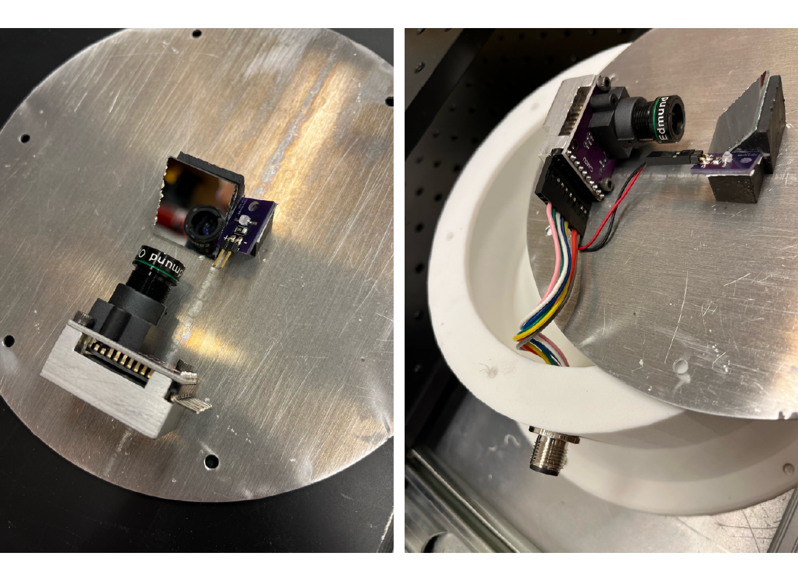
 </figure>

2. Place the rubber gasket between the bottom plate and the 3D printed cup and screw the bottom plate. Make sure that the optical flow sensor is between the cables connector and the air hose connector as shown in the figure below.

 <figure>
  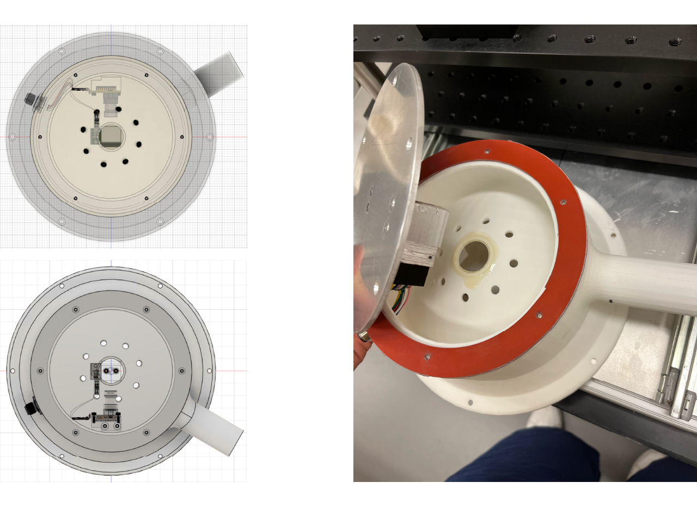
 </figure>

3. Screw the bottom plate to the cup and screw the cup to the top plate of the stage, the air hose connector should be facing the upper right part of the top optical breadboard, so that the optical flow sensor is directed toward facing the mice.

 <figure>
  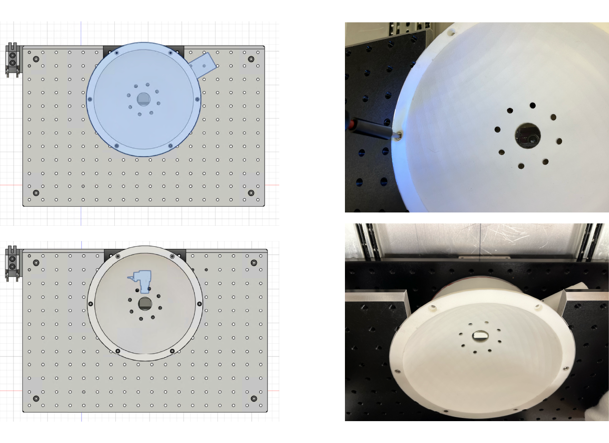
 </figure>

## Cable and hose carrier (optional)

We place a cable and hose carrier to avoid them to be crushed or damaged while the stage is taken in and out. It is also useful to keep the working space clean and neat. Follow the next steps for assembly.

1. Print the carrier to breadboard adapter and install it in the bottom part of the top breadboard (it is easier to screw it before the posts, but you can always take the top breadboard apart or screw brom the bottom). Place the M6 x 1mm square nuts on the square hole in the bottom part of the adapter and use a pair of M6 x 1mm, 10 mm long to screw the carrier mounting bracket to it.

 <figure>
  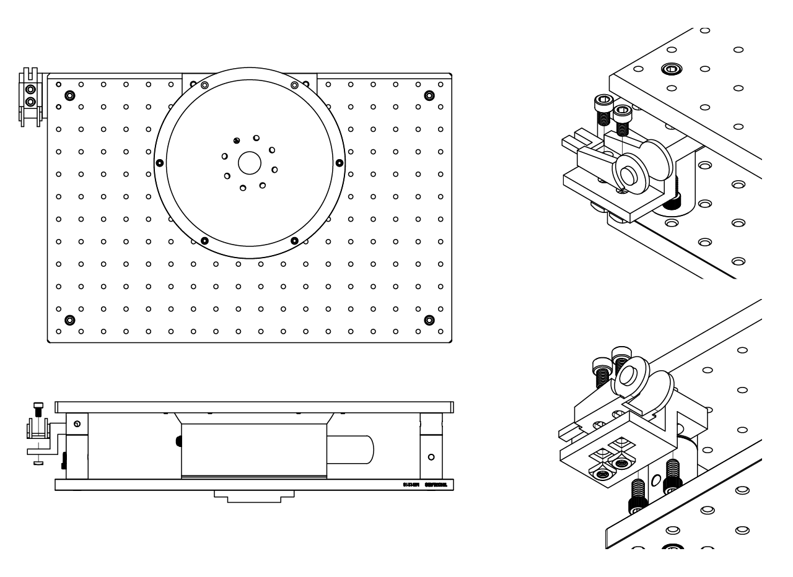
 </figure>

2. Place the second mounting bracket for the carrier on the 2 holes at the bottom left part of the aluminum bottom plate in the cabinet.

 <figure>
  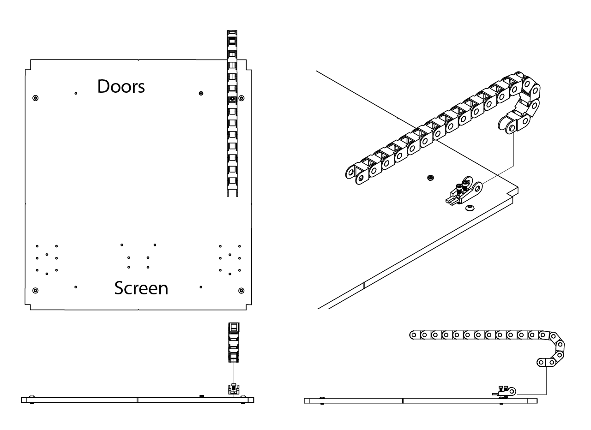
 </figure>

3. We order a 3 ft. long cable and hose carrier. Count 17 pieces of the carrier and snap off the rest of them. Attach the carrier to both mounting brackets.

 <figure>
  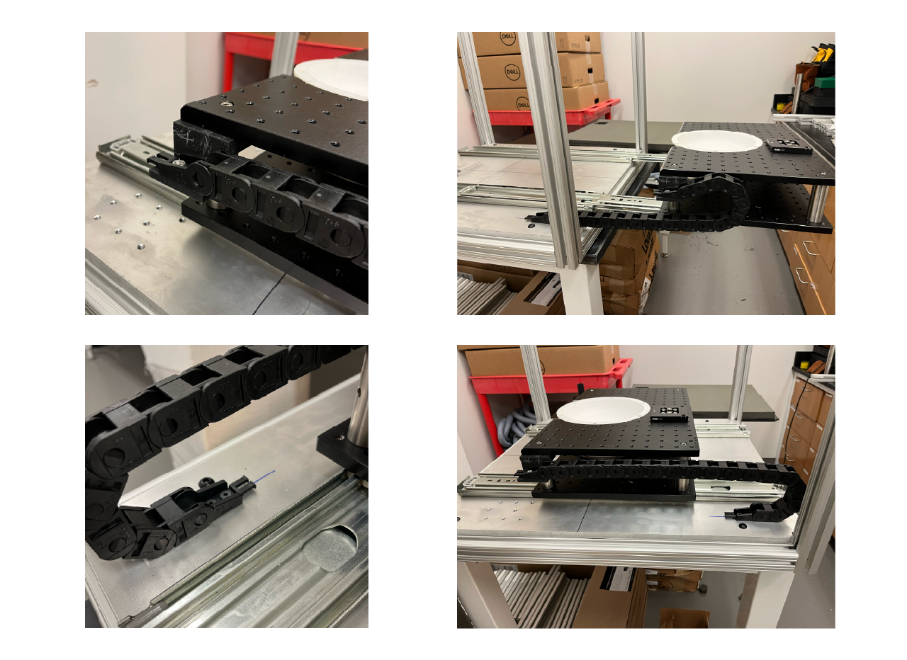
 </figure>

## GERBER files

1. Gerber files for the IR LED available <a href='/building/GERBER/IR-LED-circuit-for-optical-flow-sensor.zip'>here.</a>