# {{ $frontmatter.title }}

The stage holds a 3D printed cup with the optical flow sensor at the bottom and a hose connected to it that delivers a constant air flow, making a Styrofoam ball float on top. The mouse is head-fixed on top of the ball and can run on it, while the optical flow sensor updates the virtual world projected on the screen.

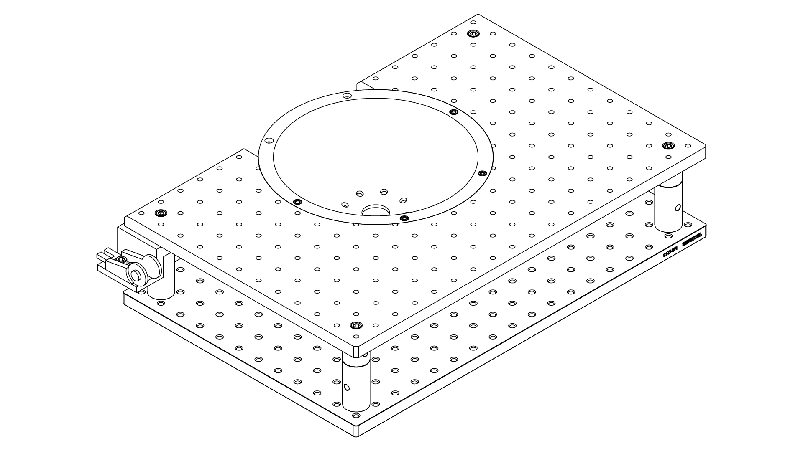

The stage consists of a pair of optical breadboards joined by a set of posts. The length of the posts is chosen so that the stage is at the height for which the mouse position and the projection are calibrated. The top optical breadboard is modified to fit the cup, which directs the constant air flow to the bottom of the Styrofoam ball and makes it float, so the mouse can move and run freely.

We have the optical breadboard modified at a machine shop. To assemble the stage, first build the 4 posts by attaching a 1" diameter, 1" long post to a 1" diameter, 2" long post with a 1/4" set screw (alternatively, you can use a 1" diameter, 3" long post). Then attach the top plate and the bottom plate to the ends of the 4 posts with 1/4" screws.

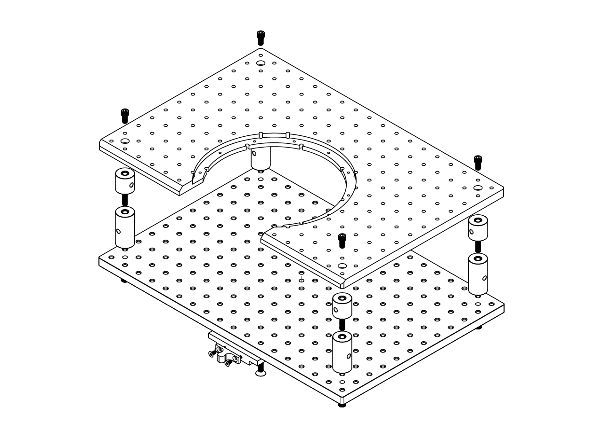

Have the adapter made at a machine shop, then attach the latch holder to the adapter with a pair of M4 x 0.7 mm, 8 mm long screws. Attach the adapter to the underside of the bottom plate, at the intersection of the middle columns and the second row, as shown in the picture below.

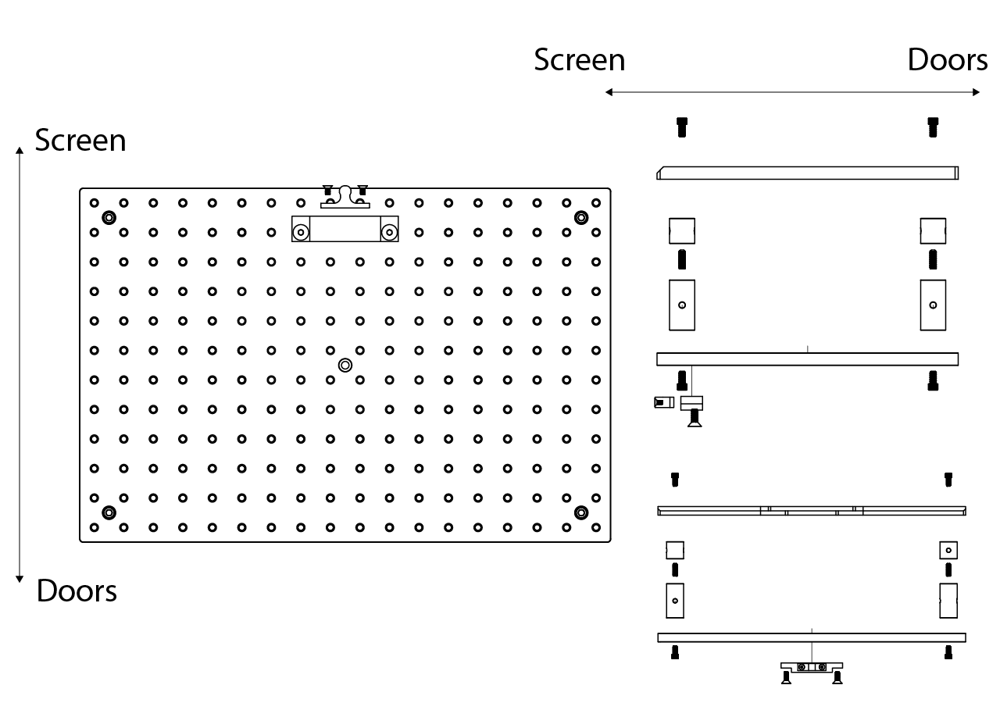

## Stage installation

Install the stage in the cabinet with 1/4"-20, 1/2" long low-profile socket head screws, driven from the bottom of the drawer slider into the breadboard (the stage can be installed before or after the 3D printed cup). Extend the drawer all the way out, place the stage on top of it and align it as shown in the image below.

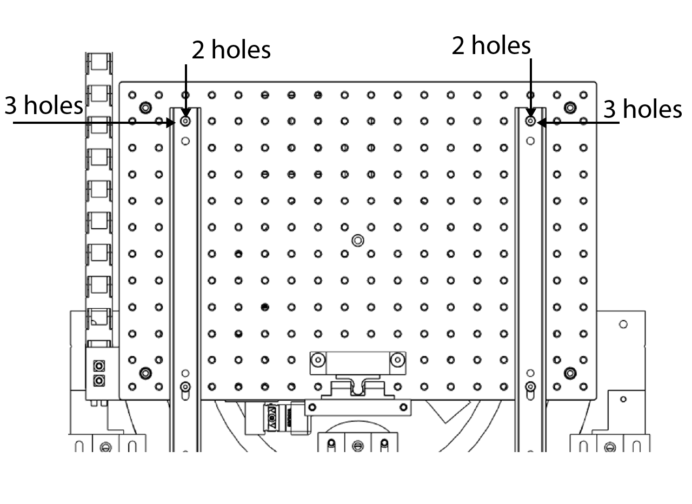

## Cup with optical flow sensor

The cup has 2 main components. The first is the cup itself, which includes a circular arm that brings a constant air flow into it, and a connector that carries power and data between the sensor and the Arduino in the rig's control module. The second is the bottom plate, which holds the optical flow sensor, a mirror and an LED printed circuit board (PCB).

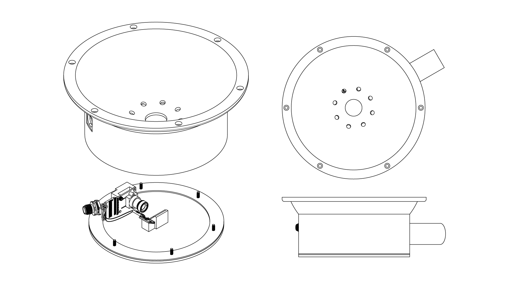

### Cup assembly

We use an external 3D printing service to make the cup. Nylon 12 works fine, and ideally the top curved surface of the cup should be smooth (sanding it by hand with fine sandpaper does the job).

1. Working from the bottom of the cup, apply a small amount of transparent epoxy around the circular hole in the middle and place the 30 mm Gorilla Glass window. Press the window gently so the epoxy seals the edges against air leaks, without letting it spread into the middle of the window.

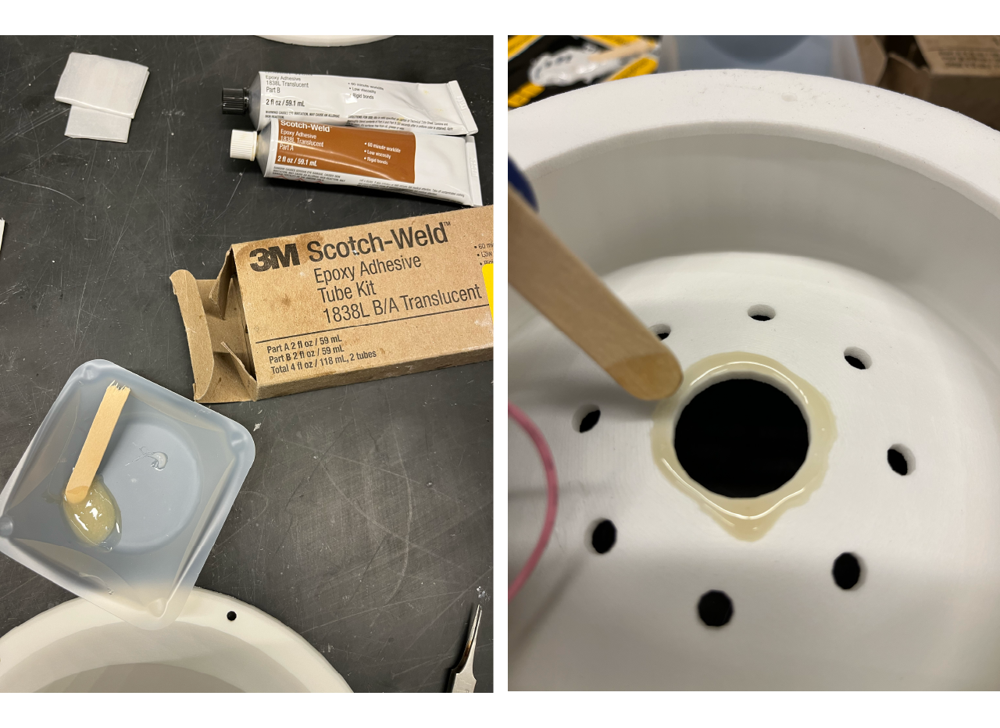

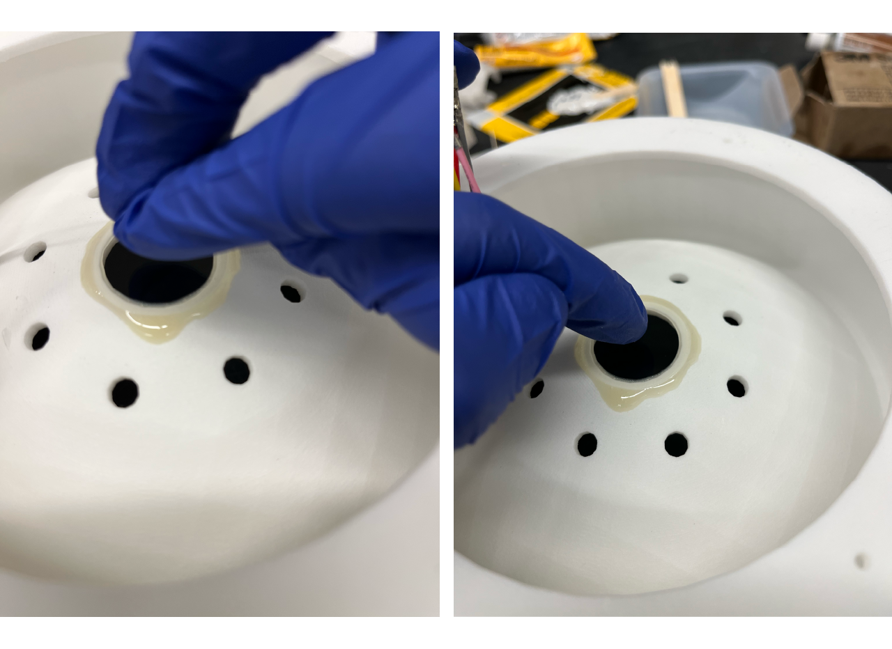

2. Cut the wires of the 8-pin connector to 4 inches and strip the insulation from the tips. Also remove the unused lead (in this case the dark purple/brown wire). Cut the black and red 26 AWG wires to 3 inches and strip their tips as well. Crimp a female crimp pin onto each wire, one at a time, following the instructions [here](https://www.pololu.com/product/1928). Crimp the black and red 26 AWG wires together with the grey and red wires respectively, as shown in the picture below.

    ::: warning
    Lead colors might differ depending on the connector used; just make sure to follow the same color code across the circuit.
    :::

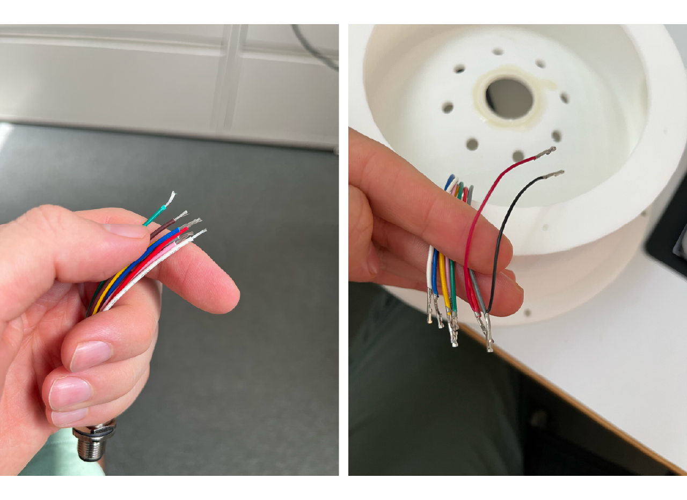

 3. Insert each crimped wire into the housing in the correct position, according to the following picture.

    ::: tip
    The strain relief barrel sometimes ends up a little overly flattened, making it too wide to fit comfortably into the crimp pin housing. In such situations, you can use a pair of pliers to gently squeeze the wider axis of the barrel into a more cylindrical shape that will slide easily into the housing. This tip is taken directly from the [source](https://www.pololu.com/product/1928).
    :::

 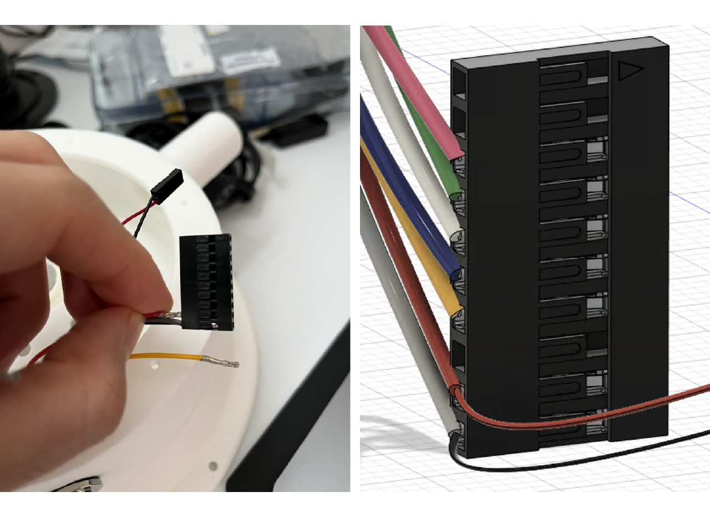

4. Insert the connector into the hole in the cup and screw it in.

 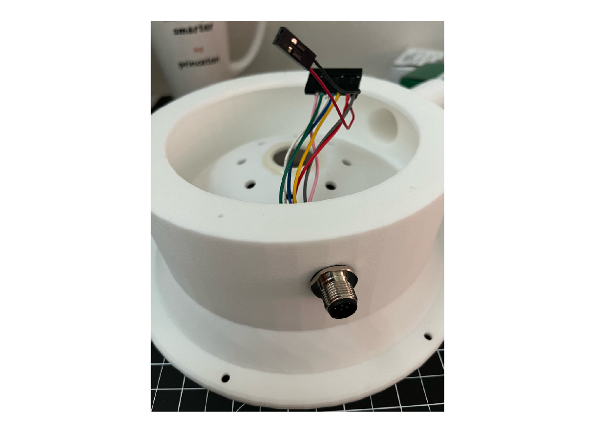

### Bottom plate assembly

We have the bottom plate made in aluminum at a machine shop. It holds the optical flow sensor, which, due to space constraints, is mounted horizontally at the front of the plate (toward the mouse, with its back to the screen), facing a 45 degree mirror right below the Gorilla Glass window, instead of directly below the Styrofoam ball. We also add a printed circuit board with a resistor and an IR LED to illuminate the bottom of the ball.

1. We have the sensor holder made in aluminum at a machine shop, but it could also be 3D printed. Solder the right-angle (90 degree) pins to the optical flow sensor, then screw the sensor to the sensor holder with a pair of 4-40, 1/4" long screws (one at the top left and one at the bottom right is enough).

2. We use an external service to make our PCBs from the Gerber files; options include PCBWay and OSH Park. Add some solder to the pads, then place the IR LED on top, making sure its pin 1 marker matches the ID mark on the PCB, as seen in the picture below (the marker is a small notch on one of the square corners of the LED; you might need a magnifying glass to see it), and solder it to the PCB with a fine tip. Repeat with the resistor, and finally solder the pins.

 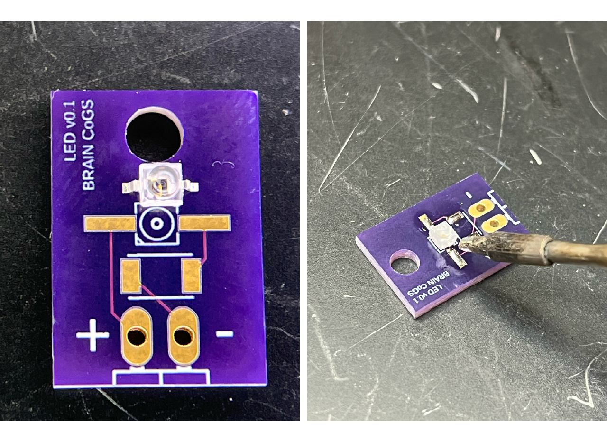

3. Use the heat-set insert installation tool to install a 4-40 x 0.17" long heat-set insert in the printed mirror and IR LED holder. Fit the correct tip to the soldering iron, put the insert on the tip and plug the iron in; wait a few seconds until it is hot, then place the insert in the hole of the mirror holder. Press until the whole insert is inside and flush with the surface.

 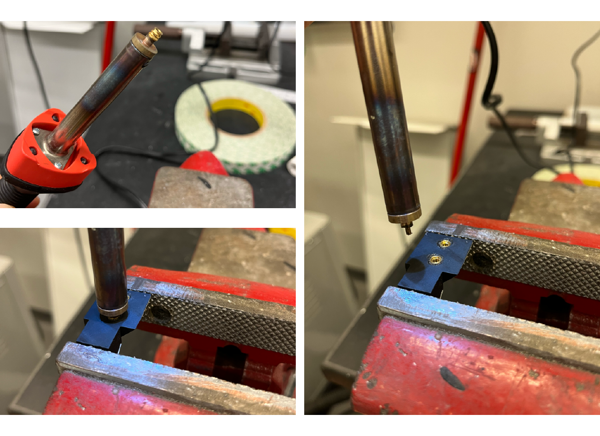

4. Cut a first-surface mirror to a 1" x 0.75" rectangle. Cut pieces of strong double-sided tape to cover both mounting surfaces of the mirror and IR LED holder, then stick on the mirror and the PCB.

 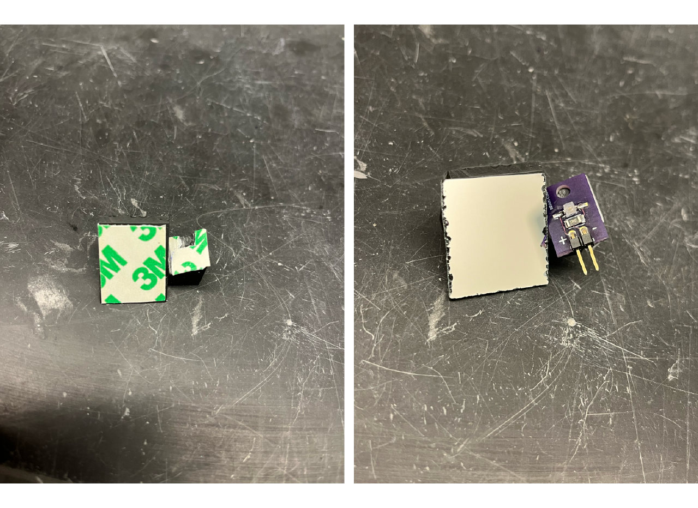

5. Screw the sensor and the mirror to the aluminum bottom plate.

### Assembly

1. Laser cut a rubber gasket to go between the aluminum plate and the cup. Connect the wires from the connector to the optical flow sensor, making sure the ground wire (grey) goes to the bottom pin of the sensor (the one closest to the bottom plate). Connect the thin red and black wires to the positive and negative pins of the IR LED PCB, respectively.

 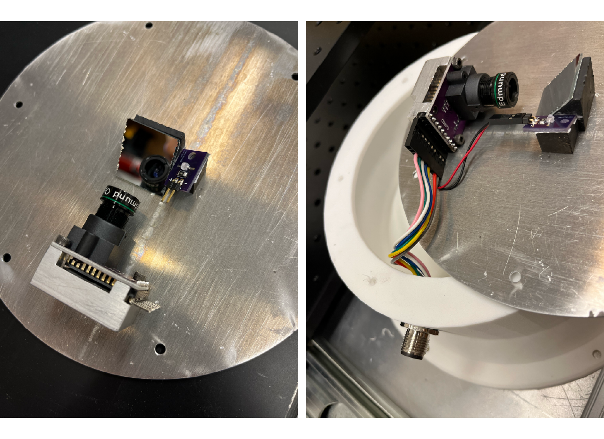

2. Place the rubber gasket between the bottom plate and the 3D printed cup. Make sure the optical flow sensor sits between the cable connector and the air hose connector, as shown in the figure below.

 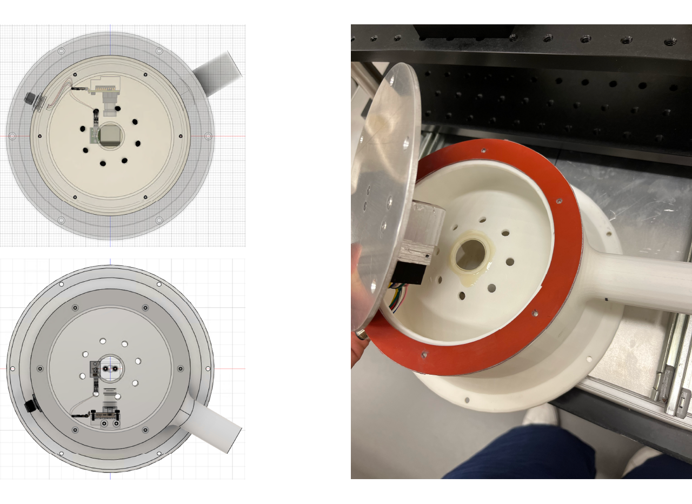

3. Screw the bottom plate to the cup and the cup to the top plate of the stage. The air hose connector should face the upper right part of the top optical breadboard, so that the optical flow sensor faces the mouse.

 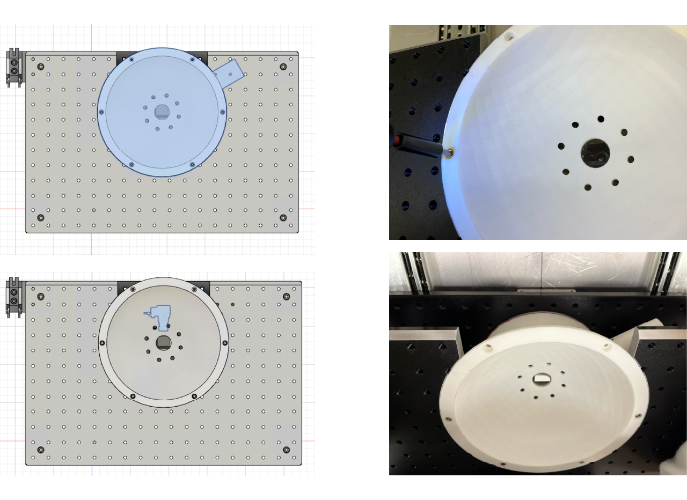

## Cable and hose carrier (optional)

We install a cable and hose carrier so that the cables and hoses don't get crushed or damaged when the stage slides in and out. It also keeps the workspace clean and tidy. Follow these steps to assemble it.

1. Print the carrier-to-breadboard adapter and install it on the underside of the top breadboard (it is easier to screw it on before the posts, but you can always take the top breadboard off or screw it from the bottom). Put the M6 x 1 mm square nuts in the square holes on the bottom of the adapter and screw the carrier mounting bracket to it with a pair of M6 x 1 mm, 10 mm long screws.

 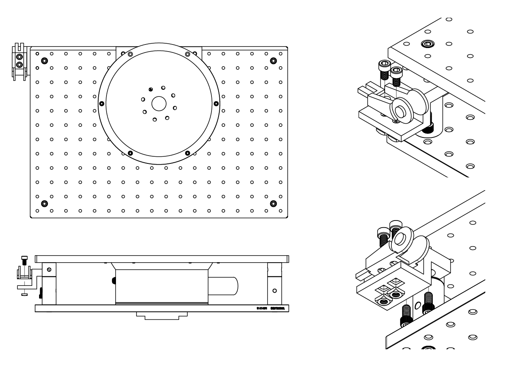

2. Attach the carrier's second mounting bracket to the 2 holes at the bottom left of the aluminum bottom plate in the cabinet.

 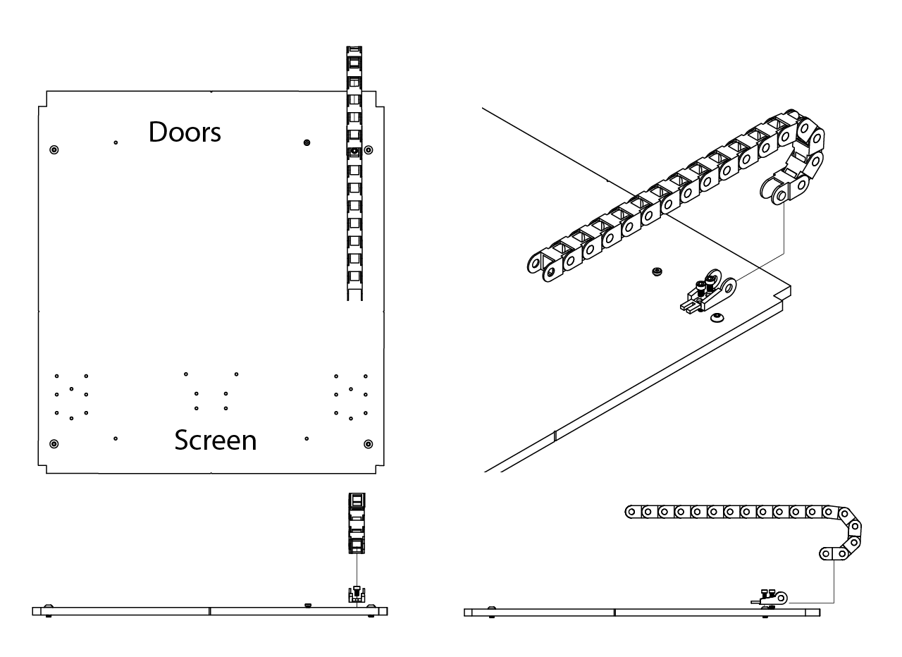

3. We order a 3 ft long cable and hose carrier. Count 17 links and snap off the rest. Attach the carrier to both mounting brackets.

 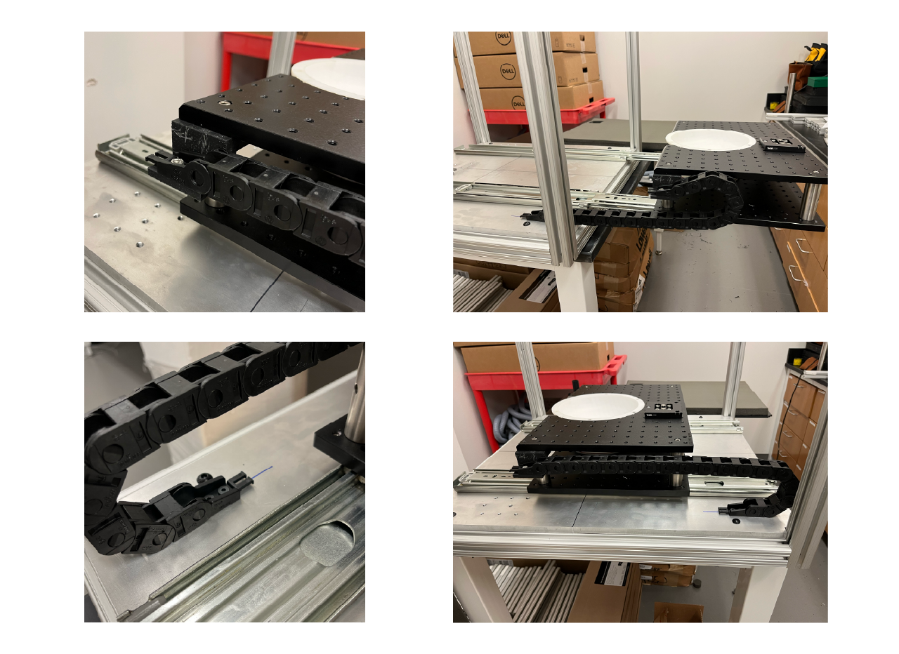

## Gerber files {#gerber-files}

1. The Gerber files for the IR LED board are available <a href='/building/GERBER/IR-LED-circuit-for-optical-flow-sensor.zip'>here</a>.
