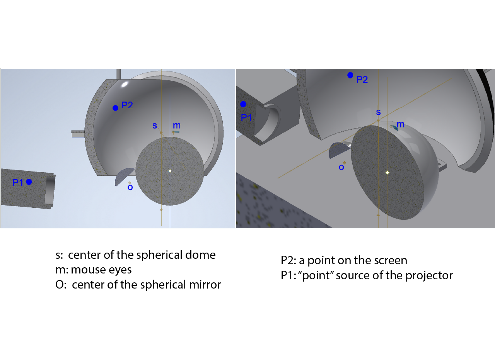
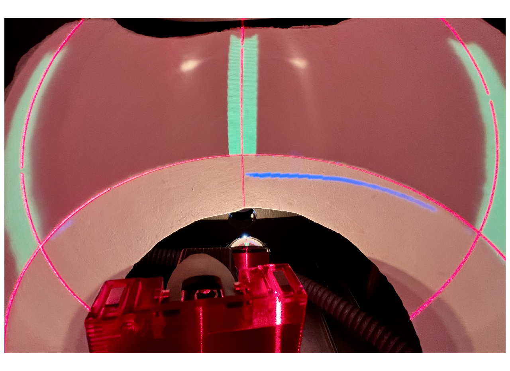

# {{ $frontmatter.title }}

 The projection module maintenance consist primarily on the initial calibration and subsequent maintenance calibrations that should be performed every ~6 months, and the projector bulb replacement that must be done whenever the projector ask for it, since the projector has an internal counter of how many hours the bulb has been used.

 ## Projection calibration

 The projection system use a spherical mirror to project into the dome. The image transformation is based on a [hemispherical dome projection principle](http://www.domerama.com/general/geodesic-dome-projection/hemispherical-dome-projection/).
 
 Creating correctly warped images given a particular projector, mirror, and dome arrangement requires finding the point on the projector frustum for any point on the dome. The problem is three-dimensional but can be turned into a simpler two dimensional problem by firstly translating the geometry so the spherical mirror is at the origin and then rotating the geometry so that the point on the mirror, dome, and projector lies in a single plane. 
 
 The projector is located at P1, the mirror is of radius r, and the position on the dome is P2. The path length from the projector to the mirror is L1, the path length from the dome to the mirror is L2. In the case of a spherical mirror: the line at mid-angle between the vectors OP1 and OP2 and its intersection with the surface of the mirror defines the reflection point.

 Fermat’s principle states that light travels by the shortest route, so the reflection point on the mirror can be found by minimising the total light path length from the projector to the position on the dome, namely minimising (L1^2 + L2^2)^1/2. It is quite simple in the case of a spherical mirror: the line at mid-angle between the vectors OP1 and OP2 and its intersection with the surface of the mirror defines the reflection point.

<figure>
  
</figure>

The projection calibration will align the projection within certain boundaries, specifically the horizon, the center and the left and right side will be aligned to the physical position of the dome. This method has a trade-off in the time that has to be inverted to perform the alignment vs the accuracy of the rendered projection, since the height of the towers might be different across systems.

To calibrate the projection:

1. Turn on the projector and make sure to mirror the projection horizontally, otherwise left/right will be inverted.
2. Place the alignment tool. We recommend to use a [3 laser alignment tool](https://www.grainger.com/product/BOSCH-Alignment-Laser-3-Beams-450W78?internalSearchTerm=Alignment+Laser%3A+3+Beams%2C+0+Dots%2C+0+Lines%2C+Red%2C+200+ft+Range+w%2Fo+Detector&suggestConfigId=8&searchBar=true&opr=THKS). Use the marked lines at the bottom plate to align the center and sides lasers on the dome. Set the height of the horizontal laser to 12" from the bottom plate.
3. Create a new subject in the ViRMEn training GUI and select the livecalibration.mat experiment. This is the calibration world that was developed, it is necessary to set the simulation mode to true in the RigParameters file. This will project a static world with 3 towers set at the center and at the left and right of the mouse eyes. The goal is to align the horizon to the animal eyes position, the center tower to the center of the screen and the left and right towers to the mouse eyes position.
4. Set the initial vairables of the projection parameters as below (these parameters has been obatained empirically and they are a good starting point for the training mini VR rigs as they are built).

```
%% Mini VR projection parameters
% Spherical screen radius
proj_param_Rs           =    8;

% Screen's center location relative to the animal eyes
proj_param_xsm          =    1.814;
proj_param_ysm          =    0;
proj_param_zsm          =    0.47;

% Mirror position relative to the animal eyes
% Mirror position measurement is facilitated knowing that the center of 
%spherical mirror is (43.8-24.2=)19.6mm (0.77in) behind the back surface.
proj_param_xOm          =   5.582;
proj_param_yOm          =   0;
proj_param_zOm          =   -6.62;

% Radius of the spherical mirror (Silver coated lens LA1740-Thorlabs)
proj_param_r            =   1.724;

% Projector position relative to the mirror center
proj_param_xP1o         =   11.1;
proj_param_yP1o         =   0;
proj_param_zP1o         =   -0.6;

% Horizontal coordinate shift and rescaling
proj_param_hrescaling   =   5.5;
proj_param_hshift       =   0.000;

% Vertical coordinate shift and rescaling
proj_param_vrescaling   =   5.5;
proj_param_vshift       =   -1.017;


```

4. First, try to align certain variables by physically moving the projector. Unscrew the plate that holds the projector and move it horizontally until the middle tower is centered with the laser. Make sure that the left and rigth towers are equidistant from the middle of the dome, you may be able to achieve this by slightly moving the plate forward from one side or the other.

::: tip

The position of the towers will move when the plate is thightened, don't untight the screws all the way if it is not necessary, unthight until it is possible to move the plate and checking the projection, then thight and adjust accordingly.

:::

The goal of doing this physically instead of modifying the projection transformation parameters is that it decreases the differences across the projections in different training rigs.

5. Adjust the rest of the parameters until the towers and horizon are aligned. A brief description of how each parameter adjust the projection can be found below.

* **Rs** should not be modified.
* **xsm** will adjust the middle tower height without affecting the lateral towers, values should be around [1.5 - 2]. This value canbe adjusted since there will be idiosincrasies due to the screen fabrication.
* **zOm** will adjust the horizon. This value can be adjusted since there can be differences in how the mirror is glued to its aluminum base.
* **xP1o** will extend or contract the lateral towers and **zP1o** will lower or elevate the middle tower but will modify the distal part of the lateral towers. These values can be adjusted since there are idiosincrasies in the origin of the projection between projectors in their fabrication.
* The **hrescaling** and the **vrescaling** should be the same, otherwise it will modify elongate or contract the projection, and there will be significant differences across sytems.
* The **hshift** and **vshift** will move the entire projection up, down, left or right. Ideally the **hshift** should be 0 if the projection is calibrated manually, but it can be modified if necessary since it shouldn't affect significatly the projection across differente systems.

<figure>
  
  <center><figcaption><small>Projection calibration. Due to the principle of the spherical mirror projection, the lateral towers will be slightly curved, the projection should be fine as long as they are equidistant and centered at the top (or the bottom, just make sure to keep the same policy across rigs).</small></figcaption></center>
</figure>

 ## Projector bulb replacement.

 The projector has a counter used to determine how long the bulb has been used, it will emit an alert that the bulb should be replaced. Make sure to have in stock projector bulbs and follow each projector instruction to replace it.