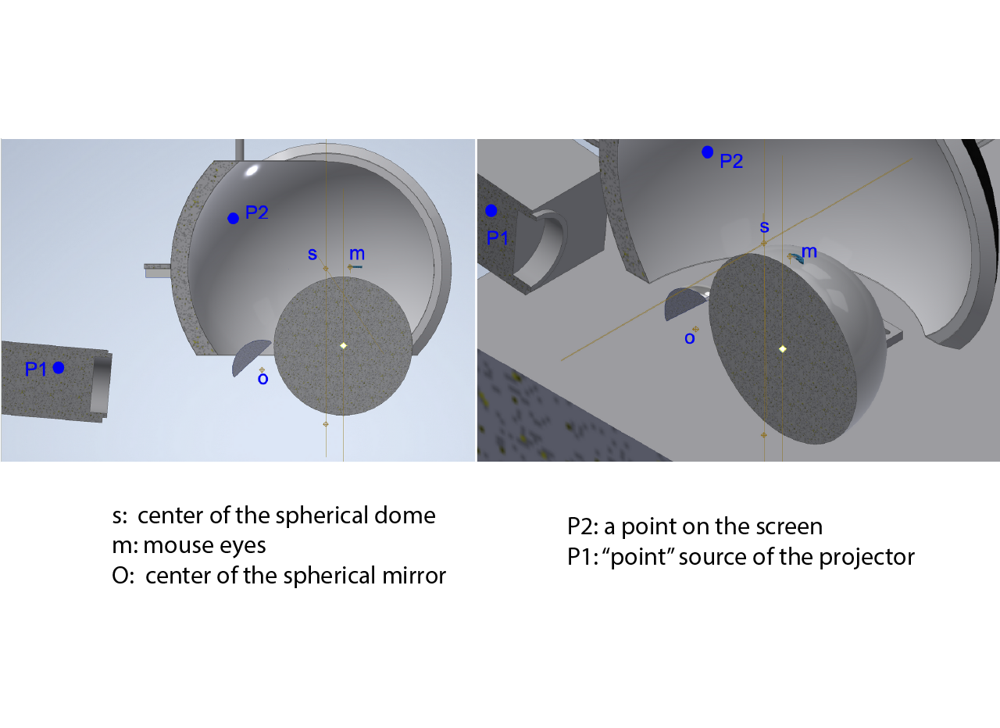
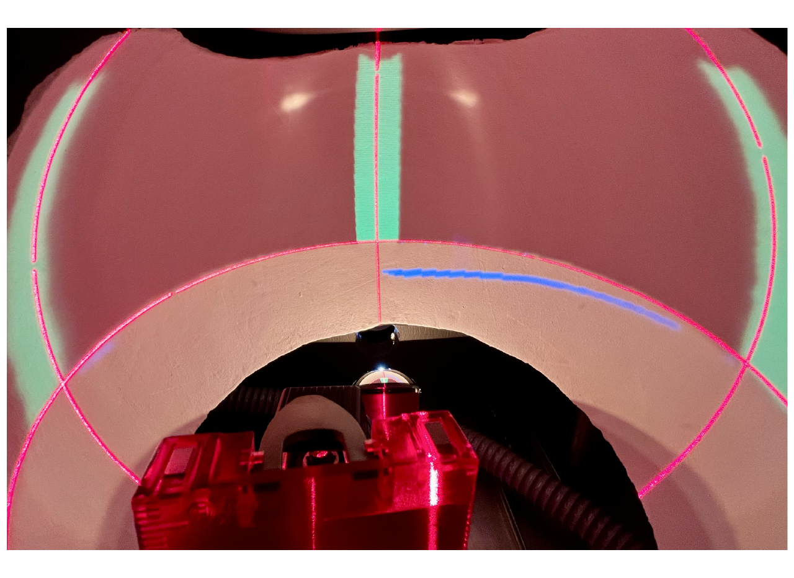

# {{ $frontmatter.title }}

 Maintenance of the projection module consists mainly of the initial calibration, recalibration every ~6 months, and replacing the projector bulb whenever the projector asks for it (the projector keeps count of the bulb's hours of use).

 ## Projection calibration

 The projection system uses a spherical mirror to project onto the dome. The image transformation is based on a [hemispherical dome projection principle](http://www.domerama.com/general/geodesic-dome-projection/hemispherical-dome-projection/).

 Creating correctly warped images for a particular projector, mirror and dome arrangement requires finding the point on the projector frustum for any point on the dome. The problem is three-dimensional, but it can be turned into a simpler two-dimensional problem by first translating the geometry so the spherical mirror is at the origin, and then rotating it so that the points on the mirror, dome and projector lie in a single plane.

 The projector is located at P1, the mirror is of radius r, and the position on the dome is P2. The path length from the projector to the mirror is L1, and the path length from the dome to the mirror is L2.

 Fermat’s principle states that light travels by the shortest route, so the reflection point on the mirror can be found by minimizing the total light path length from the projector to the position on the dome, namely L1 + L2. This is quite simple for a spherical mirror: the line at mid-angle between the vectors OP1 and OP2 and its intersection with the surface of the mirror defines the reflection point.



The projection calibration aligns the projection within certain boundaries: the horizon, the center, and the left and right sides are aligned to the physical position of the dome. This method trades off the time invested in the alignment against the accuracy of the rendered projection, since the height of the towers might differ across systems.

To calibrate the projection:

1. Turn on the projector and make sure to mirror the projection horizontally; otherwise, left and right will be swapped.
2. Place the alignment tool. We recommend a [3-beam laser alignment tool](https://www.grainger.com/product/BOSCH-Alignment-Laser-3-Beams-450W78?internalSearchTerm=Alignment+Laser%3A+3+Beams%2C+0+Dots%2C+0+Lines%2C+Red%2C+200+ft+Range+w%2Fo+Detector&suggestConfigId=8&searchBar=true&opr=THKS). Use the lines marked on the bottom plate to align the center and side lasers on the dome. Set the horizontal laser 12" above the bottom plate.
3. Create a new subject in the ViRMEn training GUI and select the `livecalibration.mat` experiment, our calibration world. Simulation mode must be set to true in the `RigParameters` file. This projects a static world with 3 towers: one at the center and one to the left and right of the mouse's eyes. The goal is to align the horizon with the animal's eye level, the center tower with the center of the screen, and the left and right towers with the position of the mouse's eyes.
4. Set the initial values of the projection parameters as below (these values were obtained empirically and are a good starting point for training mini VR rigs built as described here).

```
%% Mini VR projection parameters
% Spherical screen radius
proj_param_Rs           =    8;

% Screen's center location relative to the animal eyes
proj_param_xsm          =    1.814;
proj_param_ysm          =    0;
proj_param_zsm          =    0.47;

% Mirror position relative to the animal eyes
% Mirror position measurement is facilitated knowing that the center of
%spherical mirror is (43.8-24.2=)19.6mm (0.77in) behind the back surface.
proj_param_xOm          =   5.582;
proj_param_yOm          =   0;
proj_param_zOm          =   -6.62;

% Radius of the spherical mirror (Silver coated lens LA1740-Thorlabs)
proj_param_r            =   1.724;

% Projector position relative to the mirror center
proj_param_xP1o         =   11.1;
proj_param_yP1o         =   0;
proj_param_zP1o         =   -0.6;

% Horizontal coordinate shift and rescaling
proj_param_hrescaling   =   5.5;
proj_param_hshift       =   0.000;

% Vertical coordinate shift and rescaling
proj_param_vrescaling   =   5.5;
proj_param_vshift       =   -1.017;


```

5. First, align what you can by physically moving the projector. Unscrew the plate that holds the projector and move it horizontally until the middle tower is centered on the laser. Make sure that the left and right towers are equidistant from the middle of the dome; you may be able to achieve this by moving one side of the plate slightly forward.

::: tip

The towers will shift when the plate is tightened. Don't loosen the screws all the way unless necessary: loosen them just enough to move the plate while checking the projection, then tighten them and adjust accordingly.

:::

Doing this physically, instead of changing the projection transformation parameters, reduces the differences between the projections of different training rigs.

6. Adjust the rest of the parameters until the towers and horizon are aligned. Below is a brief description of how each parameter changes the projection.

* **Rs** should not be modified.
* **xsm** adjusts the height of the middle tower without affecting the lateral towers; values should be around 1.5 to 2. This value can be adjusted, since each screen has its own quirks from fabrication.
* **zOm** adjusts the horizon. This value can be adjusted, since mirrors can differ in how they are glued to their aluminum base.
* **xP1o** stretches or shrinks the lateral towers, and **zP1o** lowers or raises the middle tower but also changes the distal part of the lateral towers. These values can be adjusted, since the projection origin differs slightly between individual projectors.
* **hrescaling** and **vrescaling** should be equal; otherwise, the projection is stretched or squeezed, and there will be significant differences across systems.
* **hshift** and **vshift** move the entire projection up, down, left or right. Ideally, **hshift** should be 0 if the projection is calibrated manually, but it can be changed if necessary, since it shouldn't significantly affect the projection across different systems.



 ## Projector bulb replacement

 The projector counts how long the bulb has been used and alerts you when it should be replaced. Keep projector bulbs in stock, and follow the projector's instructions to replace them.
