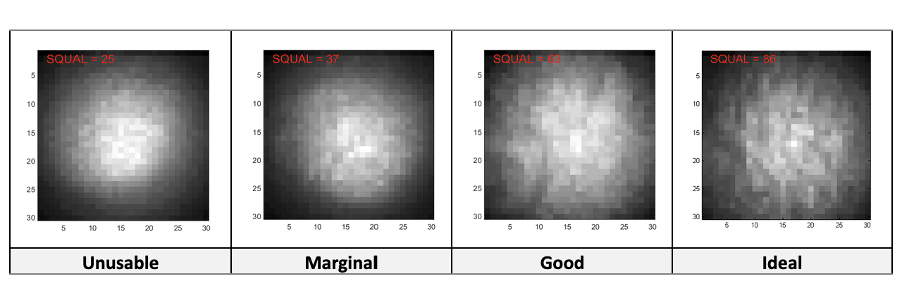
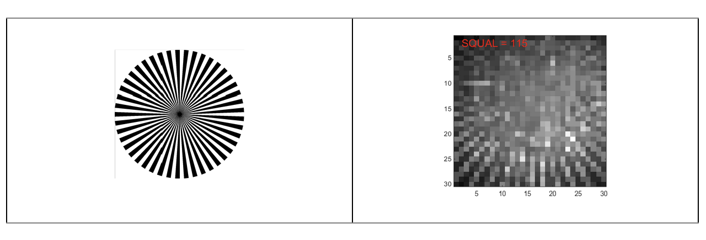
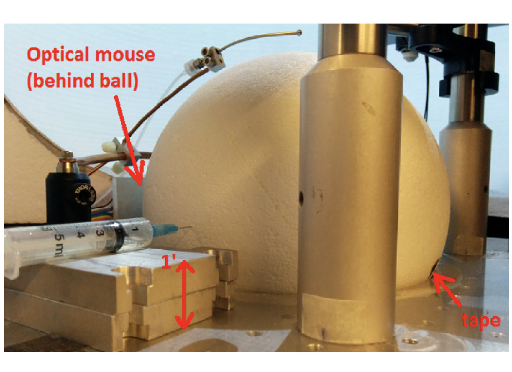
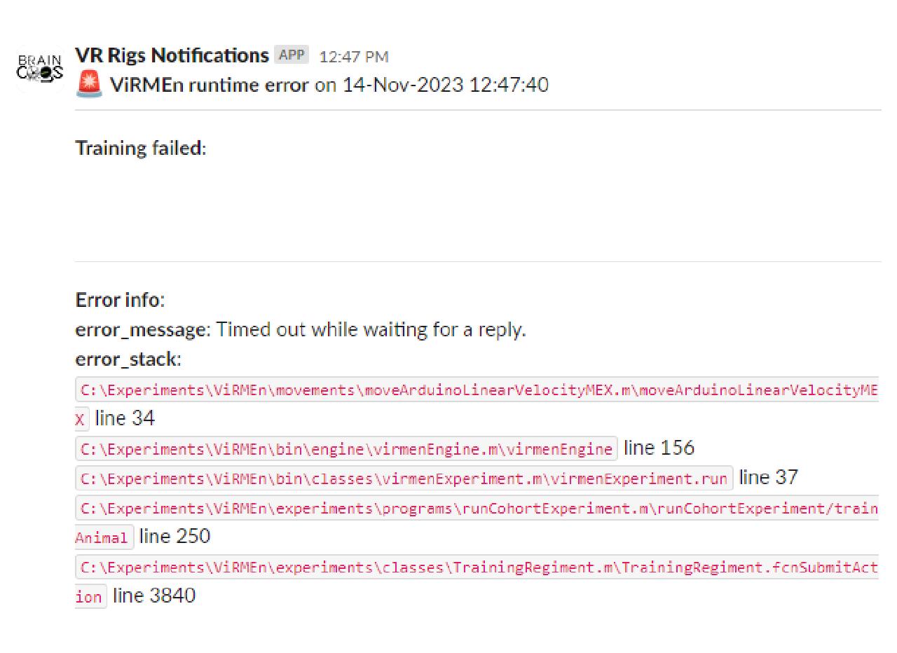

# {{ $frontmatter.title }}

Maintenance of the stage consists mainly of replacing the ball and calibrating the optical flow sensor.

## Running ball replacement

1. Glue two [8" diameter half balls](https://www.dickblick.com/items/smooth-foam-crafters-foam-half-ball-8-dia/) together with [lightweight Styrofoam glue](https://www.amazon.com/FloraCraft-Non-Toxic-Foam-Glue/dp/B000FFUCAI?th=1). Use a fair amount of glue, press the halves together (squeeze them for a few seconds so they stay stuck to each other) and smooth the excess glue along the seam with your finger. Let the ball sit for a few hours or overnight.

2. Once it has set, use an [abrasive brush](https://www.mcmaster.com/7451T32/) or a [sanding sponge](https://www.mcmaster.com/4023A79/) to slightly roughen the surface of the ball; this improves the quality of motion detection by the optical flow sensor.

3. Once the Styrofoam ball is prepared, label it with a red Sharpie, then mark it with a cross-hatch pattern using a black industrial Sharpie, trying not to leave large white gaps in the pattern.

## Optical flow sensor calibration

### Image quality and lens focus

The image quality of the optical sensor should be maximized for reliable measurements. You can do this by:

* Ensuring sufficient infrared (IR) illumination (but increasing it past a certain threshold does not help).

* Adjusting the focal plane of the M12 lens to the surface being measured.

* Using a surface with more texture (of the appropriate size given the limited number of sensor pixels).

The ADNS-3080 chip reports a surface quality (SQUAL) value that can be read out in software, as explained below. This value needs to be at least 30 for velocities of around 100-150 cm/s. At lower SQUAL values, the sensor tends to underestimate the actual displacement, and the effect grows with surface velocity. Below are example images of a Styrofoam ball at SQUAL values ranging from unusable to ideal (for velocities not far above 100 cm/s).

Follow the procedure below to adjust the focus of the optical flow sensor lens.

1. Load `Arduino Code\ADNS_image_v1\ADNS_image_v1.ino` in the Arduino IDE.

2. Set `reset_pin` to 6 and `select_pin` to 10 (lines 20-24).

3. Upload the Arduino code to the board. Note that you will have to reprogram the board afterwards to use it for displacement readout.

4. Print the left side of the following image (an optical spoke target) on a laser printer. The spoke target's lines narrow toward the center, which lets you probe the single-pixel limit of the optical sensor, as shown in the calibrated image (from the sensor) on the right:

5. Place the spoke target in front of the optical sensor at the same location and orientation as the actual surface to be measured. For example, on the mouse VR rig, tape it onto a Styrofoam ball and suspend the ball at the height it would normally be during experiments.

6. Run the `Matlab Code\Calibration\display_image.m` function. It continuously displays the sensor image for a preset amount of time and can be stopped with Ctrl+C.

7. Adjust the IR LED so that it points toward the center of the surface being imaged. You should see the illuminated region shift around in the `display_image` figure.

8. The `display_image` figure is normalized so that the brightest regions appear white and the darkest black, i.e. absolute luminosity information is not shown. You can change this by replacing `imagesc(im)` (line 66) with `image(im)` in the code and setting the color scale manually: `set(gca, 'CLim', […])`.
   Oblique illumination can help increase feature contrast on uneven surfaces, but in general just illuminating the largest amount of surface available is sufficient.

9. Adjust the focus of the optical sensor lens by rotating it. If you’re turning it the right way, you should see the spoke target lines get sharper and the SQUAL value increase. You should be able to find a distance at which the SQUAL value peaks (there is a fair amount of leeway).

10. Replace the spoke target with the actual surface to be measured, and verify that the SQUAL value is still high enough (well above 30). Values of 50-80 have been achieved with Styrofoam balls, at the higher end once they have been “weathered” by running mice.

11. If the SQUAL value is around 30 or lower, consider using a more textured surface; for example, scour the Styrofoam ball with steel wool.

### Length scale calibration {#lenght-scale-calibration}

Follow the procedure below to calibrate the length scale of the optical flow sensor.

1. Load `Arduino Code\ADNS_aout_wUSB_1sensor\ADNS_aout_wUSB_1sensor.ino` in the Arduino IDE.

2. Upload the Arduino code to the board.

3. Mount a Styrofoam ball on an axle (or use a cylindrical Styrofoam wheel) at the position it would have relative to the optical sensor in a real experiment. Mark a reference position on the ball, e.g. with a piece of black tape, as shown in the mouse VR calibration photo below.

4. Before continuing, make sure that `Matlab Code\Calibration\calibrateBall.m` is either in MATLAB's current folder or on the MATLAB path.

5. While holding the ball in place, run the `calibrateBall` script.

6. Spin the ball 10 times (this can be done quickly), counting how many times the black tape returns to roughly its original position.

7. If necessary, rotate the ball a little further until the tape is exactly at its original position. This cancels out errors from the previous step.

8. Stop `calibrateBall` by pressing Ctrl+C.

9. Enter `fclose(instrfindall)` at the MATLAB command line to close communication with the Arduino.

10. Enter `[dx,dy]` at the MATLAB command line to view the accumulated displacements. If the optical sensor is correctly aligned with the ball's axis of rotation, one of these displacements should be large (thousands or more) and the other small (tens or less).

11. Below, the measured displacement along the axis of interest is called *nDots*, and the number of revolutions *nRev*.

12. Repeat the measurement until you are satisfied (with more rotations if necessary), then enter the resulting constants in `RigParameters.m`.

* **ballCircumference**: Actual displacement (e.g. in cm) of the calibration surface per revolution. For an 8" diameter Styrofoam ball, this is its circumference, 63.8 cm.
* **sensorDotsPerRev**: This should be set directly to *nDots/nRev* in the case of a single sensor. For two sensors, use `sensorDotsPerRev = RigParameters.sensorCalibration()` and set `sensorCalibration` as described below.
* **sensorCalibration**: Only used with two sensors, which may have different constants. Use the appropriate `MovementSensor` label for each sensor to record `dotsPerRev`, e.g.: `dotsPerRev(MovementSensor.FrontVelocity) = nDots/nRev;`

## Troubleshooting

Troubleshoot in this order: first clean the 3D printed cup and its window and make sure the ball is in good condition, then replace the optical flow sensor if necessary, and finally check the Arduino. For Arduino problems, see below.

### Arduino not recognized

If the Arduino is not recognized by the rig tester's Arduino detection button, follow these steps:

1. First check whether the computer detects the Arduino: open Device Manager (type "device manager" in the search bar) and expand Ports (COM & LPT) to see the connected devices.

    * If the Arduino is listed there, the COM port might have changed. Make sure the COM port listed in Device Manager matches the `arduinoPort` variable in the rig parameters file. Restart MATLAB and try again.

2. If the Arduino is not listed in Device Manager, either the cable or the Arduino is faulty. Start with the Arduino (cables can be harder to check, since they often take intricate paths behind the rig).

    ::: tip

    Before removing the Arduino from its box, you can quickly rule out the cable: unplug the USB cable from the black box on the DIN rail and connect it to a new Arduino. If the new one is recognized in Device Manager, continue with the steps below; otherwise, replace the cable.

    :::

    * Disconnect both the cable and the connector from the black box holding the Arduino and take the box off the DIN rail (push it down slightly and pull the bottom toward you).

    * Open the box by removing the 4 screws holding the cover, then the 2 screws holding the Arduino in the 3D printed box.

    * Replace the Arduino with a new one, screw it into the box and screw the cover back on. Put the box back on the DIN rail and connect the sensor cable first, then the USB cable.

    * Program the Arduino following [these instructions](/building/control.html#programming-the-arduino).

3. If the cable is faulty, replace it. We recommend a [USB Type-C male to micro-USB Type-B male cable](https://www.bhphotovideo.com/c/product/1387544-REG/tether_tools_cuc2515_blk_tetherpro_usb_c_to_2_0.html?sts=pi&pim=Y), or any other cable that matches your setup, as long as it is a single tether cable or USB 3.0 cable. Avoid chaining multiple cables or hubs (or make sure everything is rated for high speed).

### Timed out while waiting for a reply

This error can be caused by corrupted firmware on the Arduino. To fix it, program the Arduino again following [these instructions](/building/control.html#programming-the-arduino).

[comment]: # (### Rig tester freeze when sensor quality button is clicked)

[comment]: # (1. Restart the computer. If the problem is not solved, then go to step 2.)

[comment]: # (### Rig tester sensor quality reading bad [motion sensor]: 0.0! all the time)
