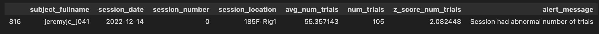
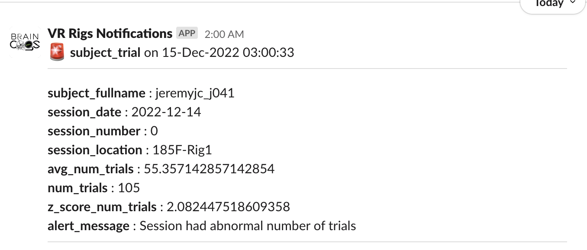

# {{ $frontmatter.title }}

## Set up custom slack alerts

1. Follow the <a href="https://braincogs.github.io/software/db_access.html#db-access-for-python-repository">Database Access with Python instructions</a>.
2. In the U19_pipeline_python repository, open the ```u19_pipeline/alert_system/custom_alerts directory```.
3. Create a new Python file with a meaningful name for the alert (e.g. `subject_bias.py`).
4. Copy the skeleton code from ```u19_pipeline/alert_system/alert_code_skeleton.py```.
   + All Slack alert code has two parts: **a Slack channel configuration** and a **main function**, described in the next sections.

### main function guide

+ This function should return a pandas DataFrame in which each row is a Slack alert message on the configured channels.
+ You can use DataJoint to get data for the alert (e.g. custom_alerts/rig_bias.py) or simply call OS scripts (e.g. custom_alerts/braininit_storage.py).
+ All columns of the DataFrame are included in the alert. (Don't add too many!)
+ DataFrame example with a Slack notification message:

<figure>

<center><figcaption>Example Dataframe for notification </figcaption></center>
</figure>

<figure>

<center><figcaption>Example Notification from previous DataFrame</figcaption></center>
</figure>

+ You can check examples of some alerts in the u19_pipeline/alert_system/custom_alerts directory.

### Slack channel dictionary configuration

+ The Slack channel configuration is a dictionary that links the corresponding Slack channels and conversations with a specific alert.
+ The dictionary has two keys: `'slack_notification_channel'` and `'slack_users_channel'`.
+ **slack_notification_channel** General channel names to send notifications to.
+ **slack_users_channel** Private direct messages to send notifications to.
+ You can add a list of channels to each of the keys:
+ **slack_notification_channel** Any `webhook_name` (see the next section).
+ **slack_users_channel** Any user_id with a configured slack_webhook (see the next section).

#### Check available notification channels:

##### MATLAB
1. Execute ```fetch(lab.SlackWebhooks,'*')```.

##### Python
1. Execute:
   + ```lab = dj.create_virtual_module('lab', 'u19_lab')```
   + ```lab.SlackWebhooks.fetch(as_dict=True)```

#### Check available user channels:

##### MATLAB
1. Execute:

```matlab
fetch(lab.User & "slack_webhook <> ''",'slack_webhook')
```

##### Python
1. Execute:
   ```python
   lab = dj.create_virtual_module('lab', 'u19_lab')
   (lab.User & "slack_webhook <> ''").fetch('KEY', 'slack_webhook', as_dict=True)
   ```

### Create and register new webhooks for alerts:

1. Create a new Slack channel if needed (for notification channels).
2. Follow the instructions to create webhooks from the <a href="https://slack.com/help/articles/115005265063-Incoming-webhooks-for-Slack">Slack documentation</a>.
3. Copy the Slack webhook from the Slack API web page.

#### Add notification channels:

##### MATLAB

```matlab
new_slack_webhook = struct
new_slack_webhook.webhook_name = (notification channel name)
new_slack_webhook.webhook_url  = (webhook url from slack API)
insert(lab.SlackWebhooks,new_slack_webhook)
```

##### Python

```python
lab = dj.create_virtual_module('lab', 'u19_lab')
new_slack_webhook = dict()
new_slack_webhook['webhook_name'] = (notification channel name)
new_slack_webhook['webhook_url']  = (webhook url from slack API)
lab.SlackWebhooks.insert1(new_slack_webhook)
```

#### Update user channel webhook notification channels:

##### MATLAB

```matlab
user = struct
user.user_id = (NETID of user)
update(lab.User & user,'slack_webhook', (webhook url from slack API))
```

##### Python

```python
lab = dj.create_virtual_module('lab', 'u19_lab')
user = dict()
user['user_id'] = (NETID of user)
user['slack_webhook'] = (webhook url from slack API)
lab.User.update1(user)
```
