# {{ $frontmatter.title }}

## Data Folders

The following data folder structures are used for the Ephys and Imaging pipeline:

- **Raw Data Directory Imaging:** braininit/Data/Raw/imaging/(user)/(subject)/(session_date)_g(session#)/(user_defined_dir)
- **Processed Data Directory Imaging:** braininit/Data/Processed/imaging/(user)/(subject)/(session_date)_g(session#)/(user_defined_dir)/job_id_(jobid)/suite2p_output/suite2p
- **Raw Data Directory Ephys:** braininit/Data/Raw/electrophysiology/(user)/(subject)/(session_date)_g(session#)/(g#_spikeglx_dir)/(imec#_spikeglx_dir)
- **Processed Data Directory Ephys:** braininit/Data/Processed/electrophysiology/(user)/(subject)/(session_date)_g(session#)/(g#_spikeglx_dir)/(imec#_spikeglx_dir)/job_id_(jobid)/(sorter)_output

## Initial configuration

Note: These steps are only needed if a red label reading "Configuration needed" appears in the top-right corner of the GUI.

  <figure>
   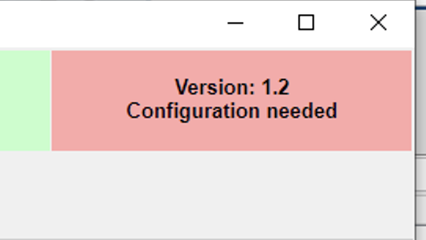
   
<figcaption>Configuration needed label</figcaption>

  </figure>

  <figure>
   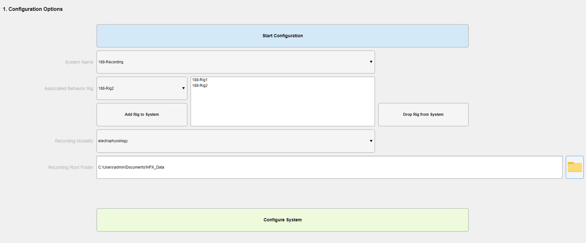
   
<figcaption>Configuration screen</figcaption>

  </figure>

1. Switch to the **"System Configuration"** tab.
2. Click the **"Start Configuration"** button.
3. In the **"System Name"** dropdown, select the corresponding system (normally named room#-Recording#).
4. In the **"Associated Behavior Rig"** dropdown, select the corresponding rig paired with the recording system.
5. Click the **"Add Rig to System"** button.
6. Repeat steps 4 and 5 until all rigs associated with the recording system are added.
7. In the **"Recording Modality"** dropdown, select the corresponding modality of the recording system.
8. In the **"Recording Root Folder"** area, click the folder button to search for the parent path where all recordings will be stored.
9. Click the **"Configure System"** button.

  <figure>
   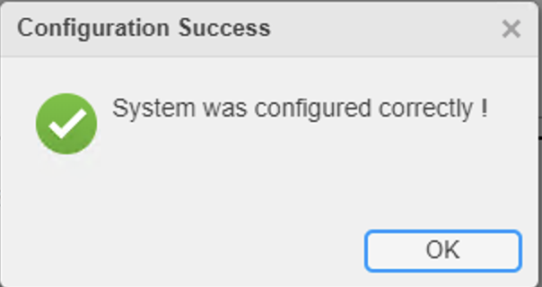
   
<figcaption>System configured correctly</figcaption>

  </figure>

If something was configured incorrectly, you can repeat the entire process.

## Automation GUI "regular use" Manual

- The automation GUI is located on the desktop of every microscope/ephys recording system across BRAINCoGS. You can identify it by the BRAINCoGS desktop icon called "Recording_Automation_GUI".
- We encourage you to register and process every recording with the Automation GUI as soon as recording ends.

### Default use case

1. Open the GUI as soon as recording ends.
2. Select the recording directory from the dropdown list in section 1.
   - If no behavior is associated with this recording, uncheck **Is there behavior Session for Recording Checkbox**
3. Check the "Add surgery & insertion device if missing" checkbox if you want to add electrode/microscope/optic fiber insertion coordinates.
4. Select the behavior session corresponding to the recording from the dropdown list in section 2.
5. Click the Register Recording button.

  <figure>
   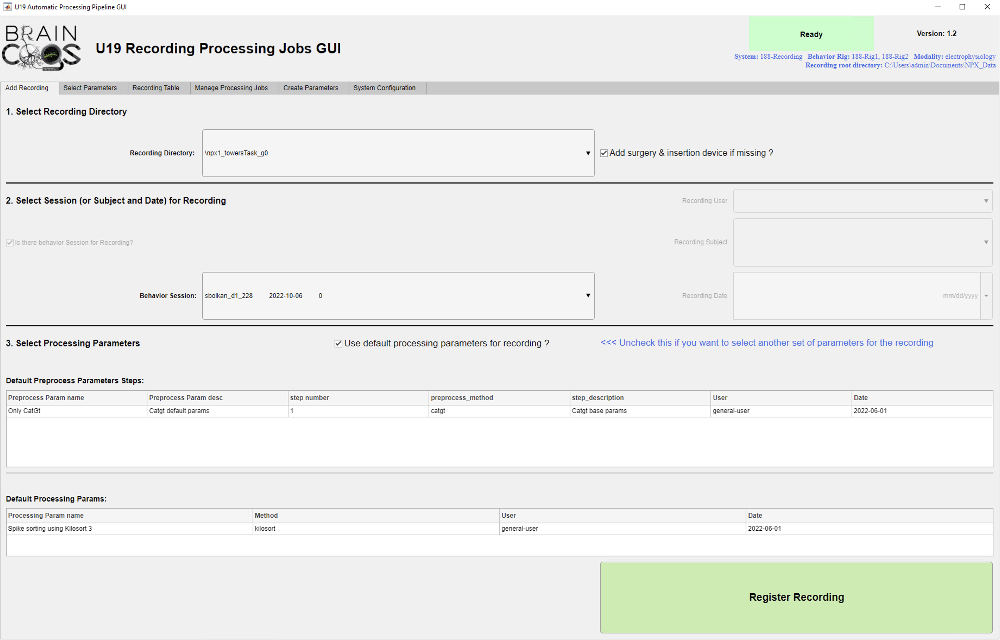
   
<figcaption>Automation GUI main screen</figcaption>

  </figure>

- If no surgery data is found for the subject, a small form for entering surgery and device insertion coordinates appears.

  <figure>
   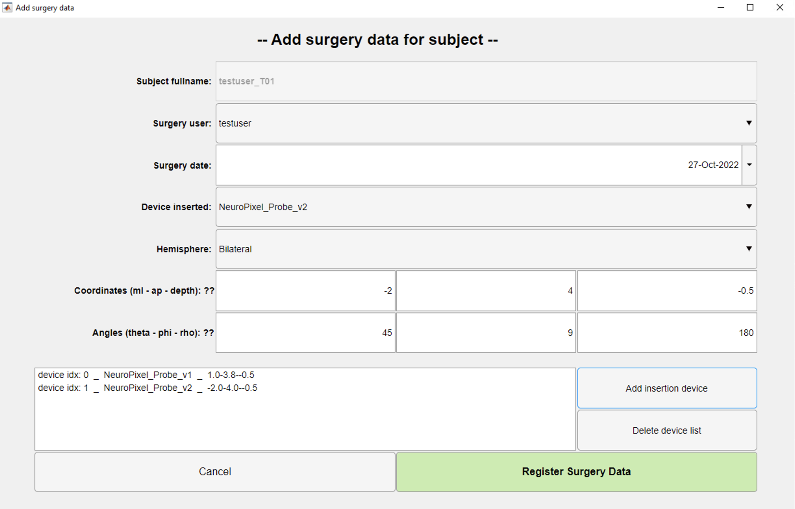
   
<figcaption>Add surgery data form</figcaption>

  </figure>

- Common coordinates for previous recordings:

| **Area**         | ml(mm) | ap(mm) | depth(mm) | theta(°) | phi(°) | rho(°) |
|-----------------:|-------:|-------:|----------:|---------:|-------:|-------:|
| **mPFC L HEMIS** |   -0.6 |    1.8 |       3.8 |      -45 |     -9 |    180 |
| **mPFC R HEMIS** |    0.6 |    1.8 |       3.8 |       45 |      9 |      0 |
| **HPC  L HEMIS** |   -1.5 |      2 |       1.8 |      -45 |     -9 |    180 |
| **HPC  R HEMIS** |    1.5 |      2 |       1.8 |       45 |      9 |      0 |

- Wait until the recording has been copied to PNI storage resources (cup).

  <figure>
   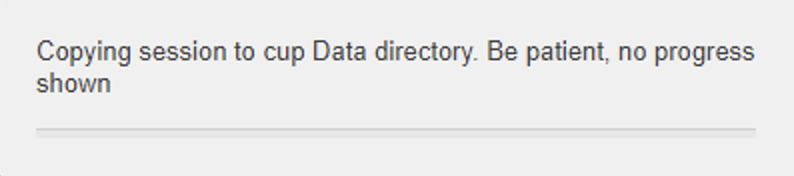
   
<figcaption>Dialog shown while copying session</figcaption>

  </figure>

6. After the recording has been transferred, a small dialog showing the recording ID appears.

  <figure>
   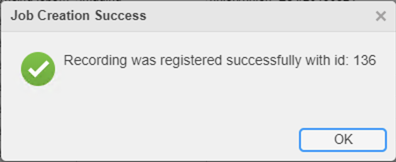
   
<figcaption>Dialog shown when recording has been transferred</figcaption>

  </figure>

7. You can check basic info about the new recording in the "Recording Table" tab. This tab becomes active after the recording is transferred.

  <figure>
   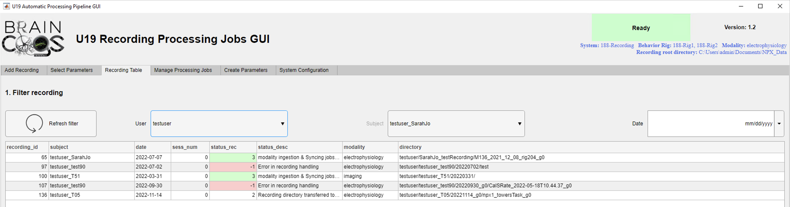
   
<figcaption>Recording table tab screenshot</figcaption>

  </figure>

#### Notes

- This use case assumes the recording will be processed with default parameters.

## "Advanced" (select parameters) use case

1. Follow steps 1-4 from the **Default use** case.
2. Uncheck the **"Use default processing parameters for recording?"** checkbox.
3. Click the **"Select parameters >>>"** button.

  <figure>
   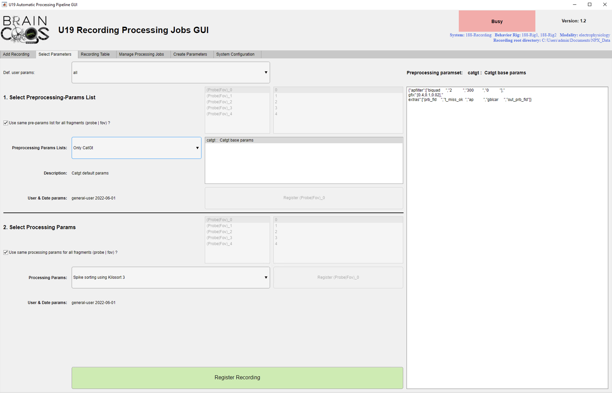
   
<figcaption>Parameter selection main screen</figcaption>

  </figure>

4. On the **"Select parameters"** tab (assume all probes/fovs will be processed with the same parameters):

### On section 1:

5. In the **Preprocessing Params Lists** dropdown, select a preprocessing param list.
   - You can see which preprocessing steps are defined for that list in the listbox on the right.
   - Selecting a preprocessing step in the listbox shows its specific parameters in the text area on the right.

### On section 2:

6. In the **Processing Params** dropdown, select a processing parameter suited to the recording.
   - Selecting a processing parameter from the dropdown shows its specific parameters in the text area on the right.
7. Click the **Register Recording** button.

The next steps are identical to the **"Default use"** case.

## Monitor jobs

- After a recording is submitted for processing, you can track, reprocess, and visualize all jobs corresponding to that recording.

  <figure>
   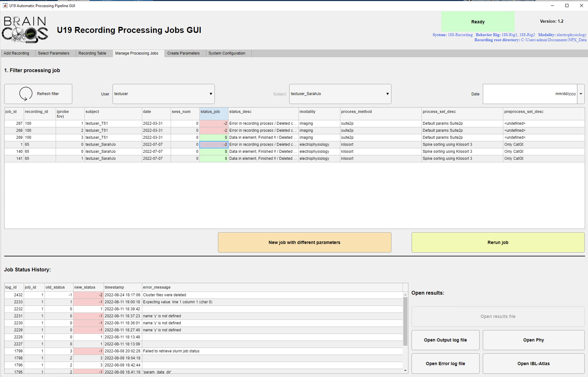
   
<figcaption>Manage Processing Jobs main screen</figcaption>

  </figure>

### Track status

1. Switch to the **"Manage Processing Jobs"** tab.
2. Use the **"User"**, **"Subject"**, and **"Date"** dropdowns/fields to find the desired jobs.
3. Select the row corresponding to the desired job:

- The job status history is shown for the selected job.

#### If status of job is in error status (-1, -2; "Error in recording process"):

- Open the error log file in the bottom-right corner by clicking the **"Open Error Log File"** button.
- If you believe the cause of the error is now resolved, rerun the job by clicking the **"Rerun job"** button.

#### If status of job is in finished status (7, 8; "Data in element DB"):

- Open the output log file in the bottom-right corner by clicking the **"Open Output Log File"** button.
- Visualize processing results by clicking the bottom-right buttons: **Open Phy** and **Open IBL Atlas** for ephys, **Open Suite2p-GUI** for imaging.

  <figure>
   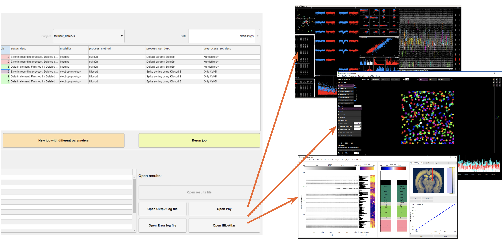
   
<figcaption>Visualization tools available</figcaption>

  </figure>

#### Rerun jobs

- You can rerun a job with different parameters by clicking the **New Job With different Parameters** button.
- Follow the <a href='https://braincogs.github.io/software/automation_pipeline.html#advanced-select-parameters-use-case'> "Advanced" (select parameters) use case </a>.

## Create new sets of processing parameters for recordings

To process recordings with non-default parameters, you need at least one of the following:

1. A new set of processing parameters (parameters for the algorithm that processes the data, e.g. kilosort, suite2p).
2. A list of preprocessing steps made up of a set of preprocessing params (e.g. run catgt + tprime before kilosort).

  <figure>
   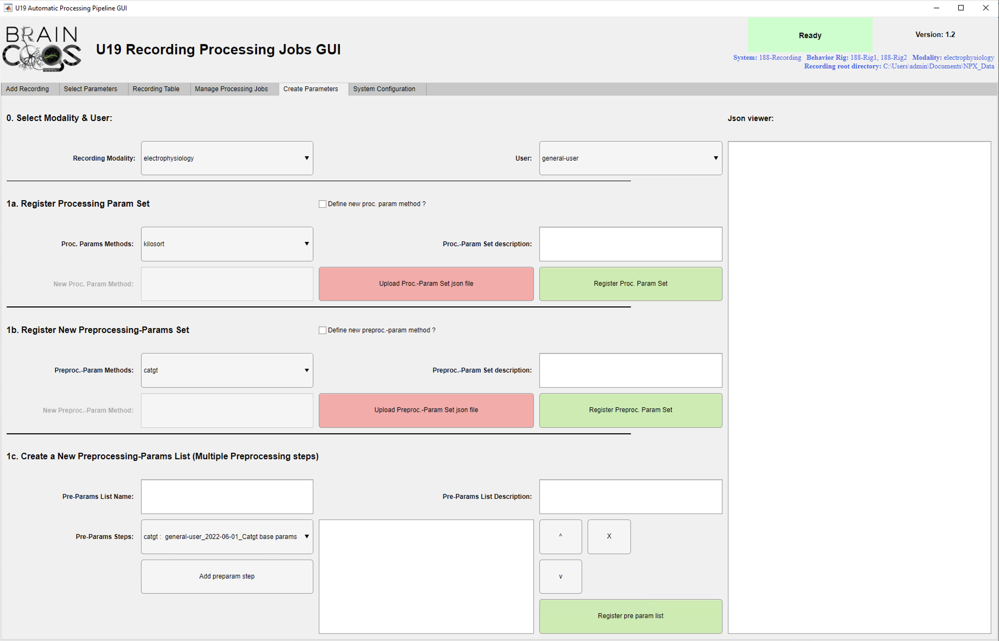
   
<figcaption>Create parameters screen</figcaption>

  </figure>

### Create new Processing parameters (algorithm params)

- Note: You need a JSON file with all parameters ready before starting this process.
- <a href='./assets/files/automation_gui/kilosort_parameters_example.json.zip'>Here</a> is an example of a kilosort parameter JSON file that you can use as a template for creating your own:

1. Switch to the "Create Parameters" tab.

#### On section 0:

2. In the "recording modality" dropdown, select which modality the parameters correspond to.
3. In the "user" dropdown, select your NETID username (select general-user if this parameter will be shared by many users).

#### On section 1a:

4. In the "proc. Param Method" dropdown, select which method (algorithm) these parameters refer to.

##### If the algorithm is not found on "proc. Param Method" dropdown:

- Check the "define new proc. param method ?" checkbox.
- Write the new processing method name in the "New Proc. Param. method" field.
- Check the <a href='https://braincogs.github.io/software/automation_pipeline_developer.html#collab-repositories-to-handle-ephys-imaging-processing'>automation pipeline developer guide</a> to add the corresponding processing code. 

5. In the "proc. Param Set Description" field, write a short description for the new parameters.
6. Click the "Upload Proc-Parm Set json file" button and browse for/load your JSON file with parameters. You can review your parameters in the text area on the right.
7. Click the "Register Proc. Param Set" button.

### Create new preprocessing parameters (a single step on preprocessing list)

- Note: You need a JSON file with all parameters ready before starting this process.
- <a href='./assets/files/automation_gui/catgt_parameters_example.json.zip'>Here</a> is an example of a catgt parameter JSON file that you can use as a template for creating your own:

1. Switch to the "Create Parameters" tab.

### On section 0:

2. In the "recording modality" dropdown, select which modality the parameters correspond to.
3. In the "user" dropdown, select your NETID username (select general-user if this parameter will be shared by many users).

### On section 1b:

4. In the "Preproc.-Param Method" dropdown, select which method (tool) these parameters refer to.

#### If the tool is not found on "Preproc.-Param Method" dropdown:

- Check the "define new prerproc.-param method ?" checkbox.
- Write the new preprocessing method name in the "New Preproc.-Param method" field.
- Check the <a href='https://braincogs.github.io/software/automation_pipeline_developer.html#collab-repositories-to-handle-ephys-imaging-processing'>automation pipeline developer guide</a> to add the corresponding processing code. 

5. In the "Preproc.-Param Set Description" field, write a short description for the new parameters.
6. Click the "Upload Preproc.-Parm Set json file" button and browse for/load your JSON file with parameters. You can review your parameters in the text area on the right.
7. Click the "Register PreProc. Param Set" button.

### Create new preprocessing parameters list (a set of preprocessing parameters)

- Note: If you just created a preprocessing parameter, restart the GUI.

1. Switch to the "Create Parameters" tab.

### On section 0:

2. In the "recording modality" dropdown, select which modality the parameters correspond to.
3. In the "user" dropdown, select your NETID username (select general-user if this parameter will be shared by many users).

### On section 1c:

4. In the "Pre-Params List Name" dropdown, write a suitable name for the list.
5. In the "Pre.-Param List Description" field, write a short description for the new list.
6. From the "Pre.-Params steps" dropdown, select the desired preprocessing step to add to the list.
7. Click the "Add Preparam Steps" button.
8. Repeat steps 6 and 7 to add all desired preprocessing steps to the list.
9. Use the "v" and "^" buttons to set the order of the preprocessing steps.
10. Use the "x" button to delete an unwanted preprocessing step.
11. Click the "Register pre param list" button.
