# {{ $frontmatter.title }}

 ## Initial configuration

  + Note: These steps are only needed if a label in red with "Configuration needed" is shown on the top right corner of the GUI.

  <figure>
   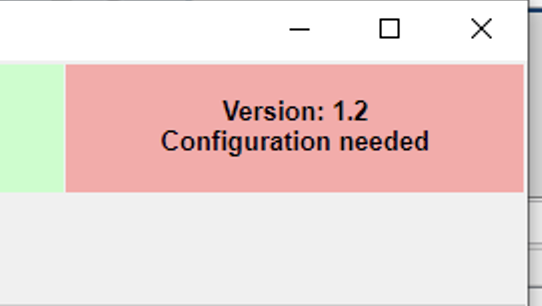
   
<figcaption>Configuration needed label</figcaption>

  </figure>

  <figure>
   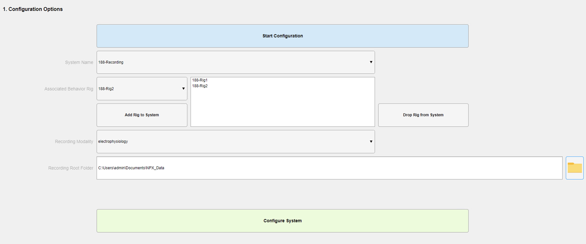
   
<figcaption>Configuration screen</figcaption>

  </figure>

  1. Switch to **"System Configuration"** tab.
  2. Click **"Start Configuration"** button. 
  3. In **"System Name"** dropdown, select corresponding system (normally named room#-Recording#).
  4. In **"Associated Behavior Rig"** dropdown, select corresponding rig paired with recording system.
  5. Click **"Add Rig to System"** button.
  6. Repeat steps 4 & 5 until all rigs associated to recording system are added.
  7. In **"Recording Modality"** dropdown select corresponsing modality of the recording system.
  8. In **"Recording Root Folder"** area, click folder button to search for Parent path where all recordings will be stored.
  9. Click **"Configure System"** button.

  <figure>
   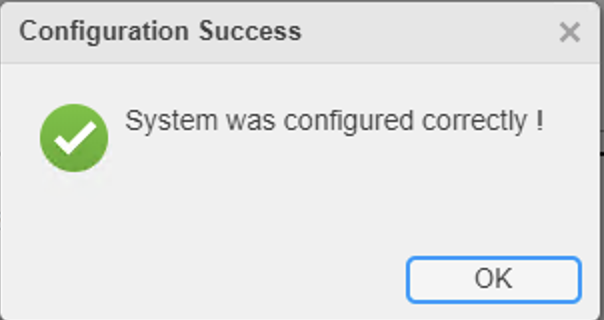
   
<figcaption>System configured correctly</figcaption>

  </figure>

  If something was configured incorrectly, you can repeat the whole process.

 ## Automation GUI "regular use" Manual

  + The automation GUI is located on the desktop in all microscope/ephys recording system across BRAINCoGS. You can identify it by a desktop BRAINCoGS icon called "Recording_Automation_GUI".
  + It is encouraged to register & process every recording with the Automation GUI just after recording has ended.

  ### Default use case

  1. Open the GUI just after recording has ended.
  2. Select the recording directory from dropdown list in section 1.
   +  If no behavior associated with this recording uncheck ****
  3. Check "Add surgery & insertion device if missing" checkbox if you want to add electrode/microscope/optic fiber insertion coordinates.
  4. Select behavior session corresponding to recording from dropdown list in section 2.
  5. Click Register Recording button.

  <figure>
   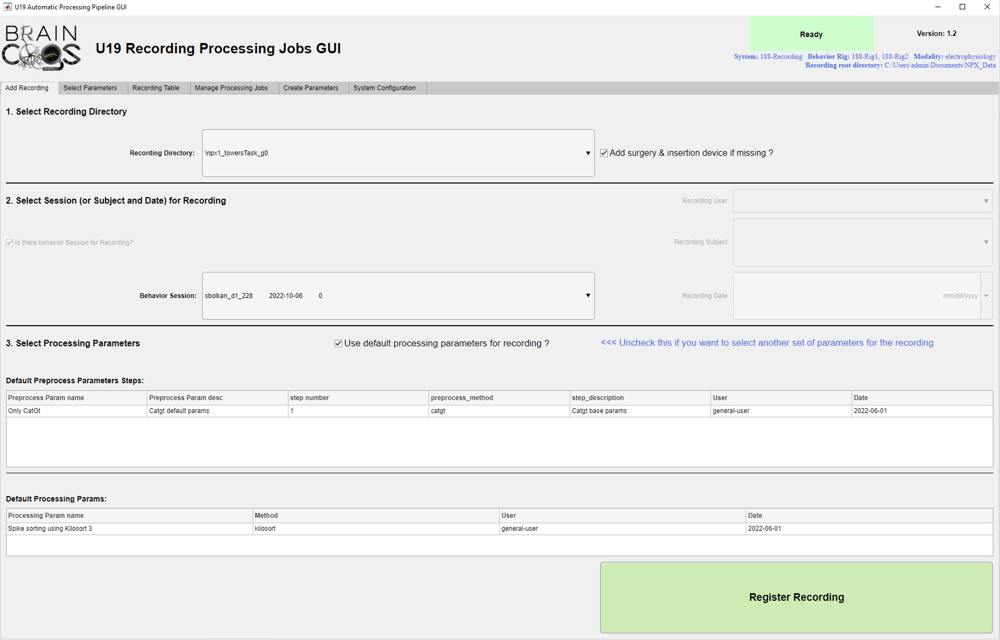
   
<figcaption>Automation GUI main screen</figcaption>

  </figure>

   + If no surgery data is found for the subject, a small form to insert surgery and device insertion coordinates will be shown.

  <figure>
   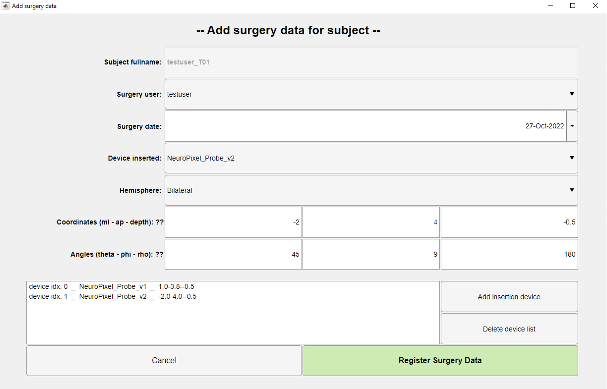
   
<figcaption>Add surgery data form</figcaption>

  </figure>

   + Common coordinates for previous recordings:

  | **Area**         | ml(mm) | ap(mm) | depth(mm) | theta(°) | phi(°) | rho(°) |
  |-----------------:|-------:|-------:|----------:|---------:|-------:|-------:|
  | **mPFC L HEMIS** |   -0.6 |    1.8 |       3.8 |      -45 |     -9 |    180 |
  | **mPFC R HEMIS** |    0.6 |    1.8 |       3.8 |       45 |      9 |      0 |
  | **HPC  L HEMIS** |   -1.5 |      2 |       1.8 |      -45 |     -9 |    180 |
  | **HPC  R HEMIS** |    1.5 |      2 |       1.8 |       45 |      9 |      0 |

  + Wait until recording has been copied to PNI storage resources (cup).

  <figure>
   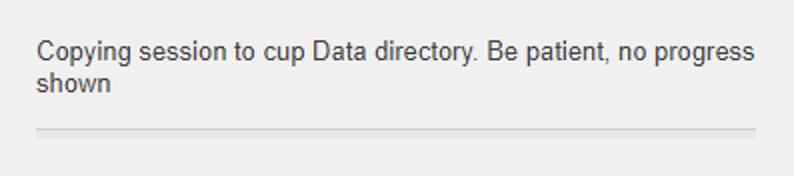
   
<figcaption>Dialog shown while copying session</figcaption>

  </figure>

  6. After recording has been transferred a small dialog with recording id will be shown.

  <figure>
   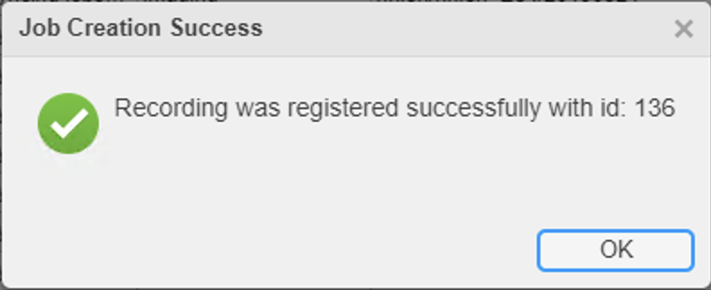
   
<figcaption>Dialog shown when recording has been transferred</figcaption>

  </figure>

  7. User can check basic info of the new recording in the "Recording Table" tab. This tab will be active after recording is transferred.

  <figure>
   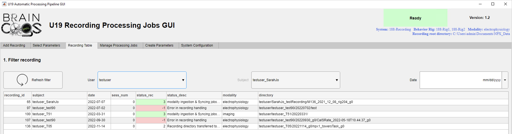
   
<figcaption>Recording table tab screenshot</figcaption>

  </figure>

 #### Notes

 + This use case assumes that default parameters will be used to process the recording.

  ## "Advanced" (select parameters) use case
  
  1. Follow 1-4 from **Default use** case
  2. Uncheck **"Use default processing parameters for recording?"** checkbox
  3. Click **"Select parameters >>>"** button

  <figure>
   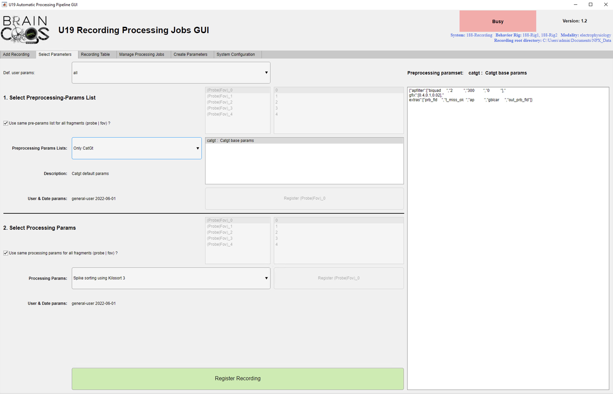
   
<figcaption>Parameter selection main screen</figcaption>

  </figure>

  4. On the **"Select parameters"** tab (assume that all probes/fovs are going to be processed with same parameters) 
  ### On section 1:
   5. In **Preprocessing Params Lists** dropdown Select a Preprocessing Param list
   + You can check which preprocessing steps are defined for that list on the listbox to the right)
   + If you select a preprocessing step from the listbox you can check the specific parameters for that preprocessing step on the text area to the right.
  ### On section 2:
   6. In **Processing Params"** dropdown select a Processing parameter suited for recording
   + If you select a processing parameter from the dropdown you can check the specific parameters for it on the text area to the right.
  7. Click **Register Recording** button.

  + Next actions are idential to the **"Default use"** case

  ## Monitor jobs
  + After a recording is submitted to processing the user is able to track, reprocess and visualize all jobs corresponsing to that recording.

  <figure>
   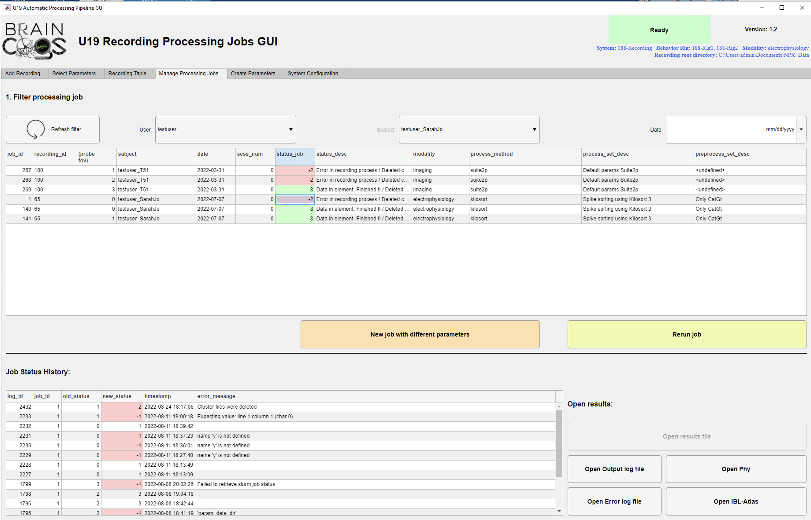
   
<figcaption>Manage Processing Jobs main screen</figcaption>

  </figure>

  ### Track status
  1. Switch to **"Manage Processing Jobs"** tab.
  2. Use **"User"**, **"Subject"** & **"Date"** dropdwons / edits to find desired jobs
  3. Select row corresponding to the corresponding job:

  + Corresponding Job Status history is shown for selected job.
  
  #### If status of job is in error status (-1, -2; "Error in recording process"):

  + You can open the Error log file on the bottom right corner by clicking **"Open Error Log File"** button.
  + If you consider that what cause the error is solved now, you can rerun job by clicking **"Rerun job"** button.

  #### If status of job is in finished status (7, 8; "Dat in element"):

  + You can open the Output log file on the bottom right corner by clicking **"Open Output Log File"** button.
  + You can visualize results from processing by clicking the bottom rightmost buttons: (**Open Phy**, **Open IBL Atlas** for ephys **Open Suite2p-GUI** for imaging)

  <figure>
   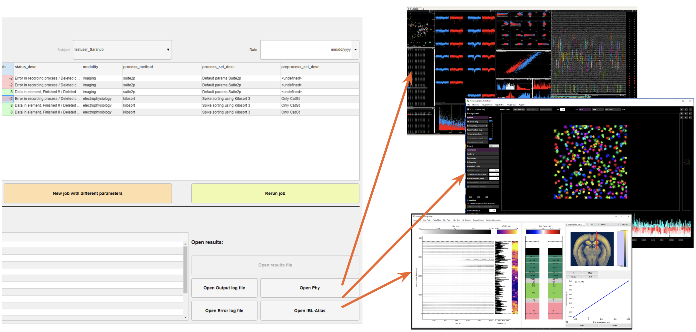
   
<figcaption>Visualization tools available</figcaption>

  </figure>

  #### Rerun jobs

  + A job can be rerun with different parameters by clicking **New Job With different Parameters** button.
  + Follow <a href='https://braincogs.github.io/software/automation_pipeline.html#advanced-select-parameters-use-case'> "Advanced" (select parameters) use case </a>

 ## Create new sets of processing parameters for recordings

  + In order to process recordings with parameters different than default you need at least one of the following:
   1. A new ser or processing parameters (parameters for the algorithm to process, e.g. kilosort, suite2p).
   2. A list of preprocessing steps formed by a set of preprocessing params (e.g. perform catgt + tprime before kilosort).

  <figure>
   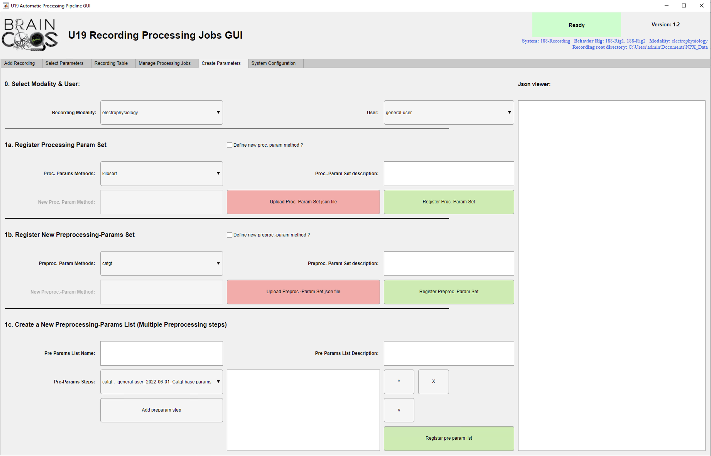
   
<figcaption>Create parameters screen</figcaption>

  </figure>

 ### Create new Processing parameters (algorithm pararms)

  + Note: You need a json file with all parameters ready before starting this process.
  + <a href='./assets/files/automation_gui/kilosort_parameters_example.json.zip'>Here</a> is an example of a kilosort parameter json file. It can serve you as an example for creating your own:

  1. Switch to "Create Parameters" tab.
  #### On section 0:
   2. In "recordig modality" dropdown select to which modality the parameters correspond. 
   3. In "user" dropdown Select your NETID username (select general-user if this parameter will be shared by many users).
  #### On section 1a:
   4. In "proc. Param Method" dropdown, select which method (algorithm) these parameters refer to.
  ##### If the algorithm is not found on "proc. Param Method" dropdown: 
   + Check "define new proc. param method ?" checkbox.
   + Write new processing method name in "New Proc. Param. method" edit
   + Check automation pipeline developer guide to add corresponding processing code. (LINK MISSING)
  5. In "proc. Param Set Description" edit, write a small description for the new parameters.
  6. Click "Upload Proc-Parm Set json file" button and search/load for your json file with parameters. You can check your parameters on the text area on the right.
  7. Click "Register Proc. Param Set" button.

 ### Create new preprocessing parameters (a single step on preprocessing list)

  + Note: You need a json file with all parameters ready before starting this process.
  + <a href='./assets/files/automation_gui/catgt_parameters_example.json.zip'>Here</a> is an example of a catgt parameter json file. It can serve you as an example for creating your own:

  1. Switch to "Create Parameters" tab.
  ### On section 0:
   2. In "recordig modality" dropdown select to which modality the parameters correspond. 
   3. In "user" dropdown Select your NETID username (select general-user if this parameter will be shared by many users).
  ### On section 1b:
   4. In "Preproc.-Param Method" dropdown, select which method (tool) these parameters refer to.
  #### If the tool is not found on "Preproc.-Param Method" dropdown: 
   + Check "define new prerproc.-param method ?" checkbox.
   + Write new preprocessing method name in "New Preproc.-Param method" edit.
   + Check automation pipeline developer guide to add corresponding preprocessing code. (LINK MISSING).
  5. In "Preproc.-Param Set Description" edit, write a small description for the new parameters.
  6. Click "Upload Preproc.-Parm Set json file" button and search/load for your json file with parameters. You can check your parameters on the text area on the right.
  7. Click "Register PreProc. Param Set" button.

 ### Create new preprocessing parameters list (a set of preprocessing paramaters)

  + Note: If you just created a preprocessing parameter, restart GUI.

  1. Switch to "Create Parameters" tab.
  ### On section 0:
   2. In "recordig modality" dropdown select to which modality the parameters correspond. 
   3. In "user" dropdown Select your NETID username (select general-user if this parameter will be shared by many users).
  ### On section 1c:
  4. In "Pre-Params List Name" dropdown, write a suitable name for the list.
  5. In "Pre.-Param List Description" edit, write a small description for the new list.
  6. From "Pre.-Params steps" dropdown select the desired preprocessing step as part of the list.
  7. Click "Add Preparam Steps" button
  8. Repeat steps 6 & 7 to add all desired preprocessing steps for the list.
  9. Use "v" & "^" buttons to set order of preprocessing steps.
  10. Use "x" button to delete an unwanted preprocessing step.
  11. Click "Register pre param list" button.