# {{ $frontmatter.title }}

The main goals of the Ephys/Imaging Automation Pipeline in BRAINCoGS are:

+ Automate spike sorting and imaging segmentation for all recordings
+ Centralize and standardize paths for recording data storage
+ Unify and register ephys/imaging processing
+ Store processed data in the BRAINCoGS database (DJ)

To accomplish this, we developed three tools:

+ Ephys/Imaging Automation GUI (<a href="https://github.com/BrainCOGS/RecordingProcessJobGUI">RecordingProcessJobGUI</a>)
+ Recording Workflow management (<a href="https://github.com/BrainCOGS/U19-pipeline_python/tree/master/u19_pipeline/automatic_job">Automatic_job directory in U19-pipeline_python </a>)
+ Collab repositories to handle Ephys/Imaging Processing (<a href="https://github.com/BrainCOGS/BrainCogsEphysSorters">BrainCogsEphysSorters </a> and <a href="https://github.com/BrainCOGS/BrainCogsImagingSegmentation">BrainCogsImagingSegmentation </a>)


## Ephys/Imaging Automation GUI

This mini guide for the Automation GUI shows the relationship between the GUI and the database: which tables supply values and which records the GUI writes.

### Create Executable and install Ephys/Imaging Automation GUI

- Follow these steps to create the executable:

1. Connect to the 185a Recording machine.
2. Open the **C:\Experiments\RecordingProcessJobGUI** directory.
3. Open the **Recording_Automation_GUI.prj** file.
4. Click the **Package** button.
5. When packaging is done, all files will be available in **\\cup.pni.princeton.edu\braininit\Shared\AutomationGUI_Installation**

- To install the GUI:

1. Connect to the machine where the GUI will be installed (182-Imaging-Rig1 and 165A-OneboxRecording at the moment).
2. If installing for the first time:
    - Copy the **AutomationGUI_update** directory from **braininit\Shared\AutomationGUI_Installation** onto the desktop.
    - Execute **firstTimeAutomationGUI.BAT** from the **AutomationGUI_update** directory on the desktop.
3. Execute **update_AutomationGUI.BAT** from the **AutomationGUI_update** directory on the desktop.
4. Follow the instructions to install the GUI (create a shortcut on the desktop).
5. Open the Recording Automation GUI.

### Automation GUI main screen

<figure>
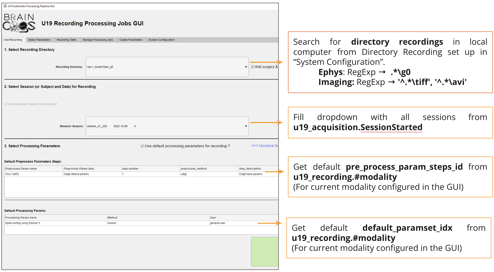
<center><figcaption>Automation GUI main screen fill values</figcaption></center>
</figure>

### Ephys Preprocessing (precluster) parameters organization

#### Main tables
  + **u19_pipeline_ephys_element.#pre_cluster_method** List of methods (or algorithms) supported for ephys preprocessing.
  + **u19_pipeline_ephys_element.pre_cluster_param_set** Specific set of parameters (mainly a dictionary) for a given preprocessing method. Multiple sets of parameters can be stored for the same method.
  + **u19_pipeline_ephys_element.pre_cluster_param_steps** (Ephys) Reference to a set of steps to perform in ephys preprocessing.
  + **u19_pipeline_ephys_element.pre_cluster_param_steps__step** These records indicate which sets of parameters for given preprocessing methods will be executed (and in which order).

<figure>
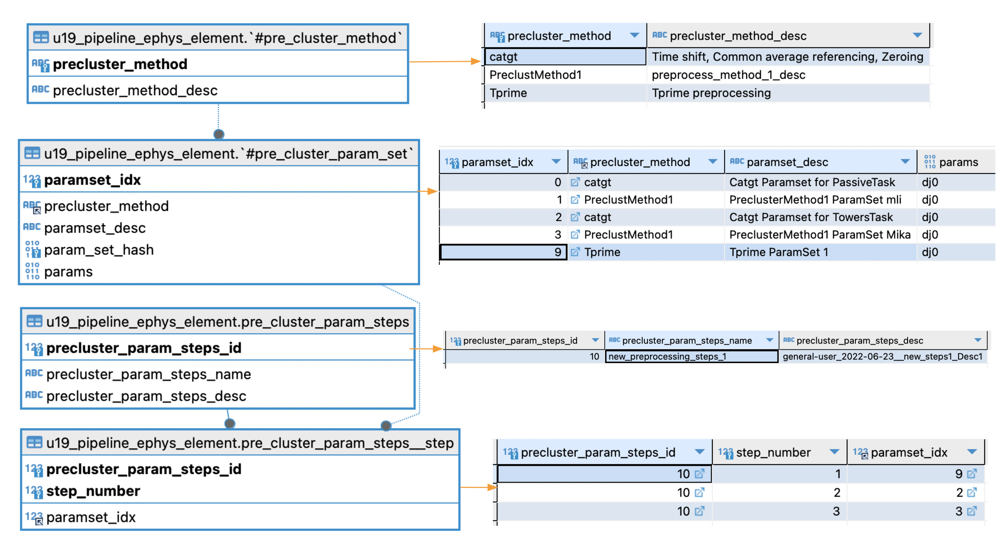
<center><figcaption>Precluster tables record examples </figcaption></center>
</figure>

+ Depicted in the above image:
 1. Suppose **precluster_param_steps_name** = new_preprocessing_steps_1 (precluster_param_steps_id = 10) is selected for preprocessing.
 2. According to **pre_cluster_param_steps__step**:
    * paramset_idx = 9 will be executed 1st
    * paramset_idx = 2 2nd
    * paramset_idx = 3 3rd.
 3. Checking **pre_cluster_param_set** for paramset_idx = 9, 2, 3, we conclude that preprocessing will comprise:
    *   **Tprime** (Tprime ParamSet 1)
    *   **Catgt** (Catgt ParamSet for Towers Task)
    *   **PreClustMethod1** (PreClusterMethod1 Paramset Mika)

### Ephys Processing (cluster) parameters organization

+ This structure is simpler than preprocessing (there are no multiple steps involved): two tables organize the ephys processing parameters.

<figure>
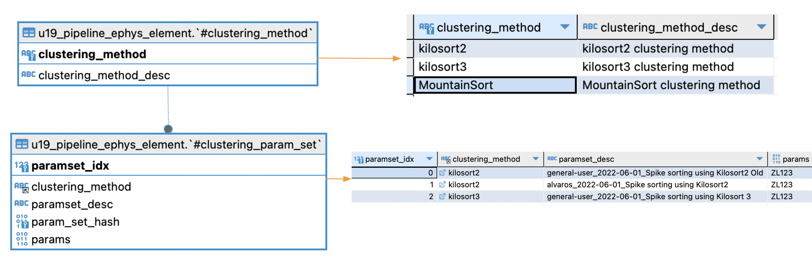
<center><figcaption>Cluster tables record examples </figcaption></center>
</figure>

#### Main tables
  + **u19_pipeline_ephys_element.#clustering_method** List of methods (or algorithms) supported for ephys processing.
  + **u19_pipeline_ephys_element.#clustering_param_set** Specific set of parameters (mainly a dictionary) for a given processing method. Multiple sets of parameters can be stored for the same method.

+ Each recording (or, to be precise, each recording process) can be processed with a different set of parameters. Default parameters are used for the majority of recordings in BRAINCoGS.

### Default parameters for preprocessing and processing

+ As seen in the Automation GUI main screen, **u19_recording.#modality** stores default parameters for each modality.
+ As a developer, **manually update the default parameters** for all modalities when the project requires it.

<figure>
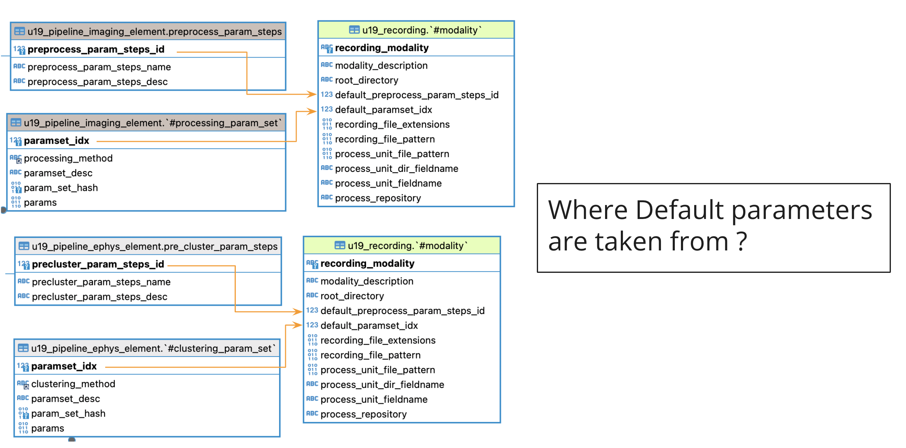
<center><figcaption>From which tables default parameters are taken </figcaption></center>
</figure>

+ The **u19_recording.#modality** table stores a reference to the default parameters most commonly used for processing ephys and imaging.
+ Main table to store preprocessing parameters:
    1. **u19_pipeline_ephys_element.pre_cluster_param_steps**: (Ephys) Reference to a set of steps to perform in ephys preprocessing.
    2. **Imaging, u19_pipeline_imaging_element.pre_process_param_steps**: (Imaging) Reference to a set of steps to perform in imaging preprocessing (no imaging preprocessing for any user at the moment).
+ Main table to store processing parameters:
    1. **Ephys, u19_pipeline_ephys_element.#clustering_param_set**: (Ephys) Reference to a set of parameters for the chosen sorting algorithm.
    2. **Imaging, u19_pipeline_imaging_element.#processing_param_set**: (Imaging) Reference to a set of parameters for the chosen segmentation algorithm.

### Imaging equivalence parameter tables:

<figure>
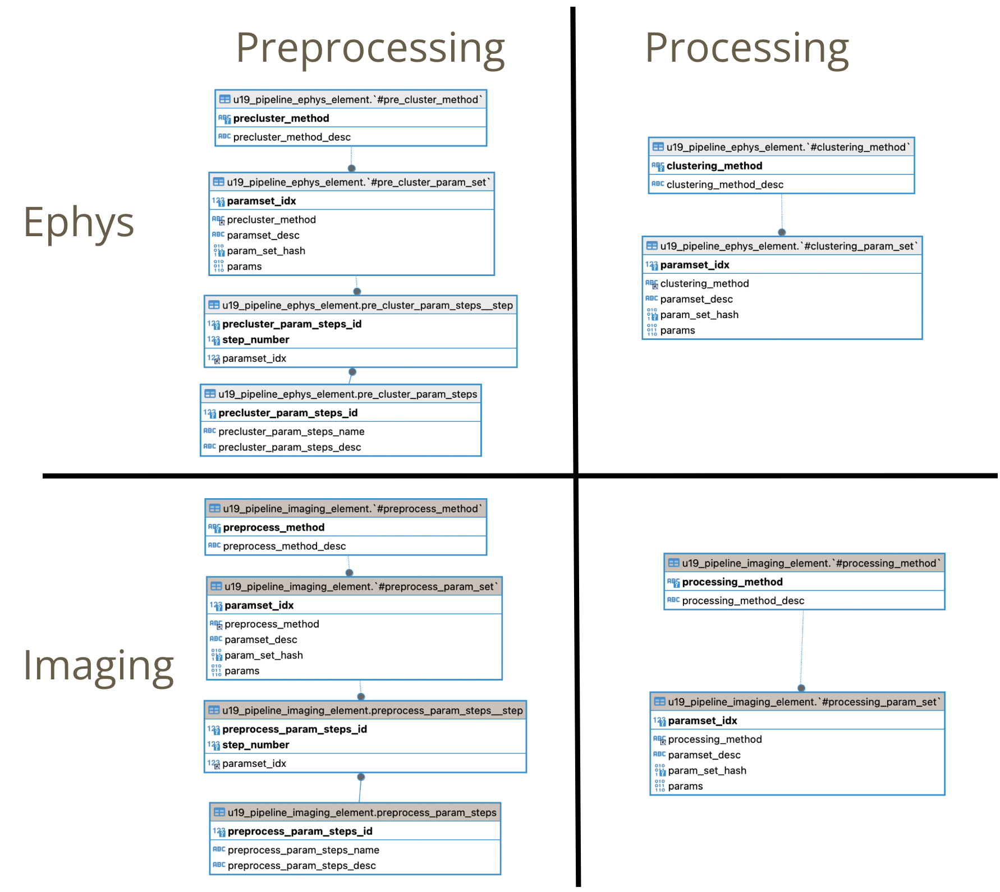
<center><figcaption>Imaging equivalence parameter tables </figcaption></center>
</figure>

+ Everything described for the ephys preprocessing and processing tables applies to the imaging counterparts.

### Tables written when recording is registered:

<figure>
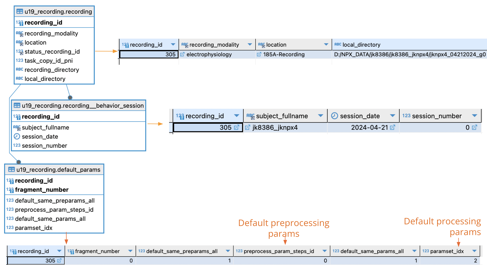
<center><figcaption>Tables written when new recording is registered </figcaption></center>
</figure>

+ When a new recording is created, three tables are written:
    1. **u19_recording.recording**: Main table for recordings. The recording_id created here identifies the recording throughout the entire process.
    2. **u19_recording.recording__behavior_session**: Reference to which behavior session this recording corresponds to.
    3. **u19_recording.default_params**: Set of parameters chosen for this recording.

+ If there is no behavior session attached to the recording:
 * **u19_recording.recording__recording_session**: The subject and datetime of the recording are stored as a reference in this table.

#### u19_recording.default_params design:

+ default_params works as a "guide" to know which parameters were chosen for the recording.
+ Explanation of all fields of this table:
  1. **recording_id** Reference to which recording the parameters are being selected for.
  2. **fragment_number** Reference to which "fragment" (or job) the parameters apply to. (See the next section to learn how recordings are split into fragments.)
  3. **default_same_preparams_all** If default_same_preparams_all = 1 (the default case), the same preprocessing parameters will be applied to all fragments of the recording.
  4. **preprocess_param_steps_id** Preprocessing parameter id chosen for this recording-fragment. Taken from u19_recording.#modality by default.
  5. **default_same_params_all** If default_same_params_all = 1 (the default case), the same processing parameters will be applied to all fragments of the recording.
  6. **paramset_idx** Processing parameter id chosen for this recording-fragment. Taken from u19_recording.#modality by default.

+ In the default case (Automation GUI main screen), default_same_preparams_all = 1 and default_same_params_all = 1, so default parameters will be applied to all fragments of the recording.


## Workflow management description

The workflow management code creates and coordinates a set of tasks for all recordings registered with the GUI to ensure they are fully processed.

Shell code executed as a cronjob for workflow management:
(<a href="https://github.com/BrainCOGS/U19-pipeline_python/blob/master/u19_pipeline/automatic_job/call_cronjob_automatic_job.sh">call_cronjob_automatic_job.sh
</a>)

Workflow management is composed mainly of two classes that handle recordings and recording_processes (recording_processes, or jobs, are how recordings are composed):
 + Ephys recordings are composed of one or many independent probe electrophysiology recordings. Each probe recording corresponds to a job in the workflow management.
 + Calcium imaging recordings are composed of one or many independent field-of-view image stacks. Each field-of-view image stack corresponds to a job in the workflow management.

The class that manages workflow at the recording level is (<a href="https://github.com/BrainCOGS/U19-pipeline_python/blob/master/u19_pipeline/automatic_job/recording_handler.py">RecordingHandler</a>)

<figure>
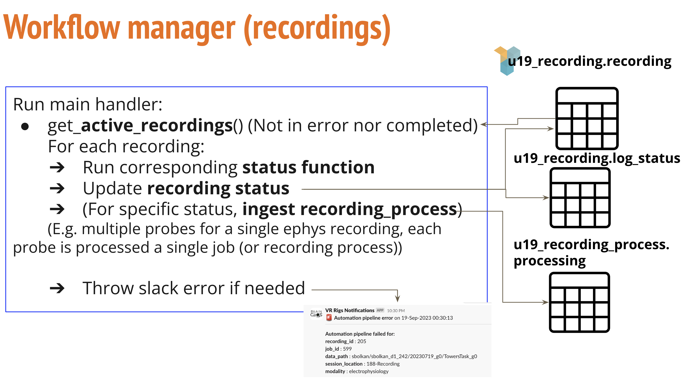
<center><figcaption>Workflow manager diagam at the recording level</figcaption></center>
</figure>

### Main functions and variables in recording workflow manager

+ **recording_status_dict** in (<a href="https://github.com/BrainCOGS/U19-pipeline_python/blob/master/u19_pipeline/automatic_job/params_config.py">Params Config file</a>): This dictionary defines status definitions and the corresponding functions to execute.
+ **pipeline_handler_main** in (<a href="https://github.com/BrainCOGS/U19-pipeline_python/blob/master/u19_pipeline/automatic_job/u19_pipeline/automatic_job/recording_handler.py">RecordingHandler</a>): Main function in the recording workflow.
  1. Executes the corresponding functions based on status.
  2. Runs every 30 minutes to check for new recordings to handle.
  3. Sends notifications for processed and failed functions.
  +  **exception_handler** in (<a href="https://github.com/BrainCOGS/U19-pipeline_python/blob/master/u19_pipeline/automatic_job/u19_pipeline/automatic_job/recording_handler.py">RecordingHandler</a>): Python decorator for error handling.
+  **modality_preingestion** in (<a href="https://github.com/BrainCOGS/U19-pipeline_python/blob/master/u19_pipeline/automatic_job/u19_pipeline/automatic_job/recording_handler.py">RecordingHandler</a>): Main ingestion function from the recording to the recording_process tables. There are subcalls depending on the modality of the recording (ephys or imaging).

#### Imaging preingestion main steps:

+  **imaging_preingestion** in (<a href="https://github.com/BrainCOGS/U19-pipeline_python/blob/master/u19_pipeline/automatic_job/u19_pipeline/automatic_job/recording_handler.py">RecordingHandler</a>): Ingestion to the recording_process table for an imaging recording. Gets all FOVs (TIFF stacks) for the recording and assigns a new job to each one, with the corresponding parameters fetched from the selection made in the Automation GUI.
**Make function in AcquiredTiff** in (<a href="https://github.com/BrainCOGS/U19-pipeline_python/blob/master/u19_pipeline/imaging_pipeline.py#L79">AcquiredTiff make function </a>): Population calls to:
  1. **u19_imaging_pipeline.AcquiredTiff**: Each recording is divided into Tiff Splits (e.g. Mesoscope recordings contain multiple tiff stacks that are processed independently).
  2. **u19_imaging_pipeline.SyncImagingBehavior**: Finds the correspondence between the virtual reality frame in the behavior experiment and the calcium imaging frame in the recording.
  (<a href="https://github.com/BrainCOGS/U19-pipeline-matlab/blob/master/schemas/%2Bimaging_pipeline/SyncImagingBehavior.m">Code here</a>). Since most users use MATLAB to read sync data, this table is populated in the general **populate tables** cronjob script.  (<a href="https://braincogs.github.io/software/automated_cronjobs.html#behavior-manipulation-optogenetics-pupillometry-tables-ingestion-matlab-cronjob">populate tables script description</a>).

<figure>
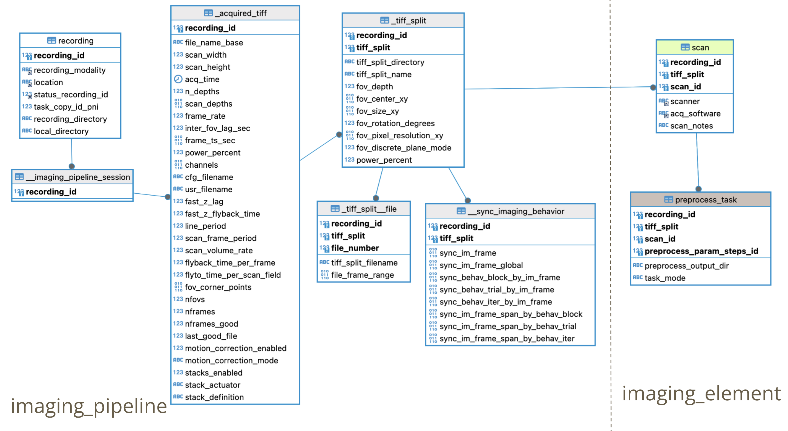
<center><figcaption>ERD for imaging pipeline at the recording level</figcaption></center>
</figure>

#### Ephys preingestion main steps:

+  **electrophysiology_preingestion** in (<a href="https://github.com/BrainCOGS/U19-pipeline_python/blob/master/u19_pipeline/automatic_job/u19_pipeline/automatic_job/recording_handler.py">RecordingHandler</a>): Ingestion to the recording_process table for an ephys recording. Gets all probes for the recording and assigns a new job to each one, with the corresponding parameters fetched from the selection made in the Automation GUI.
 1. Ingest the **ephys_pipeline.EphysPipelineSession** table.
 2. Ingest the **ephys_element.ProbeInsertion** table.
 3. Ingest the **ephys_element.EphysRecording** table.
 4. Ingest the **ephys_pipeline.BehaviorSync** table: Find the corresponding iteration in the ephys recording with the frame from the Virmen behavior task (<a href="https://github.com/BrainCOGS/U19-pipeline_python/blob/master/u19_pipeline/ephys_pipeline.py">Code here </a>) (<a href="https://github.com/BrainCOGS/U19-pipeline_python/blob/master/u19_pipeline/utils/ephys_utils.py"> and here </a>).
5. For each probe (insertion_number) in the EphysSession, insert a Processing (job) in **u19_recording_process.Processing**.


<figure>
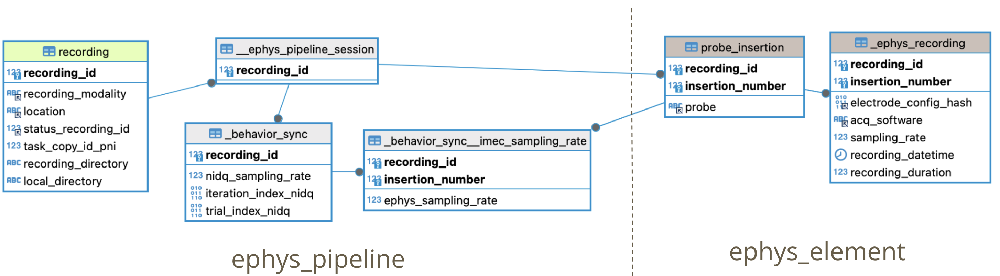
<center><figcaption>ERD for ephys pipeline at the recording level</figcaption></center>
</figure>

### Main functions and variables in recording_process workflow manager

+ **recording_process_status_dict** in (<a href="https://github.com/BrainCOGS/U19-pipeline_python/blob/master/u19_pipeline/automatic_job/params_config.py">Params Config file</a>): This dictionary defines status definitions and the corresponding functions to execute.
+ **pipeline_handler_main** in (<a href="https://github.com/BrainCOGS/U19-pipeline_python/blob/master/u19_pipeline/automatic_job/u19_pipeline/automatic_job/recording_process_handler.py">RecProcessHandler</a>): Main function in the recording process workflow.
1. Executes the corresponding functions based on status.
2. Runs every 30 minutes to check for new recordings to handle.
3. Sends notifications for processed and failed functions.
+  **transfer check/review** in (<a href="https://github.com/BrainCOGS/U19-pipeline_python/blob/master/u19_pipeline/automatic_job/u19_pipeline/automatic_job/recording_process_handler.py">transfer_check/review</a>): Executes and monitors the globus transfer from PNI to Princeton University clusters. (Deprecated)
+  **slurm_job_queue/check** in (<a href="https://github.com/BrainCOGS/U19-pipeline_python/blob/master/u19_pipeline/automatic_job/u19_pipeline/automatic_job/recording_process_handler.py">slurm_job_functions</a>): Generates the slurm file and queues the job on the cluster that will process the recording process. Monitors the job to check whether it has finished.
+  **populate_element** in (<a href="https://github.com/BrainCOGS/U19-pipeline_python/blob/master/u19_pipeline/automatic_job/u19_pipeline/automatic_job/recording_process_handler.py">slurm_job_queue</a>): After processing jobs, populates the imaging or ephys element tables downstream from the results file.


<figure>
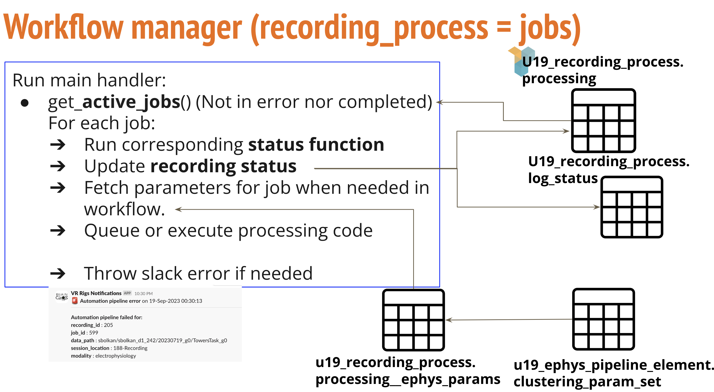
<center><figcaption>Workflow manager diagam at the recording process level</figcaption></center>
</figure>


<figure>
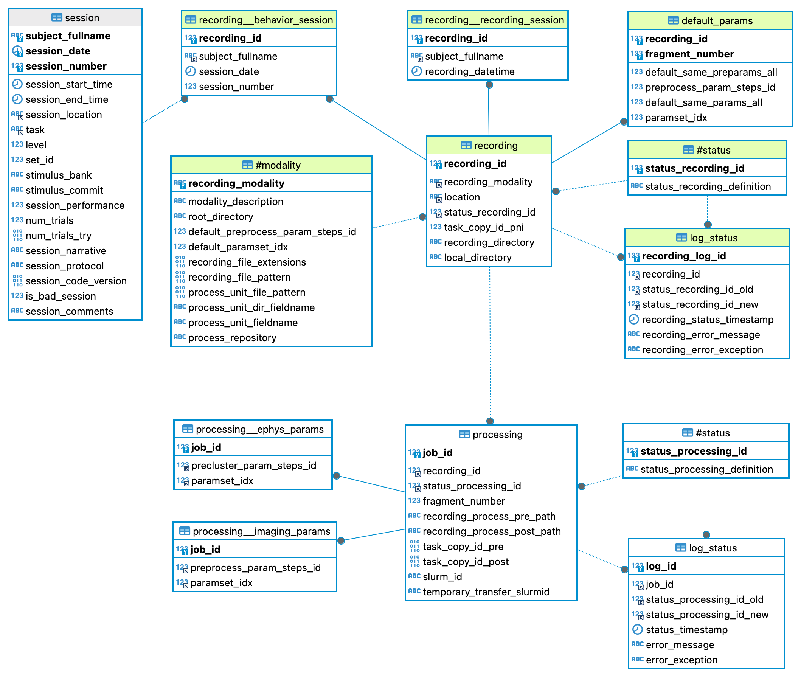
<center><figcaption>ERD from behavior session to recording process tables</figcaption></center>
</figure>

## Collab repositories to handle Ephys/Imaging Processing

### BrainCogsEphysSorters

- BrainCogsEphysSorters is the electrophysiology processing pipeline used by BrainCOGS to preprocess, sort, and post-process Neuropixels recordings. This repository works with parameters defined in previous steps of the Automation Pipeline.
- **Location:** Current location of the repository: /mnt/cup/braininit/Shared/repos/AutomaticPipelineProcessing/electrophysiology_processing/BrainCogsEphysSorters
- **System:** The repository is installed on **g-bcogs-u19proc2.pni.princeton.edu** and is run through the slurm job scheduler.
- **Logs locations:**
  - **ErrorLogs:** /mnt/cup/braininit/Shared/repos/AutomaticPipelineProcessing/u19_pipeline/automatic_job/ErrorLog
  - **OutputLogs:** /mnt/cup/braininit/Shared/repos/AutomaticPipelineProcessing/u19_pipeline/automatic_job/OutputLog

- The repository acts as a unified orchestration layer around multiple electrophysiology tools:
  - CatGT (preprocessing)
  - Kilosort 2
  - Kilosort 3
  - Kilosort 4
  - IBL Atlas post-processing pipeline


#### High-Level Workflow
  Raw Neuropixels Recording
            │
            ▼
    Preprocessing
        (CatGT)
            │
            ▼
      Spike Sorting
  (Kilosort2/3/4)
            │
            ▼
  Partial Cleanup
            │
            ▼
  IBL Atlas Conversion
            │
            ▼
  Processed Output


#### Main Components

1. main_script

- Coordinates the entire pipeline.
- **File:** main_script.py, the main entry point of the repository.

```python
# Get recording process and data directories
recording_process_id = os.environ['recording_process_id']
raw_data_directory = os.environ['raw_data_directory']
processed_data_directory = os.environ['processed_data_directory']

# Get absolute paths to raw and processed
raw_data_directory = pathlib.Path(config.root_raw_data_dir,raw_data_directory)
processed_data_directory = pathlib.Path(config.root_processed_data_dir,processed_data_directory)

# Execute selected preprocessing steps
new_raw_data_directory = pw.preprocess_main(recording_process_id, raw_data_directory, processed_data_directory)

# Execute selected sorter
sorter_processed_directory = sw.sorter_main(recording_process_id, new_raw_data_directory, processed_data_directory)

# Post process data
pw.post_process_partial_results(recording_process_id, raw_data_directory, processed_data_directory)
ppw.post_process_main(raw_data_directory, processed_data_directory, sorter_processed_directory)

```

2. Preprocessing Layer

- Checks which preprocessing steps to perform based on the preprocessing param file, then executes them (for now, only CatGT is implemented as a preprocessing stage).
- **File:** u19_sorting/preprocess_wrappers.py
- **Output result Location:**  braininit/Data/Processed/electrophysiology/(user)/(subject)/(session_date)_g(session#)/(g#_spikeglx_dir)/(imec#_spikeglx_dir)/job_id_(jobid)/catGT_output

```python
def preprocess_main(recording_process_id, raw_data_directory, processed_data_directory):

    preprocess_parameters = json.load(preprocess_param_file)

    for this_preparam in preprocess_parameters:
        if config.preproc_tools['catgt'] in this_preparam:
            catgt_output_dir = pathlib.Path(processed_data_directory, config.preproc_tools['catgt']+"_output")
            new_raw_data_directory = cat_gt.run_cat_gt(new_raw_data_directory, catgt_output_dir, this_preparam[config.preproc_tools['catgt']])
```
    
3. Sorting Layer

- Executes the selected spike sorting algorithm.
- **File:** u19_sorting/sorter_wrappers.py
- **Output result Location:**  braininit/Data/Processed/electrophysiology/(user)/(subject)/(session_date)_g(session#)/(g#_spikeglx_dir)/(imec#_spikeglx_dir)/job_id_(jobid)/(sorter)_output


```python
 sorter = config.sorters_names[process_parameters['clustering_method']]

sorter_processed_directory = pathlib.Path(processed_directory, process_parameters['clustering_method']+'_output')

  if sorter == config.sorters_names['kilosort2']:
      Kilosort2.run_Kilosort2(raw_directory, sorter_processed_directory, process_parameters_filename, chanmap_filename)
  elif sorter == config.sorters_names['kilosort3']:
      Kilosort3.run_Kilosort3(raw_directory, sorter_processed_directory, process_parameters_filename, chanmap_filename)
  elif sorter == config.sorters_names['kilosort4']:
      print('running Kilosort 4 here xxxxxxxx')
      Kilosort4.run_Kilosort4(raw_directory, sorter_processed_directory, process_parameters_filename, chanmap_filename)

```

4. Post-Processing 

- Convert sorter outputs into the formats required by downstream analysis pipelines.
- **File:** u19_sorting/postprocess_wrappers.py
- **Output result Location:**  braininit/Data/Processed/electrophysiology/(user)/(subject)/(session_date)_g(session#)/(g#_spikeglx_dir)/(imec#_spikeglx_dir)/job_id_(jobid)/ibl_data

```python
  # For the moment we just call ibl_data transformation to run atlas
  ibl_atlas_post_processing.run_ibl_atlas_post_processing(raw_data_directory, processed_data_directory, sorter_processed_directory)
```

#### Design Patterns

- The repository isolates third-party tools behind wrappers:
  - CatGT
  - Kilosort2
  - Kilosort3
  - Kilosort4

- This makes it easier to:

  - Replace sorters
  - Add new preprocessing tools
  - Keep a common interface
  - Configuration-Driven Execution

- Behavior is controlled entirely by JSON files (created by the Automation Pipeline):

  - preprocess_paramset_(id).json
  - process_paramset_(id).json
