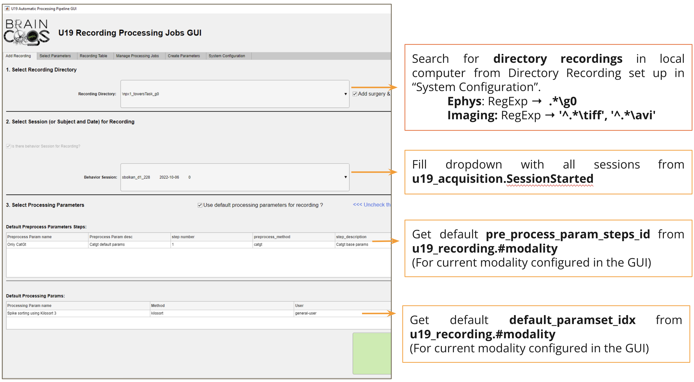
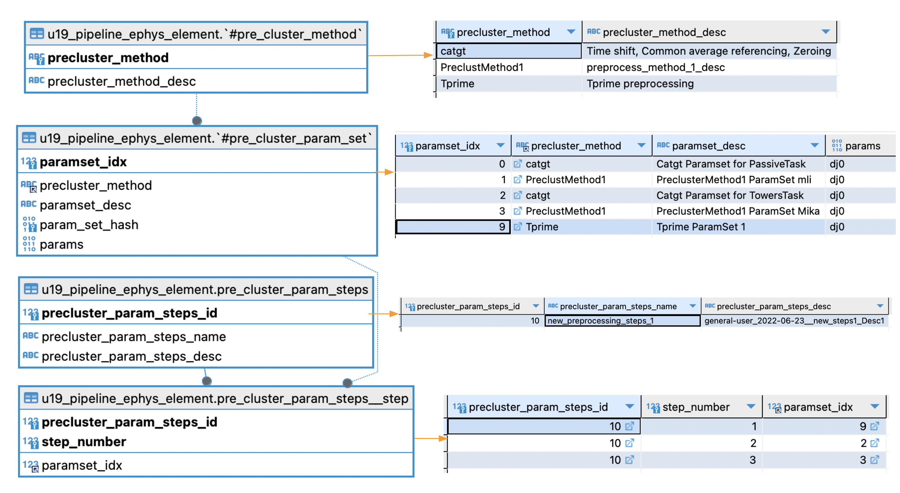
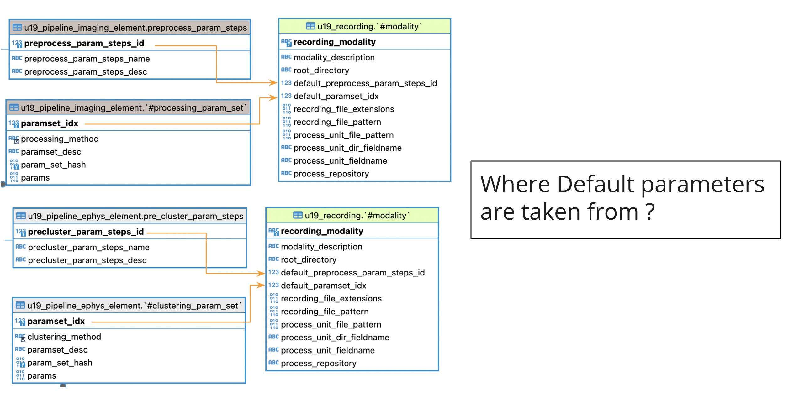
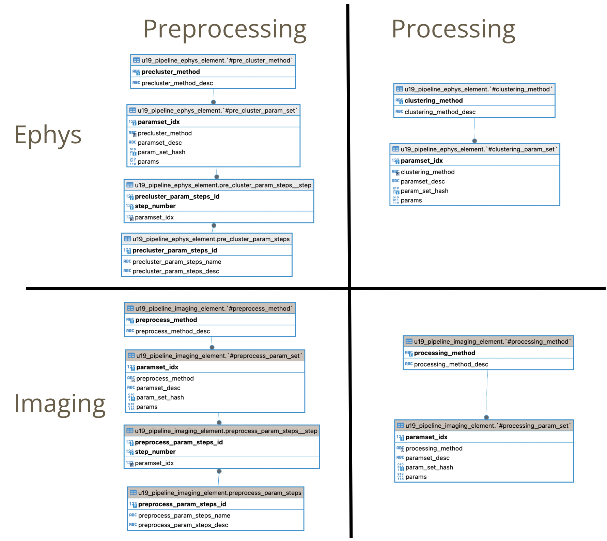
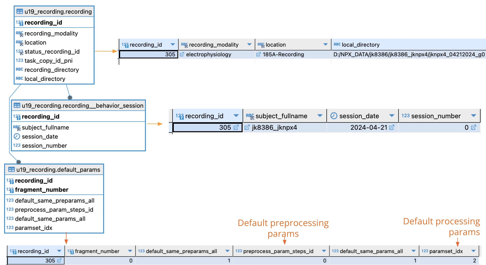
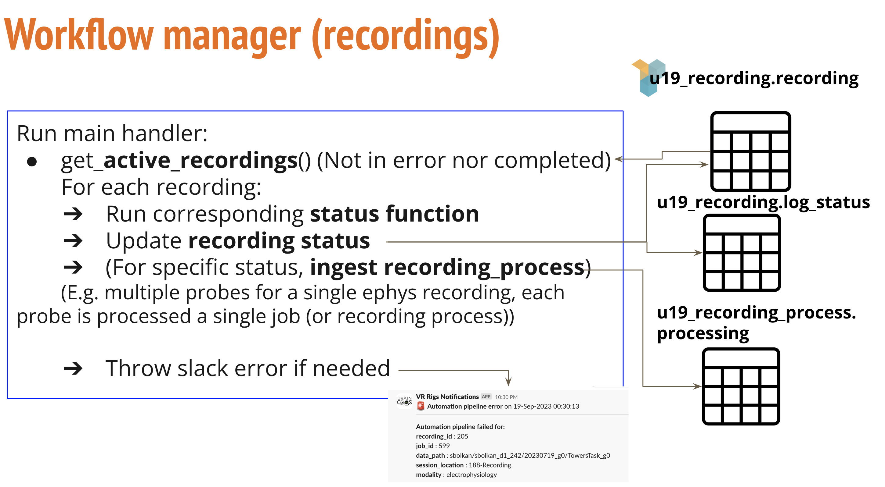
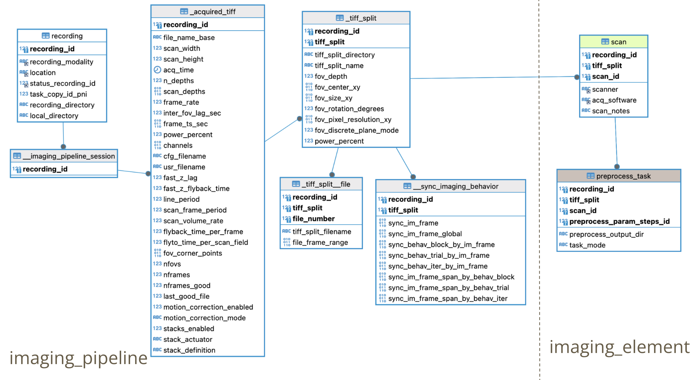
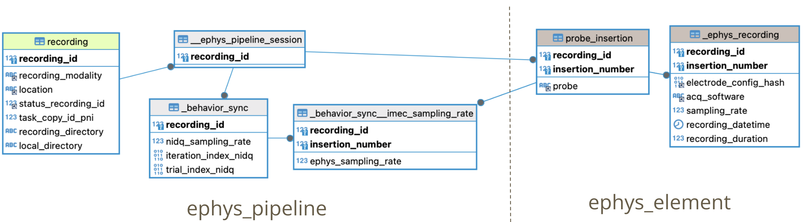
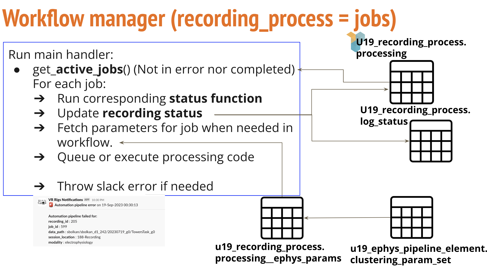
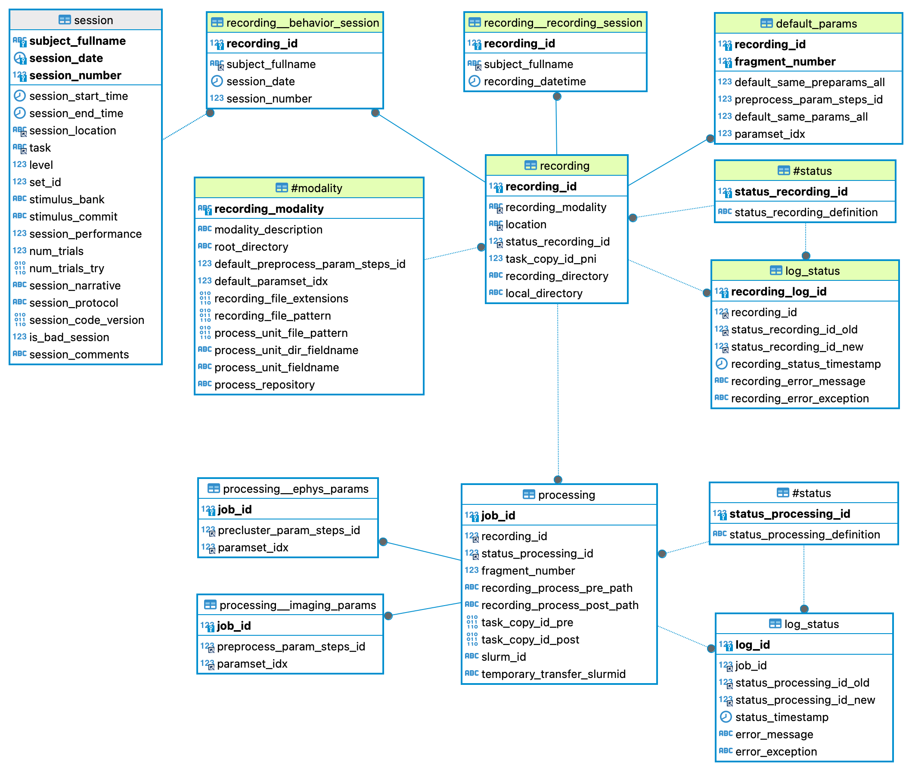

# {{ $frontmatter.title }}

The Ephys/Imaging Automation Pipeline in BRAINCoGS main goals are:

+ Automate spike sorting and imaging segmentation for all recordings
+ Centralize/Standardize paths for Recording Data Storage
+ Unify & Register Ephys/Imaging Processing
+ Store processed data in BRAINCoGS Database (DJ)

To accomplish this we developed three tools:

+ Ephys/Imaging Automation GUI (<a href="https://github.com/BrainCOGS/RecordingProcessJobGUI">RecordingProcessJobGUI</a>)
+ Recording Workflow management (<a href="https://github.com/BrainCOGS/U19-pipeline_python/tree/master/u19_pipeline/automatic_job">Automatic_job directory in U19-pipeline_python </a>)
+ Collab reposiotries to handle Ephys/Imaging Processing (<a href="https://github.com/BrainCOGS/BrainCogsEphysSorters">BrainCogsEphysSorters </a> and <a href="https://github.com/BrainCOGS/BrainCogsImagingSegmentation">BrainCogsImagingSegmentation </a>)

 ## Ephys/Imaging Automation GUI

In this mini guide for the automation GUI we will show the relationship between the GUI and the Database. From which tables some values are taken and which records are written by the GUI.

### Automation GUI main screen

 <figure>

<figcaption>Automation GUI main screen fill values</figcaption>

 </figure>

### Ephys Preprocessing (precluster) parameters organization

 #### Main tables
  + **u19_pipeline_ephys_element.#pre_cluster_method** List of methods (or algorithms) supported for ephys preprocessing 
  + **u19_pipeline_ephys_element.pre_cluster_param_set** Specific set of parameters (mainly a dictionary) for a given preprocessing method. Multiple set of parameters can be stored for the same method.
  + **u19_pipeline_ephys_element.pre_cluster_param_steps** (Ephys) Reference to a set to steps to perform in ephys preprocessing
  + **u19_pipeline_ephys_element.pre_cluster_param_steps__step** These records indicate which set of parameters for given preprocessing methods will be executed (and in which order).

 <figure>

<figcaption>Precluster tables record examples </figcaption>

 </figure>

+ Depicted in the above image:
 1. Let's pretend: **precluster_param_steps_name** = new_preprocessing_steps_1 (precluster_param_steps_id = 10 ) is selected for preprocessing.
 2. According to **pre_cluster_param_steps__step** 
    * paramset_idx = 9 will be executed 1st
    * paramset_idx = 2 2nd
    * paramset_idx = 3 3rd.
 3. Checking **pre_cluster_param_set** for paramset_idx = 9,2,3 we conclude preprocessing will comprise:
    *   **Tprime** (Tprime ParamSet 1)
    *   **Catgt** (Catgt ParamSet for Towers Task)
    *   **PreClustMethod1** (PreClusterMethod1 Paramset Mika)

### Epgys Processing (cluster) parameters organization

+ Simpler than preprocessing structure (since there are no multiple steps involved), we have two tables to organize Ephys Processing parameters.

 <figure>

<figcaption>Cluster tables record examples </figcaption>

 </figure>

 #### Main tables
  + **u19_pipeline_ephys_element.#clustering_method** List of methods (or algorithms) supported for ephys processing 
  + **u19_pipeline_ephys_element.#clustering_param_set** Specific set of parameters (mainly a dictionary) for a given processing method. Multiple set of parameters can be stored for the same method.

+ Each recording (or to be precise, recording process) can be processed with a different set of parameters. Default parameters are used for the majority of the recordings in BRAINCoGS.

### Default parameters for preprocessing and processing

+ As seen in in Automation GUI main screen, **u19_recording.#modality** stores default parameters for each modality.
+ As a developer **manually update  default parameters** for all modalities when needed by the project.

 <figure>

<figcaption>From which tables default parameters are taken </figcaption>

 </figure>

+ In **u19_recording.#modality** table it is stored a reference for default parameters most commonly used for processing ephys & imaging.
+ Main table to store preprocessing parameters:
    1. **u19_pipeline_ephys_element.pre_cluster_param_steps**: (Ephys) Reference to a set to steps to perform in ephys preprocessing
    2. **Imaging, u19_pipeline_imaging_element.pre_process_param_steps**: (Imaging) Reference to a set to steps to perform in imaging preprocessing (No preprocessing in imaging for any user at the moment)
+ Main table to store processing parameters:
    1. **Ephys, u19_pipeline_ephys_element.#clustering_param_set**: (Ephys) Reference to a set of parameters for chosen sorting algorithm.
    2. **Imaging, u19_pipeline_imaging_element.#processing_param_set**: (Imaging) Reference to a set of parameters for chosen segmentation algorithm.

### Imaging equivalence parameter tables:

 <figure>

<figcaption>Imaging equivalence parameter tables </figcaption>

 </figure>

+ All description made for ephys preprocessing and processing tables apply for the imaging counterparts.

### Tables written when recording is registered:

 <figure>

<figcaption>Tables written when new recording is registered </figcaption>

 </figure>

+ When a new recording is created three tables are written:
    1. **u19_recording.recording**: Main table for recordings. Recording_id is created will identify the recording through all the process
    2. **u19_recording.recording__behavior_session**: Reference to which behavior session corresponds this recording.
    3. **u19_recording.default_params**: Set of parameters chosen for this recording.

+ If there is no behavior session attached to recording:
 * **u19_recording.recording__recording_session**: Subject and datetime of recording is stored as reference in this table.

 #### u19_recording.default_params design:

 + Default_params works as a "guide" to know which parameters where chosen for recording.
 + Explanation for all fields of this table:
  1. **recording_id** Reference to which recording parameters are being selected
  2. **fragment_number** Reference to which "fragment" (or job) the parameters apply to. (Check next session to know how recordings are split in fragments).
  3. **default_same_preparams_all** If default_same_preparams_all = 1 (default case), same preprocessing parameters will be applied to all fragments of recording.
  4. **preprocess_param_steps_id** Preprocessing parameter id chosen for this recording-fragment. Taken from u19_recording.#modality by default.
  5. **default_same_params_all** If default_same_params_all = 1 (default case), same processing parameters will be applied to all fragments of recording.
  6. **paramset_idx** Processing parameter id chosen for this recording-fragment. Taken from u19_recording.#modality by default.

+ In the default case (main screen Automation GUI) default_same_preparams_all=1 & default_same_params_all=1 so default parameters will be applied to all fragments of recording.

 ## Workflow management description

Workflow management code creates and coordinates of a set of tasks for all recordings that were registered with the GUI to make sure they are entirely processed.

Shell code executed as a cronjob for workflow management:
(<a href="https://github.com/BrainCOGS/U19-pipeline_python/blob/master/u19_pipeline/automatic_job/call_cronjob_automatic_job.sh">call_cronjob_automatic_job.sh
</a>)

Workflow management is composed mainly by two classes that handles recordings and recording_processes  (recording_processes or jobs are how recordings are composed)
 + Ephys recordings are composed by one or many independent probe electrophysiology recordings. Each probe recording correspond to a job in the workflow management
 + Calcium imaging recordings are composed by one or many independent field of views image stacks. Each field of view image stack correspond to a job in the workflow management.

The class that manages workflow at the recording level is (<a href="https://github.com/BrainCOGS/U19-pipeline_python/blob/master/u19_pipeline/automatic_job/recording_handler.py">RecordingHandler</a>)

 <figure>

<figcaption>Workflow manager diagam at the recording level</figcaption>

 </figure>

### Main functions and variables in recording workflow manager

+ **recording_status_dict** in (<a href="https://github.com/BrainCOGS/U19-pipeline_python/blob/master/u19_pipeline/automatic_job/params_config.py">Params Config file</a>): This dictionary defines status definitions and corresponding functions to execute.
+ **pipeline_handler_main** in (<a href="https://github.com/BrainCOGS/U19-pipeline_python/blob/master/u19_pipeline/automatic_job/u19_pipeline/automatic_job/recording_handler.py">RecordingHandler</a>): Main function in recording workflow
  1. Executes corresponding functions based in status.
  2. Executed every 30 minutes to check for new recordings to be handled.
  3. Send notifications for processed and failed functions.
  +  **exception_handler** in (<a href="https://github.com/BrainCOGS/U19-pipeline_python/blob/master/u19_pipeline/automatic_job/u19_pipeline/automatic_job/recording_handler.py">RecordingHandler</a>): Python decorator for error handling.
+  **modality_preingestion** in (<a href="https://github.com/BrainCOGS/U19-pipeline_python/blob/master/u19_pipeline/automatic_job/u19_pipeline/automatic_job/recording_handler.py">RecordingHandler</a>): Main ingestion function from recording to recording_process tables. There are subcalls depending on modality of recording (ephys or imaging).

#### Imaging preingestion main steps:

+  **imaging_preingestion** in (<a href="https://github.com/BrainCOGS/U19-pipeline_python/blob/master/u19_pipeline/automatic_job/u19_pipeline/automatic_job/recording_handler.py">RecordingHandler</a>): Ingestion to recording_process table for an imaging recording. Get all FOVs (TIFF stacks) for the recording and assign a new job for each one with corresponding parameters fetched from selection done in automation GUI.
**AcquiredTiff populate function** in (<a href="https://github.com/BrainCOGS/U19-pipeline_python/blob/master/u19_pipeline/imaging_pipeline.py">Imaging pipeline</a>): Auxiliar script to call **populate_Imaging_AcquiredTiff** script in MATLAB.
+ **populate_Imaging_AcquiredTiff** in (<a href="https://github.com/BrainCOGS/U19-pipeline-matlab/blob/master/scripts/populate_Imaging_AcquiredTiff.m">populate_Imaging_AcquiredTiff</a>): Population calls to:
  1. **u19_imaging_pipeline.AcquiredTiff**: Each recording is divided into Tiff Splits (e.g. Mesoscope recordings contain multiple tiff stacks that will be processed independently). (<a href="https://github.com/BrainCOGS/U19-pipeline-matlab/blob/master/schemas/%2Bimaging_pipeline/AcquiredTiff.m">Code here</a>)
  2. **u19_imaging_pipeline.SyncImagingBehavior**: Find correspondence between virtual reality frame in the behavior experiment and Calcium Imaging frame in recording.
  (<a href="https://github.com/BrainCOGS/U19-pipeline-matlab/blob/master/schemas/%2Bimaging_pipeline/SyncImagingBehavior.m">Code here</a>)

 <figure>

<figcaption>ERD for imaging pipeline at the recording level</figcaption>

 </figure>

#### Ephys preingestion main steps:

 +  **electrophysiology_preingestion** in (<a href="https://github.com/BrainCOGS/U19-pipeline_python/blob/master/u19_pipeline/automatic_job/u19_pipeline/automatic_job/recording_handler.py">RecordingHandler</a>): Ingestion to recording_process table for an ephys recording. Get all probes for the recording and assign a new job for each one with corresponding parameters fetched from selection done in automation GUI.
 1. Ingest **ephys_pipeline.EphysPipelineSession** table
 2. Ingest **ephys_element.ProbeInsertion** table
 3. Ingest **ephys_element.EphysRecording** table
 4. Ingest **ephys_pipeline.BehaviorSync** table: Find corresponding iteration in ephys recording with frame from Virmen behavior task (<a href="https://github.com/BrainCOGS/U19-pipeline_python/blob/master/u19_pipeline/ephys_pipeline.py">Code here </a>) (<a href="https://github.com/BrainCOGS/U19-pipeline_python/blob/master/u19_pipeline/utils/ephys_utils.py"> and here </a>).
5. For each probe (insertion_number) in EphysSession insert a Processing (job) in **u19_recording_process.Processing**

 <figure>

<figcaption>ERD for ephys pipeline at the recording level</figcaption>

 </figure>

 ### Main functions and variables in recording_process workflow manager

 + **recording_process_status_dict** in (<a href="https://github.com/BrainCOGS/U19-pipeline_python/blob/master/u19_pipeline/automatic_job/params_config.py">Params Config file</a>): This dictionary defines status definitions and corresponding functions to execute.
+ **pipeline_handler_main** in (<a href="https://github.com/BrainCOGS/U19-pipeline_python/blob/master/u19_pipeline/automatic_job/u19_pipeline/automatic_job/recording__process_handler.py">RecProcessHandler</a>): Main function in recording process workflow
1. Executes corresponding functions based in status.
2. Executed every 30 minutes to check for new recordings to be handled.
3. Send notifications for processed and failed functions.
+  **transfer check/review** in (<a href="https://github.com/BrainCOGS/U19-pipeline_python/blob/master/u19_pipeline/automatic_job/u19_pipeline/automatic_job/recording_process_handler.py">transfer_check/review</a>): Executes and monitors globus transfer from PNI to PrincetonUniversity clusters. (Deprecated)
+  **slurm_job_queue/check** in (<a href="https://github.com/BrainCOGS/U19-pipeline_python/blob/master/u19_pipeline/automatic_job/u19_pipeline/automatic_job/recording_process_handler.py">slurm_job_functions</a>): Generate slurm file and queue the job in the cluster that will process recording process. Monitor job to check if it has already finished.
+  **populate_element** in (<a href="https://github.com/BrainCOGS/U19-pipeline_python/blob/master/u19_pipeline/automatic_job/u19_pipeline/automatic_job/recording_process_handler.py">slurm_job_queuew</a>): After processing jobs populate imaging or ephys element tables downstream from results file.

 <figure>

<figcaption>Workflow manager diagam at the recording process level</figcaption>

 </figure>

  <figure>

<figcaption>ERD from behavior session to recording process tables</figcaption>

 </figure>

## Collab reposiotries to handle Ephys/Imaging Processing

### BrainCogsEphysSorters

#### Set up instructions for BrainCogsEphysSorters in cluster system

### Set up new processing cluster

Instructions to set up a new computing cluster to process Ephys & Imaging 