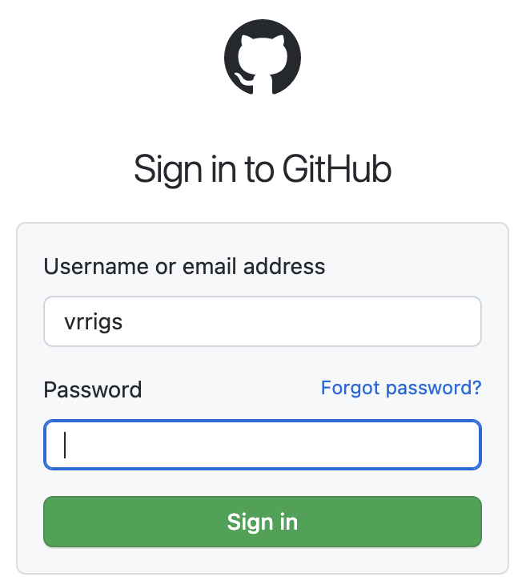
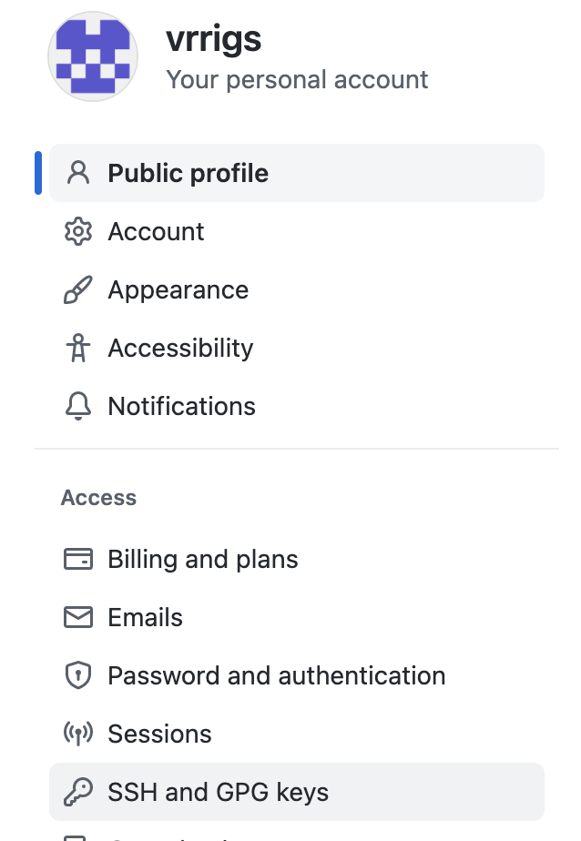
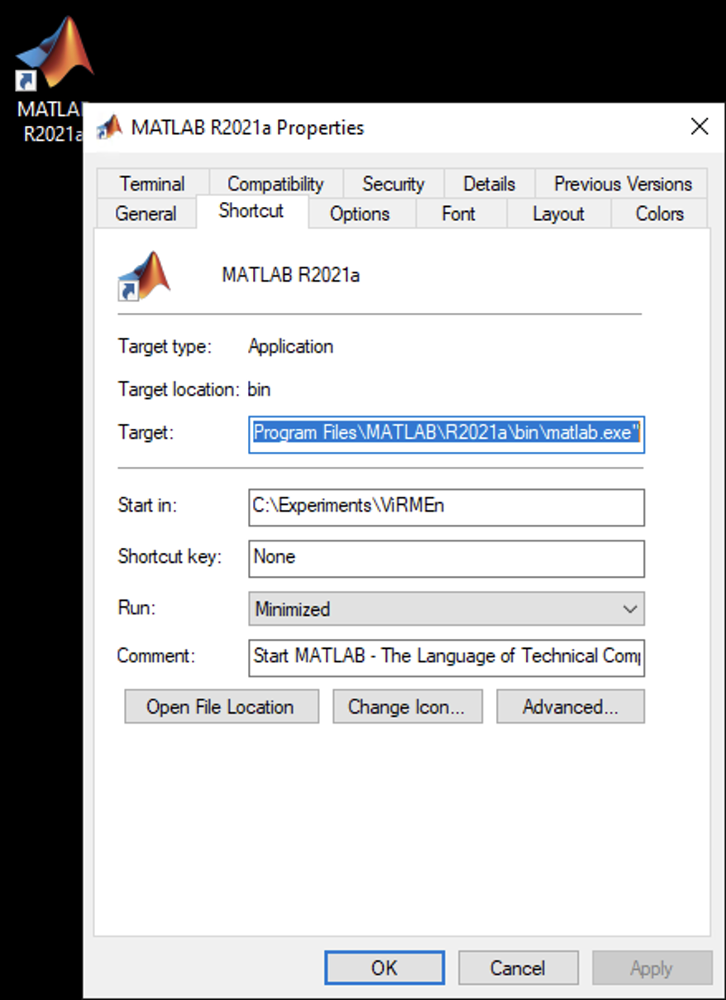
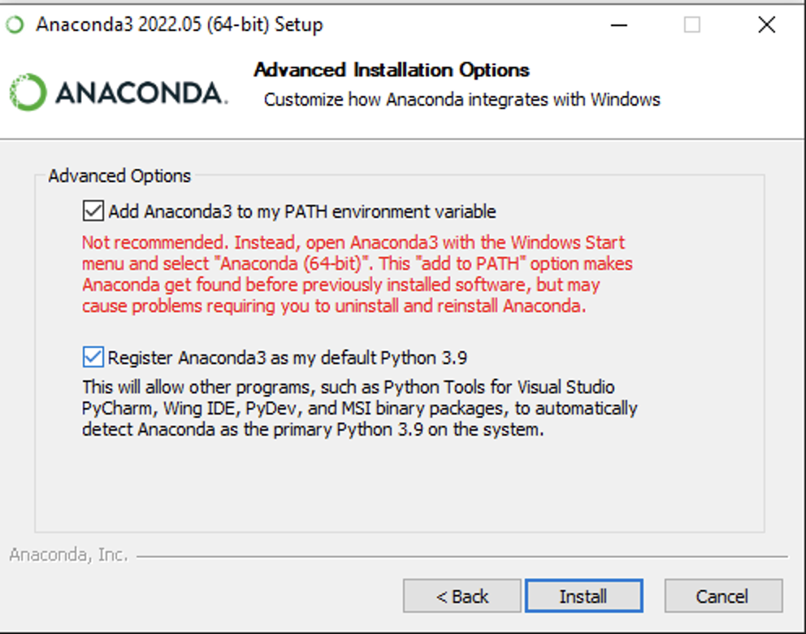
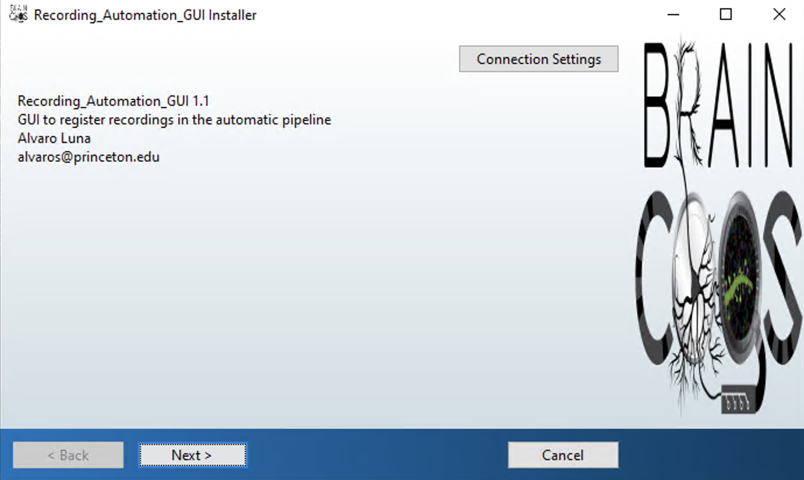

# {{ $frontmatter.title }}

## Configure a new behavior rig {#configure-new-behavior-rig-system}

### First steps

#### Mount the PNI cup drives {#mount-cup-pni-drives}

1. From Windows Explorer, select "Map Network Drive" and enter:
  + `\\cup.pni.princeton.edu\braininit\` (for braininit)
  + `\\cup.pni.princeton.edu\u19_dj\` (for u19_dj)
2. Authenticate with your NetID and PU password (NOT your PNI password, which may be different). When prompted for your username, enter `PRINCETON\netid` (PRINCETON can be upper or lower case), where `netid` is your PU NetID.

#### Install MATLAB R2020a or later {#install-matlab-2020a-or-higher}

#### Download and install NI-DAQmx from the <a href="https://ni.com/r/downloaddaqmx">National Instruments website</a> {#download-and-install-nidaqmx-from-national-instruments-website}

#### Download and install Microsoft Visual Studio Community {#download-and-install-microsoft-visual-studio-community}
  1. Select a version compatible with the installed MATLAB version. This typically means a Visual Studio release year earlier than the MATLAB release year (e.g., VS Community 2022 for MATLAB R2024a).
  2. Make sure to install the "Desktop development with C++" workload.

#### Install Git for Windows

1. Install it from this <a href="https://git-for-windows.github.io/">link</a>.

##### Installation options

  + Use Git from the Windows Command Prompt (5th pane)
  + Checkout as-is, commit as-is (6th pane)

#### Create an SSH key to clone repositories {#create-ssh-key-to-clone-repositories}

1. Open Git Bash.
2. `ssh-keygen -t ed25519 -C "vrrigsbi@princeton.edu"`
3. Leave the passphrase empty (press Enter twice).
4. `eval "$(ssh-agent -s)"`
5. `ssh-add ~/.ssh/id_ed25519`

#### Add the key to the vrrigs user on GitHub {#add-key-to-virmen-user-in-github}

1. Copy the ssh public key to the clipboard in Git Bash: `clip < ~/.ssh/id_ed25519.pub`
2. Open [GitHub](https://github.com/login).
3. Log in as the vrrigs user (ask your lab manager for the password).

 

4. Go to Settings -> SSH and GPG keys.

 

5. Click the `New SSH key` button.
6. Add a meaningful title for the key and paste the public key from the clipboard into the "Key" text area.
7. Click the `Add SSH key` button.

#### Compiler

1. Install the Visual Studio C++ compiler from <a href="https://visualstudio.microsoft.com/downloads/">https://visualstudio.microsoft.com/downloads/</a>, making sure to select C++ support.
2. In MATLAB, run `mex -setup -v`. This sets up the compiler. It should output something like "Microsoft Visual C++ 202X".

### U19-pipeline-matlab repository {#u19-pipeline-matlab-repository}

1. Open Git Bash and execute: `cd /c/Experiments`
2. Clone the **U19-pipeline-matlab** repository: `git clone git@github.com:BrainCOGS/U19-pipeline-matlab.git`
#### MATLAB instructions {#matlab-instructions}

3. Run `dj_initial_conf(0)`.
4. Enter the DB user name and password.

### ViRMEn repository {#virmen-repository}

1. Create the `C:\Experiments` directory
2. Open Git Bash and execute: `cd /c/Experiments`.
3. Execute `git config --global user.email "vrrigsbi@princeton.edu"`.
4. Clone the **ViRMEn** repository: `git clone git@github.com:BrainCOGS/ViRMEn.git`.
#### MATLAB instructions {#matlab-instructions-1}

5. Open MATLAB as Administrator.
6. Run `install_virmen` inside `C:\Experiments\ViRMEn`.
 + If compilation fails, run `mex -setup c++` to select the **Visual Studio C++ compiler**.
7. Run:
 + `import_scheduled_tasks(1)` if this is a rig in room 165 (or one mainly managed by techs)
 + `import_scheduled_tasks(0)` if this is an acquisition (ephys/imaging) rig or a rig managed by researchers
8. Open the file `C:\Experiments\ViRMEn\RigParameters.m` and edit the corresponding variables:
  + **rig:** (RigName in the format: `Room#-"Rig"#-T`)
  + **rig_type:** (`miniVR` or `NormalVR`)
  + **NI-DAQ channels**, in the corresponding variables (ask your lab manager about these parameters)
  + **Mini VR projection parameters** (ask your lab manager about these parameters)
9. Run `lab.utils.add_behavior_rig(RigParameters.rig)`.
10. Run the `live_calibration` experiment (ask your lab manager about this process).
11. Create a MATLAB shortcut and set **Start in** to `C:\Experiments\ViRMEn`.
12. Pin this shortcut to the Windows taskbar.

 

### MATLAB add-ons {#matlab-add-ons}

If not all toolboxes were installed with MATLAB, make sure these add-ons are installed:

+ Image Acquisition Toolbox
+ Image Processing Toolbox
+ Image Acquisition Toolbox Support Package for GenICam Interface
+ Image Acquisition Toolbox Support Package for OS Generic Video Interface
+ PsychToolbox
+ Statistics and Machine Learning Toolbox
+ Instrument Control Toolbox
+ Data Acquisition Toolbox
+ Zaber

## Change the sleep settings {#modify-the-sleep-behaviors}

To keep the screen from turning off while subjects are training:

1. In Windows <a href="https://support.microsoft.com/en-us/windows/how-to-adjust-power-and-sleep-settings-in-windows-26f623b5-4fcc-4194-863d-b824e5ea7679">Power & Sleep settings</a>, set "Turn my screen off after" to the longest option.
2. Also set "Make my device sleep after" to the longest option.

## Configure a new recording system {#configure-new-recording-system}

+ First, install everything necessary for the appropriate recording modality (SpikeGLX for electrophysiology, ScanImage for imaging).

1. From Windows Explorer, select "Map Network Drive" and enter:
  + `\\cup.pni.princeton.edu\braininit\` (for braininit)
  + `\\cup.pni.princeton.edu\u19_dj\` (for u19_dj)
2. Authenticate with your NetID and PU password (NOT your PNI password, which may be different). When prompted for your username, enter `PRINCETON\netid` (PRINCETON can be upper or lower case), where `netid` is your PU NetID.
3. Copy the Automation GUI files: copy `\\cup.pni.princeton.edu\braininit\Shared\AutomationGUI_Installation\AutomationGUI_update` to the Desktop.
4. Run `Desktop\AutomationGUI_update\firstTimeAutomationGUI.BAT`.
  + Install Git Bash and Anaconda from it.

 

  + On the Anaconda advanced options step, check the **"Add Anaconda3 to my PATH environment variable"** checkbox.
5. Run `Desktop\AutomationGUI_update\update_AutomationGUI.BAT`.
6. Follow the instructions to install the Recording Automation GUI (also called the Workflow Console GUI).

 

### Register recording system

On a computer with access to the database (e.g., any rig computer):

  1. Open MATLAB.
  2. Execute: `lab.utils.add_recording_system((recording_system_name), (modality))` where:
   + **recording_system_name:** (in the format: `Room#-Recording`).
   + **modality:** (one of the following: `electrophysiology, 2photon, 3photon, mesoscope`).
