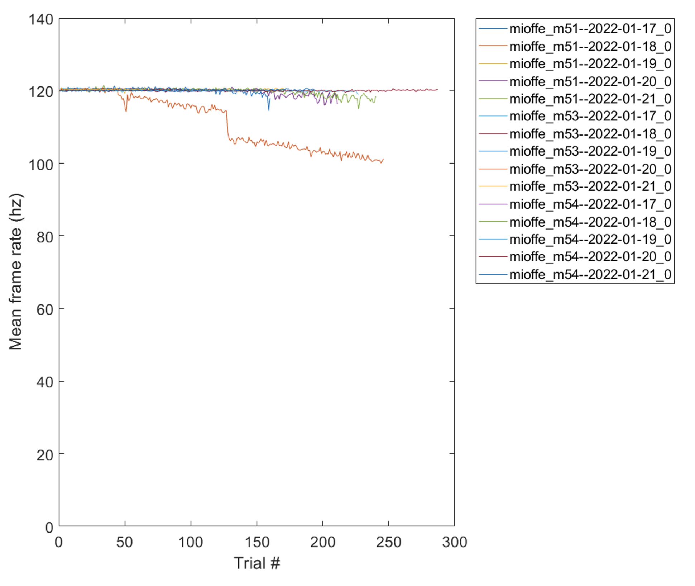
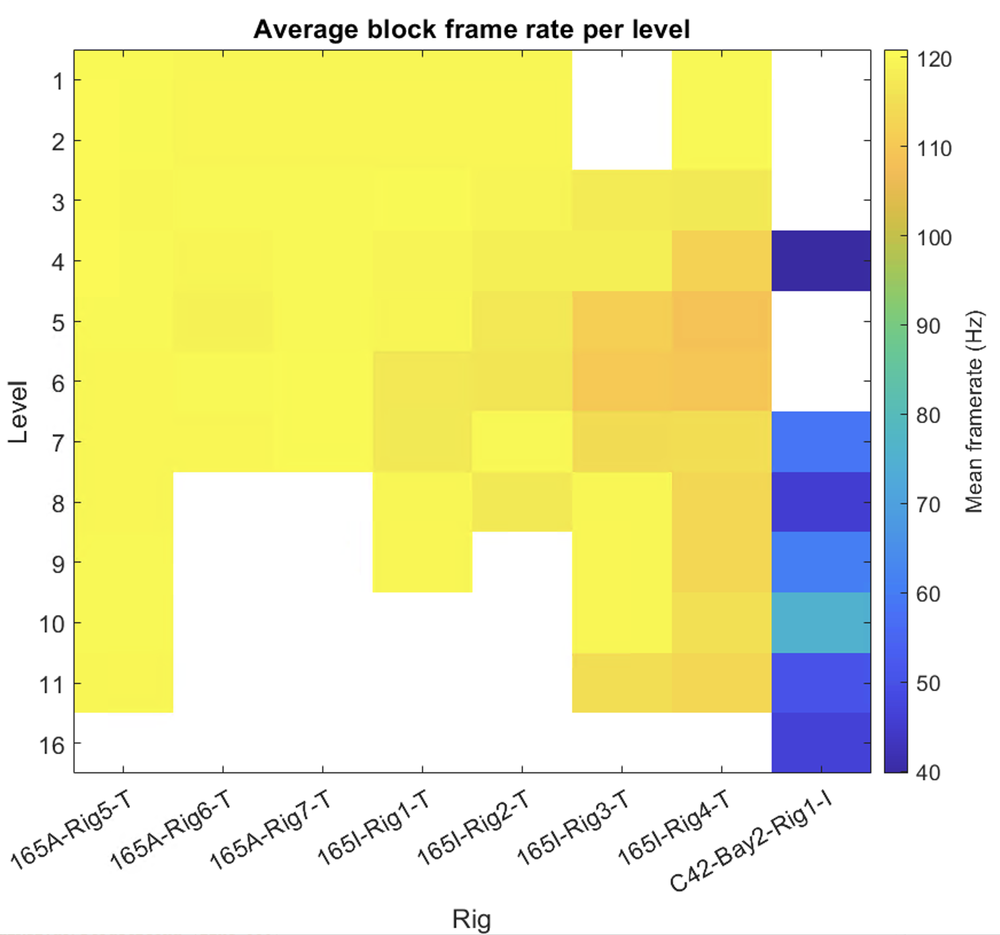
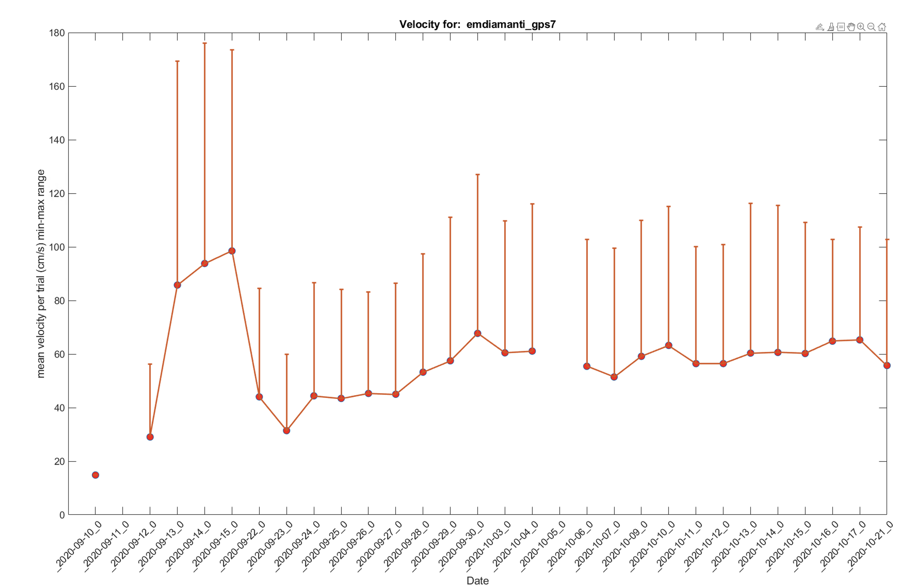
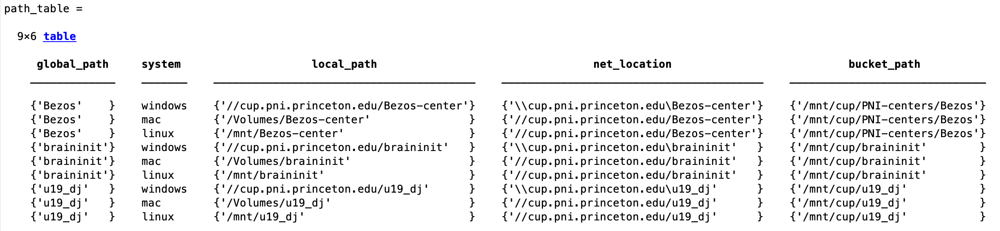

# {{ $frontmatter.title }}

## MATLAB

### Prerequisites
1. U19-pipeline-matlab repo added to MATLAB path
2. Mounted network cup drives (braininit, u19_dj)
+ See the <a href="https://braincogs.github.io/software/db_access.html">Database access section</a> for more info.

### Recommended tutorial

+ Go through ```U19-pipeline-matlab/tutorials/202103/session01_queries_fetches.mlx``` to learn basic tips on datajoint.


### **Useful scripts and functions** for researcher general use:

### Read behavior file:

1. Execute (change the key for the desired session):
```matlab
 key = struct('subject_fullname', 'testuser_T06', 'session_date', '2022-04-20');
 [status,data] = lab.utils.read_behavior_file(key)
```
2. If successful, ```status = 1``` and ```data = log behavioral file```.

### Get behavior file location (local & for spock/scotty)

1. If you only need to know the path of the behavior file, use:
```matlab
 key = struct('subject_fullname', 'testuser_T06', 'session_date', '2022-04-20');
 baseDir = fetch1(acquisition.SessionStarted & key, 'new_remote_path_behavior_file');
 [bucket_path, local_path] =  lab.utils.get_path_from_official_dir(baseDir)
```

### get_full_trial_data with SpatialTimeBlobs

+ Get trial data (position, velocity, etc.) efficiently with the DB.
+ New method to retrieve all trial data for multiple sessions faster.
1. Execute:
```matlab
 key = struct('subject_fullname', 'testuser_T06', 'session_date', '2022-04-20');
 get_full_trial_data(key)
```

+ Get trial data from joined tables as well (e.g. **TowersBlock**):
```matlab
 key = struct('subject_fullname', 'testuser_T06', 'session_date', '2022-04-20');
 get_full_trial_data(key, behavior.TowersBlockTrial * behavior.TowersBlock)
```

+ Get data from subtasks as well (e.g. **Twolickspouts** subtask):
```matlab
 key = struct('subject_fullname', 'efonseca_ef114_act114', 'session_date', '2023-01-11');
 all_tables = behavior.TowersBlockTrial * behavior.TowersBlock * behavior_subtask.TwolickspoutsBlockTrial * behavior_subtask.TwolickspoutsBlock
 get_full_trial_data(key, all_tables)
```

### get stats from session

+ Use this function to get behavior-file-like stats (at the trial level) for a single session or multiple sessions.
+ Stats include, but are not limited to: (```correct_left, correct_right, cum_correct_trials, performance, goodFraction, numPerMin, numRewardsPerMin, bias```).
```matlab
 key = struct('subject_fullname', 'testuser_T06', 'session_date', '2022-04-20');
 stat_struct = get_stats_from_session(key, "all")
```

### get behaviorfile as db

+ Function to unnest the behavior file structure to get a plain trial table (with block data merged).
```matlab
 key = struct('subject_fullname', 'testuser_T06', 'session_date', '2022-04-20');
 data_struct = get_behaviorfile_as_db(key)
```

### get time from iteration variable

+ Example of how to "translate" a variable from iteration# to trial_time.
+ In this case, the 1st row of the variable licks (iteration#) is translated to lick_times and then added to the original trial structure.
```matlab
 key = struct('subject_fullname', 'efonseca_ef114_act114', 'session_date', '2023-01-11');
trial_data = get_full_trial_data(key, behavior.TowersBlockTrial * behavior_subtask.TwolickspoutsBlockTrial);
licks_time_struct = struct;
for i=1:length(trial_data)
    licks_time_struct(i,1).lick_times = get_time_from_iter(trial_data(i).trial_time, trial_data(i).licks(1,:));
end
trial_data = cat_struct(trial_data, licks_time_struct);
```

### plot framerate frequency sessions

+ Plot the trial-by-trial framerate of multiple sessions for comparison.
```matlab
 key = 'subject_fullname like "mioffe%" and session_date > "2022-01-01" and session_date < "2022-01-30"';
 analyze_iteration_time(key)
```

 <figure>
  
  <center><figcaption>Framerate trial by trial sessions</figcaption></center>
 </figure>

### plot framerate frequency levels and rigs

+ Plot the mean framerate by level and rig for multiple sessions.
```matlab
 key = 'subject_fullname like "mioffe%" and session_date > "2022-01-01" and session_date < "2022-12-10"';
 analyze_iteration_time_level_rig(key)
```

 <figure>
  
  <center><figcaption>Mean framerate by level and rig </figcaption></center>
 </figure>

### plot velocity sessions

+ Plot the mean and max range velocity by session for multiple behavior sessions.
```matlab
 key = struct('subject_fullname', 'emdiamanti_gps7');
 plot_velocity_session(key)
```

 <figure>
  
  <center><figcaption>Velocity plot for multiple sessions</figcaption></center>
 </figure>

### get path table

1. Get the default paths for network cup drives across different OSes and spock/scotty (bucket).
```matlab
 key = struct('subject_fullname', 'testuser_T06', 'session_date', '2022-04-20');
 baseDir = fetch1(acquisition.SessionStarted & key, 'new_remote_path_behavior_file');
 [bucket_path, local_path] =  lab.utils.get_path_from_official_dir(baseDir)
```
 <figure>
  
  <center><figcaption>Path table data</figcaption></center>
 </figure>

### Common errors and troubleshooting

1. Fetching from a table with external storage when the corresponding network cup drive is not mounted:
```matlab
 Error using dj.store_plugins.File (line 89)
 Directory `/Volumes/u19_dj/external_dj_blobs` not accessible.

 Error in dj.internal.ExternalTable (line 52)
            self.spec = dj.store_plugins.(storePlugin)(config);
```

```matlab
 Error using fread
 Invalid file identifier. Use fopen to generate a valid file identifier.

 Error in dj.store_plugins.File.download_buffer (line 63)
            result = fread(fileID);
```
+ Just mount all cup drives and try again!

2. The key references more than one session when the function was meant to work for a single session:
```matlab
  Error using dj.internal.GeneralRelvar/fetch1 (line 250)
  fetch1 can only retrieve a single existing tuple.
```
+ Just recreate the key to reference a single session.
