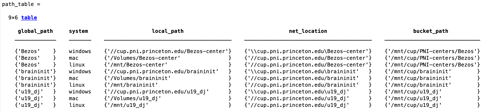

# {{ $frontmatter.title }}

 ## MATLAB

 ### Prerequesites
  1. U19-pipeline-matlab repo added to MATLAB path
  2. Mounted network cup drives (braininit, u19_dj)
  + Check (see <a href="https://braincogs.github.io/software/db_access.html">Database access section</a> ) for more info.
 
 ### Recommended tutorial

 + Go through ```U19-pipeline-matlab/tutorials/202103/session01_queries_fetches.mlx``` to learn basic tips on datajoint.


 ### **Useful scripts and functions** for reseacher general use:

 ### Read behavior file:

 1. Execute: (change key for desired session)
 ```
 key = struct('subject_fullname', 'testuser_T06', 'session_date', '2022-04-20');
 [status,data] = lab.utils.read_behavior_file(key)
 ```
 2. If successful ```status = 1``` and ```data = log behavioral file```

 ### Get behavior file location (local & for spock/scotty)

 1. If you only need to know the path of behavior file use:
 ```
 key = struct('subject_fullname', 'testuser_T06', 'session_date', '2022-04-20');
 baseDir = fetch1(acquisition.SessionStarted & key, 'new_remote_path_behavior_file');
 [bucket_path, local_path] =  lab.utils.get_path_from_official_dir(baseDir)
 ```

 ### get_full_trial_data with SpatialTimeBlobs

 + Get trial data (position, velocity, etc) efficiently with DB.
 + New method to retrieve all trial data for multiple sessions faster.
 1. Execute:
 ```
 key = struct('subject_fullname', 'testuser_T06', 'session_date', '2022-04-20');
 get_full_trial_data(key)
 ```

 + Get trial data from joined tables as well (e.g. **TowersBlock**):
 ```
 key = struct('subject_fullname', 'testuser_T06', 'session_date', '2022-04-20');
 get_full_trial_data(key, behavior.TowersBlockTrial * behavior.TowersBlock)
 ```

 + Get data from subtasks as well (e.g. **Twolickspouts** subtask)
 ```
 key = struct('subject_fullname', 'efonseca_ef114_act114', 'session_date', '2023-01-11');
 all_tables = behavior.TowersBlockTrial * behavior.TowersBlock * behavior_subtask.TwolickspoutsBlockTrial * behavior_subtask.TwolickspoutsBlock
 get_full_trial_data(key, all_tables)
 ```

 ### get stats from session

 + To get behavior file like stats (on the trial level) for a single or multiple sessions use this function
 + Stats include, but not limited to: (```correct_left, correct_right, cum_correct_trials, performance, goodFraction, numPerMin, numRewardsPerMin, bias```) 
 ```
 key = struct('subject_fullname', 'testuser_T06', 'session_date', '2022-04-20');
 stat_struct = get_stats_from_session(key, "all")
 ```

 ### get behaviorfile as db

 + Function to unnest behavior file structure to get a plain trial table (with block data merged). 
 ```
 key = struct('subject_fullname', 'testuser_T06', 'session_date', '2022-04-20');
 data_struct = get_behaviorfile_as_db(key)
 ```

 ### get time from iteration variable

 + Example of how to "translate" a variable from iteration# to trial_time
 + In this case, 1st row of variable licks (iteration#) is translated to lick_times and then added to original trial structure
 ```
 key = struct('subject_fullname', 'efonseca_ef114_act114', 'session_date', '2023-01-11');
trial_data = get_full_trial_data(key, behavior.TowersBlockTrial * behavior_subtask.TwolickspoutsBlockTrial);
licks_time_struct = struct;
for i=1:length(trial_data)
    licks_time_struct(i,1).lick_times = get_time_from_iter(trial_data(i).trial_time, trial_data(i).licks(1,:));
end
trial_data = cat_struct(trial_data, licks_time_struct);
 ```

 ### plot framerate frequency sessions

 + Plot trial by trial framerate of multiple sessions for comparison
 ```
 key = 'subject_fullname like "mioffe%" and session_date > "2022-01-01" and session_date < "2022-01-30"';
 analyze_iteration_time(key)
 ```

 <figure>
  
  <center><figcaption>Framerate trial by trial sessions</figcaption></center>
 </figure>

 ### plot framerate frequency levels and rigs

 + Plot mean framerate by level and rig for multiple sessions
 ```
 key = 'subject_fullname like "mioffe%" and session_date > "2022-01-01" and session_date < "2022-12-10"';
 analyze_iteration_time_level_rig(key)
 ```

 <figure>
  
  <center><figcaption>Mean framerate by level and rig </figcaption></center>
 </figure>

 ### plot velocity sessions

 + Plot mean - max range velocity by session for multiple behavior sessions
 ```
 key = struct('subject_fullname', 'emdiamanti_gps7');
 plot_velocity_session(key)
 ```

 <figure>
  
  <center><figcaption>Velocity plot for multiple sessions</figcaption></center>
 </figure>

 ### get path table

 1. Get default paths for network cup drives for different OS and spock/scotty (bucket)
 ```
 key = struct('subject_fullname', 'testuser_T06', 'session_date', '2022-04-20');
 baseDir = fetch1(acquisition.SessionStarted & key, 'new_remote_path_behavior_file');
 [bucket_path, local_path] =  lab.utils.get_path_from_official_dir(baseDir)
 ```
 <figure>
  
  <center><figcaption>Path table data</figcaption></center>
 </figure>

### Common errors and troubleshooting

 1. When trying to fetch from a table with external storage and corresponding network cup drive is not mounted:
 ```
 Error using dj.store_plugins.File (line 89)
 Directory `/Volumes/u19_dj/external_dj_blobs` not accessible.

 Error in dj.internal.ExternalTable (line 52)
            self.spec = dj.store_plugins.(storePlugin)(config);
 ```

 ```
 Error using fread
 Invalid file identifier. Use fopen to generate a valid file identifier.

 Error in dj.store_plugins.File.download_buffer (line 63)
            result = fread(fileID);
 ```
 + Just mount all cup drives and try agian !!

 2. key reference more than one session when function was supposed to work for single sessions 
  ```
  Error using dj.internal.GeneralRelvar/fetch1 (line 250)
  fetch1 can only retrieve a single existing tuple.
  ```
 + Just recreate key to reference a single session.

 ## PYTHON

 ### Common errors and troubleshooting


 