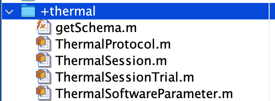
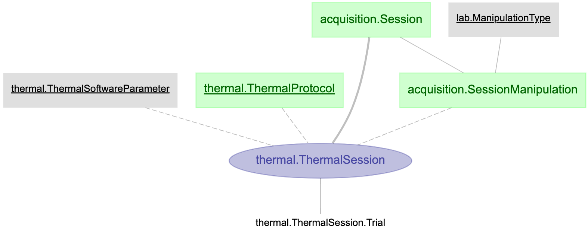
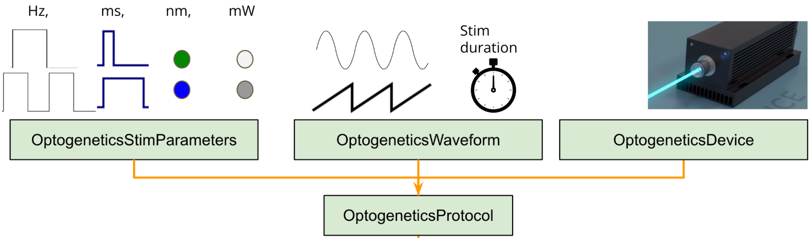
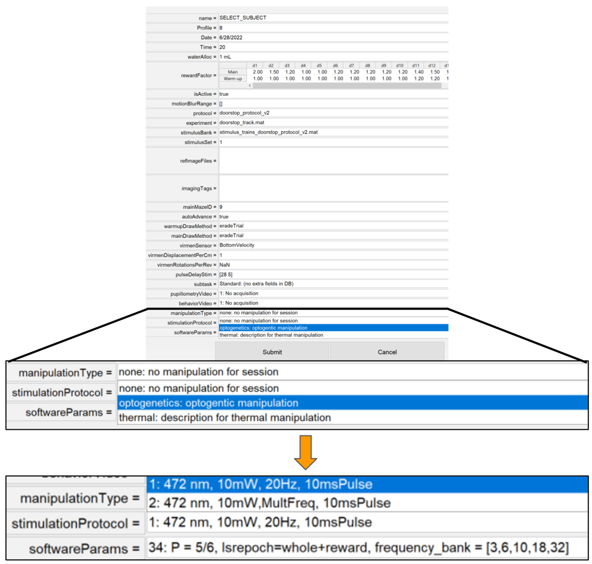

# {{ $frontmatter.title }}

 + This documentation will guide the researcher through the process of creating a new manipulation pipeline.
 + At BRAINCoGS optogenetics and thermal manipulation are currently supported.

## What does the “manipulation” pipeline include:

 + Minimum data framework to store in a DB all relevant data from a specific manipulation.
 + Behavior integration. Training system will include the manipulation as an option to be selected for a behavior session.
 + Generic software parameters to be used in behavior code.

## Prerequisites 

 + In order to create a new manipulation it’s assumed that:
 + The researcher is able to connect to <a href="https://braincogs.github.io/software/db_access.html#db-access-for-matlab-repository">datajoint00.pni.princeton.edu DB</a>
 + Latest version of u19_pipeline_matlab repository.

## Initial set-up 

 + Connect to database ```connect_datajoint00```
 + Create new manipulation schema (substitute manipulation_name with the real name of the manipulation: ```create_new_manipulation_schema('(manipulation_name)', 1)```
 + This will create a new schema “base” code on the `U19-pipeline-matlab/schemas` directory:
 + (We will use “thermal” manipulation for this example).

 <figure>
  
 </figure>

 <figure>
  
  <center><figcaption>Thermal manipulation file creation & Entity-Relationship diagram on the BRAINCoGS DB</figcaption></center>
 </figure>

## Table description

 + Throughout the table description chapter we are going to give an example of an already working manipulation pipeline. (Optogenetics)

 ### "Manipulation" Protocol table
	
  + The protocol table stores related information that defines the current manipulation “type” to be used on a behavior session.
  + Here is the minimum table definition for a manipulation protocol table, it is composed by an id to identify the protocol and a description field.
  
  + Generic **"Manipulation" Protocol.m**
  ```
  %{
  # Defined <manipulation> protocols for training
  <manipulation>_protocol_id     : int AUTO_INCREMENT
  ---
  protocol_description        : varchar(256)                  
  %}
  ```

 ### Adding features to "Manipulation" Protocol table

 + For each manipulation protocol it is possible to add from 0 to n “features” that will define & describe the protocol. We are going to describe all features added for **OptogeneticsProtocol** as an example:

 + It is important to know from an optogenetic experiment what kind of stimulation was given to the subject: Frequency, wavelength, power etc. All these variables can be stored into a “feature” table and be categorized as StimulationParameters.
 + What if stimulation was not a square pulse ? We can create a “feature” table to define (if needed) specific waveforms for a given session. (OptogeneticsWaveform)
 + What if different rooms have different laser systems models ? We can create a “feature” table to store all possible devices to be used in an optogenetic experiment (OptogeneticsDevice).
 + For each of these features we need to create a new table that encompasses the needed information for that feature. We will call all these extra tables a protocol “feature” table.
 + For a guide on how to define DJ tables go to: <a href="https://docs.datajoint.org/matlab/definition/02-Creating-Tables.html">this link</a>.

 <figure>
  
  <center><figcaption>Tables that define an optogenetic protocol for a session.</figcaption></center>
 </figure>

 + For the current guide we will only show OptogeneticsStimulationParameters definition as an example:

 ### OptogeneticsStimulationParameters.m:
 ```
  %{
  # Parameters related to laser stimulation
  stim_parameter_set_id       : int AUTO_INCREMENT  # 
  ---
  stim_parameter_description  : varchar(256)        #
  stim_wavelength             : decimal(5,1)        # (nm)
  stim_power                  : decimal(4,1)        # (mW)
  stim_frequency              : decimal(6,2)        # (Hz)
  stim_pulse_width            : decimal(5,1)        # (ms)
  %}
  
  classdef OptogeneticStimulationParameter < dj.Lookup
    properties
    end
  end
  ```

 + Fields needed for a protocol “feature” table:

+ **id field:** as an int AUTO_INCREMENT type as the only primary key  (e.g. stim_parameter_set_id).
+ **extra_fields:** Any other field that helps to define the feature. 
+ After all feature tables are defined they should be added to the "Manipulation" Protocol table.

+ For our Optogenetics example:
 ```
 % Declare new "feature" table
 optogenetics.OptogeneticsStimulationParameters
 % Add the feature -> protocol table
 add_feature_key_protocol_table(optogenetics.OptogeneticsProtocol, ... optogenetics.OptogeneticsStimulationParameters)
 % Sync definition from DB to .m file
 syncDef(optogenetics.OptogeneticsProtocol);
 % clear previous connection and connect again
 clear all
 connect_datajoint00
 ```

+ After the “features” tables are added to the "Manipulation" Protocol table we are ready to add protocols to be “ready” and selectable for a behavior session:

```
 % Insert stim parameter record
 stim_parameter_rec.stim_parameter_description = 'cool stims'
 stim_parameter_rec.stim_wavelength = 473
 stim_parameter_rec.stim_power = 10                
 stim_parameter_rec.stim_frequency = 100        
 stim_parameter_rec.stim_pulse_width = 1
 insert(optogenetics.OptogeneticsStimulationParameters, stim_parameter_rec)  

 % get last inserted stim_id
 stim_id = fetch(optogenetics.OptogeneticsStimulationParameters, 'ORDER BY stim_parameter_set_id desc LIMIT 1');

 % or look for a previously inserted parameter
 all_stim_params = fetch(optogenetics.OptogeneticsStimulationParameters, '*')
 stim_id = 1;

 % Insert new protocol with new stimulation parameter
 new_protocol.protocol_description = 'this_is_new_protocol'
 new_protocol.stim_parameter_set_id = stim_id;
 insert(optogenetics.OptogeneticsProtocol, new_protocol)
```  

### "Manipulation" SoftwareParameters table

 + The software parameters table stores a set of parameters (a matlab struct, a python dictionary) that the code that handles the behavior will use during the session.
 + We will show how to insert new software parameters:
 + This for the **optogenetics.OptogeneticSoftwareParameter** table

 ```
 param_struct = struct();
 param_struct.software_parameter_description =  'stimulation_sequence # 1';
  
 % All parameters goes in here 
 %(P_on and lsrepoch are the common and needed for current opto experiments)
 param_struct.software_parameters.P_on      = 0.21;
 param_struct.software_parameters.lsrepoch  = 'cue';
   
 %Insert parameter
 software_param_id = try_insert(optogenetics.OptogeneticSoftwareParameter, param_struct)
 ```
 
 + Check <a href="https://github.com/BrainCOGS/U19-pipeline-matlab/blob/master/scripts/insert_software_parameters/insert_optogenetic_software_parameter.m">insert_optogenetic_software_parameter</a> script to use as example.
 + How to read software parameters on experiment code (ViRMEn)
 + Example to get software parameters on the initializatonCodeFun on virmen:

 ```
 function vr = initializationCodeFun(vr)
 
 vr.software_params     = vr.exper.userdata.trainee.softwareParams.software_parameters;
 vr.lsrepoch = vr.software_params.lsrepoch;
 vr.P_on = vr.software_params.P_on;
 ```

### "Manipulation" Session table

 + This table stores manipulation data for a specific behavior session. This table “links” a manipulationProtocol & manipulationSoftwareParameters with a behavior Session.
 + This table does not need any additional code on it. (Unless extra fields from the behavior file are needed to be stored). **Researcher should contact DB designer if that is their intention**

 ```
 OptogeneticSession.m 
 %{
 # Information of a optogenetic session
 -> acquisition.Session
 ---
 -> acquisition.SessionManipulation
 -> optogenetics.OptogeneticProtocol
 -> optogenetics.OptogeneticSoftwareParameter
 %}
 ```

### "Manipulation" SessionTrial table

+ This table stores data, on a trial by trial basis, corresponding to the manipulation performed during the behavior session.
+ There is a section on any  "Manipulation" SessionTrial class on the get_manipulation_trial_data function code where researcher has to add lines to fetch specific trial manipulation data:

Code extract  from **OptogeneticSessionTrial** table

```
function trial_structure = get_manipulation_trials_data(~,session_key, log)
.
.
for itrial = 1:nTrials

  curr_trial = log.block(iBlock).trial(itrial);                            
  trial_data = session_key;
  trial_data.stim_on           = curr_trial.lsrON;
  trial_data.t_stim_on  = time_trial(curr_trial.iLaserOn);
  trial_data.stim_epoch = num2str(curr_trial.LaserTrialType);
  trial_structure(total_trials) = trial_data;
```

### Training with new manipulation

+ After all code for new manipulation has been set up the researcher will be able to select a specific manipulation type, protocol & software parameters that will be associated with the schedule for a given animal. Subsequent behavior sessions will correspond to that selection.

<figure>
 
 <center><figcaption>Parameter selection (manipulation, protocol & software Parameter) for a training schedule of a subject.</figcaption></center>
</figure>

### Fetching Data

+ After training has occurred all relevant data will be accessible in the corresponding tables of the database.
+ <a href="https://docs.datajoint.org/matlab/queries/03-Fetch.html">Datajoint fetch guide</a> 

```
key = struct('subject_fullname', 'sbolkan_a2a_492', 'session_date', '2022-06-27')
fetch(optogenetics.OptogeneticSessionTrial * optogenetics.OptogeneticSession & key,'*')

ans = 

  363×1 struct array with fields:

    subject_fullname
    session_date
    session_number
    block
    trial_idx
    stim_on
    t_stim_on
    t_stim_off
    stim_epoch
```


 


