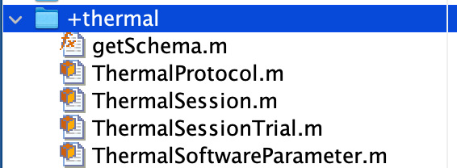
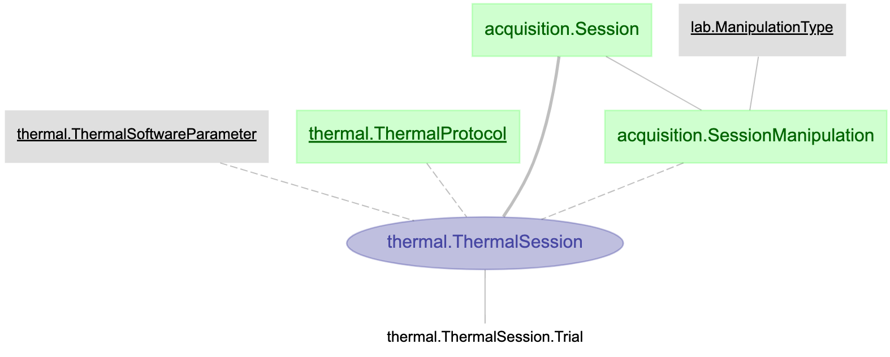
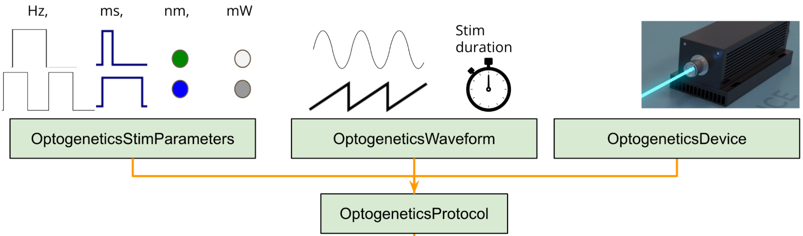
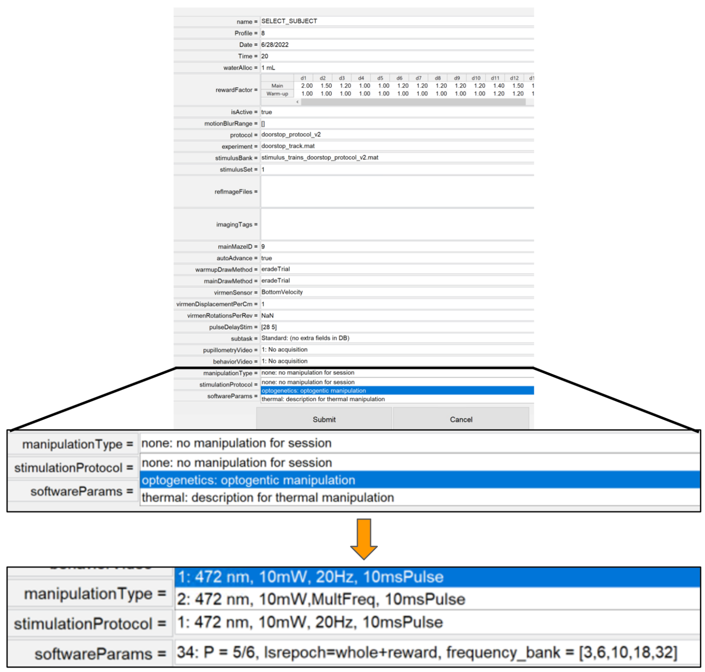

# {{ $frontmatter.title }}

+ This documentation guides the researcher through the process of creating a new manipulation pipeline.
+ At BRAINCoGS, optogenetics and thermal manipulation are currently supported.

## What does the “manipulation” pipeline include:

+ A minimal data framework for storing all relevant data from a specific manipulation in a DB.
+ Behavior integration: the training system includes the manipulation as an option that can be selected for a behavior session.
+ Generic software parameters to be used in behavior code.

## Prerequisites

+ To create a new manipulation, it is assumed that:
+ The researcher can connect to the <a href="https://braincogs.github.io/software/db_access.html#db-access-for-matlab-repository">datajoint00.pni.princeton.edu DB</a>.
+ The latest version of the u19_pipeline_matlab repository is installed.

## Initial set-up

+ Connect to the database: ```connect_datajoint00```
+ Create the new manipulation schema (substitute manipulation_name with the real name of the manipulation): ```create_new_manipulation_schema('(manipulation_name)', 1)```
+ This creates a new schema "base" code in the `U19-pipeline-matlab/schemas` directory.
+ (We will use the “thermal” manipulation for this example.)

 <figure>
  
 </figure>

 <figure>
  
  <center><figcaption>Thermal manipulation file creation & Entity-Relationship diagram on the BRAINCoGS DB</figcaption></center>
 </figure>

## Table description

+ Throughout this table description section, we give an example based on an already working manipulation pipeline (Optogenetics).

### "Manipulation" Protocol table

  + The Protocol table stores information that defines the current manipulation “type” to be used in a behavior session.
  + Below is the minimum table definition for a manipulation protocol table. It is made up of an id to identify the protocol and a description field.

  + Generic **"Manipulation" Protocol.m**
  ```matlab
  %{
  # Defined <manipulation> protocols for training
  <manipulation>_protocol_id     : int AUTO_INCREMENT
  ---
  protocol_description        : varchar(256)                  
  %}
  ```

### Adding features to "Manipulation" Protocol table

+ For each manipulation protocol, you can add from 0 to n “features” that define and describe the protocol. As an example, we describe all the features added for **OptogeneticsProtocol**:

+ For an optogenetic experiment, it is important to know what kind of stimulation was given to the subject: frequency, wavelength, power, etc. All these variables can be stored in a “feature” table and categorized as StimulationParameters.
+ What if the stimulation was not a square pulse? We can create a “feature” table to define specific waveforms for a given session, if needed (OptogeneticsWaveform).
+ What if different rooms have different laser system models? We can create a “feature” table to store all the possible devices used in an optogenetic experiment (OptogeneticsDevice).
+ For each of these features, we need to create a new table that holds the information needed for that feature. We call all these extra tables protocol “feature” tables.
+ For a guide on how to define DJ tables, see <a href="https://docs.datajoint.org/matlab/definition/02-Creating-Tables.html">this link</a>.

 <figure>
  
  <center><figcaption>Tables that define an optogenetic protocol for a session.</figcaption></center>
 </figure>

+ For this guide, we show only the OptogeneticsStimulationParameters definition as an example:

### OptogeneticsStimulationParameters.m:
 ```matlab
  %{
  # Parameters related to laser stimulation
  stim_parameter_set_id       : int AUTO_INCREMENT  # 
  ---
  stim_parameter_description  : varchar(256)        #
  stim_wavelength             : decimal(5,1)        # (nm)
  stim_power                  : decimal(4,1)        # (mW)
  stim_frequency              : decimal(6,2)        # (Hz)
  stim_pulse_width            : decimal(5,1)        # (ms)
  %}
  
  classdef OptogeneticStimulationParameter < dj.Lookup
    properties
    end
  end
  ```

+ Fields needed for a protocol “feature” table:

+ **id field:** An int AUTO_INCREMENT type as the only primary key (e.g. stim_parameter_set_id).
+ **extra_fields:** Any other field that helps define the feature.
+ Once all the feature tables are defined, they should be added to the "Manipulation" Protocol table.

+ For our Optogenetics example:
 ```matlab
 % Declare new "feature" table
 optogenetics.OptogeneticsStimulationParameters
 % Add the feature -> protocol table
 add_feature_key_protocol_table(optogenetics.OptogeneticsProtocol, ... optogenetics.OptogeneticsStimulationParameters)
 % Sync definition from DB to .m file
 syncDef(optogenetics.OptogeneticsProtocol);
 % clear previous connection and connect again
 clear all
 connect_datajoint00
 ```

+ Once the “feature” tables are added to the "Manipulation" Protocol table, we are ready to add protocols so they are “ready” and selectable for a behavior session:

```matlab
 % Insert stim parameter record
 stim_parameter_rec.stim_parameter_description = 'cool stims'
 stim_parameter_rec.stim_wavelength = 473
 stim_parameter_rec.stim_power = 10                
 stim_parameter_rec.stim_frequency = 100        
 stim_parameter_rec.stim_pulse_width = 1
 insert(optogenetics.OptogeneticsStimulationParameters, stim_parameter_rec)  

 % get last inserted stim_id
 stim_id = fetch(optogenetics.OptogeneticsStimulationParameters, 'ORDER BY stim_parameter_set_id desc LIMIT 1');

 % or look for a previously inserted parameter
 all_stim_params = fetch(optogenetics.OptogeneticsStimulationParameters, '*')
 stim_id = 1;

 % Insert new protocol with new stimulation parameter
 new_protocol.protocol_description = 'this_is_new_protocol'
 new_protocol.stim_parameter_set_id = stim_id;
 insert(optogenetics.OptogeneticsProtocol, new_protocol)
```  

### "Manipulation" SoftwareParameters table

+ The SoftwareParameters table stores a set of parameters (a MATLAB struct or a Python dictionary) that the code handling the behavior uses during the session.
+ We will show how to insert new software parameters.
+ This is for the **optogenetics.OptogeneticSoftwareParameter** table.

 ```matlab
 param_struct = struct();
 param_struct.software_parameter_description =  'stimulation_sequence # 1';
  
 % All parameters goes in here 
 %(P_on and lsrepoch are the common and needed for current opto experiments)
 param_struct.software_parameters.P_on      = 0.21;
 param_struct.software_parameters.lsrepoch  = 'cue';
   
 %Insert parameter
 software_param_id = try_insert(optogenetics.OptogeneticSoftwareParameter, param_struct)
 ```

+ See the <a href="https://github.com/BrainCOGS/U19-pipeline-matlab/blob/master/scripts/insert_software_parameters/insert_optogenetic_software_parameter.m">insert_optogenetic_software_parameter</a> script to use as an example.
+ How to read software parameters in the experiment code (ViRMEn):
+ Example to get the software parameters in the initializationCodeFun in ViRMEn:

 ```
 function vr = initializationCodeFun(vr)
 
 vr.software_params     = vr.exper.userdata.trainee.softwareParams.software_parameters;
 vr.lsrepoch = vr.software_params.lsrepoch;
 vr.P_on = vr.software_params.P_on;
 ```

### "Manipulation" Session table

+ This table stores manipulation data for a specific behavior session. It “links” a manipulationProtocol and manipulationSoftwareParameters with a behavior Session.
+ This table does not need any additional code (unless extra fields from the behavior file need to be stored). **The researcher should contact the DB designer if that is their intention.**

 ```matlab
 OptogeneticSession.m 
 %{
 # Information of a optogenetic session
 -> acquisition.Session
 ---
 -> acquisition.SessionManipulation
 -> optogenetics.OptogeneticProtocol
 -> optogenetics.OptogeneticSoftwareParameter
 %}
 ```

### "Manipulation" SessionTrial table

+ This table stores data, on a trial-by-trial basis, corresponding to the manipulation performed during the behavior session.
+ In any "Manipulation" SessionTrial class, there is a section in the get_manipulation_trial_data function code where the researcher has to add lines to fetch specific trial manipulation data:

Code extract from the **OptogeneticSessionTrial** table:

```matlab
function trial_structure = get_manipulation_trials_data(~,session_key, log)
.
.
for itrial = 1:nTrials

  curr_trial = log.block(iBlock).trial(itrial);                            
  trial_data = session_key;
  trial_data.stim_on           = curr_trial.lsrON;
  trial_data.t_stim_on  = time_trial(curr_trial.iLaserOn);
  trial_data.stim_epoch = num2str(curr_trial.LaserTrialType);
  trial_structure(total_trials) = trial_data;
```

### Training with new manipulation

+ Once all the code for the new manipulation has been set up, the researcher can select a specific manipulation type, protocol, and software parameters to associate with the schedule for a given animal. Subsequent behavior sessions will correspond to that selection.

<figure>
 
 <center><figcaption>Parameter selection (manipulation, protocol & software Parameter) for a training schedule of a subject.</figcaption></center>
</figure>

### Fetching Data

+ After training, all relevant data is accessible in the corresponding tables of the database.
+ <a href="https://docs.datajoint.org/matlab/queries/03-Fetch.html">Datajoint fetch guide</a>

```matlab
key = struct('subject_fullname', 'sbolkan_a2a_492', 'session_date', '2022-06-27')
fetch(optogenetics.OptogeneticSessionTrial * optogenetics.OptogeneticSession & key,'*')

ans = 

  363×1 struct array with fields:

    subject_fullname
    session_date
    session_number
    block
    trial_idx
    stim_on
    t_stim_on
    t_stim_off
    stim_epoch
```
