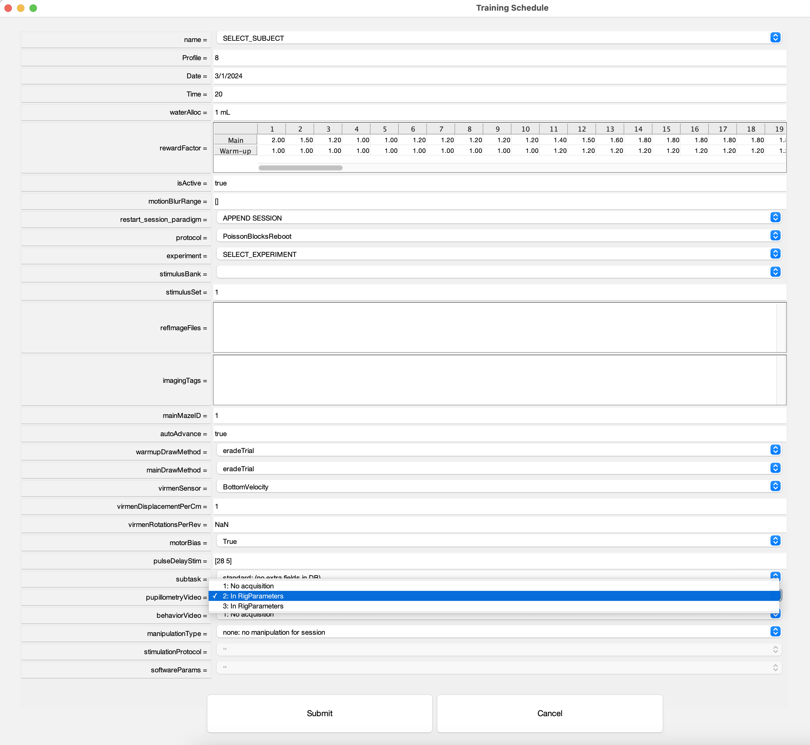
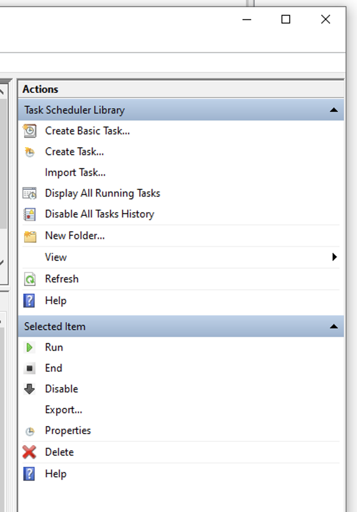
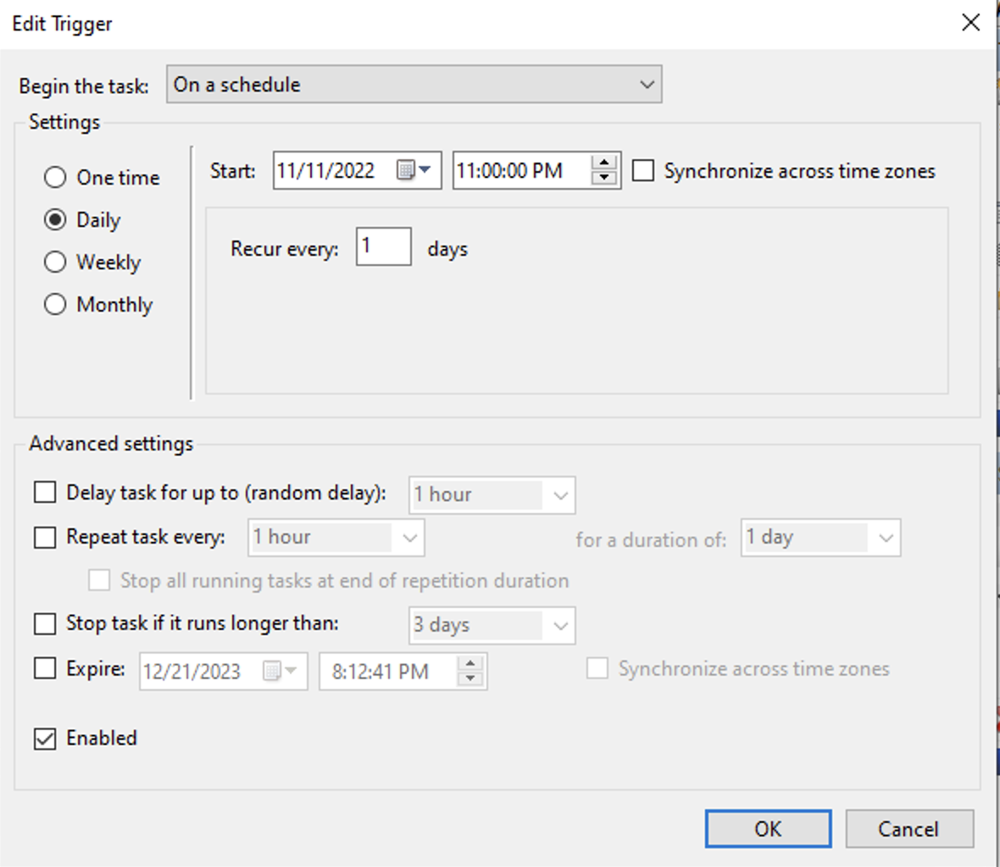
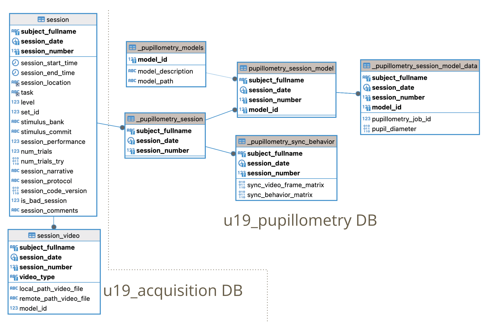
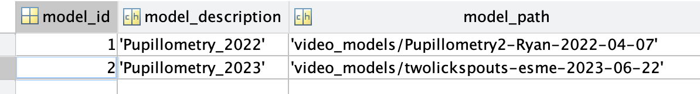

# {{ $frontmatter.title }}

 + This documentation will guide the researcher through the process of register, monitor & review pupillometry data.

## Instructions to Set up Pupillometry Pipeline on a Rig Machine

1. Ask your lab manager for helo to set up a camera in the rig.
2. If needed, add these parameters in **RigParameters.m** 

```
%% Pupilometry video parameters
video_parent_path               =   'E:/VideoData'
video_ext                       =   '.mj2'
video_acquisition_rate          =   30
video_record                    =   true
video_gain                      =   8
preview                         =   true
```    

3. In Tranining GUI subject task selection menu, under `PupillometryVideo` select `2. In RigParameters`:

 <figure>
  
  <center><figcaption>Training GUI for pupillometry</figcaption></center>
 </figure>
 
 4. In Experiment file add the following lines in `initializationcodeFun` function (just after `vr = initializeGradedExperiment(vr);` line):

```
% Start video acquisition
if ~isempty(vr.trainee.pupillometryVideo) && vr.trainee.pupillometryVideo ~= 1
    vr = startVideoAcquisition(vr);
end
```

5. In Experiment file add the following lines in `runtimeCodeFun` function (just after `catch err displayException(err);` line):

```
% Stop video acquisition
if ~isempty(vr.trainee.pupillometryVideo) && vr.trainee.pupillometryVideo ~= 1
        vr = stopVideoAcquisition(vr);
end
```

6. In Experiment file add the following lines in `terminationCodeFun` function (the very first line):

```
% Stop video acquisition
if ~isempty(vr.trainee.pupillometryVideo) && vr.trainee.pupillometryVideo ~= 1
        vr = stopVideoAcquisition(vr);
end
```

 ### Pupillometry backup videos task schedule
 
 1. On Windows type **"Task Scheduler"**
 2. Open **Task Scheduler** "App"
 3. On right hand side menu, click on **"Create Task"** Action

 <figure>
  
  <center><figcaption>Task scheduler menu</figcaption></center>
 </figure>

 4. Name new task as **video_backup**
 5. Add a trigger to run task daily at 11:30 pm

 <figure>
  
  <center><figcaption>Task scheduler Trigger Tab</figcaption></center>
 </figure>

 6. Add an action: add this line to the Program/script edit: `C:\Experiments\U19-pipeline-matlab\scripts\cmd_copy_video_files`
 7. Hit **OK** button


## Pupillometry DB and data organization

+ Raw data (video files) are located in: `\\cup.pni.princeton.
  edu\braininit\Data\Raw\video_pupillometry\(userid)\(subjectfullname)\(session_date)_g(session_number)\(video_file)`

+ Processed data (h5 files) are located in: `\\cup.pni.princeton.
  edu\braininit\Data\Processed\video_pupillometry\(userid)\(subjectfullname)\(session_date)_g(session_number)\(h5_file)`

+ Video models are located in: `\\cup.pni.princeton.
  edu\braininit\Data\Raw\video_models\(video_model_directory)`

+ Check <a href="https://braincogs.github.io/software/db_organization.html#_9-u19-pupillometry"> DB Organization (pupillometry) </a> for a description for each pupillometry table.

 <figure>
  
  <center><figcaption>Pupillometry pipeline DB schema</figcaption></center>
 </figure>

## Steps executed in Pupillometry pipeline

  1. When `pupillometry_video -> 2. In RigParameters ` is selected in training GUI a new `session_video` record is registered in the DB while ingesting Session. (<a href="https://github.com/BrainCOGS/U19-pipeline-matlab/blob/master/schemas/%2Bacquisition/Session.m#L135">Code here</a>)

  2. The `cmd_copy_video_files` task scheduler takes `session_video` records and store new videos in this location: `\\cup.pni.princeton.
  edu\braininit\Data\Raw\video_pupillometry\(userid)\(subjectfullname)\(session_date)_g(session_number)\(video_file)`. <a href="https://github.com/BrainCOGS/U19-pipeline-matlab/blob/master/scripts/cmd_copy_behavior_files.BAT">Script run by pupillometry backup videos task schedule</a> 
  
  3. During night cronjob: if video is found on cup location:

   + Populate `pupillometry_session` table
   + Execute sync behavior code for video. <a href="https://github.com/BrainCOGS/U19-pipeline-matlab/blob/master/schemas/%2Bpupillometry/PupillometrySyncBehavior.m"> Code here</a>.
   + Register default model to process video in ` pupillometry_session_model` and `pupillometry_session_model_data`.

 4. Queue/Checks job in `spockvm2`

   + Similar to ephys/imaging automation pipeline, pupillometry pipeline has a main (more simple) class to process all pupillometry jobs called `PupillometryProcessingHandler`. This class is located <a href="https://github.com/BrainCOGS/U19-pipeline_python/blob/master/u19_pipeline/automatic_job/pupillometry_handler.py"> here </a>.


   + Execute <a href="https://github.com/BrainCOGS/U19-pipeline_python/blob/master/u19_pipeline/automatic_job/call_pupillometry_queue_jobs.sh">pupillometry_queue_jobs script</a>. This scripts calls `PupillometryProcessingHandler.check_pupillometry_sessions_queue` function. Queues a processing job to all sessions where a model was registered. 
   + Execute <a href="https://github.com/BrainCOGS/U19-pipeline_python/blob/master/u19_pipeline/automatic_job/call_pupillometry_check_jobs.sh">pupillometry_check_jobs script</a>. This scripts calls `PupillometryProcessingHandler.check_processed_pupillometry_sessions` function. If processing job is finished get final result (pupil_diameter) and stores it in  `pupillometry_session_model_data` table.

## Monitor pupillometry processing sessions

+ A few MATLAB functions were built to check how pupillometry jobs are doing:

+ Get processed data from a session:
```
key = struct('subject_fullname', 'efonseca_ef317_act116', 'session_date', '2024-02-21')
pupillometry_data = fetch(pupillometry.PupillometrySessionModelData * pupillometry.PupillometrySyncBehavior & key, '*')
pupillometry_data = 

  struct with fields:

           subject_fullname: 'efonseca_ef317_act116'
               session_date: '2024-02-21'
             session_number: 0
                   model_id: 2
        pupillometry_job_id: 2984
             pupil_diameter: [108177×1 double]
    sync_video_frame_matrix: [108177×4 single]
       sync_behavior_matrix: [150227×5 single]
```
**pupil_diameter**: Pupil diameter for each video frame.\
**sync_video_frame_matrix**: Time & Block/Trial/Iteration for each video frame.\
**sync_behavior_matrix**: Time & video frame for each Block/Trial/Iteration.

+ Restart processing for failed processing
Sometimes processing fails for external factors (processing system was down, model was not properly selected, etc). As a first attempt to solve the issue a restart processing function was created:
```
psmd = pupillometry.PupillometrySessionModelData()
key = struct('subject_fullname', 'efonseca_ef317_act116', 'session_date', '2024-02-21')
psmd.restart_pupillometry_failed_job(key)
```
If processing fails again, contact Software Developer and check `#automation_pipeline_errors` slack channel for more information about the error.    

+ Check status for all sessions:
```
psmd = pupillometry.PupillometrySessionModelData()
all_sessions_table = psmd.check_status_pupillometry_jobs()
```    

+ Check status for a specific session(s):
```
psmd = pupillometry.PupillometrySessionModelData()
key = struct('subject_fullname', 'efonseca_ef317_act116', 'session_date', '2024-02-21')
session_status = psmd.check_status_pupillometry_jobs(key)
```    

+ Get all succesfully processed sessions:
```
psmd = pupillometry.PupillometrySessionModelData()
pupillometry_finished_sessions = psmd.get_finished_jobs_pupillometry()
```    

## Add a new video model to the pipeline

1. Check <a href="https://deeplabcut.github.io/DeepLabCut/README.html">Deeplabcut documentation</a> for step by step guide.

2. Ask for tips and tricks to our BRAINCoGS personnel that have created video models in the past:
  + Joshua Julian (jjulian@princeton.edu)
  +  Juan Lopez (juanlopez@princeton.edu)

3. After video model has been created, copy the main directory of the model to this location: `\\cup.pni.princeton.
  edu\braininit\Data\Raw\video_models\(video_model_directory)`

4. Add model to the DB (u19_pupillometry.PupillometryModels table):
 + MATLAB code:

```
new_model_key = struct()
new_model_key.model_description = 'New model to insert'
new_model_key.model_path = 'video_models/new_model_directory_name'
insert(pupillometry.PupillometryModels,new_model_key)
```
+ Always add `video_models/` to the model_path, `before model_directory_name`.

5. Get `model_id` of model you want to use for your sessions:

```
>> pupillometry.PupillometryModels

ans = 
Object pupillometry.PupillometryModels
 :: Table to store reference for each model ::
    MODEL_ID      model_description                        model_path                  
    ________    _____________________    ______________________________________________

       1        {'Pupillometry_2022'}    {'video_models/Pupillometry2-Ryan-2022-04-07'}
       2        {'Pupillometry_2023'}    {'video_models/twolickspouts-esme-2023-06-22'}
```

`fetch(pupillometry.PupillometryModels,'*')`

 <figure>
  
  <center><figcaption>Pupillometry model_id selection</figcaption></center>
 </figure>

6. Insert into `u19_pupillometry.PupillometrySessionModel` sessions to be processed with the new model:

```
key = struct('subject_fullname', 'efonseca_ef317_act116', 'session_date', '2024-02-21')
key.model_id = 2
insert(pupillometry.PupillometrySessionModel, key, 'IGNORE');
```

7. Sessions will be processed with new model overnight.

### **Note: All pupillometry sessions are processed with a default model (model_id = 2, Pupillometry_2023).**
### **In the future we plan a way to select model for subjects and or rigs instead of being processed with default model.**


## Review processed data

