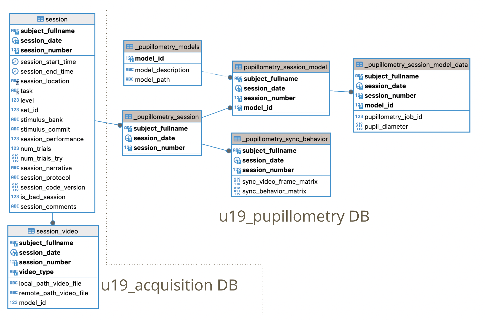
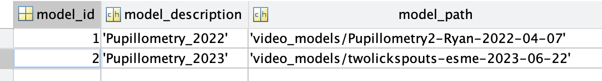

# {{ $frontmatter.title }}

+ This guide walks researchers through registering, monitoring and reviewing pupillometry data.

## Set up the pupillometry pipeline on a rig computer {#instructions-to-set-up-pupillometry-pipeline-on-a-rig-machine}

1. Ask your lab manager for help setting up a camera on the rig.
2. If needed, add these parameters to **RigParameters.m**:

```matlab
%% Pupilometry video parameters
video_parent_path               =   'E:/VideoData'
video_ext                       =   '.mj2'
video_acquisition_rate          =   30
video_gain                      =   8
preview                         =   true
```
- The **RigParameters.m** parameter that controls video acquisition for the next session is **video_record**. If it is set to true, the pupillometry session will be registered.

```matlab
video_record                    =   true
```

3. In the experiment file, add the following lines to the `initializationCodeFun` function (just after the `vr = initializeGradedExperiment(vr);` line):

```matlab
% Start video acquisition
if RigParameters.hasDAQ && isprop(RigParameters, 'video_record') && RigParameters.video_record
    vr = startVideoAcquisition(vr);
end
```


4. In the experiment file, add the following lines to the `runtimeCodeFun` function (just after the `catch err displayException(err);` line):

```matlab
% Stop video acquisition
if RigParameters.hasDAQ && isprop(RigParameters, 'video_record') && RigParameters.video_record
    vr = stopVideoAcquisition(vr);
end
```

5. In the experiment file, add the following lines at the very start of the `terminationCodeFun` function:

```matlab
% Stop video acquisition
if RigParameters.hasDAQ && isprop(RigParameters, 'video_record') && RigParameters.video_record
    vr = stopVideoAcquisition(vr);
end
```

## Pupillometry DB and data organization

+ Raw data (video files) is stored in: `\\cup.pni.princeton.edu\braininit\Data\Raw\video_pupillometry\(userid)\(subjectfullname)\(session_date)_g(session_number)\(video_file)`

+ Processed data (HDF5 files) is stored in: `\\cup.pni.princeton.edu\braininit\Data\Processed\video_pupillometry\(userid)\(subjectfullname)\(session_date)_g(session_number)\(h5_file)`

+ Video models are stored in: `\\cup.pni.princeton.edu\braininit\Data\Raw\video_models\(video_model_directory)`

+ See <a href="/software/db_organization.html#_9-u19-pupillometry">DB organization (pupillometry)</a> for a description of each pupillometry table.

 

## Pupillometry pipeline steps {#steps-executed-in-pupillometry-pipeline}

  1. When `pupillometry_video -> 2. In RigParameters` is selected in the training GUI, a new `session_video` record is registered in the DB when the session is ingested (<a href="https://github.com/BrainCOGS/U19-pipeline-matlab/blob/master/schemas/%2Bacquisition/Session.m#L135">code here</a>).

  2. The `cmd_copy_video_files` scheduled task reads the `session_video` records and copies the new videos to: `\\cup.pni.princeton.edu\braininit\Data\Raw\video_pupillometry\(userid)\(subjectfullname)\(session_date)_g(session_number)\(video_file)`. (<a href="https://github.com/BrainCOGS/U19-pipeline-matlab/blob/master/scripts/cmd_copy_behavior_files.BAT">script run by the video backup scheduled task</a>)

  3. During the nightly cron job, if the video is found on cup:

   + Populate the `pupillometry_session` table.
   + Run the behavior sync code for the video (<a href="https://github.com/BrainCOGS/U19-pipeline-matlab/blob/master/schemas/%2Bpupillometry/PupillometrySyncBehavior.m">code here</a>).
   + Register the default model to process the video in `pupillometry_session_model` and `pupillometry_session_model_data`.

  4. Queue and check the job on `spockvm2`:

   + Similar to the ephys/imaging automation pipeline, the pupillometry pipeline has a main (simpler) class to process all pupillometry jobs, called `PupillometryProcessingHandler`. This class is <a href="https://github.com/BrainCOGS/U19-pipeline-python/blob/master/u19_pipeline/automatic_job/pupillometry_handler.py">here</a>.
   + Execute the <a href="https://github.com/BrainCOGS/U19-pipeline-python/blob/master/u19_pipeline/automatic_job/call_pupillometry_queue_jobs.sh">pupillometry_queue_jobs script</a>. This script calls the `PupillometryProcessingHandler.check_pupillometry_sessions_queue` function. It queues a processing job for every session with a registered model.
   + Execute the <a href="https://github.com/BrainCOGS/U19-pipeline-python/blob/master/u19_pipeline/automatic_job/call_pupillometry_check_jobs.sh">pupillometry_check_jobs script</a>. This script calls the `PupillometryProcessingHandler.check_processed_pupillometry_sessions` function. When a processing job has finished, it retrieves the final result (`pupil_diameter`) and stores it in the `pupillometry_session_model_data` table.

## Monitor pupillometry processing sessions

+ A few MATLAB functions let you check on pupillometry jobs:

+ Get processed data from a session:
```matlab
key = struct('subject_fullname', 'efonseca_ef317_act116', 'session_date', '2024-02-21')
pupillometry_data = fetch(pupillometry.PupillometrySessionModelData * pupillometry.PupillometrySyncBehavior & key, '*')
pupillometry_data =

  struct with fields:

           subject_fullname: 'efonseca_ef317_act116'
               session_date: '2024-02-21'
             session_number: 0
                   model_id: 2
        pupillometry_job_id: 2984
             pupil_diameter: [108177×1 double]
    sync_video_frame_matrix: [108177×4 single]
       sync_behavior_matrix: [150227×5 single]
```
**pupil_diameter**: Pupil diameter for each video frame.\
**sync_video_frame_matrix**: Time & block/trial/iteration for each video frame.\
**sync_behavior_matrix**: Time & video frame for each block/trial/iteration.

+ Restart processing for a failed job:
Processing sometimes fails because of external factors (the processing system was down, the model was not selected properly, etc.). As a first attempt to fix it, use the restart function:
```matlab
psmd = pupillometry.PupillometrySessionModelData()
key = struct('subject_fullname', 'efonseca_ef317_act116', 'session_date', '2024-02-21')
psmd.restart_pupillometry_failed_job(key)
```
If processing fails again, contact the software developer and check the `#automation_pipeline_errors` Slack channel for details about the error.

+ Check the status for all sessions:
```matlab
psmd = pupillometry.PupillometrySessionModelData()
all_sessions_table = psmd.check_status_pupillometry_jobs()
```  

+ Check the status for a specific session (or sessions):
```matlab
psmd = pupillometry.PupillometrySessionModelData()
key = struct('subject_fullname', 'efonseca_ef317_act116', 'session_date', '2024-02-21')
session_status = psmd.check_status_pupillometry_jobs(key)
```  

+ Get all successfully processed sessions:
```matlab
psmd = pupillometry.PupillometrySessionModelData()
pupillometry_finished_sessions = psmd.get_finished_jobs_pupillometry()
```  

## Add a new video model to the pipeline

1. See the <a href="https://deeplabcut.github.io/DeepLabCut/README.html">DeepLabCut documentation</a> for a step-by-step guide.

2. Ask BRAIN CoGS staff who have created video models before for tips and tricks:
  + Joshua Julian (jjulian@princeton.edu)
  + Juan Lopez (juanlopez@princeton.edu)

3. After the video model has been created, copy the model's main directory to this location: `\\cup.pni.princeton.edu\braininit\Data\Raw\video_models\(video_model_directory)`

4. Add the model to the DB (u19_pupillometry.PupillometryModels table):
 + MATLAB code:

```matlab
new_model_key = struct()
new_model_key.model_description = 'New model to insert'
new_model_key.model_path = 'video_models/new_model_directory_name'
insert(pupillometry.PupillometryModels,new_model_key)
```
+ Always prefix `model_path` with `video_models/` (i.e. `video_models/<model_directory_name>`).

5. Get the `model_id` of the model you want to use for your sessions:

```matlab
>> pupillometry.PupillometryModels

ans =
Object pupillometry.PupillometryModels
 :: Table to store reference for each model ::
    MODEL_ID      model_description                        model_path  
    ________    _____________________    ______________________________________________

       1        {'Pupillometry_2022'}    {'video_models/Pupillometry2-Ryan-2022-04-07'}
       2        {'Pupillometry_2023'}    {'video_models/twolickspouts-esme-2023-06-22'}
```

`fetch(pupillometry.PupillometryModels,'*')`

 

6. Insert the sessions to be processed with the new model into `u19_pupillometry.PupillometrySessionModel`:

```matlab
key = struct('subject_fullname', 'efonseca_ef317_act116', 'session_date', '2024-02-21')
key.model_id = 2
insert(pupillometry.PupillometrySessionModel, key, 'IGNORE');
```

7. The sessions will be processed with the new model overnight.

::: tip Note
All pupillometry sessions are processed with a default model (`model_id = 2`, Pupillometry_2023). In the future, we plan to add a way to select the model per subject and/or rig instead of always using the default model.
:::
