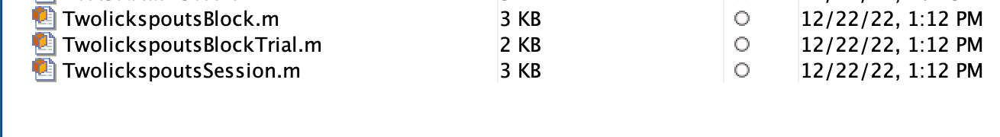
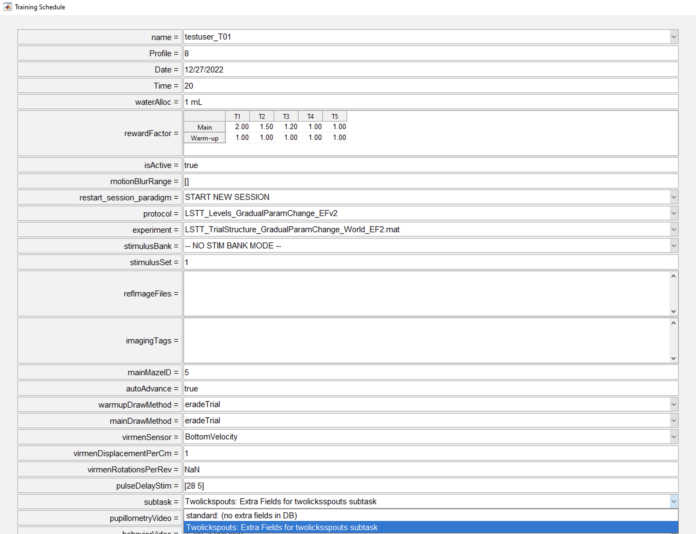

# {{ $frontmatter.title }}

+ This documentation guides the researcher through the process of creating a new subtask pipeline.
+ Currently in BRAINCoGS, data from our well-known "VR Towers Task" is stored in the DB.
+ New behavior paradigms include new variables that were not part of our original design:
  + Context task
  + Doorstop task
  + Movie/Stationary task
+ As a result, only a subset of the entire data is stored in the DB.
+ The subtask pipeline was created to solve this problem. Its goal is to store specific subtask variables in a separate subset of tables in the DB.

## What does the “subtask” pipeline include:

+ A minimal data framework for storing all relevant data from "VR Towers Task" variants in a DB.
+ Behavior integration: the training system includes the subtask as an option that can be selected for a behavior session.

## Prerequisites

+ To create a new subtask, it is assumed that:
+ The researcher can connect to the <a href="https://braincogs.github.io/software/db_access.html#db-access-for-matlab-repository">datajoint00.pni.princeton.edu DB</a>.
+ The latest version of the u19_pipeline_matlab repository is installed.

## Initial set-up

+ Connect to the database: ```connect_datajoint00```
+ Create the new subtask base code (substitute subtask_name with the real name of the subtask): ```create_new_subtask_classes('(subtask_name)')```
+ This creates the table code templates for the subtask — **(Subtask)Session.m, (Subtask)Block.m & (Subtask)Trial.m** — in the `U19-pipeline-matlab/schemas/+behavior_subtask` directory.
+ (We will use the **"Twolickspouts" subtask** for this example.)

 <figure>
  
  <center><figcaption>Files created for Twolickspouts subtask on U19-pipeline-matlab/schemas/+behavior_subtask directory</figcaption></center>
 </figure>

## Table description

+ Throughout this table description section, we give an example based on an already working subtask pipeline (Twolickspouts).

### task.Subtask table

+ This table registers all subtasks created with this pipeline.

### acquisition.SessionSubtask table

+ This table stores the subtask record for a specific behavior session. It "links" the task.Subtask table with the acquisition.Session table.

### "Subtask" Session table

+ The Session table stores information related to the entire session (see acquisition.Session for a related example).

### "Subtask" Block table

+ The Block table stores information related to each block of the session (see behavior.TowersBlock for a related example).

### "Subtask" BlockTrial table

+ The BlockTrial table stores information related to each trial of the session (see behavior.TowersBlockTrial for a related example).

## Adding code to "Subtask" tables

+ For each subtask, you can add all the needed variables from the behavior file to the "Subtask" tables.
+ Example for the **"Twolickspouts" subtask**:

### TwolickspoutsSession table code

 ```matlab
  %{
 # Session level data for a twolickspouts subtask session
 -> acquisition.Session
 ---
 %}
 
 classdef TwolickspoutsSession < dj.Imported
 ```

+ There is no extra field to add at the session level, so no code is added to the file.

### TwolickspoutsBlock table code

 ```matlab
%{
# Block level data for a twolickspouts subtask session
-> behavior_subtask.TwolickspoutsSession
-> acquisition.SessionBlock
---
sublevel                  : int                           # sublevel for the block
trial_params              : blob                          # maze features of current block
%}
 .
 .

 %%%%%%%%%%%%%%%%%%%%%%%%%%%%%%%%%%
 %%%% fill here read corresponding TestSubtask data for each block
 tuple.sublevel = block_data.sublevel;
 tuple.trial_params = block_data.trialParams;
 %%%%%%%%%%%%%%%%%%%%%%%%%%%%%%%%%%
 ```

+ In this example, two fields were added to the TwolickspoutsBlock table (sublevel & trial_params).
+ Two things are needed:
  1. Add them to the table definition (the 1st part of the code block).
  2. Set how these fields are read from the **block_data** variable (search for the **fill here** section in the code). block_data holds all the block data from the behavior file.

### TwolickspoutsBlockTrial table code

 ```matlab
  %{
  # Trial level data for a twolickspouts subtask session
  -> behavior_subtask.TwolickspoutsBlock
  -> acquisition.SessionBlockTrial
  ---
  licks                        : tinyblob                      # all iterations with lick detected and side
  trial_difficult_type         : varchar(16)                   # trial type label (easy, medium, difficult, etc)
  forced_automatic_reward=null : tinyint                       # 1 if reward was forced for trial 0 otherwise
  %}
  .
  .
  %%%%%%%%%%%%%%%%%%%%%%%
  %%%% fill here read corresponding Twolickspouts data for each trial
  trial_data.licks = curr_trial.licks;
  if isfield(curr_trial, 'forced_automatic_reward')
    trial_data.forced_automatic_reward = curr_trial.forced_automatic_reward;
  else
    trial_data.forced_automatic_reward = NaN;
  end
  if isfield(curr_trial, 'trialDifficultyType')
    trial_data.trial_difficult_type = curr_trial.trialDifficultyType;  
  else
    trial_data.trial_difficult_type = '';
  end
  %%%%%%%%%%%%%%%%%%%%%%%%
  ```

+ In this example, three fields were added to the TwolickspoutsBlockTrial table (licks, trial_difficult_type & forced_automatic_reward).
+ Two things are needed:
  1. Add them to the table definition (the 1st part of the code block).
  2. Set how these fields are read from the **trial_data** variable (search for the **fill here** section in the code). trial_data holds all the trial data from the behavior file.

### Create tables

+ Once all the code has been written in the "Subtask"Session, "Subtask"Block & "Subtask"BlockTrial codebase, you need to actually create the tables in the DB.
+ Execute: ```create_new_subtask_tables('(subtask_name)')```

### Training with new subtask

+ Once all the code for the new subtask has been set up and the tables have been created, the researcher can select a specific subtask to associate with the schedule for a given animal. Subsequent behavior sessions will correspond to that selection.

 <figure>
  
  <center><figcaption>Subtask selection for a training schedule of a subject.</figcaption></center>
 </figure>

### Fetching Data

+ After training, all relevant data is accessible in the corresponding tables in the behavior_subtask DB.
+ <a href="https://docs.datajoint.org/matlab/queries/03-Fetch.html">Datajoint fetch guide</a>
+ Example to fetch all Twolickspouts data for a single session:

```matlab
key = struct('subject_fullname', 'testuser_T01', 'session_date', '2022-12-27')
fetch(behavior_subtask.TwolickspoutsSession * behavior_subtask.TwolickspoutsBlock ...
* behavior_subtask.TwolickspoutsBlockTrial & key, '*')

ans = 

  5×1 struct array with fields:

    subject_fullname
    session_date
    session_number
    subtask
    block
    trial_idx
    sublevel
    trial_params
    licks
    trial_difficult_type
    forced_automatic_reward
```
