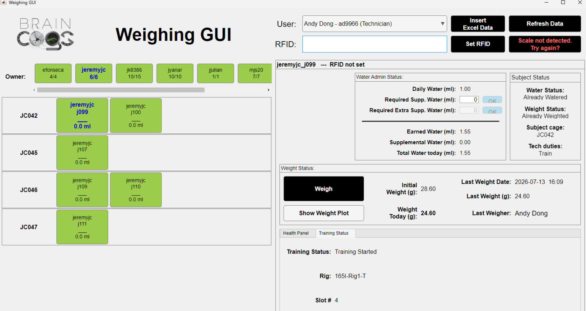
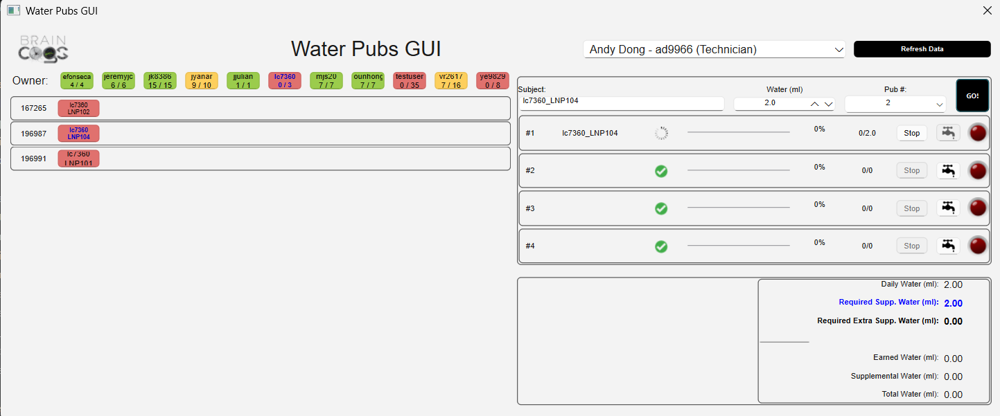
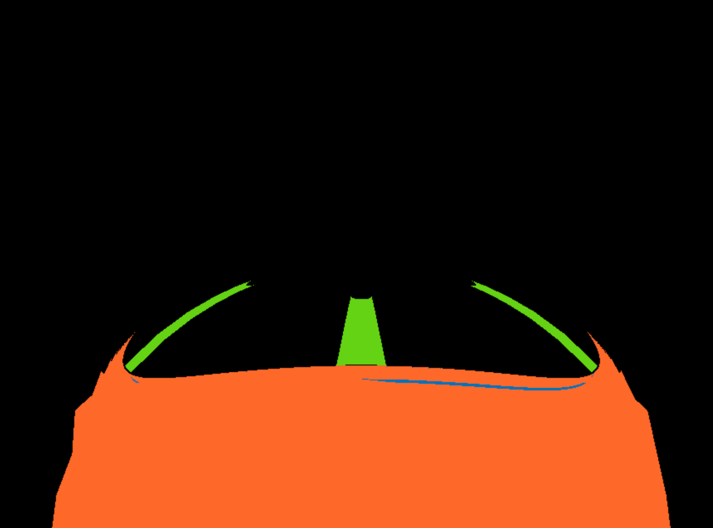

# {{ $frontmatter.title }}

+ This documentation helps the BRAINCoGS Software Developer maintain and improve the old and new ViRMEn code, and serves as a guide to it.

## Old training GUI

Here is an overview of the main functions that run, in chronological order:

+ Program scripts (Program-wrapper-file):
  A script created by each researcher that defines the main data path, experiment name, and cohort name, and calls the **runCohortExperiment** function. See the <a href='https://braincogs.github.io/software/virmen_guide.html#program-wrapper-file'> Program-Wrapper-File </a> section for more info.

+ runCohortExperiment
  Main function in charge of preparing and starting training. Its main tasks are:

    1. Opens the **"Old Training GUI" (TrainingRegiment)**.
    ```vr.regiment   = TrainingRegiment( experName ...  ```
    2. Starts training via the **trainAnimal** function. The line below indicates that trainAnimal runs when the "Train" button is pressed.
    ```vr.regiment.guiSelectAnimal({'TRAIN', 'Training'}, @trainAnimal, @cleanup);```
    3. Creates the **trainee** variable. The trainee variable holds all the data the training experiment needs to function correctly, including:
        1. **vr.trainee.experiment:** Path to the ViRMEn world function. Loading the world file creates the *exper* structure:
            1. **exper.transformationFunction:** Which kind of transformation is used for world projection.
            2. **exper.movementFunction:** Which function is used to control subject movement (e.g. keyboard, arduinoSensor).
            3. **exper.variables:** Variables defined in the ViRMEn GUI (on world creation) that control parts of the experiment (e.g. trialEndPauseDuration).
        2. **vr.trainee.stimulationProtocol** and **vr.trainee.softwareParams** for optogenetics experiments, if chosen in the GUI.
        3. **vr.trainee.RewardFactor**, the reward multiplier that depends on which level the subject is training at.
    4. Inserts an **acquisition.SessionStarted** record in the DB.
    5. Starts training: ```status        = exper.run();```

## New Training GUI

### TrainingToday
  Function that runs daily on training rigs at startup.
  Location: <a href="https://github.com/BrainCOGS/ViRMEn/blob/master/experiments/utility/TrainingFlowGUI/TrainingTodayFunctions/TrainingToday.m">Training Today function</a>
   1. Fetches the scheduled subjects for the rig from the schedule.Schedule table.
   2. Runs the Rig Tester (**TestVRRig_2** function) if it hasn't already run that day.
   3. Runs **TrainingFlow_GUI** to start training for each subject.

### TestVRRig_2 (Rig Tester)
  Rig Tester GUI. Tests all the corresponding IOs for the current schedule.
  Location: <a href="https://github.com/BrainCOGS/ViRMEn/blob/master/experiments/utility/Test_VRrigs/%40TestVRRig_2/TestVRRig_2.m">TestVRRig_2 function</a>

#### Tasks to do before adding a new rig (or updating an IO for a given rig) to use *Rig Tester*

  1. Add the corresponding record to **lab.Location** for the new rig. The easiest way is to copy a record from another behavior rig.
  2. Add the corresponding records to **scheduler.RigStatus** for the rig.
   - Copy all IO records from another rig.
   - Set to **OK** all IOs that will be used on that rig.
   - Set to **N/A** all IOs that won't be used on that rig.
   (If updating an IO, only change the corresponding record to **OK** or **N/A**.)
  3. Add the mandatory params to the **C:\Experiments\extras\RigParameters.m** file, based on the **schedule.InputOutputRigParameters** table and the corresponding IOs.

#### Things to do to add a new IO for experiments:

  1. Add the corresponding record to the **scheduler.InputOutputRig** table.
  2. Add the corresponding rigParameters params for the IO in **scheduler.InputOutputRigParameters**.
  3. For all rig records, add a corresponding record with this new IO in the **scheduler.RigStatus** table.
    - current_status = N/A for all rigs that will not have the new IO.
    - current_status = OK for all rigs that will contain the IO.
  4. If needed (rarely the case), add a new test function in the <a href="https://github.com/BrainCOGS/ViRMEn/tree/master/experiments/utility/Test_VRrigs/TestSensorsFunctions">TestSensorsFunctions </a> directory.
  5. Add the corresponding entry in the RigTester, <a href="https://github.com/BrainCOGS/ViRMEn/blob/master/experiments/utility/Test_VRrigs/%40TestVRRig_2/createComponents.m">createComponents code</a>.

#### Rig Tester operation:

  - Creates a TestTable where each row corresponds to one of all the inputs and outputs enabled across all rigs (<a href="https://github.com/BrainCOGS/ViRMEn/blob/master/experiments/utility/Test_VRrigs/%40TestVRRig_2/createComponents.m">createComponents function</a>).
    1. Each IO row has components to interact with and perform its corresponding task (button, switch, function to perform, parameters for each IO, etc.).
  - The TestTable is filtered down to the corresponding IOs:
    1. If used from **TrainingToday**: IOs = the corresponding IOs for all subjects to train on that rig. These IOs are taken from the InputOutput Profiles of the subjects in the schedule.
    2. If called on its own ("TestVRRig_2"): IOs = all IOs registered for the rig (all IOs with status != N/A in *scheduler.RigStatus*).
    3. The function that "filters out" all unused tests is called **selectTask** (<a href="https://github.com/BrainCOGS/ViRMEn/blob/master/experiments/utility/Test_VRrigs/%40TestVRRig_2/selectTask.m">selectTask function code</a>). It does this by setting rowHeight = 0 for all tests not used in the RigTester run.


#### IO Malfunction

  - When an IO is not working properly and is reported through the Rig Tester, the corresponding record for that IO in the **scheduler.RigStatus** table is set to "current_status = 'Not OK'".
  - Whenever a successful RigTester run is completed for all IOs, the corresponding records for all IOs of that rig in the **scheduler.RigStatus** table are set to "current_status = 'OK'".


### Training Flow GUI
  GUI to start the corresponding experiments for a given scheduled subject.
  Location: <a href="https://github.com/BrainCOGS/ViRMEn/blob/master/experiments/utility/TrainingFlowGUI/%40TrainingFlow_GUI/TrainingFlow_GUI.m">Training Flow GUI function</a>
  Its main tasks are:

  1. **get_subject_schedule():** Gets the subject schedule by merging **scheduler.Schedule** and **scheduler.TrainingProfile**.
  2. **create_subject_timeslot_table():** Based on the schedule, creates a table that integrates everything shown on screen, from training instructions to performance plots.
    - create_subject_performance_plot() & getPastSessionsPerformanceTraining(): Get all training data for the subject from the DB: acquisition.SessionStarted, behavior.TowersSession & behavior.TowersBlock.
  3. **update_subject_training_icons() & get_rig_io_subject_status():** Check the IO status for the experiments of all subjects on the rig. Update the status and icon for each subject to inform the user about training availability.
  4. **start_subject_setup_and_training():** Function that triggers rig setup and the experiment when the Train button is pushed.
    - Runs **TestVRRig_Setup** for rig setup.
    - Runs **runExperiment()**, the main function that triggers the experiment.
  5. **AddTestTrainingDialog:** Small GUI to add test subjects to the TrainingFlow GUI.
    - GUI to manually select a training profile to test, copy a training profile from an existing scheduled subject, or even copy the last 20 behavioral sessions of an existing scheduled subject along with its training profile. The end result is a new entry in the **subject_timeslot_table** that the TrainingFlow GUI treats as an extra subject to train.


### Rig Setup (TestVRRig_Setup)
  GUI to visually verify subject positioning and sensor functionality prior to the experiment.
  Location: <a href="https://github.com/BrainCOGS/ViRMEn/blob/master/experiments/utility/Test_VRrigs/%40TestVRRig_Setup/TestVRRig_Setup.m">TestVRRig_Setup function</a>
  Its main tasks are:

  - **getSubjectMotorPosition():** Gets the motor position for the rig-subject combination from *subject.HeadMotorPosition*. If there is none, it calculates the average position for the most recent subjects on that rig.
  - **setMotorsPosition():** Uses the Zaber motor library to adjust the motor to the desired position.
  - **startCameras():** If cameras are present, starts them to give visual feedback on the subject's position.
  - **updateSensorPlot():** Plots the Arduino movement sensor output to verify "correct" displacement in x and y for the subject.
  - **get_if_rig_double_valve() & get_if_rig_puffs():** Check whether the rig has a double valve or puffs installed and add the interface for them, to check that the valves remained calibrated and to do a final puff output check.
  - **fillPreTrainingInstructionsPanel():** When pre-training instructions are set for a subject, this function shows them; setup cannot finish until they are checked as completed.
  - **confirmSetup():** Runs **storeDailySubjectMotorPositionData()**, which stores the motor position and lateral and/or top camera images for reference in **action.DailySubjectPositionData**. Then proceeds to subject training.

### PostTrainingGUI
  GUI to start the corresponding experiments for a given scheduled subject.
  Location: <a href="https://github.com/BrainCOGS/ViRMEn/blob/master/experiments/utility/Test_VRrigs/%40PostTrainingGUI/PostTrainingGUI.m">PostTrainingGUI main function</a>
  Its main tasks are:

  - **store_motor_image_reference():** Stores the end-of-training motor position and image for future reference in *action.DailySubjectPositionData*.
  - **get_stats_from_session_local_beh_file():** Opens the behavior file and gets stats such as performance and bias to show in the GUI.
  - **fillStatsSession() & fillPlotsSession():** Based on the stats from the behavior file, show relevant data to the user. Mainly used to alert technicians to a suspiciously low trial count or low performance.
  - **insertErrorLabel() & insertErrorMessage():** If an error occurred in the training experiment, show it so the user can take relevant action.
  - **fillPostTrainingCheckBoxes():** If post-training instructions were set, show them and prevent further action until all of them are checked.


### NewTrainingGUI_BackwardCompatibility
- To integrate existing experiment code and auxiliary classes with the new Training GUI structure, a "compatibility" layer was created.
  Location: <a href="https://github.com/BrainCOGS/ViRMEn/tree/master/experiments/common/NewTrainingGUI_BackwardCompatibility"> NewTrainingGUI_BackwardCompatibility </a>
  Its main tasks are:

- **runExperiment():** Main function of the compatibility layer. Triggered from **TrainingFlowGUI** to start training. runExperiment performs the following:
  1. **loadTrainingProfile():** Loads all training profile info from the *scheduler.TrainingProfile* table.
  2. **loadWaterAlloc():** Gets the **water_per_day** requirement from **action.SubjectStatus**.
  3. Assigns the training profile to the trainee variable: **vr.trainee = training_profile**. The trainee variable is used widely across experiment code.
  4. Loads the post-training instructions (for later use in the **PostTrainingGUI** call).
  5. Writes hardcoded "dummy" variables for **vr.trainee** (e.g. vr.trainee.sessionIndex = 1).
  6. Loads the protocol function: **vr.trainee.protocol = str2func(vr.trainee.protocol)** [Protocol Reference](./virmen_guide.md#protocol-file).
  7. If in the 165 room, enables LiveStats: **vr.trainee.EnableLiveStats = true** (<a href="https://github.com/BrainCOGS/ViRMEn/blob/master/experiments/classes/ExperimentLog.m#L630"> Use of LiveStats </a>).
  8. Checks whether the level and/or sublevel will be overridden by the user (from the TrainingFlowGUI selection): **vr.trainee.overrideMazeID & vr.trainee.overrideSubMazeID**.
  9. Creates a minimal substitute for the *TrainingRegiment* class: **vr.regiment = TrainingRegiment_DBGUI;** (used mainly to create the filePath for the behavior file).
  10. Loads the experiment code into memory: **load(vr.trainee.experiment)**. Loads it into the **exper** variable.
  11. Gets **getTransformationFunction** and **getMovementFunction** for the exper variable.
  12. For future use, loads manipulation (e.g. optogenetics) parameters: **getExperimentManipulationVariables**.
  13. Checks that the rewardFactor variable is the appropriate length for all mazes: **checkRewardFactor**.
  14. If Mesoscope recording, enables UDP communication: **check_connectionToSI**.
  15. If Ephys recording is set up (RigParameters.SyncPulses = true or RigParameters.hasParallelCommNew = true), initializes the corresponding NIDAQ ports via **initializeCommPulses**.
  16. Inserts a record in the **acquisition.SessionStarted** table: insertNewSessionStartExperiment(). Gets the behavior file's full path from the **regiment.whichLog()** function.
  17. Creates the behavior file directory if it doesn't exist: **mkdir(experiment_dir)**.
  18. So the experiment code can work out the starting level and sublevel, gets the previous subject performance in oldTrainingGUI format: **vr.trainee.data = getPerformanceSubjectAsRegimentData()**.
  19. Saves the vr variable in exper.userdata: **exper.userdata = vr**. userdata is used in some parts of the experiment code.
  20. Finally, runs the experiment: **error_status = exper.run();**.
  21. If an error occurs during ViRMEn, sends a Slack notification (**error_training_notification_slack**) and keeps a record in the DB in the **acquisition.SessionErrorLog** table via the **send_error_session_log** function.
  22. If the experiment could not start, does the same as step 21 but also prepares the variables to open **PostTrainingGUI**.
  23. Opens **PostTrainingGUI**.


### ViRMEn Offline

- To keep the ability to run experiments even during a DB or internet outage, a ViRMEn Offline mode was implemented.
- Below is a description of all the parts that make this mode possible.

1. The <a href="https://github.com/BrainCOGS/U19-pipeline-python/blob/master/u19_pipeline/alert_system/noDB_backup_creation/noDB_backup_creation_script.py"> No DB backup creation script </a> creates the following auxiliary files to remove the training DB dependency:
  - **DJCustomVariables.csv:** Copy of the **lab.DJCustomVariables** table. It contains paths to the root directories (behavior, ephys, imaging, etc.).
  - **SlackChannels.csv:** Copy of the **lab.SlackWebhooks** table. Used to get the Slack URLs that raise alerts when training fails. The webhook URLs are also encoded for security reasons.
  - **UserSlack.csv:** A subset of the **lab.User** table.
  - **RigStatusTable.csv:** A copy of the **scheduler.RigStatus** table, so the system knows which IOs are installed on each rig.
  - **ScheduleDay.csv:** A copy of **scheduler.Schedule * scheduler.TrainingProfile**, to know the schedule and training profiles for today's training.
  - **PastSessions.csv:** Query from **acquisition.SessionStarted, acquisition.Session, behavior.TowersSession & behavior.TowersBlock** to get past performance (for the performance plot and current level calculation).
  - **SubjectMotorPosition.csv:** Query from **subject.HeadMotorPosition** to get the latest stored motor position for each subject.
  - **Weighing_GUI_Replacement_SpreadSheet.xlsx:** Excel file with the minimal data technicians need to use instead of the Weighing GUI.

All these files are stored in **braininit/Shared/NoDBVirmenBackup** by this script.

2. **Copy files to local machines:** A task is scheduled (**copyNODBFiles** in Task Scheduler) on all rig machines daily at 5:55 am to copy the files from step 1 to the local path **C:/Experiments/ViRMEn/extras**.

3. <a href="https://github.com/BrainCOGS/ViRMEn/blob/master/extras/GeneralParameters.m">GeneralParameters </a> holds a reference to all the files from step 1, to be named inside the ViRMEn repository.

4. **Local "replacement" functions:** When the DB is not found, a set of "local" functions is used throughout the ViRMEn repository to replicate the functionality needed for normal subject training. Here is a list of all those functions:

- ViRMEn\experiments\common\NewTrainingGUI_BackwardCompatibility\createNewRemoteBehaviorFilenameLocal.m		
- ViRMEn\experiments\common\NewTrainingGUI_BackwardCompatibility\loadScheduleLocal.m		
- ViRMEn\experiments\common\NewTrainingGUI_BackwardCompatibility\loadTrainingProfileLocal.m		
- ViRMEn\experiments\common\NewTrainingGUI_BackwardCompatibility\loadWaterAllocLocal.m		
- ViRMEn\experiments\utility\Test_VRrigs\@PostTrainingGUI\getLocalDataPosttrainingGUI.m		
- ViRMEn\experiments\utility\Test_VRrigs\@TestVRRig_2\getLocalFileTests.m		
- ViRMEn\experiments\utility\Test_VRrigs\@TestVRRig_Setup\getSubjectMotorPositionLocal.m		
- ViRMEn\experiments\utility\Test_VRrigs\@TestVRRig_Setup\get_if_rig_double_valve_local.m		
- ViRMEn\experiments\utility\Test_VRrigs\@TestVRRig_Setup\get_if_rig_puffs_local.m		
- ViRMEn\experiments\utility\TrainingFlowGUI\@TrainingFlow_GUI\get_rig_io_subject_status_local.m		
- ViRMEn\experiments\utility\TrainingFlowGUI\@TrainingFlow_GUI\get_subject_already_trained_status_local.m		
- ViRMEn\experiments\utility\find_remote_name_from_local_name.m		
- ViRMEn\experiments\utility\get_if_rig_double_valve_local.m		
- ViRMEn\notifications\error_training_notification_slack_local.m		

## Select Maze for each experiment

- This works exactly the same way whether started from the Old Training GUI or the New Training GUI:

1. Inside the experiment code, the previous performance data is saved in the **trainee** variable, accessed in the experiment code as **vr.exper.userdata.trainee**.
2. In the **setupTrials** function, the **getTrainingLevel** function (declared for all experiments) is executed.
3. The new level (or maze) to run is defined in the **getTrainingLevel** function. For details on how this is achieved, refer to the function code itself (it is very well documented): <a href='https://github.com/BrainCOGS/ViRMEn/blob/master/experiments/common/getTrainingLevel.m'> Code here </a>.
4. Two functions, **getTrainingLevel_josh** and **getTrainingLevelSublevelMode**, replace the common getTrainingLevel function and take extra variables in specific experiments into account (context and sublevel stats).

### Sublevel selection

- For experiments that include sublevel configuration, a couple of functions are added to select the corresponding sublevel after level selection:

1. **getCurrentSubLevel:** Gets the last sublevel achieved in the previous session.
2. **selectInitialSubLevel:** Sets the maze-specific sublevel variables for the experiment.


## Behavior File creation

- Behavior files (or log files) are stored locally for each ViRMEn session.
- These files are later copied to the braininit Drive and populated into the database. See the <a href='https://braincogs.github.io/software/virmen_developer.html#lists-of-current-scheduled-tasks'> Scheduled tasks </a> and <a href='https://braincogs.github.io/software/automated_cronjobs.html#behavior-manipulation-optogenetics-pupillometry-tables-ingestion-matlab-cronjob'> Behavior DB population cronjob </a> sections for more info on those processes.

- Behavior file creation is handled by the **ExperimentLog** class, specifically in that class's **save** function. The **ExperimentLog** class handles all data collection throughout a session. See the <a href='https://github.com/BrainCOGS/ViRMEn/blob/master/experiments/classes/ExperimentLog.m'> ExperimentLog code </a> for more information.


### Behavior filepath in Old Training GUI

  - The filepath is created in the **TrainingRegiment** class, specifically in the **whichLog** function.
  - The TrainingRegiment class is the code for the "Old Training GUI" itself.
  - Most of the TrainingRegiment class's actions are described <a href='https://braincogs.github.io/software/virmen_developer.html#old-training-gui'> here </a> and <a href='https://braincogs.github.io/software/virmen_guide.html#training-gui-detailed-description'> here </a>.
  - The filepath is given by the <a href='https://braincogs.github.io/software/virmen_guide.html#program-wrapper-file'> Program wrapper file </a>, where the **dataPath**, **experName**, and **cohortName** variables are defined following this convention:

  ```matlab
  behaviorfilepath = [ dataPath, filesep, strrep(experName,' ',''), '_', cohortName '_', RigParameters.rig, '.mat' ] 
  ```
  - Example behaviorfilepath: **C:\Data\josh\data\jjulian_jj077\josh_context_josh_poisson_blocks_context_165I-Rig4-T_jjulian_jj077_T_20230324_1.mat**

### Behavior filepath in New Training GUI

  - The filepath is created in the **TrainingRegiment_DBGUI** class, specifically in the **whichLog** function.
  - TrainingRegiment_DBGUI is a stripped-down version of the TrainingRegiment class, with only the filepath creation functions ported over.
  - The filepath follows this convention:

  ```matlab
  behaviorfilepath = ['C:/Data/(userID)/(subject_fullname)/', 'Session_', experiment_name, ...
          '_', RigParameters.rig, ...
          '_', trainee.name, ...
          '_', char(datetime('now', 'Format', 'uuuuMMdd')), ...
          '_',  num2str(session_number),'.mat']
  ```
  - Example behaviorfilepath: **C:\Data\jk8386\jk8386_jk73\Session_jesse_chronic_spatfreq_TTL_165I-Rig4-T_jk8386_jk73_20250423_0_1.mat**


## Initialize Trial World Sequence

- The Initialize Trial World sequence is at the very core of a ViRMEn experiment. It coordinates several vital functions for ViRMEn operation (maze advancement, trial generation, tower positioning).
- There are two "modes" for executing the Trial World sequence: "Classic" (inside the experiment code and dependent on the StimulusBank file) and "NoStimBank" mode.


#### High-Level Comparison

| Area | Stim Bank dependency | NoStimBank |
|----------|----------|----------|
| Primary Goal | Present evidence using Poisson stimulus trains | Generate configurable cue-based navigation trials |
| Trial Source | Pre-generated Poisson stimulus sequence | Dynamically generated trial configuration |
| Trial Generator | `vr.poissonStimuli.nextTrial()` | `TG_generateTrialFull()` |
| Difficulty Control | Embedded in stimulus train generation | Explicit difficulty pipeline |
| World Rebuild | Only when maze changes | Only when maze changes |
| Cue Generation | Derived from Poisson stimulus bank | Generated per-trial |
| Reward Scaling | Dynamic reward adjustment | Protocol reward scaling |
| Flexibility | Stimulus-driven | Configuration-driven |

---

####  Lifecycle Comparison

##### NoStimBank

```text
Trial End
    │
    ▼
TrialSetup
NSB_initializeTrialWorld
    │
    ├── decideMazeAdvancement
    ├── getSubLevels
    ├── TG_getTrialConfig
    ├── TG_setDifficulty
    ├── TG_generateTrialFull
    ├── TG_get_trial_difficulty_type
    ├── NSB_computeWorld
    ├── drawTrial
    ├── NSB_drawCueSequence
    └── configureCues
```

##### Stim Bank dependency

```text
Trial End
    │
    ▼
TrialSetup
initializeTrialWorld
    │
    ├── decideMazeAdvancement
    ├── computeWorld
    ├── drawTrial
    ├── poissonStimuli.nextTrial
    ├── drawCueSequence
    ├── configureCues
    └── autoAdjustReward
```

---

####  Trial Creation Architecture

##### NoStimBank – Configuration-Based Generation

```text
Trial Configuration
        │
        ▼
TG_getTrialConfig
        │
        ▼
TG_setDifficulty
        │
        ▼
TG_generateTrialFull
        │
        ▼
Generated Trial
```

#### Advantages

- Highly configurable
- Easy difficulty manipulation
- Multiple cue strategies
- Flexible evidence structures

#### Disadvantages

- More computational overhead
- More dependencies

---

##### Stim Bank dependency – Stimulus-Bank Generation

```text
PoissonStimulusTrain
        │
        ▼
nextTrial()
        │
        ▼
Trial Returned
```

#### Advantages

- Fast
- Consistent evidence generation
- Easier statistical control

#### Disadvantages

- Less flexible
- Coupled to stimulus bank design

---

####  Difficulty Management

##### NoStimBank

```matlab
cfg = TG_setDifficulty(cfg, vr);
```

followed by

```matlab
TG_get_trial_difficulty_type(...)
```

Difficulty becomes part of the generated trial.

#### Stored Variable

```matlab
vr.trialDifficultyType
```

---

##### Stim Bank dependency

Difficulty is embedded within:

```matlab
vr.poissonStimuli
```

The evidence structure originates from the stimulus train itself.

```text
Stimulus Generator
        │
        ▼
Difficulty Emerges
```

---

####  Evidence Generation

##### NoStimBank

```text
Generated Trial
        │
        ▼
NSB_drawCueSequence
        │
        ▼
Cue Pattern
```

Produces:

- Cue counts
- Cue side assignment
- Evidence weight

---

##### Stim Bank dependency

```text
PoissonStimulusTrain
        │
        ▼
Trial
        │
        ▼
drawCueSequence
```

Cue generation visualizes evidence already present in the stimulus train.

---

####  World Generation

Both systems share a similar world reconstruction stage.

```text
Maze Change
        │
        ▼
computeWorld
```

or

```text
Maze Change
        │
        ▼
NSB_computeWorld
```

Both rebuild:

- Geometry
- Visibility
- Reward locations
- Cue placement structures

---

####  Reward Logic

##### NoStimBank

```matlab
vr.protocol.updateRewardScale(...)
```

Reward values are managed by the protocol.

##### Stim Bank dependency

```matlab
autoAdjustReward(...)
```

Reward magnitude may adapt to recent performance.

---

####  Protocol Interaction

##### NoStimBank

Heavy protocol dependence:

```matlab
setDrawMethod
drawTrial
reset_statistics
updateRewardScale
```

##### Stim Bank dependency

Primary protocol interaction:

```matlab
drawTrial
```

while evidence generation is delegated to the stimulus generator.

---

####  State Variables

##### Shared Variables

```matlab
mazeID
sublevel
trialType
trialProb
wrongChoice
experimentEnded
```

##### NoStimBank-Specific

```matlab
trialDifficultyType
trialWeight
repeat_trial
```

##### Poisson-Specific

```matlab
poissonStimuli
```

---

####  Call Graph Comparison

##### NoStimBank

```text
NSB_initializeTrialWorld
│
├── decideMazeAdvancement
├── getSubLevels
├── TG_getTrialConfig
├── TG_setDifficulty
├── TG_generateTrialFull
├── TG_get_trial_difficulty_type
├── NSB_computeWorld
├── drawTrial
├── reset_statistics
├── NSB_drawCueSequence
└── configureCues
```

##### Stim Bank dependency

```text
initializeTrialWorld
│
├── decideMazeAdvancement
├── computeWorld
├── drawTrial
├── poissonStimuli.nextTrial
├── drawCueSequence
├── configureCues
└── autoAdjustReward
```

---

####  Architectural Difference

##### NoStimBank – Trial-First Architecture

```text
Create Trial
      │
      ▼
Generate Evidence
      │
      ▼
Display Evidence
```

The trial is built dynamically and cues are added afterward.

---

##### Stim Bank dependency – Evidence-First Architecture

```text
Generate Evidence
      │
      ▼
Create Trial
      │
      ▼
Display Evidence
```

The evidence stream already exists inside `PoissonStimulusTrain`, and the trial becomes a visualization of that stream.

---

####  Developer Takeaway

If you are debugging maze progression, world generation, or trial side selection, both systems behave similarly.

If you are debugging evidence generation, the workflows diverge significantly:

- **NoStimBank:** Start at `TG_generateTrialFull()` and trace through `NSB_drawCueSequence()`.
- **Stim Bank dependency:** Start at `PoissonStimulusTrain.nextTrial()` and trace how the resulting stimulus sequence is converted into cues.

In practice:

- `NSB_initializeTrialWorld` is a general-purpose trial construction engine.
- `initializeTrialWorld` in Stim Bank dependency is a stimulus-driven trial presentation engine.


## Most common errors handling

Errors that occur during training are registered in the **acquisition.SessionErrorLog** table.
The list below covers the most common errors and a way to fix each one.

#### Invalid or deleted object

  + **Cause:** Commonly caused by the technician closing the LaserSetupGUI before an optogenetic session.
  + **Solution:** There is no known solution, just attention from users. This error does not affect training.

#### Serial write error:  Unknown

  + **Cause:** Commonly caused by miscommunication with the Arduino serial port for the movement sensor.
  + **Solution:** Restart MATLAB.
  + Similar errors:
    + Timed out while waiting for a reply.
    + Serial communications have not been properly initiated.

#### NI-DAQ task has not been set up. Call 'init' before ...

  + **Cause:** Use of a compiled C++ function before calling init first.
  + **Solution:** Check why the appropriate initialize_daq function was not called.
  + Common initialize_daq functions:
        + C:\Experiments\ViRMEn\experiments\common\NewTrainingGUI_BackwardCompatibility\initializeCommPulses.m
        + C:\Experiments\ViRMEn\experiments\common\initializeArduinoReader.m
        + C:\Experiments\ViRMEn\experiments\common\initializeDAQ.m
        + C:\Experiments\ViRMEn\experiments\common\initializeDAQ_2LickSpouts.m
        + C:\Experiments\ViRMEn\experiments\common\initializeDAQ_laser.m
        + C:\Experiments\ViRMEn\experiments\common\initializeDAQ_widefield.m
        + C:\Experiments\ViRMEn\experiments\common\initializeLickCounterInput.m
        + C:\Experiments\ViRMEn\experiments\common\initializeLickCounterInput_6501.m
        + C:\Experiments\ViRMEn\experiments\common\initializeVRRig_laser.m

#### No supported formats found for this device. See IMAQHWINFO(ADAPTORNAME).

  + **Cause:** The camera is not properly configured.
  + **Solution:** The most common cause is that an image acquisition toolbox was not installed. See the <a href='https://braincogs.github.io/software/configure_systems.html#matlab-add-ons'> MATLAB Add-Ons </a> section for more info.


#### Multiple image acquisition objects cannot access the same device simultaneously.

  + **Cause:** Video acquisition was not stopped correctly.
  + **Solution:** Restart MATLAB.


#### Open failed: Port: COM(x) is not available. Available ports: COM(y).

  + **Cause:** The Arduino sensor COM port was most likely updated.
  + **Solution:** Update the **arduinoPort** variable in RigParameters to the correct port.


#### Unrecognized field name "x"

  + **Cause:** The experimenter most likely added a variable that was not properly initialized in the vr structure.
  + **Solution:** Check with the experimenter.


## cpp NI DAQ functions

- The **C:\Experiments\ViRMEn\experiments\daq** directory holds a set of C++ functions: low-level MEX-compiled functions that set up tasks directly on the NIDAQ card for "real-time" IO control in ViRMEn.
- If you need to create a new task for the NIDAQ, here are the most basic recommended steps to follow:
  1. Copy a "similar" task from the ones already created in the daq folder.
  2. See the <a href='https://www.ni.com/docs/en-US/bundle/ni-daqmx-c-api-ref/page/group__ni-daqmx__c__functions.html'> NIDAQ C API reference </a> for all the functions and properties that can be used for NIDAQ cards.
  3. When ready to test, open the **C:\Experiments\ViRMEn\compile_daqcomm.m** file and add the newly created function to the list of .cpp functions to compile (lines 13-34, approximately).
  4. Run **C:\Experiments\ViRMEn\compile_daqcomm.m** to compile the newly created function.
  5. Remember that these functions are normally run like this:
        - **function ('init', ...)** to initialize the nidaq function.
        - **function (specific functionality: read, on, off, etc.)** to execute the function.
        - **function ('end')** to end the functionality and close the port for the next task.
- Common places for nidaq functions in experiments. Although there are no specific places in experiments where nidaq functions must go, there are common patterns:
      - **Input functions:** Usually located in runTimeCodeFun before the main BehaviorState switch case is checked. These functions must run every iteration to poll for any update on the input port (e.g. <a href='https://github.com/BrainCOGS/ViRMEn/blob/master/experiments/LSTT_Active_TrialStructure_EF.m#L130'> islick2 </a>).
      - **Syncing signal outputs:** Usually located at the end of runTimeCodeFun after the main BehaviorState switch case is checked. Like inputs, these functions must run every iteration for ephys/imaging syncing purposes (e.g. <a href='https://github.com/BrainCOGS/ViRMEn/blob/master/experiments/doorstop_track.m#L1685'> updateDAQSyncSignals </a>).
      - **General pulse outputs:** Normally executed once (or a few times) per trial. These are commonly located inside the main BehaviorState switch, because they run only in a specific portion of the trial (e.g. <a href='https://github.com/BrainCOGS/ViRMEn/blob/master/experiments/poisson_patchesAndPuff_laserTTL_multiregion.m#L206'> nidaqPulse3 in the poisson_patchesAndPuff_laserTTL_multiregion experiment </a>).

## Scheduled tasks
- Several tasks have been created to handle common daily jobs on rig computers.
- These tasks are stored in the **braininit/Shared/TasksScheduler** directory.
- Scheduled tasks are set up on a rig computer via PowerShell scripts saved in:
  + C:\Experiments\ViRMEn\extras\import_scheduled_tasks.ps1
  + C:\Experiments\ViRMEn\extras\import_main_scheduled_tasks.ps1

### Lists of current Scheduled tasks

#### CopyNODBFiles.xml
 - **Description:** Copies the **braininit/Shared/NoDBVirmenBackup** CSV files to the **C:/Experiments/ViRMEn/extras** directory. These files act as a DB replacement so training can continue during a DB outage.
 - **Script Run:** C:\Experiments\U19-pipeline-matlab\scripts\cmd_copy_noDB_files 
 - **Schedule:** Daily at 5:55 am 
 - **Which Rigs:** All rigs

#### new_data_backup.xml
 - **Description:** Copies local behavior files to the **braininit/Data/Raw/behavior** directory.
 - **Script Run:** C:\Experiments\U19-pipeline-matlab\scripts\cmd_copy_behavior_files 
 - **Schedule:** Daily at 11:00 pm 
 - **Which Rigs:** All rigs

 #### video_backup.xml
 - **Description:** Copies local video files to the **braininit/Data/Raw/video_pupillometry** directory.
 - **Script Run:** C:\Experiments\U19-pipeline-matlab\scripts\cmd_copy_video_files
 - **Schedule:** Daily at 11:55 am 
 - **Which Rigs:** All rigs

 #### RestartComputer.xml
 - **Description:** Restarts the computer automatically.
 - **Script Run:** shutdown  /r /f /t 0
 - **Schedule:** Daily at 7:00 am 
 - **Which Rigs:** "165" Rigs

 #### start_matlab.xml
 - **Description:** Starts the latest MATLAB version automatically.
 - **Script Run:** C:\Experiments\ViRMEn\extras\start_latest_matlab.ps1
 - **Schedule:** At user log on
 - **Which Rigs:** "165" Rigs


### Steps to create a new Scheduled task for Rigs

1. Manually create a new scheduled task via Task Scheduler on a Windows machine.
2. Export the task to an XML file via the Action -> Export menu.
3. Copy the XML file to the **braininit/Shared/TasksScheduler** directory.
4. Modify the PowerShell script to include the newly created task:
  + C:\Experiments\ViRMEn\extras\import_scheduled_tasks.ps1 (for 165 room rigs)
  + C:\Experiments\ViRMEn\extras\import_main_scheduled_tasks.ps1 (for acquisition rigs)
5. Open MATLAB as administrator.
6. Run:
 + `import_scheduled_tasks(1)` if this is a 165 room rig (or one mainly managed by techs).
 + `import_scheduled_tasks(0)` if this is an acquisition (ephys/imaging) rig or a rig managed by researchers.
7. Repeat steps 5-6 for all rigs where this task will be scheduled.


## Weighing GUI

- MATLAB graphical interface to register subject weight, water administration, and health variables, and to provide general information for each subject.
- More detailed documentation is in the code.

+ Basic features:
  - Load subjects for all researchers.
  - Two different "modes", technician and researcher (the corresponding subjects are shown in each scenario).
  - Read the amount of water to administer to all subjects (daily amount, minus what was earned by training).
  - Write water administration, weighing, and health records to the database.
  - Send Slack alert notifications when a low weight is detected for a subject.


+ Weighing GUI code:
  <a href='https://github.com/BrainCOGS/ViRMEn/tree/master/experiments/utility/WeighingGUI'> Code here </a>

 <figure>
  
  <center><figcaption>Weighing GUI</figcaption></center>
 </figure>

## Water Pubs GUI

- Python (PyQt) graphical interface, based on the Weighing GUI, that automatically provides the "scheduled" amount of water for subjects.
- Designed for a Raspberry Pi that controls 4 Water Pubs simultaneously.
- More detailed documentation is in the code.

+ Basic features:
  - Load subjects (as in the Weighing GUI).
  - Read the amount of water to administer to all subjects.
  - Calibrate the valves module.
  - Count licks for each subject "scheduled" in each Water Pub to administer the desired volume of water.

+ Water Pubs GUI repository:
  <a href='https://github.com/BrainCOGS/WaterPubsGUI'> Code here </a>

 <figure>
  
  <center><figcaption>Water Pubs GUI</figcaption></center>
 </figure>


## Known fixes to update to MATLAB >= 2025

+ **uisplittool** replacement for running the "base" ViRMEn GUI.

```matlab
Error using uisplittool
uisplittool has been removed. To create a push tool in a toolbar, use uipushtool instead.

Error in createFigures (line 82)
            hm = uisplittool(toolbar,'tooltipstring',row{colm.ToolTip});
```

+ Update the Zaber MATLAB Toolbox and code.
  + See <a href='https://software.zaber.com/motion-library/docs/tutorials/install/matlab'> Zaber MATLAB </a> for more information.
  + Functions like <a href='https://github.com/BrainCOGS/ViRMEn/blob/master/experiments/utility/Test_VRrigs/%40TestVRRig_Setup/getMotorPosition.m'> getMotorPosition </a> will need to be updated. Look for functions and scripts with the line **getMotorPosition**.


## Run Live Calibration

- To run the live calibration and adjust the calibration parameters, simply type:

```matlab
run_live_calibration
```

- You should see something similar to this image on the rig projector:

 <figure>
  
  <center><figcaption>Virmen Calibration Projection</figcaption></center>
 </figure>
