# {{ $frontmatter.title }}

This guide walks the researcher through every step, along with tips and tricks, for training in the ViRMEn/Datajoint environment.

## New task Creation

### Prerequisites

+ Read the ViRMEn Manual. Access it from the ViRMEn repository (log in to GitHub first): <a href="https://github.com/BrainCOGS/ViRMEn/blob/master/ViRMEn%20manual.pdf">ViRMEn Manual Link</a>
+ Each task is made up of a group of files (2 `.mat` files and 4 `.m` functions) that make everything work. All of them are described below.

### Experiment code file
+ Located in the **ViRMEn\experiments** directory.
+ Controls stimulus presentation and trial/block progression. This code runs every frame; its general structure is a state machine that follows the trial schema.
+ For a detailed guide on how to modify it, see the ViRMEn Manual.
+ Original file: ```C:\Experiments\ViRMEn\experiments\poisson_blocks.m```
+ Most common use:
 1. Copy the existing experiment code file from the most similar task.
 2. Rename the file to a descriptive name (e.g. **"TaskName"_ExperimentCode.mat**).
 3. Change the experiment code logic.
 4. See  <a href="https://braincogs.github.io/software/virmen_guide.html#tips-and-tricks-experiment-code"> Tips and Tricks Experiment Code </a> below for detailed tips.

 <figure>
  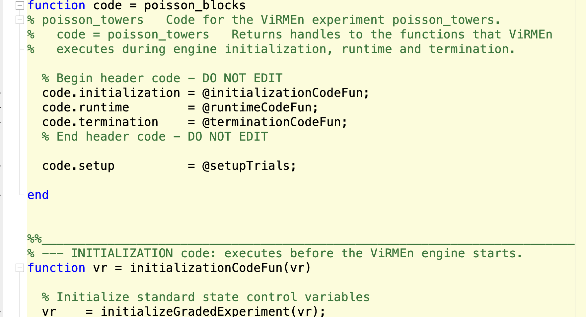
  <center><figcaption>ViRMEn Experiment Code</figcaption></center>
 </figure>

### World file
+ Located in the **ViRMEn\experiments** directory.
+ Defines the structure and settings of the ViRMEn world(s).
+ For a detailed guide on how to modify it, see the ViRMEn Manual.
+ Original file: ```C:\Experiments\ViRMEn\experiments\poisson_blocks.mat```
+ Most common use:
 1. Copy the existing world file from the most similar task.
 2. Rename the file to a descriptive name (e.g. **"TaskName"_World.mat**).
 3. Run ```virmen``` in MATLAB and open the world (Experiment -> Open).
 4. If no object is going to change, just set the **Experiment code** dropdown (bottom-left corner) to match your experiment code filename.

 <figure>
  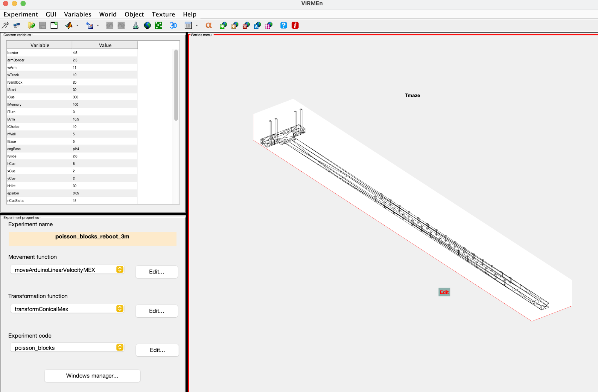
  <center><figcaption>ViRMEn GUI: to modify world files</figcaption></center>
 </figure>

### Protocol file
+ Located in the **ViRMEn\experiments\protocols** directory.
+ Declares the number of levels, maze settings, and the criteria that decide when to advance a subject to the next level.
+ Original file: ```C:\Experiments\ViRMEn\experiments\protocols\PoissonBlocksCondensed3m.m```

 <figure>
  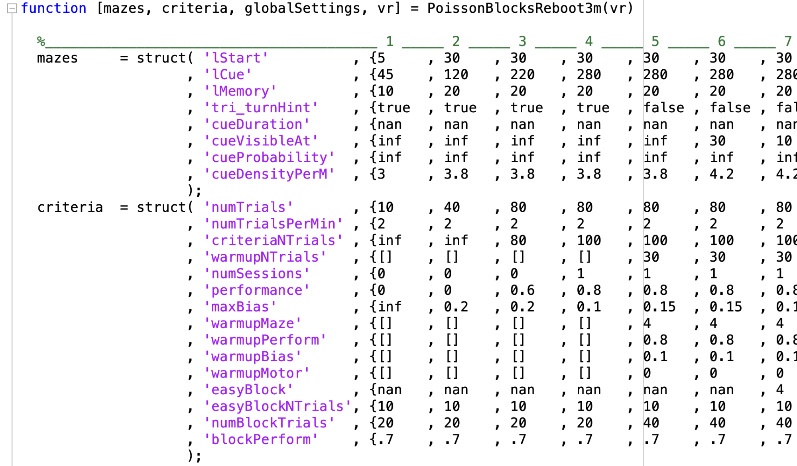
  <center><figcaption>Protocol file Code</figcaption></center>
 </figure>

+ The structures and variables in the protocol file are defined below.
 1. Maze structure:

 | Parameter name   | Definition                                                                                                                             | Values accepted                                                                                              |
 |------------------|----------------------------------------------------------------------------------------------------------------------------------------|--------------------------------------------------------------------------------------------------------------|
 | lStart           | Length of start region on track                                                                                                        | Real number (>0)                                                                                             |
 | lCue             | Length of cue region on track                                                                                                          | Real Number (>0)                                                                                             |
 | lMemory          | Length of delay region on track                                                                                                        | Real Number (>0)                                                                                             |
 | Tri_turnHint     | Are the turn hints present at all?                                                                                                     | logical                                                                                                      |
 | Tri_turnHint_Mem | Are turn hints present during delay period?                                                                                            | logical                                                                                                      |
 | cueDuration      | How long are towers present after they appear (i.e., do they disappear after they are passed, and if yes, after how much time)?        | Real Number (>0, in seconds)                                                                                 |
 | cueVisibleAt     | How far away from the navigator are towers visible?                                                                                    | Real Number (>0)                                                                                             |
 | cueProbability   | Probability parameter that defines the ratio of salient vs. distractor towers                                                          | Real Number (>0, lower numbers make the ratio smaller on average) or inf (places all towers on correct side) |
 | cueDensityPerM   | How many towers per meter in cue region are possible?                                                                                  | Real number                                                                                                  |
 | antiFraction     | Proportion of trials in which the correct choice is away from the side with more towers (i.e., fraction of trials with inverted reward | Real number ([0-1])                                                                                          |
 | world            | Index of Virmen world in vr.worlds for that Maze                                                                                       | Index of virmen world ([1-N], where N is the max number of worlds)                                           |

 2. Maze advancement criteria structure:

 | Parameter name   | Definition                                                                                                                         | Values accepted                                                    |
 |------------------|------------------------------------------------------------------------------------------------------------------------------------|--------------------------------------------------------------------|
 | numTrials        | Minimum number of trials the mouse must spend above performance                                                                    | Natural number                                                     |
 | numTrialsPerMin  | Number of trials required per minute to be considered maintaining “good” performance                                               | Natural number                                                     |
 | criteriaNTrials  | Number of trials in the running window used to measure performance for deciding whether to advance to the next maze                | Natural number                                                     |
 | numSessions      | Minimum number of sessions the navigator must have above criteria before advancing                                                 | Natural number                                                     |
 | Performance      | Minimum performance criterion to advance maze                                                                                      | Real number ([0-1])                                                |
 | maxBias          | Max allowed side bias to advance maze                                                                                              | Real number ([0-1])                                                |
 | warmupMaze       | Index of Virmen world in vr.worlds for the warmup maze for that particular main maze, which occurs at the start of a given session | Index of virmen world ([1-N], where N is the max number of worlds) |
 | warmupPerform    | Minimum performance allowed during warmup to advance to mainMaze                                                                   | Real number ([0-1])                                                |
 | warmupBias       | Max allowed side bias allowed during warmup to advance to main maze                                                                | Real number ([0-1])                                                |
 | warmupMotor      | Max percentage of trials to have "bad" motor quality. (Too much travel distance inside the maze)                                   | Real number ([0-1])                                                                                                                           |                                                      
 | easyBlock        | Index of Virmen world in vr.worlds for the easy block maze for that particular main maze                                           | Index of virmen world ([1-N], where N is the max number of worlds) |
 | easyBlockNTrials | Number of trials in an easy block                                                                                                  | Natural number                                                     |
 | numBlockTrials   | Number of trials within a block used to assess performance for demotion to an easy block                                           | Natural number                                                     |
 | blockPerform     | If running window performance (calculated over numBlockTrials) goes under this value, a switch to the easy block is triggered      | Real number ([0-1])                                                |

 3. Protocol extra variables:

 | Parameter name        | Definition                                                                                                                                                       | Values accepted                                             |
 |-----------------------|------------------------------------------------------------------------------------------------------------------------------------------------------------------|-------------------------------------------------------------|
 | globalSettings        | Defines global settings for all mazes                                                                                                                            | Cell array of name-value pairs (see below for more details) |
 | vr.numMazesInProtocol | Total number of mazes in protocol                                                                                                                                | Natural number (likely the length of mazeIDs)               |
 | vr.stimulusGenerator  | Function to generate stimuli (i.e., distribution of towers along the maze)                                                                                       | @stimulusGeneratorFunc (e.g., @PoissonStimulusTrain)        |
 | vr.stimulusParameters | Parameters for a stimulus inherited when running the experiment (so stimulus parameters that change between mazes but are not defined by the stimuli themselves) | Cell array (see below for more details)                     |
 | vr.inheritedVariables | Parameters for a maze inherited when running the experiment (so maze parameters that change between mazes but are not defined by the stimuli themselves)         | Cell array (see below for more details)                     |

 4. Global settings variables:

 | Parameter name   | Definition                                                                                                                                                                               | Values accepted     |
 |------------------|------------------------------------------------------------------------------------------------------------------------------------------------------------------------------------------|---------------------|
 | cueMinSeparation | Min distance between two towers on the same side                                                                                                                                         | Real number (>0)    |
 | fracDuplicated   | Proportion of trials that are duplicated                                                                                                                                                 | Real number ([0-1]) |
 | trialDuplication | Number of times each set of stimulus parameters are duplicated, for a given fracDuplicated (i.e., number of exact replications of each trial type for the duplicated fraction of trials) | Natural number      |

### Stimuli bank file

+ Located in the **ViRMEn\experiments\protocols** directory.
+ Contains the stimulus sets that are drawn from during a session. It holds trial data: tower positions and the number of towers for each maze level, depending on the protocol variables.
+ Original file: ```C:\Experiments\ViRMEn\experiments\protocols\stimulus_trains_PoissonBlocksCondensed3m.mat```
+ Most common use:
 1. Create the protocol and world files.
 2. Run ```generatePoissonStimuli(('world_file'), @('protocol_file'))```, substituting **world_file** and **protocol_file** with the corresponding names.

### RigParameters file

+ Located in the **ViRMEn\extras** directory.
+ Defines the parameters that control and adjust the hardware, display, and motion in a task.
+ Only file: ```C:\Experiments\extras\RigParameters.m```

##### If working on a rig computer:
+ This file has most likely already been set up by the Lab Manager. Do nothing.

##### If working on a personal computer:
+ The most common use for this file on a personal computer is to run ViRMEn simulations without interacting with the hardware. To do this, set:
+ ```simulationMode: = true```
+ ```hasDAQ: = false```
+ This lets you run simulations on any Windows computer and use the keyboard to simulate mouse movement.

 <figure>
  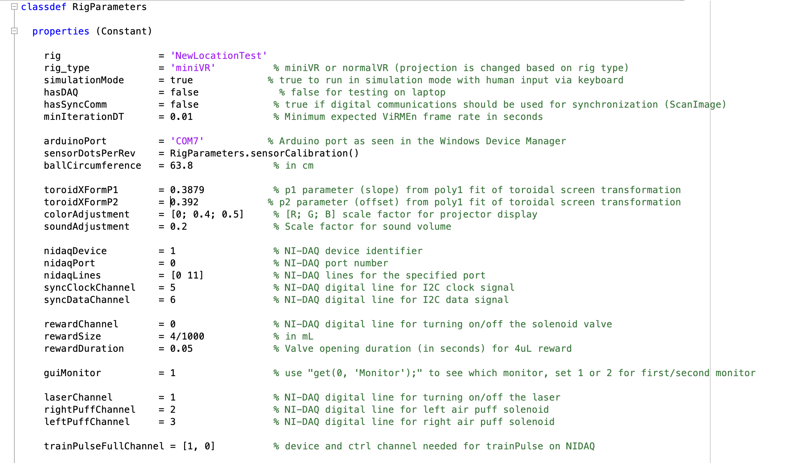
  <center><figcaption>RigParameters File</figcaption></center>
 </figure>

## New Training GUI

- The following sections describe the training workflow from start to finish: from selecting which experiment will run to reviewing session performance right after it finishes.
- First steps is defining a training profile & scheduling a subject on a specific rig on the BRAINCoGS Web GUI: https://braincogs-webgui.pni.princeton.edu/. These steps should be done at least the day before the session occurs.
- Next steps are done in the rig computers on the same day of the experiment session.

### Define Training Profile (WebGUI)

 <figure>
  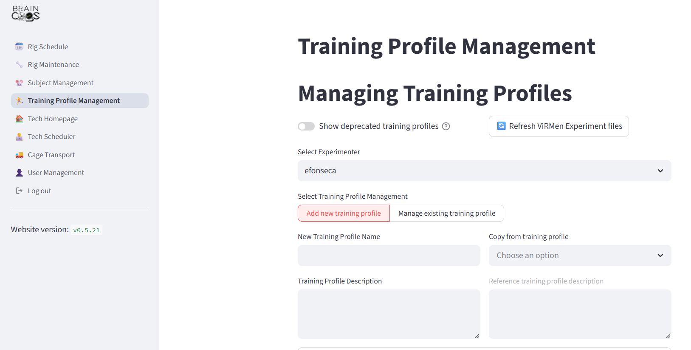
  <center><figcaption>Training Profile Management Site</figcaption></center>
 </figure>


### Rig Schedule (WebGUI)

 <figure>
  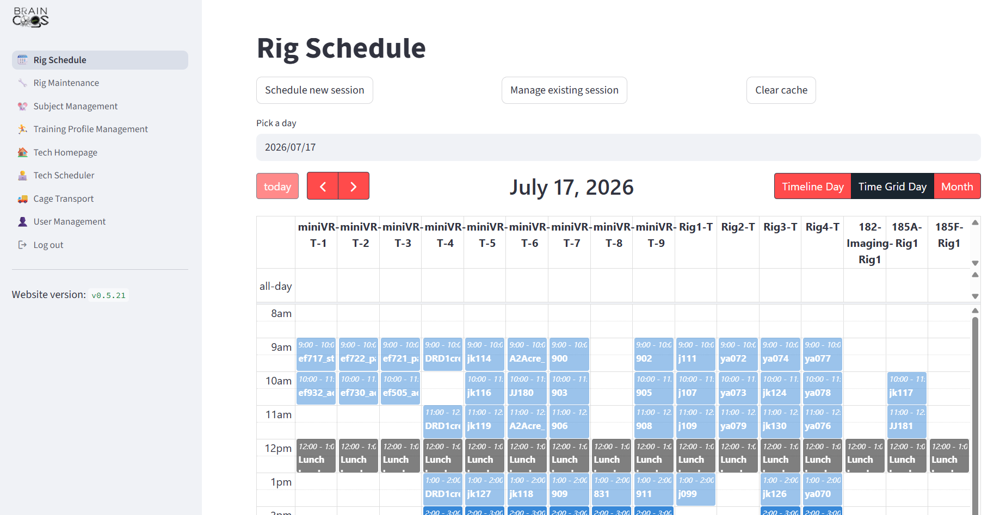
  <center><figcaption>Rig Schedule Site</figcaption></center>
 </figure>


### Rig Tester

- The Rig Tester GUI lets you check all of a rig's inputs and outputs (IOs) before training starts. The IOs are predefined via the Input Output Profile and Rig Status tables. See the <a href="https://braincogs.github.io/software/virmen_developer.html#testvrrig-2-rig-tester"> ViRMEn developer Rig Tester section </a> for more information.
- From here on, all steps in the following sections are performed on the rig machine.
- MATLAB should already be open and the Rig Tester GUI should be visible. If not, type ```TrainingToday``` to start the training process.

 <figure>
  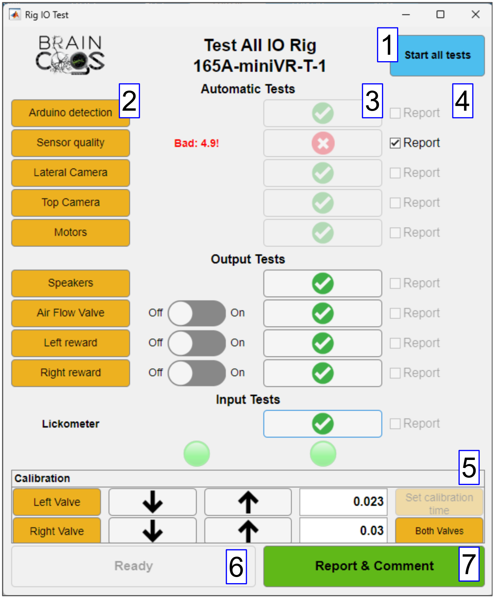
  <center><figcaption>Rig Tester GUI</figcaption></center>
 </figure>


+ Below is a description of every part of the Rig Tester GUI. Note that some buttons may not be shown (and some extra buttons may appear) compared to the example image.
 1. **Start all tests Button:** Automatically runs all "Automatic Tests", one by one, until they are done.
 2. **Start individual test Button:** For "Output Tests" such as valves and air puffs. This button briefly activates the output so you can manually verify it is working properly.
 3. **Mark Passed/Failed Buttons:** For "Input & Output Tests", the technician pushes this button to mark a test as passed or failed.
 4. **Report Checkboxes:** If a test fails, the technician can report it by checking the report checkbox.
 5. **Calibration Panel:**
    - **Left Valve/Right Valve/Valve Button:** Runs calibration: 25 drops are delivered in the corresponding lick spout. The technician can check whether the volume delivered matches the desired value (4 ul per drop).
    - **Up and Down Arrow Buttons:** Adjust valve timing to reach the desired calibration.
    - **Set calibration time Button:** Saves the adjusted valve times in the RigParameters file.
    - **Both valves Button:** Calibrates both valves simultaneously.
 6. **Ready Button:** If all tests pass, proceed to the Training Flow GUI screen.
 7. **Report & Comment Button:** If at least one IO test does not pass and the report checkboxes are marked, a report screen appears where you can add comments for the Lab Manager (see below). A Slack message is sent to the **#rig_issues_and_troubleshooting** channel when a report is sent.

  <figure>
  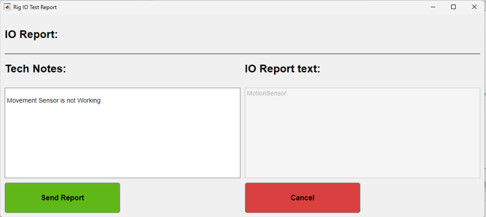
  <center><figcaption>Rig Tester Report Dialog</figcaption></center>
 </figure>

- If a rig parameter is missing from the RigParameters.m file for the configured IOs, a dialog like the one below appears. Add the parameters to the RigParameters.m file and see the <a href="https://braincogs.github.io/software/virmen_developer.html#testvrrig-2-rig-tester"> ViRMEn developer Rig Tester section </a> for more information.

 <figure>
  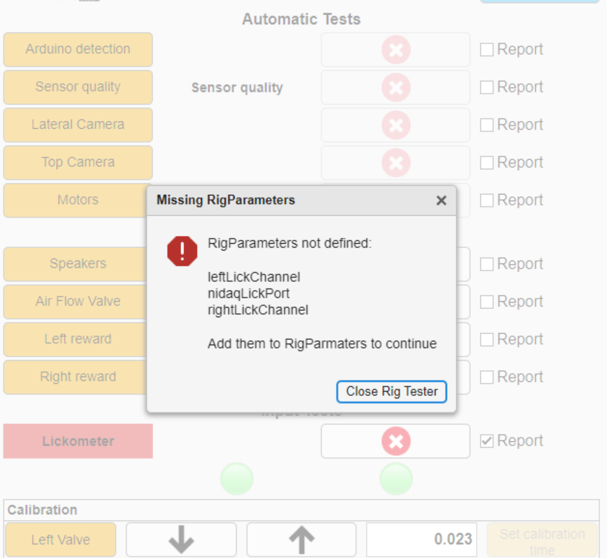
  <center><figcaption>Missing Rig Parameters Dialog</figcaption></center>
 </figure>


### Training Flow GUI

- Once the Rig Tester GUI passes, the Training Flow GUI appears.
- This GUI is the interface to:
    - Start subject training
    - Check the training status of subjects scheduled for the day
    - Verify the training profile for each subject
    - Add test subjects to train, to check experiment code

 <figure>
  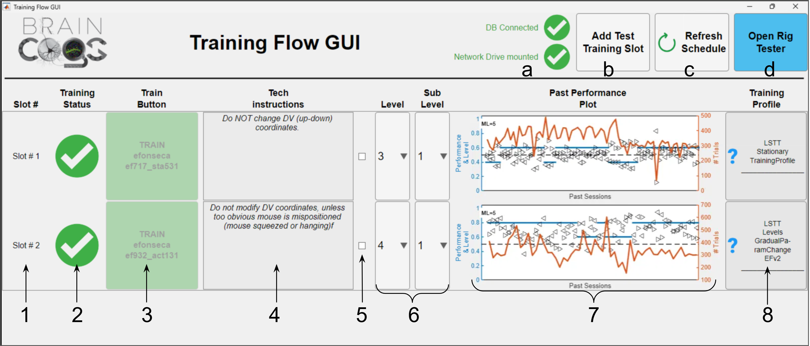
  <center><figcaption>Training Flow GUI</figcaption></center>
 </figure>


+ Below is a description of every part of the Training Flow GUI.
 1. **Slot # Labels:** Informative label showing the training order for the day.
 2. **Training Status Icon:** Icon showing the current status of the corresponding subject. See the image below for all possible icon statuses:

 <figure>
  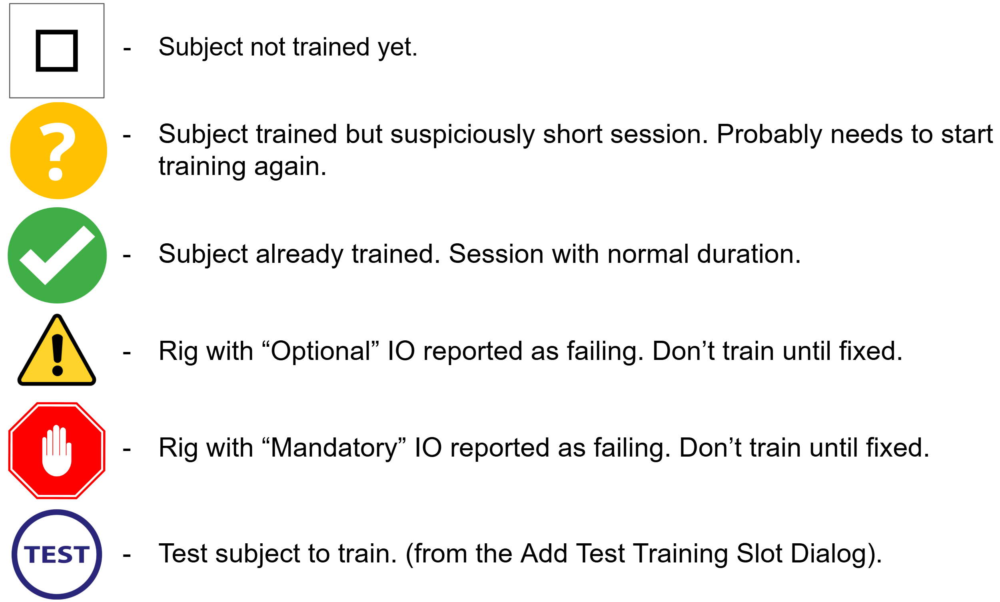
  <center><figcaption>Training Flow GUI Icons</figcaption></center>
 </figure>

 3. **Train Button:** Starts the selected subject's training process. The Training Setup GUI opens.
 4. **Tech instructions Area:** General instructions provided by the researcher to complete before starting training.
 5. **Tech instructions Checkbox:** The Train button stays disabled until the tech instructions checkbox is marked.
 6. **Level & Sublevel Override Selectors:** "Force" training to start at a specific level (and sublevel, if the experiment uses them).
 7. **Past performance Plot:** Plot showing the main training performance stats (# trials, session performance, and level) for the corresponding subject's last 50 sessions.
 8. **Check Training Profile Button:** Opens a dialog (shown below) to verify all training profile variables for the experiment. See the <a href="https://braincogs.github.io/software/virmen_guide.html#define-training-profile-webgui"> Define Training Profile Web GUI section </a> for more information.

 <figure>
  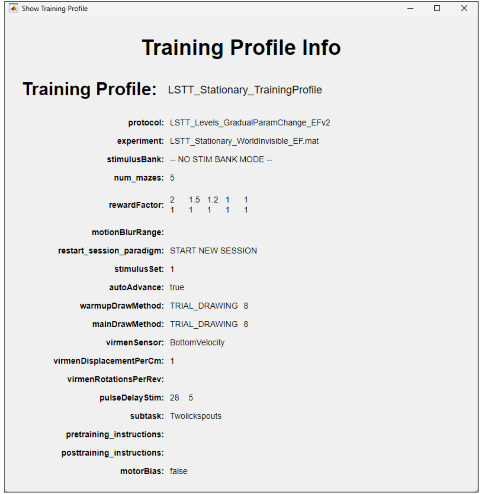
  <center><figcaption>Review Training Profile Dialog</figcaption></center>
 </figure>

* a. **Verify DB & Network Drive:** Labels showing whether the Database and Network drive are working correctly. If the DB is not connected, <a href="https://braincogs.github.io/software/virmen_developer.html#virmen-offline"> ViRMEn Offline </a> is used to continue training.
* b. **Add Test Training Slot Button:** Click this to verify experiment code without creating a "real" session. The "Add test training" dialog appears; it is shown and described below.
* c. **Refresh Schedule Button:** Refreshes the schedule in case changes were made to it during the day.
* d. **Open Rig Tester Button:** If an IO needs to be rechecked, click this to open the Rig Tester GUI.

#### Add test training Dialog

  <figure>
  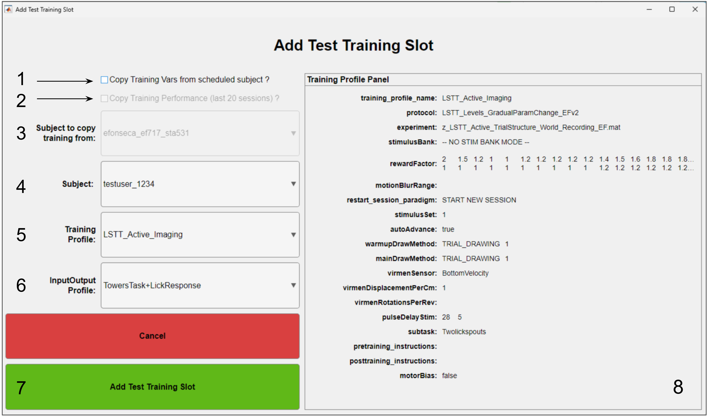
  <center><figcaption>Add test training Dialog</figcaption></center>
 </figure>

+ Below is a description of every part of the Add Test Training dialog.
 1. **Copy Training Vars from scheduled Checkbox:** Check this to create a test subject with the same configuration as one of the subjects scheduled for the day.
 2. **Copy Training Performance Checkbox:** Check this to copy the last 20 sessions of performance from the scheduled subject to the newly created test subject. Use this primarily to check that the maze advancement code and/or criteria work as expected. See the <a href="https://braincogs.github.io/software/virmen_guide.html#protocol-file"> Protocol file </a> and <a href="https://braincogs.github.io/software/virmen_developer.html#select-maze-for-each-experiment"> Maze advancement code </a> sections for more information.
 3. **Subject Scheduled Selector:** If option 1 is checked, select which subject you are copying the configuration from.
 4. **Subject Selector:** If option 1 is unchecked, select which test subject will be used for the test training slot.
 5. **Training Profile Selector:** If option 1 is unchecked, select which training profile will be used for the test training slot.
 6. **InputOutput Profile Selector:** If option 1 is unchecked, select which InputOutput profile will be used for the test training slot. This normally has no effect on the test training, so leave it untouched if unsure.
 7. **Add Test Training Slot Button:** Adds a new test subject slot to the Training Flow GUI.
 8. **Training Profile Panel:** Panel to verify all training profile variables for the test training slot.

### Training Setup GUI

 <figure>
  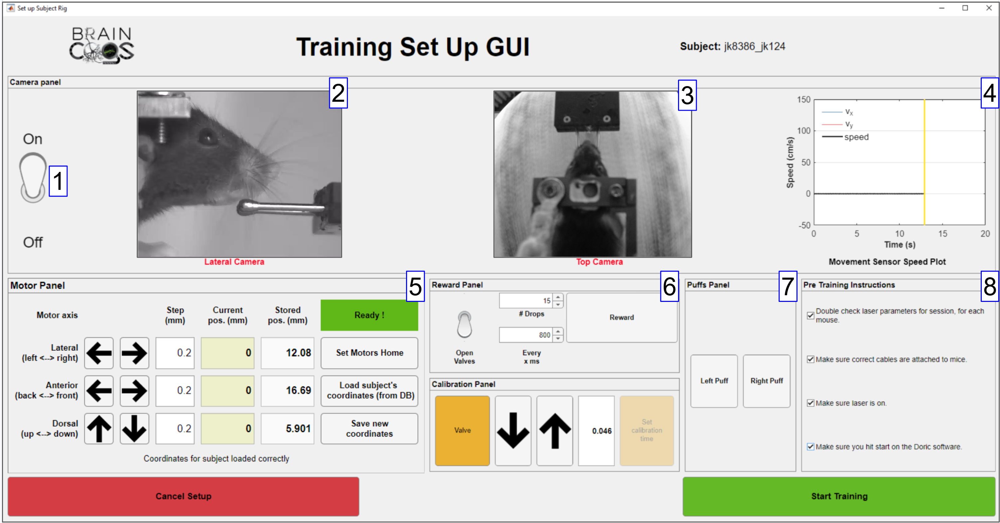
  <center><figcaption>Training Setup GUI</figcaption></center>
 </figure>

- After you click the Train button on the Training Flow GUI, the Training Setup GUI appears. Here you can make final adjustments before the experiment starts.

+ Below is a description of every part of the Training Setup GUI.
 1. **Turn On/Off Cameras Switch:** Turns on the cameras (if installed) to verify the subject's position.
 2. **Lateral Camera View:** View to verify and correct the subject's anterior and dorsal positioning.
 3. **Top Camera View:** View to verify and correct the subject's lateral and anterior positioning.
 4. **Movement Sensor Plot:** Plot to verify that the Arduino movement sensor is working correctly.
 5. **Motor Panel:** Panel to adjust motor position.
    - **Arrow Buttons:** Perform a single motor step in the chosen direction.
    - **Step Edits:** Adjust the motor step size for the corresponding axis.
    - **Current Position Labels:** Show the current position of the motors.
    - **Stored Position Labels:** Show the last position stored in the database for the current subject on this particular rig. For a new subject, the average position of the subjects on this rig is shown.
    - **Set Motors Home Button:** Set all motors to position 0 mm. Use this only when there is no subject in the rig!
    - **Load Subject Coordinates Button:** Coordinates are normally already loaded for the subject. Use this only when coordinates have changed substantially.
    - **Save New Coordinates Button:** Click this once the motor position has been adjusted. The new coordinates will be available for the next run.
 6. **Reward & Calibration Panel:** Calibration with the same functionality as in the <a href="https://braincogs.github.io/software/virmen_guide.html#rig-tester"> Rig Tester </a>, plus buttons to deliver a small reward to the subject in the rig. This lets you verify that the subject can reach the reward lick spouts comfortably.
 7. **Puff Panel:** (Only visible for rigs with air puffs.) Lets you verify that the subject and the air puff valves are positioned so the subject receives the air puff stimulation.
 8. **Pre Training Instructions Panel:** (Only visible for subjects with pretraining instructions defined in the training profile; see the <a href="https://braincogs.github.io/software/virmen_guide.html#define-training-profile-webgui"> Training Profile Management section </a>.) Final instructions for the technician to complete before starting training. The **Start training subject** button stays disabled until all of these are checked.


### ViRMEn Experiment Stats GUI & Maze Projection


- After you click the Start training subject button, the ViRMEn experiment starts and the ViRMEn Experiment Stats GUI appears. This GUI monitors the subject's current performance throughout the session.


 <figure>
  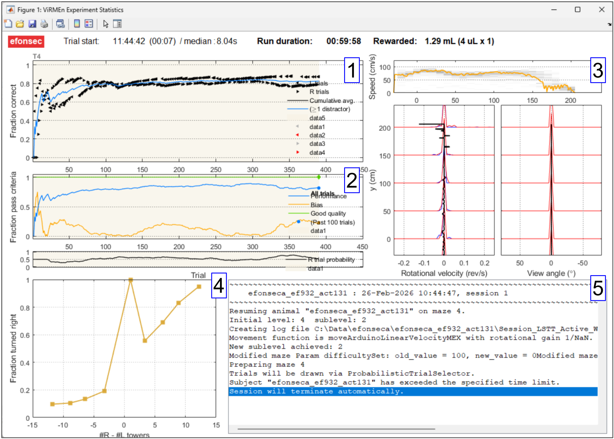
  <center><figcaption>Virmen Experiment Stats GUI</figcaption></center>
 </figure>


+ Below is a description of every part of the ViRMEn Experiment Stats GUI.
 1. **Fraction Correct Plot:** Overall and left/right performance across all blocks of the session.
 2. **Pass Criteria Plot:** Performance and bias over the last 40 trials. These stats determine whether the subject is promoted to the next level.
 3. **Speed, Rotation & Angle Plots:** Plots of the displacement variables from the last trial, used to verify that the movement sensor is working correctly and to monitor the subject's side bias.
 4. **Psychometric Plot:** Percentage of right responses vs. right/left tower trials. For a well-trained subject, this plot should roughly approximate a sigmoid.
 5. **Message Text Area:** Session milestones are written here, such as: new level achieved, forced reward delivery, level demotion, etc.

- In addition to the Experiment Stats GUI, the virtual reality world is displayed on the rig projector. It may look something like the image below:

 <figure>
  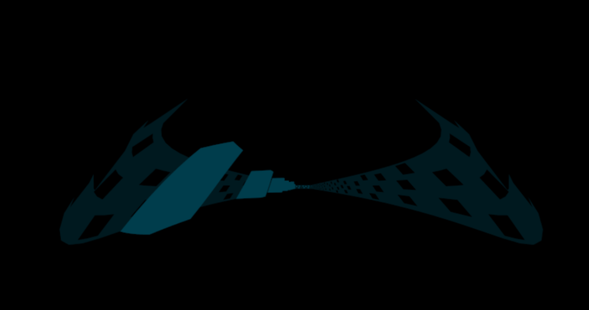
  <center><figcaption>ViRMEn Maze Projection</figcaption></center>
 </figure>

### Post Training GUI

- Once the subject's session is over, the Post Training GUI appears. This GUI monitors overall performance and verifies that no code error occurred during the experiment.

 <figure>
  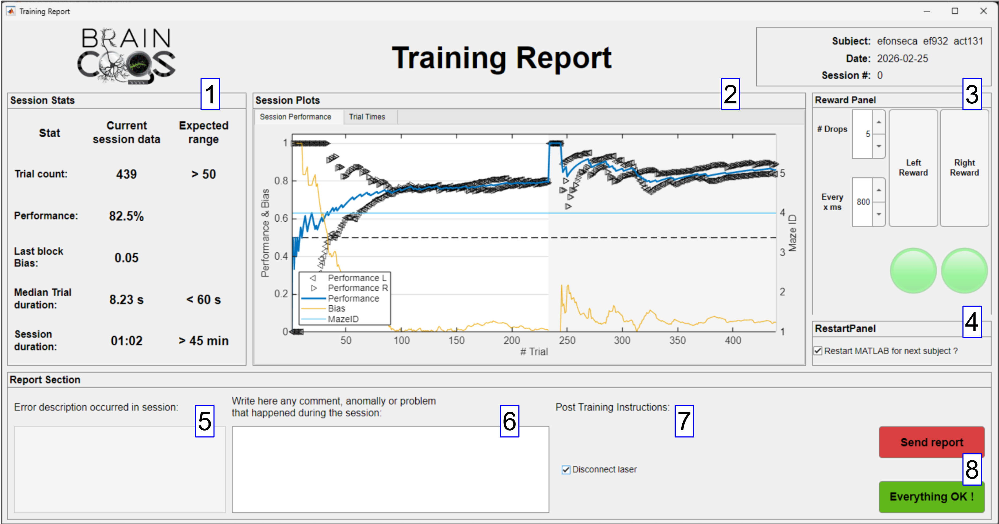
  <center><figcaption>Post Training GUI</figcaption></center>
 </figure>

+ Below is a description of every part of the Post Training GUI.
 1. **Session Stats Panel:** The most common performance stats for the session. If session data is shown in red, an error or something abnormal most likely occurred during the session.
 2. **Session Plots:** Overall and left/right performance across all blocks of the session.
 3. **Reward Panel:** Same functionality as the Reward Panel in the Training Setup GUI.
 4. **Restart Panel:** By default, MATLAB restarts after a subject is trained. You can prevent this by unchecking the checkbox in this panel.
 5. **Error Description Area:** If an error occurred during training, this window shows it as MATLAB reports it.
 6. **Error Comment Area:** Window to add extra comments if a report is sent.
 7. **Post Training Instructions Checkboxes:** (Only visible for subjects with posttraining instructions defined in the training profile; see the <a href="https://braincogs.github.io/software/virmen_guide.html#define-training-profile-webgui"> Training Profile Management section </a>.) Final instructions for the technician to complete after training the subject. The **Everything OK** button stays disabled until all of these are checked.
 8. **Send Report and Everything OK Buttons:** If an error occurred, the technician can send a report by clicking the corresponding button. This sends a Slack message to the **#rig_training_error_notification** channel.

## Old Training GUI

### Program wrapper file

+ Located in the **ViRMEn\experiments\programs** directory.
+ Sets up a cohort of animals on the training GUI.
+ Original file: ```C:\Experiments\ViRMEn\experiments\programs\trainPoissonBlocks_lp_cohort1.m```
+ Most common use:
 1. Copy the existing program wrapper file from the most similar task.
 2. Rename the file to a descriptive name (e.g. **train"TaskName"_cohort(n).m**).
 3. In the call to the **runCohortExperiment** function, rename the first 3 parameters:
   + **dataPath:** should be ```C:\Data\(NETID)\(String to represent protocol, task or cohort)```
   + **experName:** should be the experiment code name (without .m).
   + **cohortName:** should be a string that identifies the cohort.
  * **experName** and **cohortName** are appended to behavior files.

 <figure>
  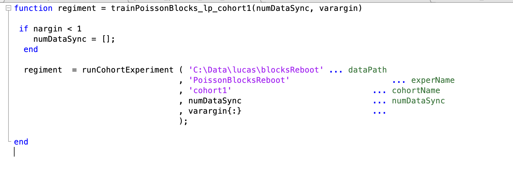
  <center><figcaption>Program Wrapper File</figcaption></center>
 </figure>


### Set up training

 1. Make sure you have all the files described in the section above.
 2. Run your **program wrapper file** (e.g. ```trainPoissonBlocks_lp_cohort1()```).
 3. The training GUI appears:

 <figure>
  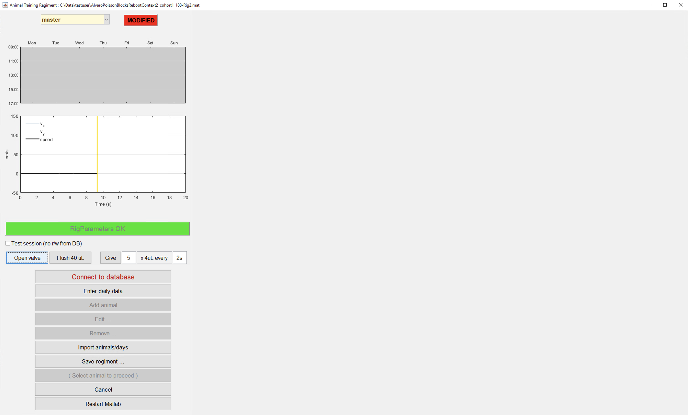
  <center><figcaption>Main screen training GUI</figcaption></center>
 </figure>

 4. Click the **Connect to Database** button.
 5. Click the **Add animal** button.

 <figure>
  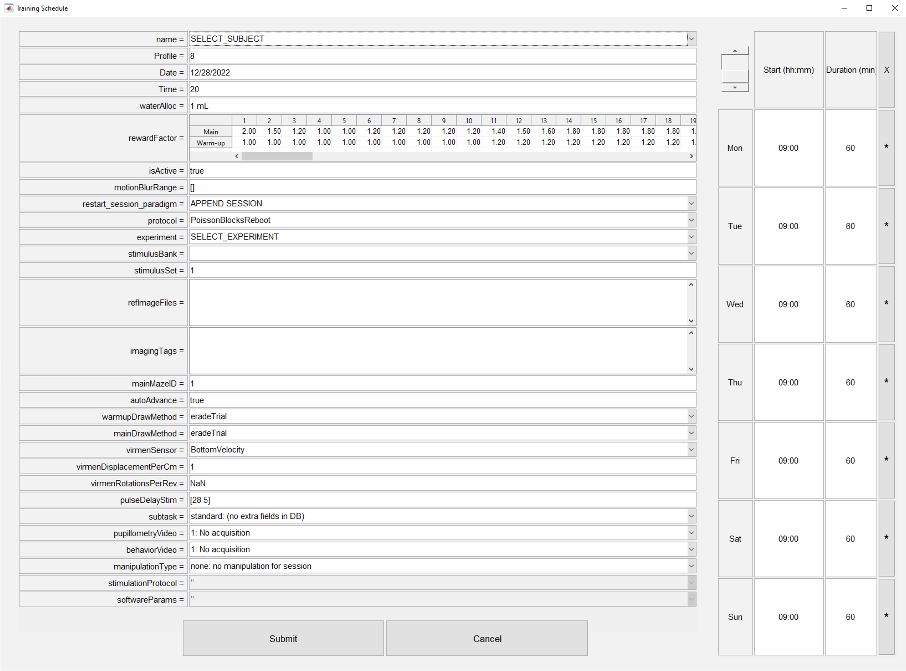
  <center><figcaption>Add animal dialog</figcaption></center>
 </figure>

 6. Fill in the corresponding information for the animal to train (see the next section).
 7. Click the **Submit** button.
 8. Repeat steps 5-7 to add all animals from the cohort.
 9. Click the **Save regiment** button.
 10. Click the **"Empty area" section** where the subject you want to train is shown.
 11. Click the **TRAIN "SubjectFullname"** button.

 <figure>
  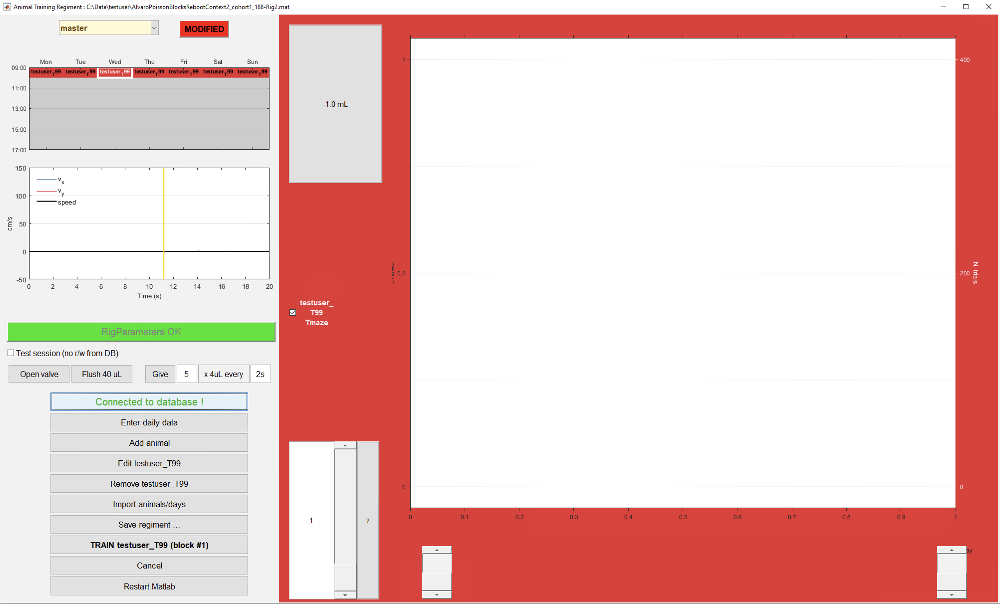
  <center><figcaption>Main screen training GUI with subject</figcaption></center>
 </figure>

### Set up motor positioning
+ If the rig where training happens has a motor positioning system (ask the Lab Manager about it), you need to set up the initial coordinates for each subject trained on that rig.

 1. Adjust the subject's positioning for the first time on the rig using the motor GUI (installed on the rig computer).

 <figure>
  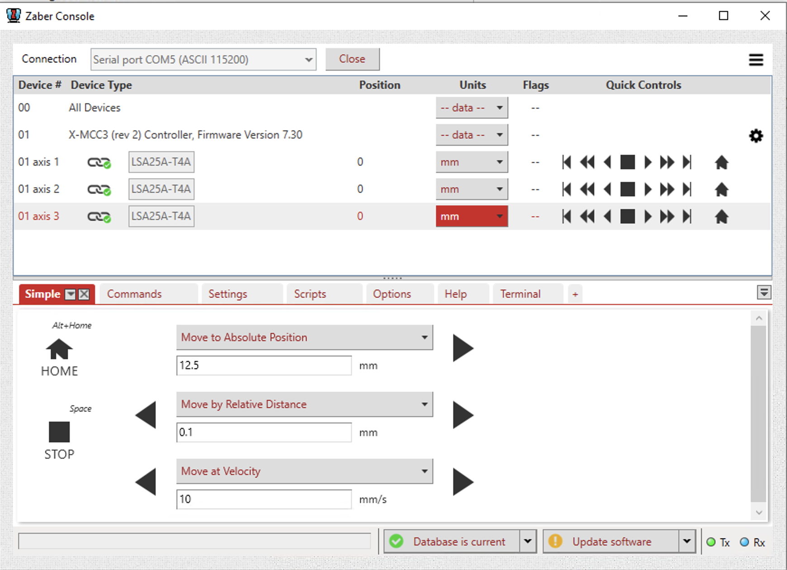
  <center><figcaption>Motor GUI</figcaption></center>
 </figure>

 2. In MATLAB, enter the following (replace the code in brackets with the corresponding info for the subject):
  ```matlab
  new_record = struct
  new_record.subject_fullname = ['efonseca_ef481_actpg004']; # Subject fullname 
  new_record.ml_position = [17.5]   # ml position in mm (motor axis#1 position in GUI)
  new_record.ap_position = [10]     # ap position in mm (motor axis#2 position in GUI)
  new_record.dv_position = [15.3]    # dv position in mm (motor axis#3 position in GUI)
  insert(subject.LickometerMotorPosition, new_record)
  ```

### Old Training GUI detailed description

 This section describes all the elements of the training GUI.

 <figure>
  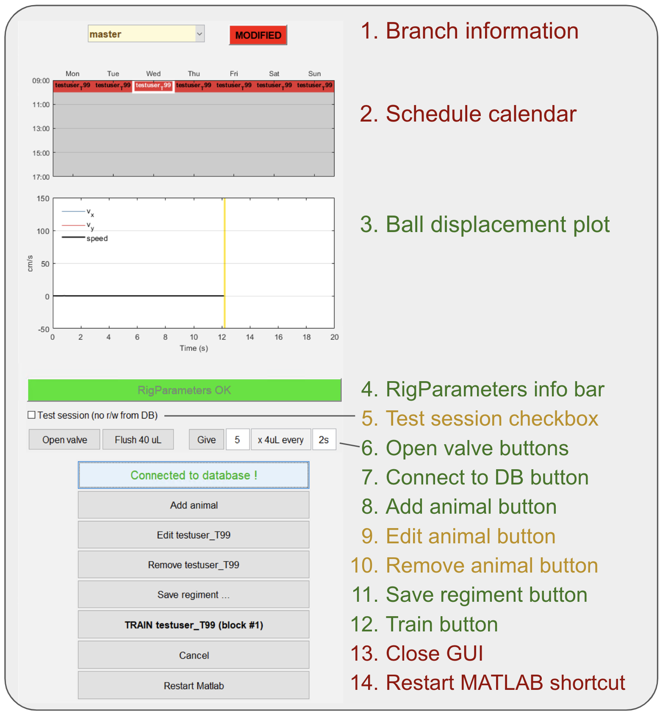
  <center><figcaption>Training GUI main screen parts</figcaption></center>
 </figure>

+ On the main screen, the elements are grouped into three categories (<span style="color:red">*red* = rarely used or not used at all; </span><span style="color:rgb(184, 146, 68);">*yellow* = used in specific situations; </span><span style="color:green">*green* = widely used</span>).
 1. **Branch information section:** For git users, shows which branch is currently checked out and whether the current code has uncommitted changes. Most of the time it should read "master" and "synced". If not, see the pulling/pushing code section.
 2. **Schedule calendar:** Day of the week and time when subjects should be trained. This information is not crucial for training at the moment.
 3. **Ball displacement plot:** Figure showing real-time X and Y velocity for the subject in the rig. Use this plot to detect ball movement sensor issues.
 4. **RigParameters info bar:** This bar turns red whenever simulation mode is active or the hasDAQ parameter is set to false. If that is the case, both parameters must be reset for training to start. If simulation mode is intended, ignore this bar.
 5. **Test session checkbox:** Check this box if the next session's goal is to test code, or if the behavior will not be analyzed. The session will not be stored in our DB.
 6. **Open valve buttons:** Use these buttons to give a small reward to the subject in the rig and/or to test valve function.
 7. **Connect to DB button:** Use this button to connect to the DB; it should be the first thing you do when the training GUI opens. <a href="https://braincogs.github.io/software/virmen_guide.html#set-up-training">See the Set up training section.</a>
 8. **Add animal button:** Use this button to add a new subject to the cohort. <a href="https://braincogs.github.io/software/virmen_guide.html#set-up-training">See the Set up training section</a> and the <a href="https://braincogs.github.io/software/virmen_guide.html#add-animal-dialog-detailed-description">Add animal dialog detailed description</a>.
 9. **Edit animal button:** Button to change a parameter in the "Add animal" dialog for a subject already added to the cohort.
 10. **Remove animal button:** Button to remove a subject from the cohort (do this when the animal has finished training).
 11. **Save regiment button:** Click this button whenever a subject is added, edited, or removed to save the changes.
 12. **Train button:** Click this button to start training the selected subject.
 13. **Close GUI:** Click to close the GUI.
 14. **Restart MATLAB shortcut:** Click to restart MATLAB.

### Add animal dialog detailed description

 <figure>
  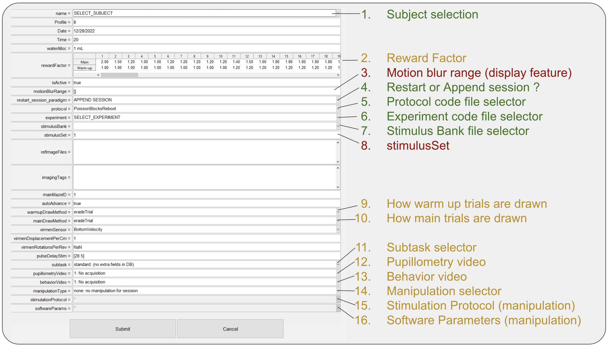
  <center><figcaption>Add subject Dialog</figcaption></center>
 </figure>

+ In the Add animal dialog, the elements are grouped into three categories (<span style="color:red">*red* = rarely used or not used at all; </span><span style="color:rgb(184, 146, 68);">*yellow* = used in specific situations; </span><span style="color:green">*green* = widely used</span>). Elements that are not described are not used.
 1. **Subject selection:** Dropdown list of all subjects in BRAINCoGS available for training.
 2. **Reward Factor:** Multiplier applied to the reward for each of the warm-up and main mazes. The reward is normally 4 ul for each correct trial on the Towers Task (e.g. if ```RewardFactor = 1.25 -> Reward = 4*1.25 = 5 ul```).
 3. **Motion blur range:** Parameter that sets up the cue elongation effect opposite to the subject's direction of motion in virtual reality. A 2x1 vector where the first element is the distance (in cm) from the subject to the tower cue at which elongation starts, and the second element is the distance (in cm) at which the elongation effect stops. Leave empty for no motion blur effect. Common values: ```[28 5], []```.
 4. **Restart or append session:** Action to perform when a session is restarted.
 + If **APPEND SESSION** is selected, each time the session is restarted the "new" session is counted as new blocks of the same session.
 + If **START NEW SESSION** is selected, each time the session is restarted a new session is created (recommended when physiology recordings are performed, to make the syncing process easier).
 5. **Protocol code file selector:** Dropdown to select the protocol code file; see the <a href="https://braincogs.github.io/software/virmen_guide.html#new-task-creation">New task creation section for detailed information</a>.
 6. **Experiment code file selector:** Dropdown to select the experiment code file; see the <a href="https://braincogs.github.io/software/virmen_guide.html#new-task-creation">New task creation section for detailed information</a>.
 7. **Stimulus bank file selector:** Dropdown to select the stimulus bank file; see the <a href="https://braincogs.github.io/software/virmen_guide.html#new-task-creation">New task creation section for detailed information</a>.
 8. **Stimulus Set edit:** If the stimulus bank has more than one set, you can set it here. Only change this if you understand the stimulus bank file deeply and know what you are doing.
 9. **How warm up trials are drawn:** Strategy for selecting left or right trials based on previous bias and performance. The default value is eradeTrial, described <a href=" https://pubmed.ncbi.nlm.nih.gov/11550944/">here</a>.
 10. **How main trials are drawn:** Strategy for selecting left or right trials based on previous bias and performance. The default value is eradeTrial, described <a href=" https://pubmed.ncbi.nlm.nih.gov/11550944/">here</a>.
 11. **Subtask selector:** If the session is from a specific subtask, you can select it here. See the <a href="https://braincogs.github.io/software/subtask_pipeline.html">subtask pipeline section</a> for more information.
 12. **Pupillometry video:** If a pupillometry video will be captured, select the video parameters here.
 13. **Behavior video:** If a behavior video will be captured, select the video parameters here.
 14. **Manipulation selector:** If the session is from a specific manipulation, you can select it here. See the <a href="https://braincogs.github.io/software/manipulation_pipeline.html">manipulation pipeline section</a> for more information.
 15. **Stimulation protocol:** If the session is from a specific manipulation, select the stimulation protocol in this dropdown. See the <a href="https://braincogs.github.io/software/manipulation_pipeline.html">manipulation pipeline section</a> for more information.
 16. **Software parameters:** If the session is from a specific manipulation, select the software parameters in this dropdown. See the <a href="https://braincogs.github.io/software/manipulation_pipeline.html">manipulation pipeline section</a> for more information.

## Tips and Tricks Experiment Code

### Add variables to behavior file

+ It is often necessary to store additional variables in the behavior file for further analysis.

#### Add variables on the trial level
 1. Go to the ```setupTrials``` function in the experiment code.
 2. Find a line like this: ```cfg.trialData         = { 'trialProb', 'trialType', 'choice', 'trialID' ... ```
 3. Add the variable name at the end of the **cfg.trialData** cell array.
+ Remember to define that variable as vr.(variableName) in ```initializationCodeFun()``` or ```runtimeCodeFun()``` before the 1st trial is over.

#### Add variables on the block level
 1. Go to the ```setupTrials``` function in the experiment code.
 2. Find a line like this: ```cfg.blockData         = { 'mazeID', 'mainMazeID', 'motionBlurRange', 'iterStr', 'shapingProtocol' ... ```
 3. Add the variable name at the end of the **cfg.blockData** cell array.
+ Remember to define that variable as vr.(variableName) in ```initializationCodeFun()``` or ```runtimeCodeFun()``` before the 1st trial is over.

### Set code ready for simulation

+ It is useful to have the experiment code ready for simulations, so you can test all changes without interacting with the rig hardware.
+ Setting the code up for simulation also enables making trial-by-trial videos with the <a href="https://github.com/BrainCOGS/ReproduceTrialTowers">ReproduceTrialTowers repository</a>.
 1. Find all lines in the experiment code that interact with hardware (every line starting with **nidaq..** and the **updateDAQSyncSignals** function — the hardware code lines).
 2. Add the line ```if RigParameters.hasDAQ``` before the hardware code lines and close the if after them.

### Solve common errors during training

#### Arduino Serial communication error

+ Errors like these:
 ```matlab
 Open failed: Port: COM7 is not available. Available ports: COM1.
 Use INSTRFIND to determine if other instrument objects are connected to the requested device.
 ```
 ```matlab
 Serial communications have not been properly initiated.
 ```
 ```matlab
 Device Error: Unanticipated host error
 ```
+ These are the most common errors during training. Check whether the Arduino COM port is found in Device Manager, and restart MATLAB and/or the system to solve this.

#### virmen variable not properly set

 ```matlab
 Reference to non-existent field (variable_name)...
 ```
 ```matlab
 Unrecognized field name (variable_name).
 ```
+ This error is solved by initializing the variable in ```initializationCodeFun()``` (e.g. ```vr.(variable_name) = 0```).

#### Nidaq channel is busy or not found

```matlab
 [nidaqPulseRightReward:commit]  Requested operation could not be performed, because the specified digital lines are either reserved or the device is not present in NI-DAQmx.
 It is possible that these lines are reserved by another task or the device is being reset. If you are using these lines with another task, wait for the task to complete.  If you want to force the other task to relinquish the device, reset the device. If you are resetting the device, wait for the reset to finish.
 Device:  Dev1

 Task Name: RightReward

 Status Code: -200587
```
+ Review the **RigParameters.m** file and check that there is no overlap between the input/output channel variables (rewardChannel, laserChannel, rightPuffChannel, leftPuffChannel, rightRewardChannel, leftRewardChannel, newIterationChannel, newTrialChannel, etc.).
