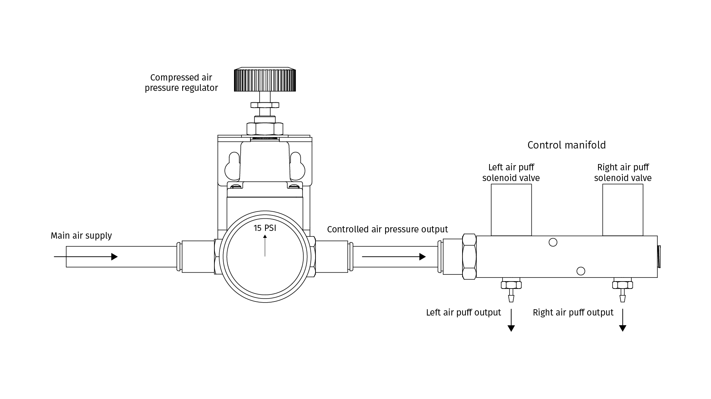
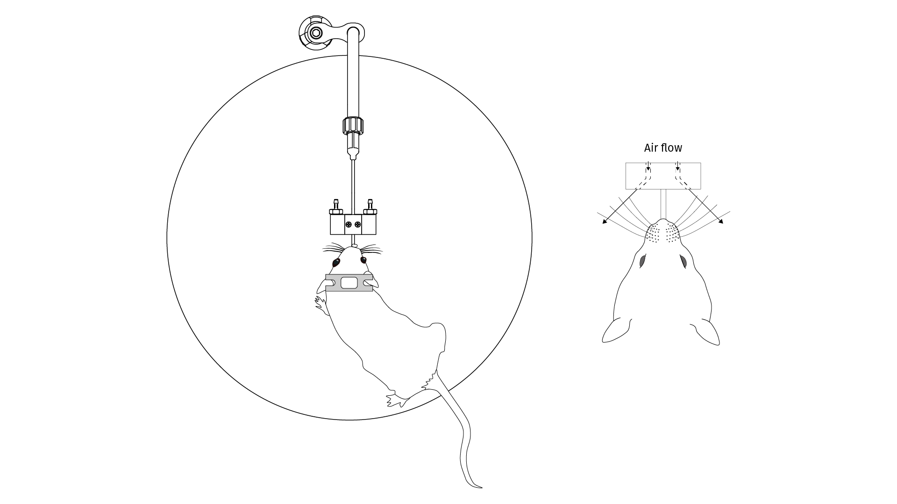

# {{ $frontmatter.title }}

The air puffs module can be divided in two main parts, the air pressure regulation and valve control and the delivery of the stimuli. One of the outputs from the main air supply manifold is used for the air puffs, a 3/8" outer diameter tube to 3/8" NPT male push to connect tube fitting is used to connect a 3/8" outer diameter tube from the air supply manifold to a compressed air regulator. A precision compressed air regulator with 1/8" NPT female inputs and 1-30 PSI range is used, a pair of 3/8" tube outer diameter to 3/8" NPT push to connect fittings are attached to both input and output of the regulator, a 1-30 pressure gauge is also connected to the regulator to easily adjust the air puff pressure as needed. The regulator is mounted using a mounting bracket attached to a DIN rail adapter.

The control manifold has screwed to one side a 3/8" tube outer diameter to 1/8" NPT push to connect fitting and on the other side a 1/8" NPT plug. Screwed at the bottom of the manifold are a pair of 1/16" tube internal diameter to 10-32 thread male low pressure tube fitting and at the top a pair of E2012 manifold mount 10-32 threaded stud subminiature solenoid valves from Gems sensors and controls. The controlled air pressure output from the regulator is then attached with a 3/8" outer diameter tube to the control manifold and the output is connected to the delivery part mounted on the reward spout with a 1/16" inner diameter and 1/8" outer diameter tygon tube.

<figure>
  
  
<figcaption><small>Description of the air pressure regulation and valve control</small></figcaption>

</figure>

The delivery of the air puffs is done with a Delrin part that is designed to be attached to the reward delivery module, it has 2 holes made at an angle of 45 degrees to point the air flow toward the whiskers of the mice and avoid the eyes. This part consist on 2 pieces that are tightened around the reward spout with 0-80 1/4" long screws. At the back, two 1/6" tube internal diameter to 10-32 thread male barbed tube fitting are screwed to attach the tygon tube coming from the control manifold output.

<figure>
  
  
<figcaption><small>Delivery of the air puffs mounted on the reward spout and description of the air flow toward the whiskers of the mouse (mouse drawings by <a href="https://zenodo.org/record/3925997#.YOcrtUwpDRY">Federico Claudi</a> )</small></figcaption>

</figure>

## Parts list

### Air pressure regulation and valve control

1. (3) Push-to-Connect Tube Fitting for Air Straight Adapter, for 3/8" Tube OD x 1/8 NPT Male from [McMaster-Carr](https://www.mcmaster.com/5779K115/)
2. Miniature Precision Compressed Air Regulator Inline Mount, 1/8 NPT Female, 1-30 PSI from [McMaster-Carr](https://www.mcmaster.com/2227T21/)
3. 1-30 PSI Pressure Gauge for 1/8 NPT Miniature Precision Compressed Air Regulator from [McMaster-Carr](https://www.mcmaster.com/2227T42/)
4. Mounting Bracket for Inline Mount 1/8 NPT Miniature Precision Compressed Air Regulator from [McMaster-Carr](https://www.mcmaster.com/2227T41/)
5. Spring Clip Mounting Adapter, 42 mm Wide from [McMaster-Carr](https://www.mcmaster.com/8961K106/)
6. Firm Polyurethane Tubing for Air and Water 1/4" ID, 3/8" OD from [McMaster-Carr](https://www.mcmaster.com/5648K71/)
7. Low-Pressure Galvanized Steel Fitting with Sealant Plug with Hex Drive, 1/8 NPTF from [McMaster-Carr](https://www.mcmaster.com/1162T37/)
8. (2) Brass Low-Pressure Barbed Tube Fitting Nickel-Plated, for 1/16" Tube ID x 10-32 Thread Male Pipe from [McMaster-Carr](https://www.mcmaster.com/2844K11/)
9. Low-Pressure Galvanized Steel Fitting with Sealant Plug with Hex Drive, 1/8 NPTF from [McMaster-Carr](https://www.mcmaster.com/1162T37/)
10. Solenoid valve E2212, Encapsulated coil with 0.11 spade terminal, Nickel plated brass, standard plunger seal, standard o-ring, manifold mount #10-32 threaded stud, 24VDC. Part number E2212-5-MM-C204 from [Gems sensors and controls](https://www.gemssensors.com/search-products/product-details/e-eh-series-solenoid-valve-e2212)
11. Clear Masterkleer Soft PVC Plastic Tubing for Air and Water, 1/16" ID, 1/8" OD from [McMaster-Carr](https://www.mcmaster.com/5233K51/)

### Delivery part

1. (2) Tight-Seal Moisture-Resistant Barbed Tube Fitting Plastic, for 1/16" Tube ID x 10-32 Thread Male Pipe from [McMaster-Carr](https://www.mcmaster.com/5047K11/)
2. (2) Passivated 18-8 Stainless Steel Phillips Flat Head Screw 100 Degree Countersink, 0-80 Thread, 1/4" Long from [McMaster-Carr](https://www.mcmaster.com/91771A919/)

## Drawings

1. Control manifols for air puffs available <a href='./assets/pdf/air-puffs/control_manifold.pdf' target='_blank'>here</a>
2. Delivery part for air puffs available <a href='./assets/pdf/air-puffs/delivery.pdf' target='_blank'>here</a>
3. Delivery cover part for air puffs available <a href='./assets/pdf/air-puffs/delivery_cover.pdf' target='_blank'>here</a>
3. <a href='./assets/drawings/air-puffs.zip'>Download</a> complete inventor file drawings for air puffs