# {{ $frontmatter.title }}

The air supply module consist of a manifold that is connected to the main lab air supply, a air flow control valve that is connected into the manifold and its output goes to a airflowmeter, which provides a constant flow of air trough an adapter placed in the panel of the cabinet to the cup to make the styrofoam ball float. The manifold also provide air to other modules, such as the air puffs, and has the flexibility to add another manifold if other modules require an air supply.

<figure>
  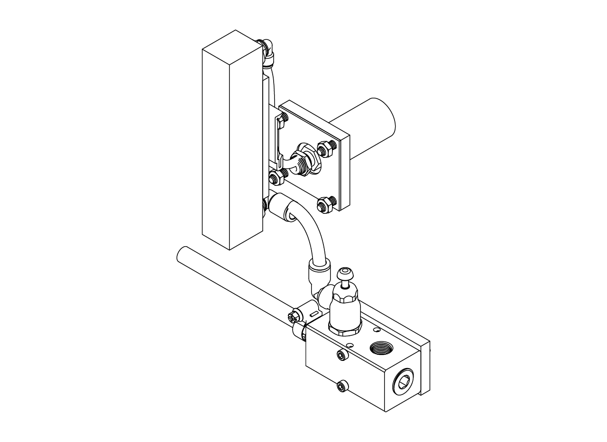
  
<figcaption><small>Air supply module.</small></figcaption>

</figure>

## Manifold assembly

If the air puffs are going to be used, we recommend to add the pressure gauge during this step, otherwise place a plug instead of the gauge on the second outlet of the manifold. First, install a 1/2 NPT plug and a 1/4" ID x 1/2 NPT male barbed hose fitting in the manifold, then install the pressure gauge or another plug if air puffs are not going to be installed. Finally, install a 3/8 NPT male inlet x 3/8" push-to-connect female outlet air flow control valve into the first outlet of the manifold.

<figure>
  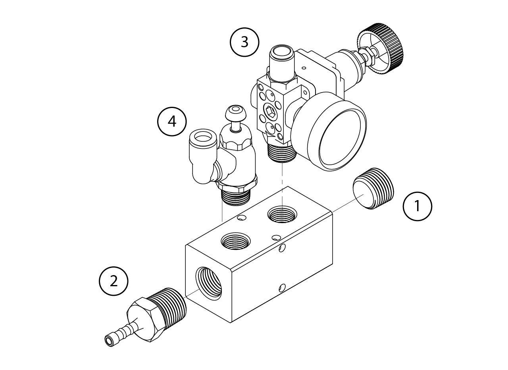
</figure>

Once assembled, place the manifold in the lower T-slotted profile at the left side of the cabinet (the same as the DIN rails). First, use a T-slotted framing drop-in nut with spring tab, 5/16"-18 thread size and insert a pair of them on the profile. Then, place the pair of 10-24 square nuts at the back of the 3D printed frame to manifold adapter and using 5/16"-18 x 1/2" long low-profile screws screw it to the frame.

Attach the manifold to the adapter using a pair of 10-24 x 1-7/8" long screws.

<figure>
  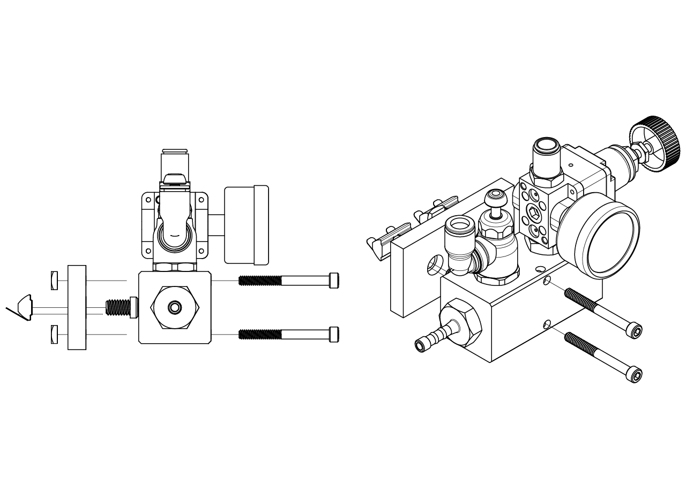
</figure>

## Air flowmeter assembly

To assemble the air flowmeter first attach at the top outlet a push-to-connect tube fitting for air
90 degree swivel elbow, for 1/4" tube OD x 1/4 NPT male, and at the bottom inlet a push-to-connect tube fitting for air 90 degree swivel elbow, for 3/8" tube OD x 1/4 NPT male. Then, use a couple of 10-32 x 5/16" long screws to attach the air flowmeter to DIN mounting clip adapter to the air flowmeter. Finally, use a number 8 x 5/16" long rounded head thread-forming screws to attach a spring clip DIN rail mounting adapter.

<figure>
  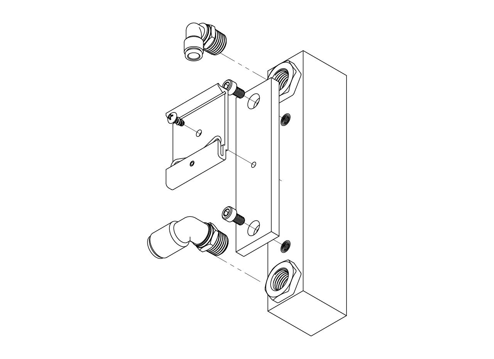
</figure>

Attach the airflowmeter to the din rail by inserting the bottom part only and push it from the bottom up and forward at the same time.

<figure>
  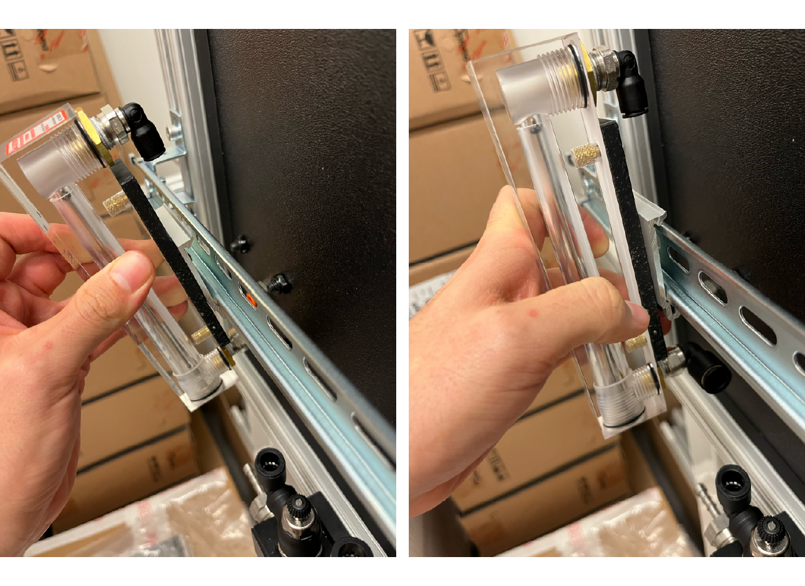
</figure>

Then, insert a firm polyurethane tubing for air 1/4" ID, 3/8" OD from one end into the inlet of the air flowmeter until it click and the tube can't come out of the connector, then measure the distance to the air flow control valve outler connector (bottom of the connector, as seen in the pictures below), cut the hose and connect the hose.

<figure>
  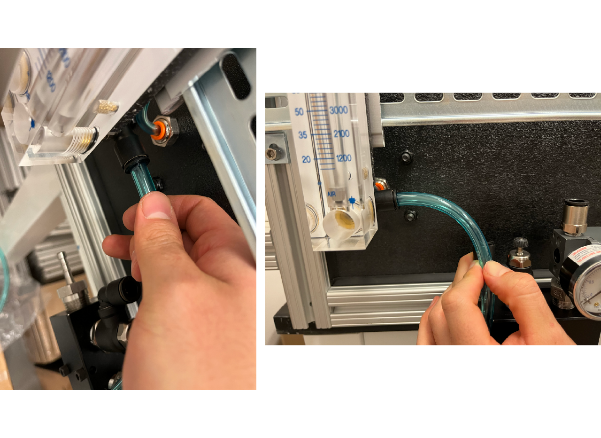
</figure>

<figure>
  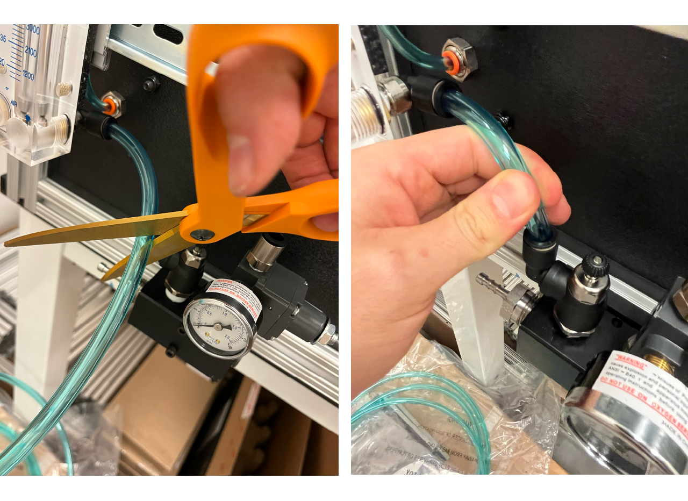
</figure>

## Air flow adapter

To install the air flow adapter, first screw the push-to-connect tube fitting through-wall adapter, 1/4" tube OD x 1/4 NPT female in the cabinet hole. Then, screw the 1/4 NPT male air nozzle from inside the cabinet in the adapter, and over it insert the air supply to ball adapter to panel gasket and the 3D printed sose to panel adapter, use 4 1/4"-20 x 3/4" long screws and 4 1/4"-20 locknuts to attach it to the panel. Follow the same procedure to connect a 1/8" ID, 1/4" OD firm polyurethane tubing for air from the flowmeter outlet to the cabinet inlet.

<figure>
  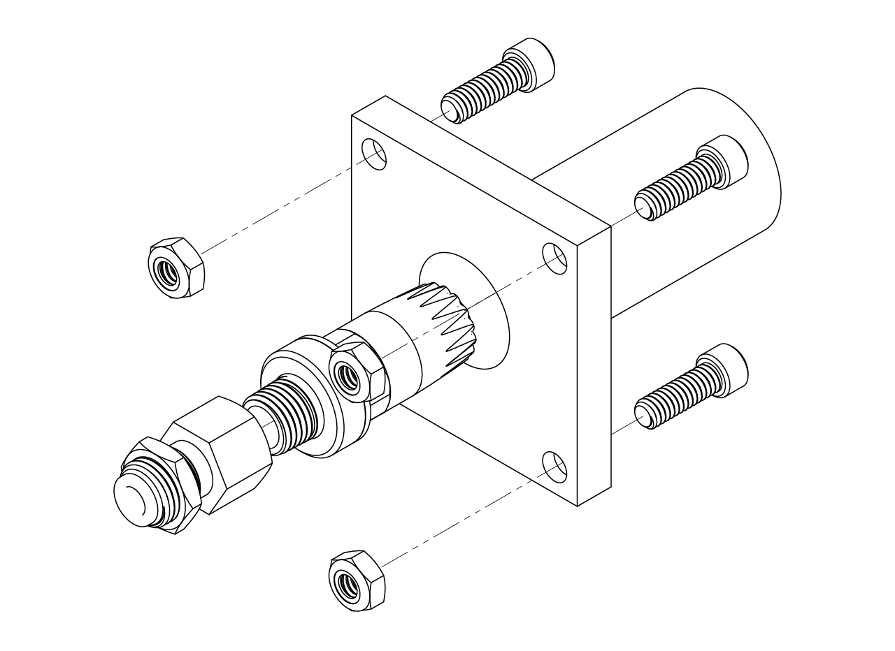
</figure>

<figure>
  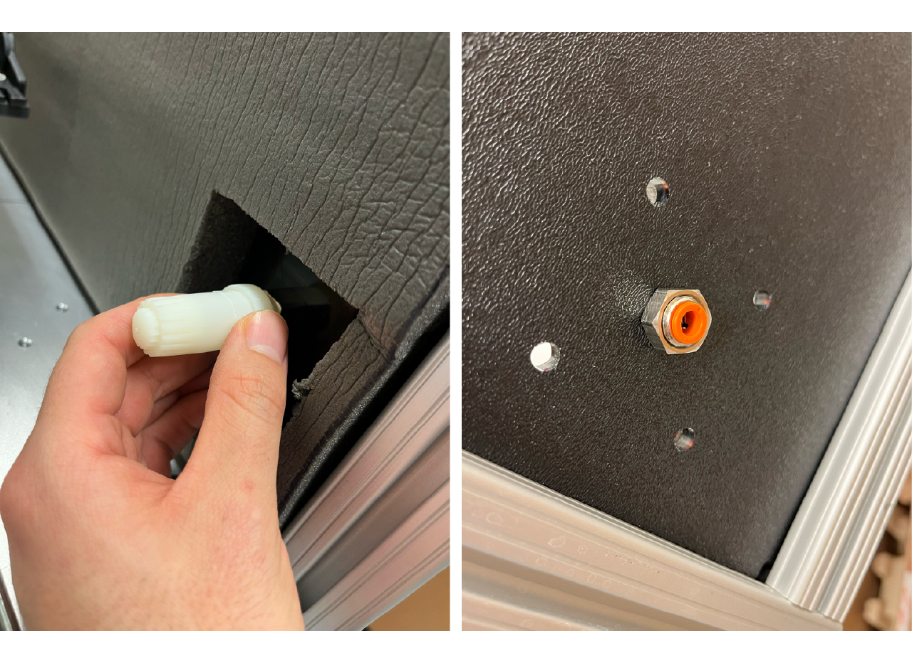
</figure>

<figure>
  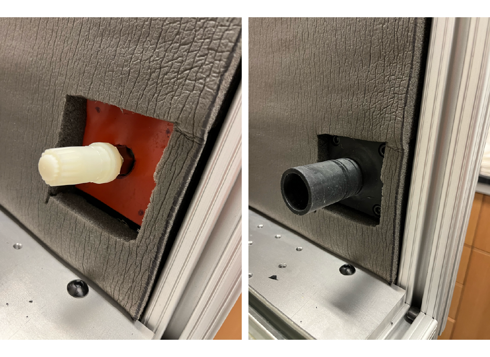
</figure>

<figure>
  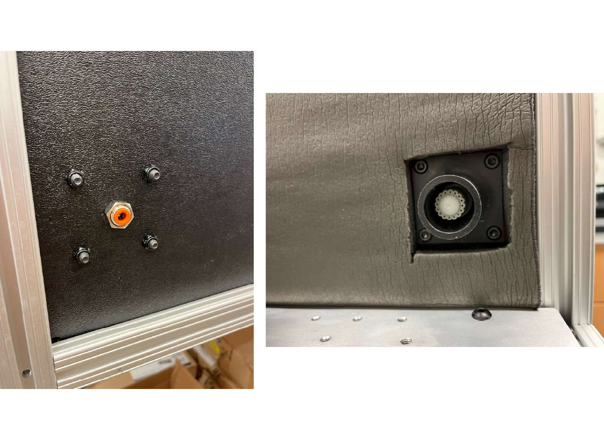
</figure>

Use a very flexible PVC duct hose, 1 1/4" ID, 1 1/2" OD, and attach one screw-on fitting, PVC, for 1 1/4" ID to one end and connect it to the adapter in the cabinet; pull the stage all the way out and measure the length of the hose, cut it and attach a fitting to the other end, finally connect it to the cup in the stage.