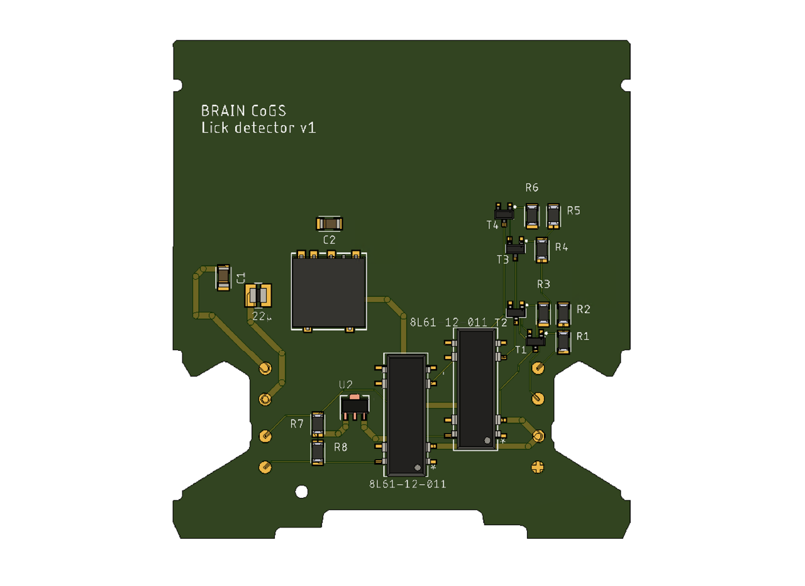

# {{ $frontmatter.title }}

The lick detection module is based on a simple transistor design (Slotnick 2009), we modified the design to allow the detection of 2 lick spouts in the same module. Additionally, we added a DC-DC converter to isolate the circuit from the power source and added a 5V voltage regulator after the relays to have a TTL signal at the output of both circuits.

[comment]: # (Add diagram of the modified circuit with the explanation of the inputs and outputs)

The module was designed this way to enable a specific task that require the use of two spouts, but it can also be used in a one spout setting (e.g count the number of licks during a task). Below is an example of a setup using two lick spouts during a decision making task developed by one member of the BRAIN CoGS team.

[comment]: # (Drawing of the two lick spout setting)

## Two lick detection module assembly

Have the PCB fabricated [here](https://www.pcbway.com/project/shareproject/Two_spouts_lick_detector_059c7e07.html) (or download the GERBER files and have it made elsewhere). The step by step instructions to solder the components on the solenoid valve driver from the [control module](/building/control.html#solenoid-valve-driver-assembly) can be used as well for this module, making sure to use the appropiate components and placing them as labeled in the PCB.

<figure>
  
</figure>

| Label | Part No. | Description |
| ----------- | ----------- | ----------- |
| R1, R2, R4, R5 | [AC1206FR-0710ML](https://www.digikey.com/en/products/detail/yageo/AC1206FR-0710ML/5897214) | 10M Ohm resistors |
| R3, R6 | [AC1206FR-0747KL](https://www.digikey.com/en/products/detail/yageo/AC1206FR-0747KL/5897559) | 47K Ohm resistors |
| R7, R8 | [AC1206FR-0710KL](https://www.digikey.com/en/products/detail/yageo/ac1206fr-0710kl/5897213) | 10K Ohm resistors |
| T1, T2, T3, T4 | [MMBT2222LT1G](https://www.digikey.com/en/products/detail/onsemi/mmbt2222lt1g/919595) | BJT Transistor NPN |
| 8L61-12-011 (2) | [8L61-12-011](https://www.digikey.com/en/products/detail/coto-technology/8l61-12-011/1914969) | Relay reed SPDT 250MA 12V |
| U2 | [UA78L05ACPKE6](https://www.digikey.com/en/products/detail/texas-instruments/ua78l05acpke6/9860880) | Linear Voltage Regulator |
| No label (middle big square) | [TRS 2-2412](https://www.digikey.com/en/products/detail/traco-power/trs-2-2412/9383650) | Isolated Module DC DC Converter |
| C1 | [CL31B475KBHNNNE](https://www.digikey.com/en/products/detail/samsung-electro-mechanics/cl31b475kbhnnne/3888447) | 4.7 µF Ceramic Capacitor |
| C2 | [CL31C151JBCNNNC](https://www.digikey.com/en/products/detail/samsung-electro-mechanics/cl31c151jbcnnnc/3888469) | 150 pF Ceramic Capacitor |
| 22 micro | [IFSC1008ABER220M01](https://www.digikey.com/en/products/detail/vishay-dale/ifsc1008aber220m01/2744218) | 22 µH Shielded Inductor |

After assemblying the module, place the labels as shown in the picture below.

[comment]: # (Image of the enclosure with labels)

The description of each pin of the lick detector module can be found in the table below.

| PIN | Description |
| ----------- | ----------- |
| 1. GROUND | Input - ground |
| 2. 24V | Input - 24V DC  |
| 3. OUT LEFT | Output - TTL output pin for the left spout |
| 4. OUT RIGHT | Output - TTL output pin for the right spout |
| 5. RIGHT SPOUT | Input - Connect the right spout to this pin |
| 6. LEFT SPOUT | Input - Connect the left spout to this pin |
| 7. HEADPLATE | Input - Connect the headplate to this pin |
| 8. COMMON | Input - Connect the ground from the NiDAQ (or any acquisition device) to this pin |

### Soldering a cable to the feeding spout and headplate

[comment]: # (If possible, add photos of the process)

1. Use sandpaper to remove the outer layer of the stainless steel spout at one of the sides if the luer lock connector (as far as possible from the connector tip), do the same with the headplate (wherever you want to place the cable, we recommend to use the arm without the tapped hole to fit a heat shrinkable tube).

2. Clean the sanded surface with isopropyl alcohol and let it dry. In the meantime, prepare the coaxial cable (we recommend a [26](https://www.digikey.com/en/products/detail/molex-temp-flex/1000660054/4368709) or [28](https://www.digikey.com/en/products/detail/molex/1001935047/8566104) AWG coaxial cable like these ones ) by removing the jacket and the shield, then expose the conductor by removing a portion of the insulation material. Repeat the process on the other end of the cable.

3. Drop a small drop of flux in the sanded surface and place the tip of the solder iron over the flux - the tip might stick to the stainless steel, that's normal - continue heating the surface and use soldering wire (we found lead works best) to solder the coaxial cable to the spout and headplate.

4. Use heat shrinkable tube to cover the soldering spot.