# {{ $frontmatter.title }}

The positioning system is designed to fix the subject within the projection and correct posture boundaries, but also to have high repeatibility, allowing to have specific coordinates for different subjects trained on the same rig. There are two different positioning systems currently used at our facilities, an automated positioning system that ensures repeatibility and personalized positioning for each subject across training rigs and training sessions; and the manual positioning system, which consist of low cost thorlabs components and a positioning tool developed in house.

<figure>
  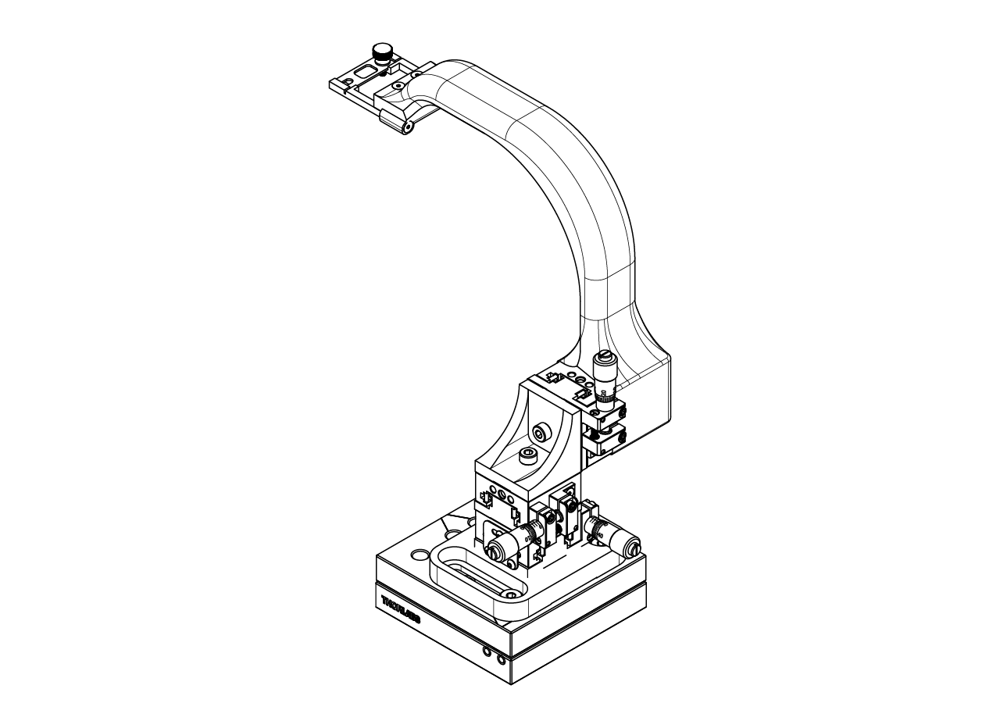
  
<figcaption><small>Automatic (left) and manual (right) positioning system.</small></figcaption>

</figure>

The animal position in the ball should prioritize the correct posture for running whithin boundaries of the projection calibration. The projection is calibrated assuming the animal eyes are going to be positioned 0.256 inches behind the center of the ball on the X axis, 1 inch over the top of the center of the ball on the Y axis and centered along the Z axis. A 0.5 inches range error is acceptable.

<figure>
  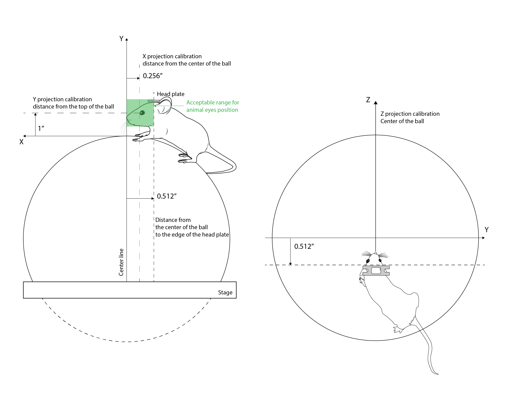
  
<figcaption><small>Projection calibration boundaries and animal position (mouse drawings by <a href="https://doi.org/10.5281/zenodo.3926057">Ethan Tyler</a> and <a href="https://zenodo.org/record/3925997#.YOcrtUwpDRY">Federico Claudi</a> )</small></figcaption>

</figure>

## Automated positioning system

The automated positioning system consist of a set of motorized platforms set in a XYZ configuration. We use the small factor 25mm linear stage (LSA25) from Zaber technologies. A 3D printed arm in Nylon 12 with glass beads - PA12 (MJF) from shapeways - from the top motor (height control) was designed, at the end of the arm we designed a stainless steel headplate holder. The whole assembly is attached to the stage breadboard using a custom adapter.

<figure>
  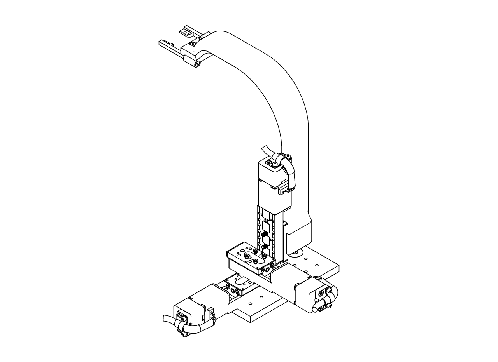
</figure>

The headplate holder has to be designed to fit the head plate to be used in order to minimize the variability in the pitch, roll and yaw of the head plate and the animal position. This way, the motors can have better repeatability by adjusting the antero-posterior, dorso-ventral and medio-lateral position of the animal.

<figure>
  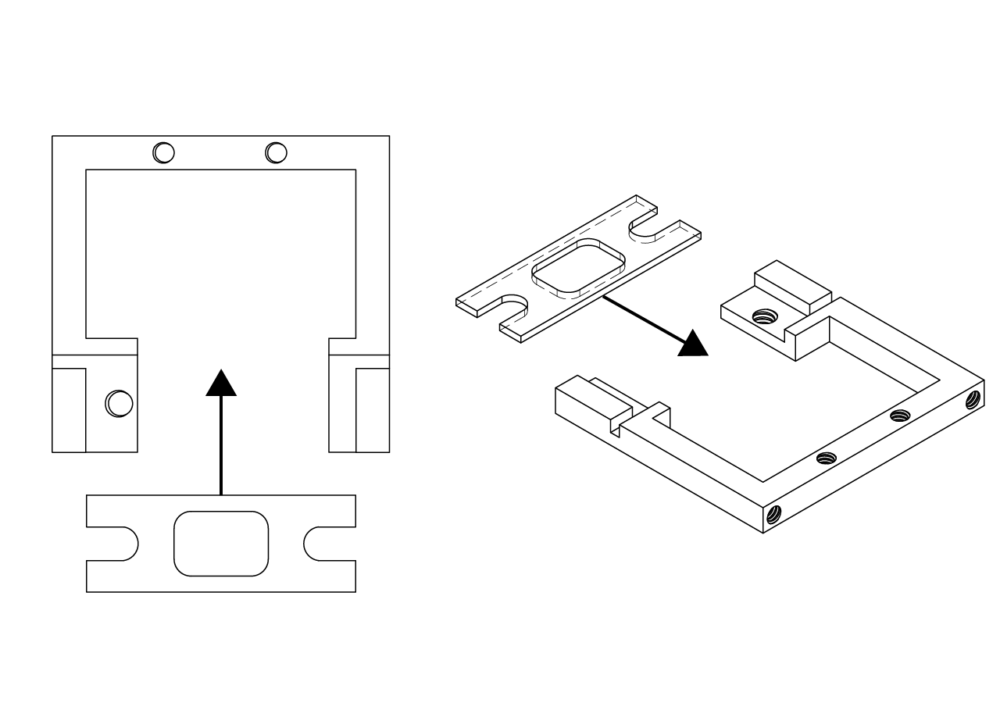
</figure>

The positioning system is designed to be fixed at the expected position of the headplate in the antero-posterior (AP) and mediolateral (ML) position as shown in the picture below when the motorized stages are set at midrange.

<figure>
  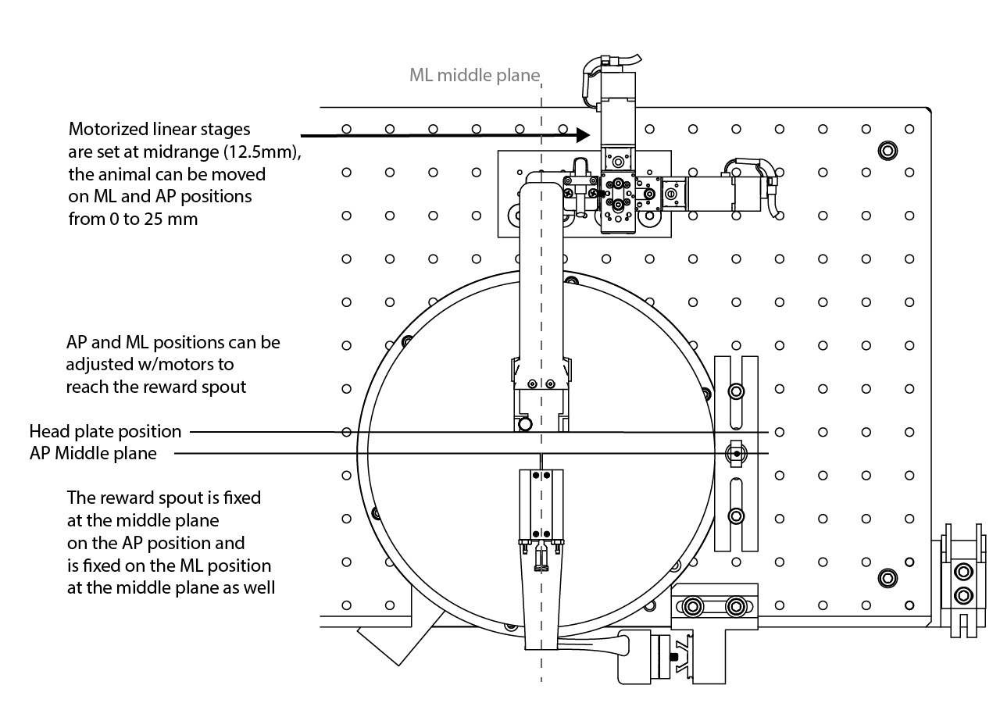
</figure>

To assemble the positioning system, first attach the custom made breadboard adapter to the top stage breadboard at the position shown below using 82 Degree Countersink Angle, 1/4"-20 Thread Size, 1/2" Long Drive Flat Head screws. Then attach the first motorized stage at correct position as shown in the image below using Low-Profile, M3 x 0.5 mm Thread, 5 mm Long screws.

<figure>
  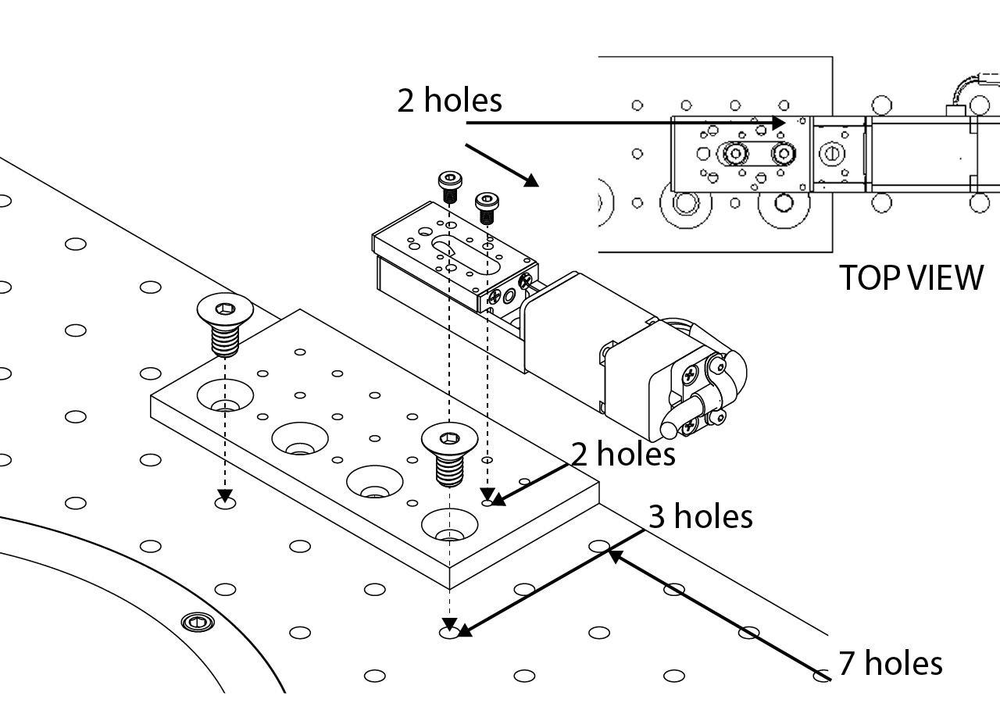
</figure>

Attach the second (AP position) motorized linear stage to the first one using the same kind of screws at the position shown in the image below. Then, attach the Z adapter from zaber technologies (AB106) to the stage using M2 x 0.4 mm Thread, 5 mm Long Low profile socket head screws at the position as shown below.

<figure>
  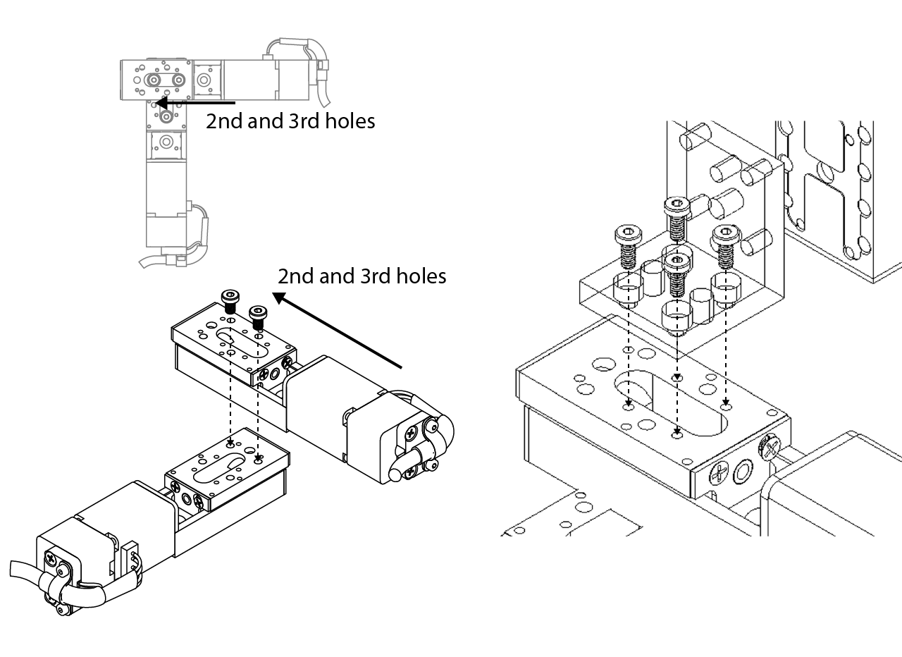
</figure>

Attach the third (DV position) motorized linear stage to the AB106 Zaber adapter using Low-Profile, M3 x 0.5 mm Thread, 5 mm Long screws at the position indicated in the image below. Finally, screw the 3D printed arm to the DV position motorized linear stage using M3 x 0.5 mm Thread, 30 mm Long Hex Drive Flat Head screws as shown below.

<figure>
  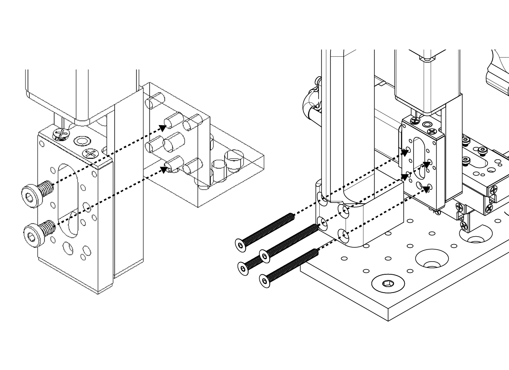
</figure>

One of the most importants variables for the mice on the VR tasks are the DV positioning (height), the mice needs to be comfortable enough to properly run on top of the styrofoam ball. The automated positioning system allows to set customizable heights for each subject. The whole coordinated of the subjects can also be stored on a DB and retrieved before training, which improves the repeatibility and decreases the time needed to set the subjects.

## Manual positioning system

The manual positioning system consist of a set of Thorlabs and custom made parts. To assemble it, first attach a 4" post (either PSR-4.0 from siskiyou or RS4 from Throlabs) at the position of the top stage breadboard shown in the image below. Then, attach a 3" post (RS3 from Thorlabs) on top of the previous installed posts.

<figure>
  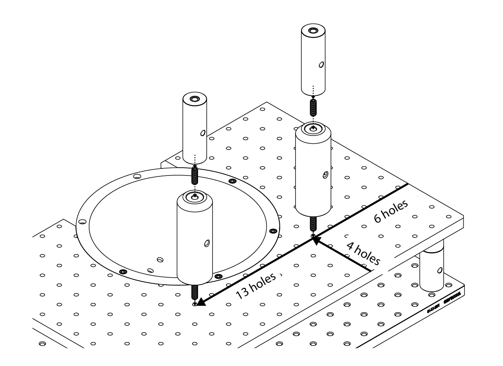
</figure>

Screw down a RB2 part from Thorlabs down the right post (looking at the stage from behind), then attach a TR1 using a 4-40 screw to the RB2 clamp. Then slide down and tight a RA90 Thorlabs part to the TR1 post as indicated in the image below.

<figure>
  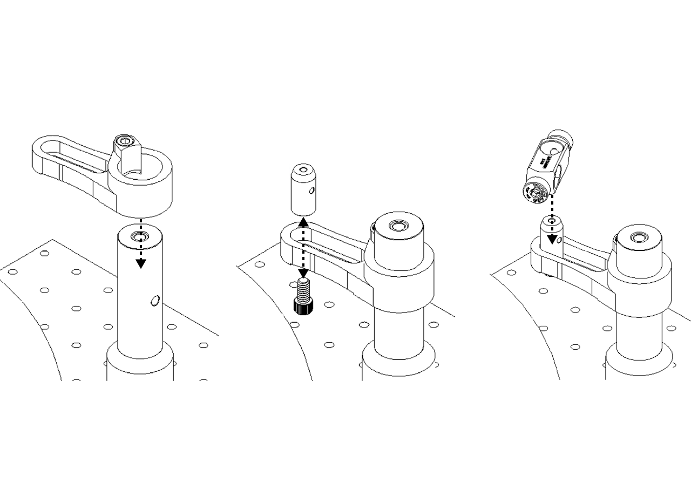
</figure>

Finally, screw the custom made stainless steel head plate adapter to the a TR2 post from Thorlans, then attach it to the RA90 and tight it down as shown below.

<figure>
  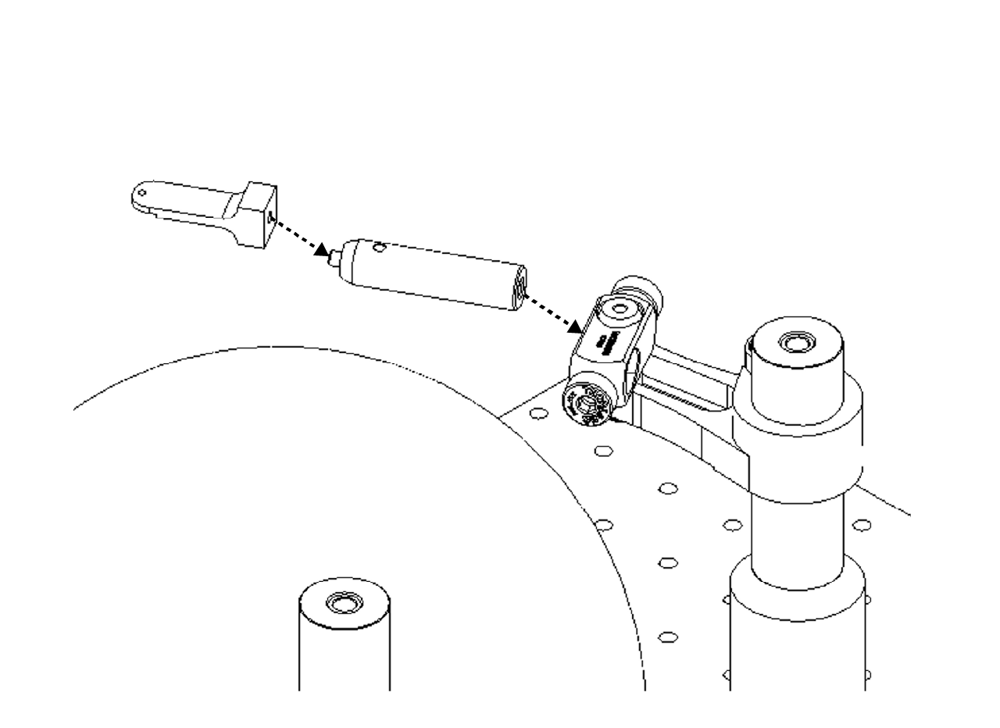
</figure>

A positioning tool was designed taking as reference the 2 pillars that are part of the stage of the mini VR rig. The tool consist on a 3D printed part that hold a glued transparency, lines are made with a marker for the Y position of the animal (1st and 2nd dents of the tool) and the Z line (A and B arrows on the tool). The user can easily use this tool to adjust the animal in the right X and Y position, and the height must be fine tuned to allow the animal to run comfortable.

The tool also has space to add a magnet fixed with epoxy resin on the pillars holes to be steady when placed on top of the pillars.

::: warning
The pillars must be placed in the correct holes of the breadboard as shown in the figure, otherwise the distance from the center of the ball could be wrong.
:::

<figure>
  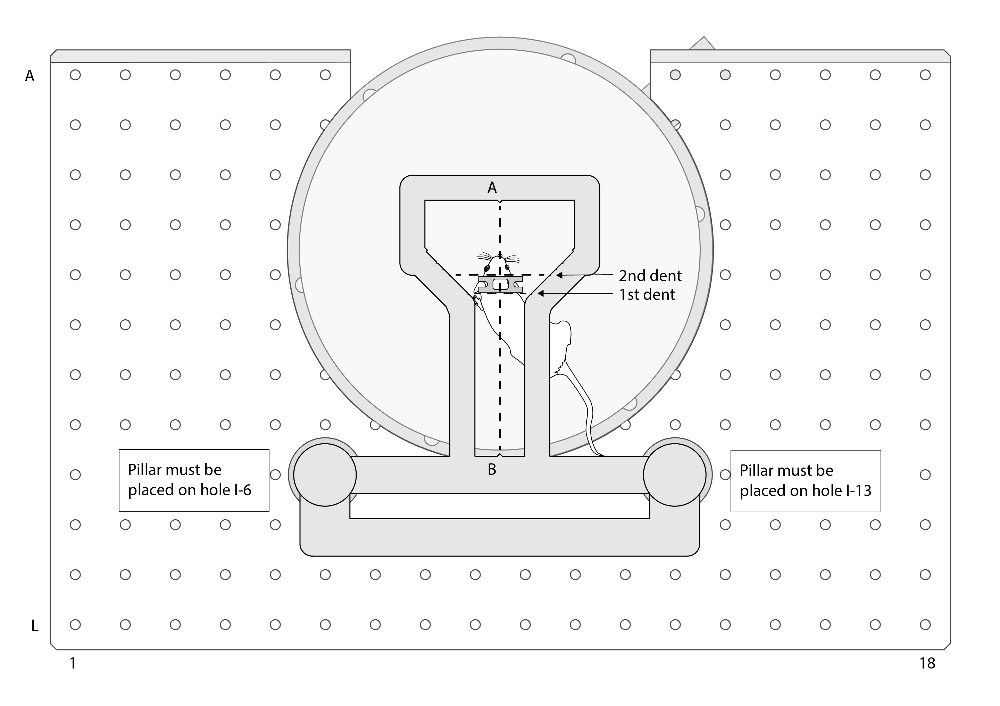
  
<figcaption><small>Positioning tool and animal placement (mouse drawings by <a href="https://zenodo.org/record/3925997#.YOcrtUwpDRY">Federico Claudi</a> )</small></figcaption>

</figure>