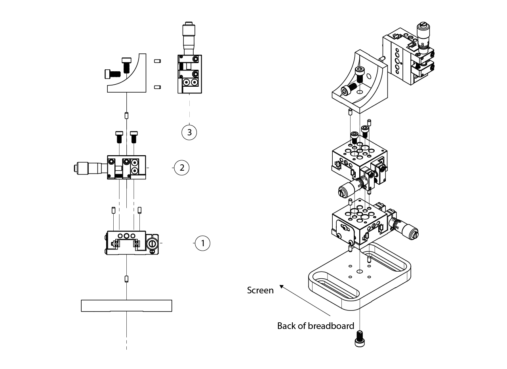
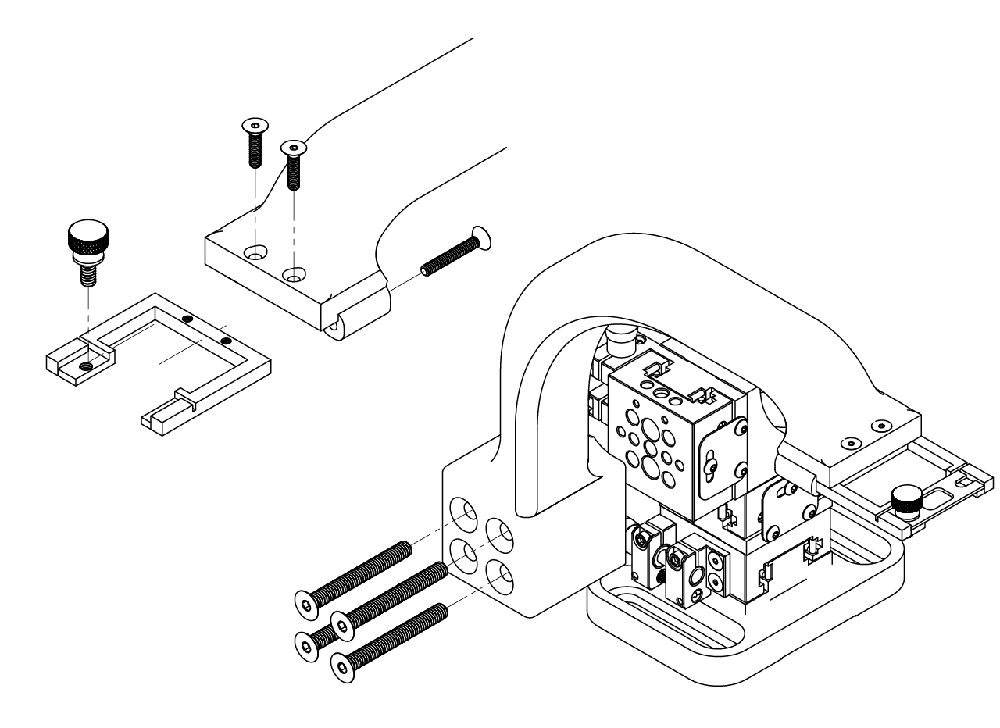
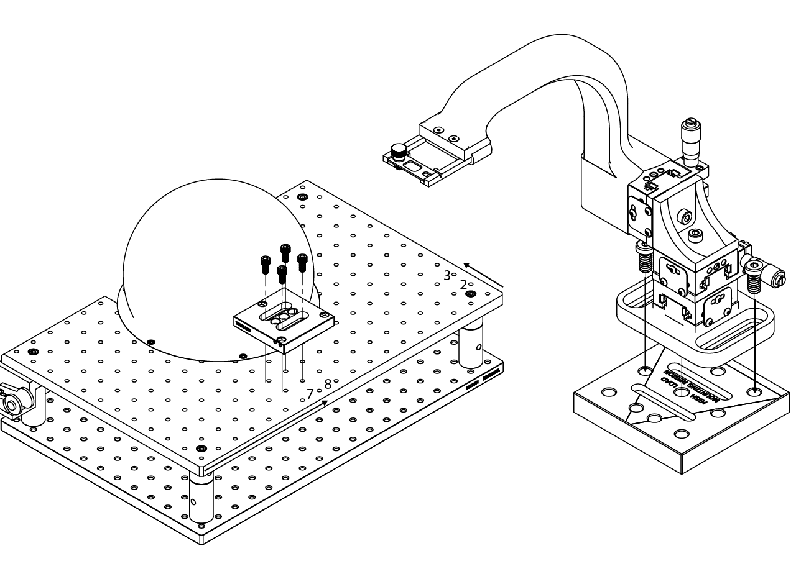

# {{ $frontmatter.title }}

The positioning system is designed to fix the subject within the projection and correct posture boundaries, but also to have high repeatibility, allowing to have specific coordinates for different subjects trained on the same rig.

<figure>
  
  
<figcaption><small>Positioning system.</small></figcaption>

</figure>

The animal position in the ball should prioritize the correct posture for running whithin boundaries of the projection calibration. The projection is calibrated assuming the animal eyes are going to be positioned 0.256 inches behind the center of the ball on the X axis, 1 inch over the top of the center of the ball on the Y axis and centered along the Z axis. A 0.5 inches range error is acceptable.

<figure>
  
  
<figcaption><small>Projection calibration boundaries and animal position (mouse drawings by <a href="https://doi.org/10.5281/zenodo.3926057">Ethan Tyler</a> and <a href="https://zenodo.org/record/3925997#.YOcrtUwpDRY">Federico Claudi</a> )</small></figcaption>

</figure>

To ensure repeatibility in the positioning of the mouse, we designed a positioning system based on the assembly of 3 6.5 mm travel micropositioners in a XYZ configuration. This is mounted on a kinetic base, making it easy to remove it when the styrofoam ball need to be taken out to clean after the training is done. Then we designed a 3D printed arm that will hold a custom made stainless steel headplate holder in the correct position within the boundaries of the projection calibration, with a 6.5 mm travel in all direction to account for mice idiosyncrasies.

::: tip
We have noticed that the most important variable for a correct posture and better quality training in terms of performance and number of trials is the height of the headplate holder with respect to the styrofoam ball. To set it properly, we mount a camera and IR LED at the side to monitor the posture during training.
:::

## Positioning system assembly

To assemble the positioning system, follow the next steps.

1. Assemble the 3 axis micropositioner system, use a M4 x 0.7 mm thread, 8 mm long screw and a pair of 3/32" diameter, 3/16" long dowel pins to screw the first MS1S/M (you could also use a MS1S if you're more comfortable with imperial system) micropositioner to a MS101 baseplate, the micrometer should be facing the back of the plate. Then, use a couple of M3 x 0.5 mm thread, 6 mm long and a pair of 3/32" diameter, 3/16" long dowel pins to screw the second micropositioner on top of the first one, make sure that the micrometer is facing the left part of the baseplate. Use a M4 x 0.7 mm thread, 8 mm long screw and a couple of 3/32" diameter, 3/16" long dowel pins to attach a MS102 Thorlabs bracket to the top of the micropositioner, making sure the bracket is facing the right part of the baseplate. Finally, use a M4 x 0.7 mm thread, 8 mm long screw and a pair of 3/32" diameter, 3/16" long dowel pins to screw the last micropositioner, the micrometer should be facing the top of the baseplate.

<figure>
  
</figure>

2. Have the arm 3D printed (we recommend any high stiffness material like PA12GB), and have the headplate holder machined (we recommend having it made in stainless steel). Then attach the headplate holder to the arm using a pair of 2-56 thread Size, 3/8" long flat head screws from the top of the arm and a pair of 2-56 thread Size, 5/8" long flat head screws from the back of the arm. We use a 4-40 thread Size, 1/4" long stainless steel flared-collar knurled-head thumb screw to hold in place the headplate since it is easy to screw it using the hands without any tool. Finally, screw the arm to the micropositioner array using 4 M4 x 0.7 mm thread, 35 mm long flat head screws.

<figure>
  
</figure>

3. Finally screw the micropositioners into the top part of a kinetic base using 2 1/4"-20 screws as shown in the picture below. Then attach the bottom part of the kinetic base to the top breadboard of the stage in the position shown below, make sure the bottom and top kinetic base matches and the position of the arm is the right one.

<figure>
  
</figure>

## Legacy positioning system

The animal position in the ball should prioritize the correct posture for running whithin boundaries of the projection calibration. The projection is calibrated assuming the animal eyes are going to be positioned 0.256 inches behind the center of the ball on the X axis, 1 inch over the top of the center of the ball on the Y axis and centered along the Z axis. A 0.5 inches range error is acceptable.

<figure>
  
  
<figcaption><small>Projection calibration boundaries and animal position (mouse drawings by <a href="https://doi.org/10.5281/zenodo.3926057">Ethan Tyler</a> and <a href="https://zenodo.org/record/3925997#.YOcrtUwpDRY">Federico Claudi</a> )</small></figcaption>

</figure>

To this end, a positioning tool was designed taking as reference the 2 pillars that are part of the stage of the mini VR rig. The tool consist on a 3D printed part that hold a glued transparency, lines are made with a marker for the Y position of the animal (1st and 2nd dents of the tool) and the Z line (A and B arrows on the tool). The user can easily use this tool to adjust the animal in the right X and Y position, and the height must be fine tuned to allow the animal to run comfortable.

The tool also has space to add a magnet fixed with epoxy resin on the pillars holes to be steady when placed on top of the pillars.

::: warning
The pillars must be placed in the correct holes of the breadboard as shown in the figure, otherwise the distance from the center of the ball could be wrong.
:::

<figure>
  
  
<figcaption><small>Positioning tool and animal placement (mouse drawings by <a href="https://zenodo.org/record/3925997#.YOcrtUwpDRY">Federico Claudi</a> )</small></figcaption>

</figure>