# {{ $frontmatter.title }}

 The projection module consist on the screen assembly inside the cabinet, a projector is positioned at the back of the exterior part of the cabinet and it throws the image towards an spherical mirror attached to the cabinet positioned in the bottom part of the screen. The spherical mirror reflects the image onto the dome screen.

<figure>
  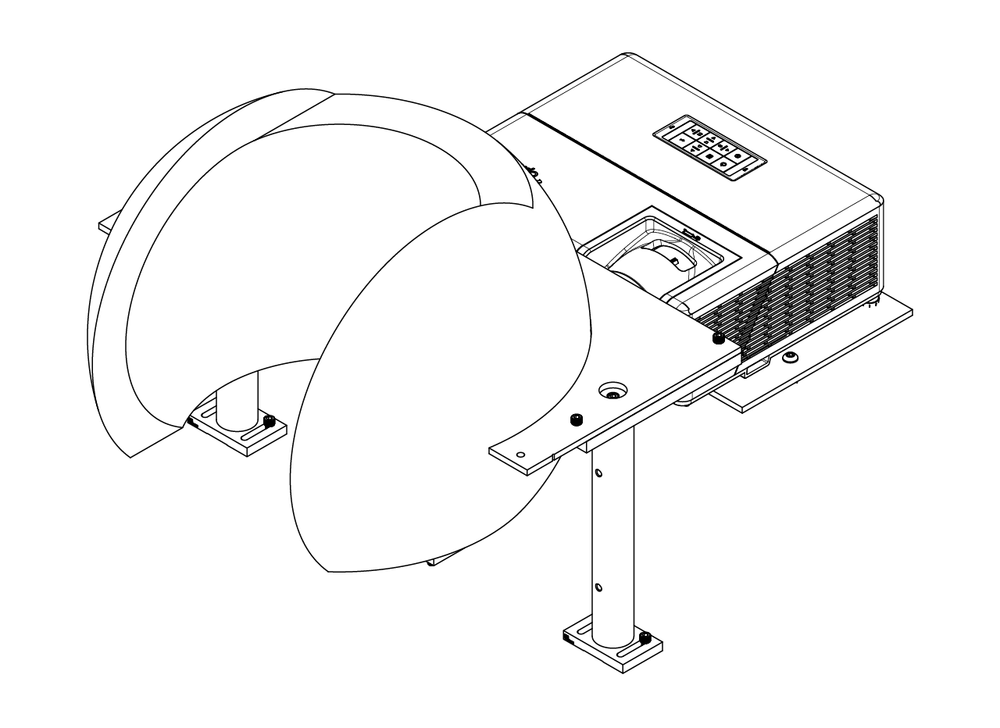
  
<figcaption><small>Projection assembly. The projector is for display purposes only and it is not the same model than the actual one.</small></figcaption>

</figure>

 ## Mirror

The spherical mirror is custom made from Thorlabs with the item number LA1740-P01-SP, be sure to contact them for a quote before polaceing the order and ask for the price breaks if you're planning to build more than 5 training rigs (it could go down up to 50% from 5 to 10 pieces).

We place the spherical mirror on an aluminum custom made base that is sent to a machine shop. The instruction for the assembly are descripted below.

1. Start by assembling the mirror holder, which is composed of the custom made holder, one 1" diameter 2" long post (RS1), one 1" diameter 1.5" long post (RS2) and a BA2 post base from Thorlabs. Use a screwdriver thin enough to pass through the hole at the center of the post and apply enough force to properly screw each piece onto each other.

<figure>
  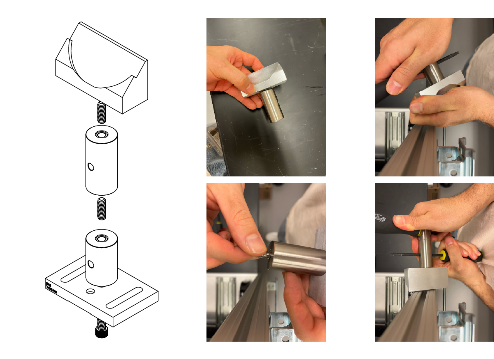
</figure>

2. To align the pieces, screw the base but not all the way. Then, place the pieces on a flat surface and make sure that both the mirror base and the BA2 post base lie completely flat on the surface, apply some force with one of your hands to make sure they stay that way and with the other hand tight screw the base.

<figure>
  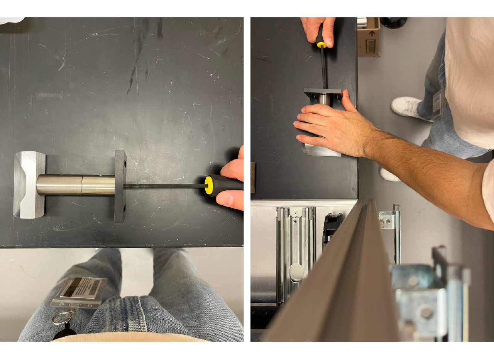
</figure>

3. Use a file to scratch the surface that will hold the mirror, then clean it with ethanol. Use estructural epoxy, follow the instruction on your specific type, and apply to the aluminum base. Make sure to use a nitrile gloves to carefully place the mirror on top of the base and apply some pressure to let it sit flat on the base surface, wait and clean apoxy leakage if any. Let the epoxy dry for 24 hrs.

::: tip
  Apply just a sufficient ammount of epoxy in the middle of the aluminum base, don't spread it all over since it could leak once you place the mirror and apply pressure on it.
:::

<figure>
  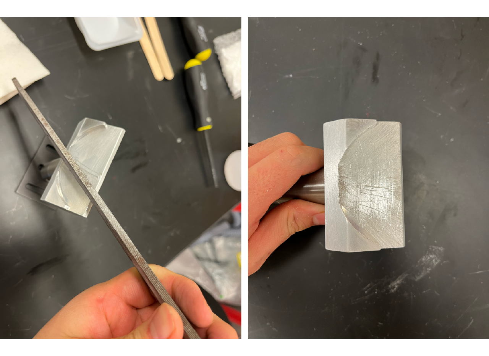
</figure>

<figure>
  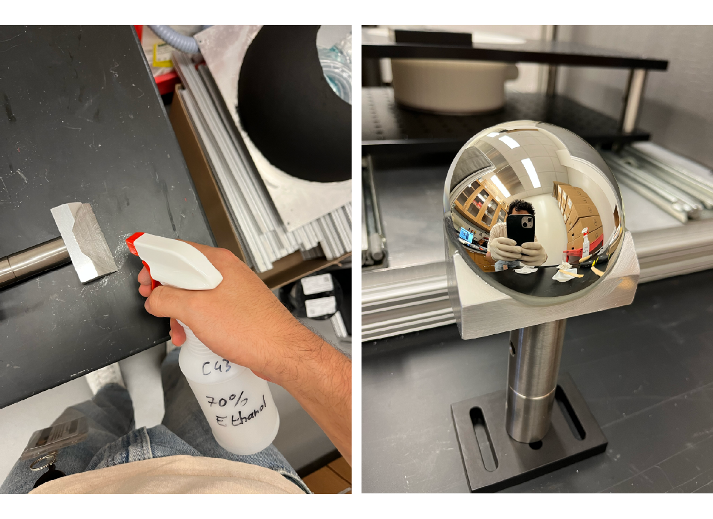
</figure>

4. Screw the mirror and the base to the cabinet bottom plate using 1/4-20 screws, make sure to place the base as far as it can get from the stage (push it all the ways toward the projector, then screw it), as shown below.

<figure>
  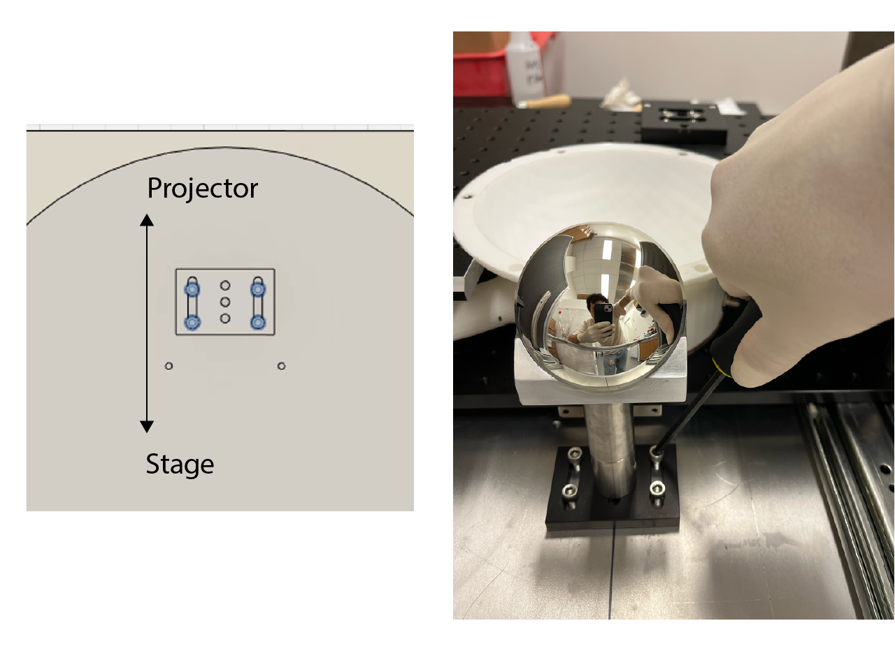
</figure>

 ## Projector

 The projector is installed at the back of the cabinet, at the top of a T-slotted frame structure. To assembly, use a couple of T-slot fasteners and place them on the frame at the back of the cabinet. Then, loosely screw the projector aluminum plate, measure 1 and 1/4 inches from the edge of the plate to the intersection of the frames as shown in the pictures below and tighten the screws. Finally, screw the projector to the aluminum plate.

<figure>
  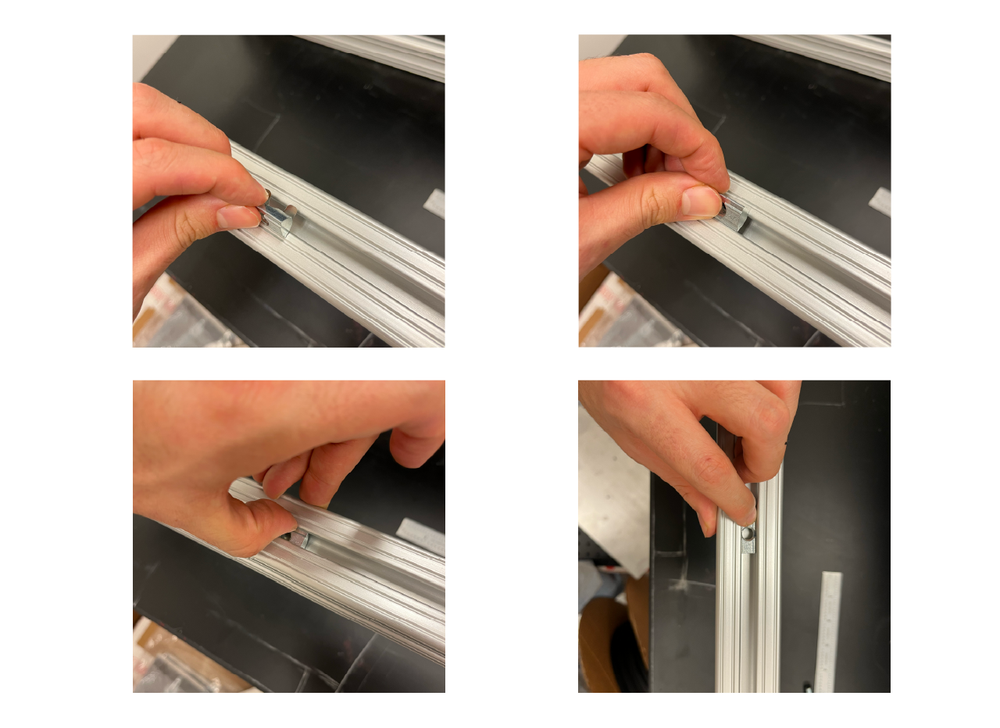
</figure>

<figure>
  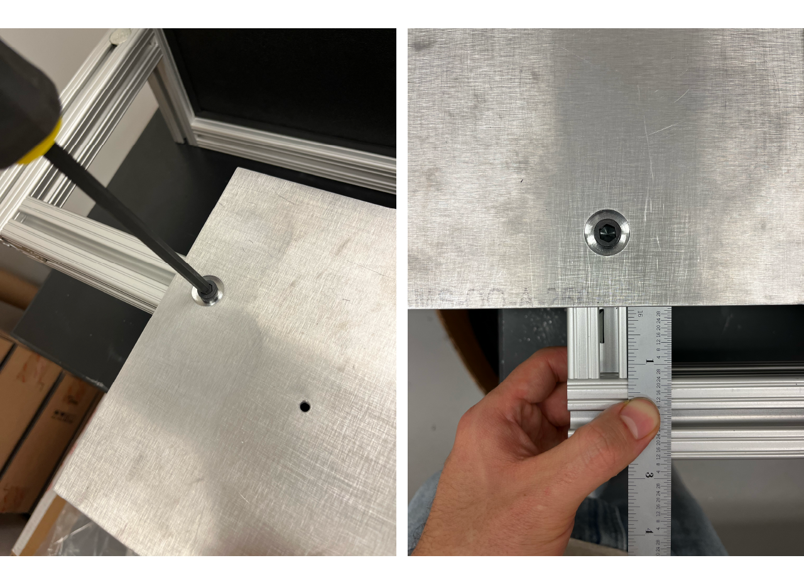
</figure>

<figure>
  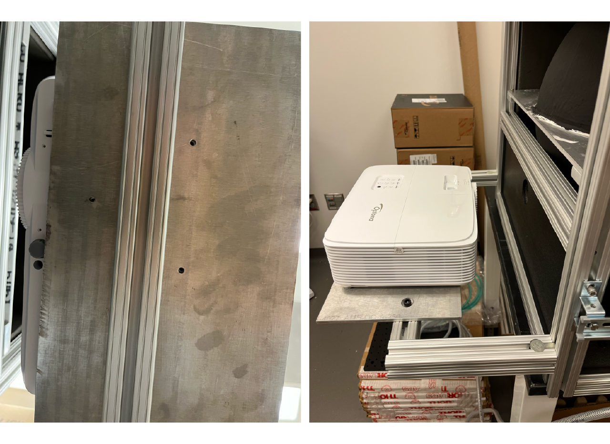
</figure>

 ## Screen building

 The whole process of screen building can take up to 5 days. We describe the whole process in steps, adding which steps we make in a day and the time it took for us to follow the steps. We recommend to do it this way to allow the materials to properly dry. You could use the time it takes to dry to parallelize the work and assembly other modules in the meantime.

 The first step for building the projection module consist on the fabrication of the dome screen. A styrofoam ball of 18" outer diameter and 16" inner diameter is being fabricated by an external provider. For ease of transportation the screens were sent as half spheres.

 ### Day 1 [time: ~3 hours].

 1. If the balls are shipped in halfs, first measure and mark the equator in each of the half spheres. Place a mark at the bottom of the sphere at 9 inches and at 14 inches from one of the sides to the pole using either a tread marked or a soft plastic ruler. We use a laser level to project a straight line through both marks and draw a line with a sharpie.

 <figure>
  
 </figure>

 2. Use 3M Foam Fast 74 CA spray adhesive to glue both half spheres. Spray from 3 to 5 inches away both surfaces and wait for 1 minute, then attach both half spheres making sure to match the equator drawed lines, apply pressure on the union and leave it to dry and harden for at least 15 min.

 <figure>
  
 </figure>

 3. Use lightweight joint compound to fill the line and the holes the adhesive might have caused, use a hand applicator to spread even on the surface trying to keep it as as smooth as possible. Let the joint compound dry from 30 min to 1 hour.

 <figure>
  
 </figure>

 4. Place the aluminum plate in a flat surface making sure is hanging with enough space to fit the screen. Use a sharpie to mark a straigth line by joining the marks in the aluminum plate as seen in the pictures. Place the screen in the plate, making sure to align the equator with the plate and the meridian (the mark where the half spheres where joined) with the plate markers.

    ::: tip
    Sometimes the diameter of the balls is different from the plate, you can use some paper or carboard and tape it to fill the space between the screen and the plate for it to hang properly.
    :::

 <figure>
  
 </figure>

 5. Glue about 5 inches of the sides and the back of the ball with an electric glue gun and wit for it to harden. Once cold, remove taped paper/cardboard and turn the plate around and glue the whole screen to the aluminum plate, wait for it to harden; turn once more time the plate and finish gluing the top part of the screen to the plate.

 <figure>
  
 </figure>

 ### Day 2 [time: ~3 hours]

 1. Place the screen with the plate on a flat surface. We use a couple 14" (1 inch diameter) pillars, other stuff could potentially be used just making sure the ball is freely hanguing from the plate and have enough space (at least ~6 inches) from the bottom of the screen to the flat surface. We place the pillars diagonally for stability.

    Mark a line below 4.75" from the equator of the screen. We use a set of Thorlabs BA2 and 1/2" post (with a post holder) with a 90 degrees 1/2" post holder to insert a sharpie marker as a tool to mark the line. We set the height of the post at 4.75" below the equator and then mark the screen by moving the shapie along making sure the tool is flat on the surface.

 <figure>
  
 </figure>

 2. Place a mark at the half of the scren across the meridian using the same tool as step 1 in day 1. The place the laser level in the flat surface facing the screen, use the vertical laser to throw a projection and align both marks at the half of the screen across the meridian. Mark a line from the top to the bottom of the screen (at least at the bottom line).

 <figure>
  
 </figure>
 
 3. Measure from the joint of the two half spheres 4" to the top and 4.75" to the sides, place a mark and draw by hand a half circle using those 3 points.

 <figure>
  
 </figure>

 4. Place a mark at 4.75" and at 6" from the midline along the joint of the spheres (at the top) and along the equator. Use the laser level to project a line from the top marks to the marks on the equator and draw with a marker a pointed line. 

 <figure>
  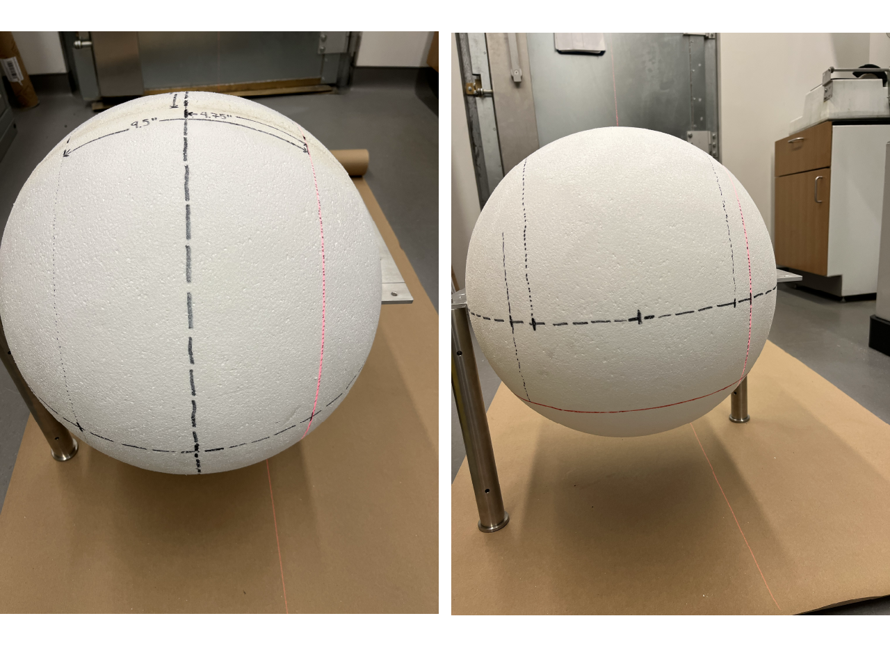
 </figure>
 
 5. Place a mark at 2.5" from the equator to the top of the ball along the 4.75" and 6" lines.

 <figure>
  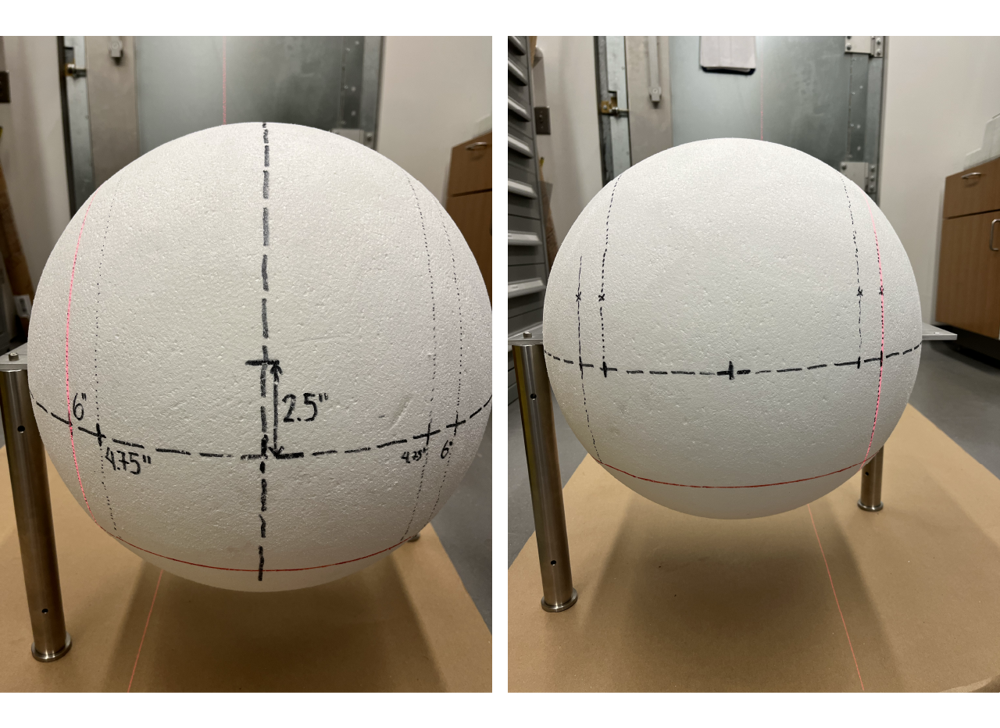
 </figure>

 6. Join with a marker (we used a different color to make it noticeable) the intersections between the pointed lines as shown in the pictures below.

      - (A & I) The intersection between the bottom 4.75" line from the equator and the 6" line from the meridian.
      - (B & H) The intersection between the top 2.5" line from the equator and the 6" line from the meridian.
      - (C & G) The intersection between the top 2.5" line from the equator and the 4.75" line from the meridian.
      - (D & F) The intersection between the top joint of the sphere and the 4.75" line from the meridian.
      - (E) The intersection between the top 4" mark from the top joint of the sphere and the meridian.

      <figure>
         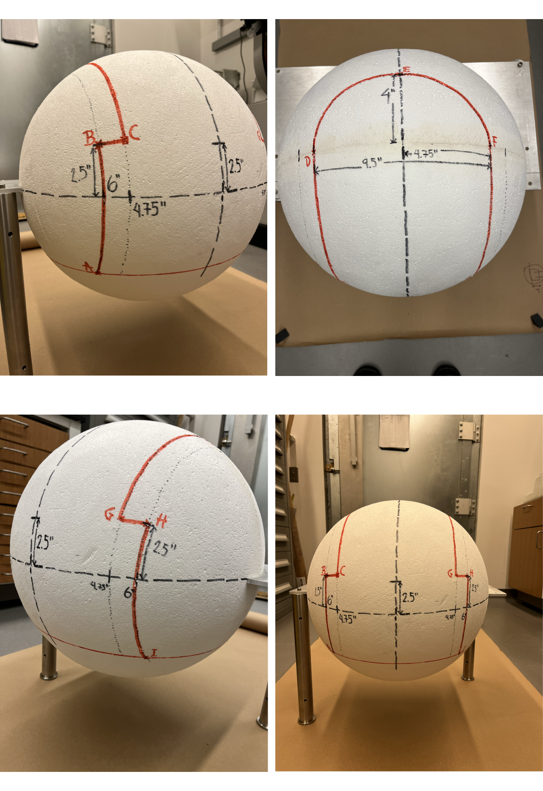
      </figure>

 7. Use a styrofoam cutter (we use the *200 W Pro Electric Hot Knife from RoMech Foam Cutter*) to cut the sphere though the marked lines. We recommend to use a bench vise or C-clamps to hold the sphere through the aluminum plate follow the next steps:

     - Cut the bottom part of the sphere following the line marked at 4.75" below the equator.
     - Cut the line through intersections (B) toward (A).
     - Cut the line through the instersection (D) toward (C).
     - Cut the line through the intersection (B) toward (C).
     - Repeat the steps for the other side.

      <figure>
         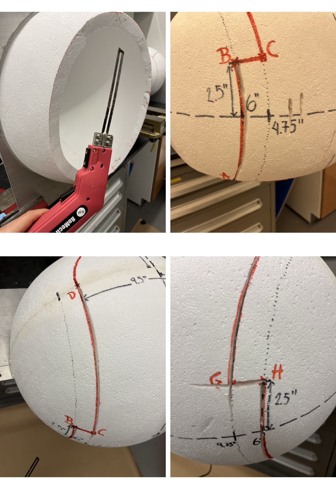
      </figure>

     - Cut the line through the intersection (D) toward (F).
     - Remove cutted styrofoam part as shown in the picture below.

      <figure>
         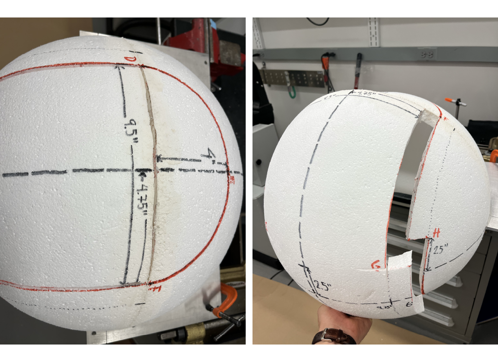
      </figure>

     - Cut a line from the mark (E) toward the bottom of the sphere.
     - Cut a line through the intersection (D) toward (E) and remove the cutted styrofoam part.
     - Cut a line through the intersection (F) toward (E) and remove the cutted styrofoam part.

      <figure>
         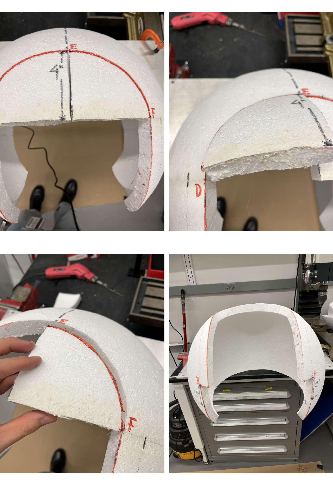
      </figure>

 8. Apply joint compound to the crack on the half spheres intersection from the inside of the screen using a curved rubber wipe down knife. Let it dry overnight and apply a second hand if necessary to have a smooth surface.

 <figure>
   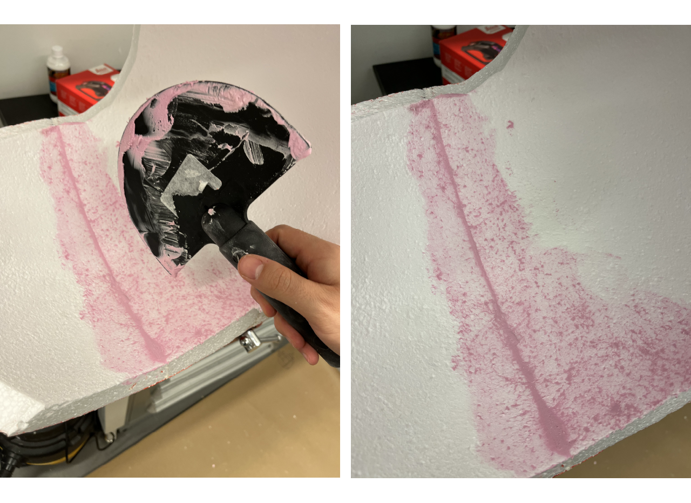
 </figure>

 ### Day 3 [time: ~1 hour]

 1. Apply All purpose foam coat + Bounce from Hot Wire Factory following the instructions for mixing (just make sure the mix is thin enough to handle but thick enough to work as a protective layer). Apply one coat to the exterior part of the sphere, if you find the layer to thin you can apply 2 layers. We recommend to first apply to the top part of the sphere from the aluminum plate, then the bottom part and finally the cutted edges of the sphere (everything but the inner surface of the sphere). Let it dry for 24 hrs.

 <figure>
   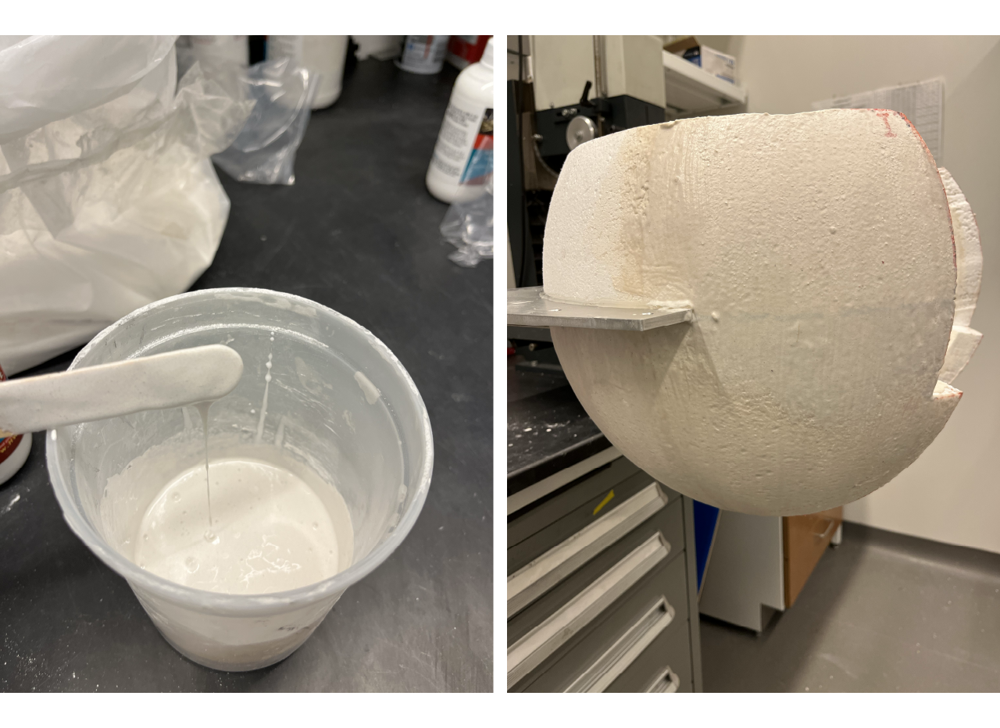
 </figure>

 ### Day 4 [time: ~1/2 hour each layer plus drying time]

 1. Apply white lightweight spackling to the inner surface of the sphere using a curved rubber wipe down knife, making sure cover the imperfections on the surface as much as you can. Let it dry for ~3 hours (or more depending on ambient temperature and humidity), you can touch the surface and it shouldn't stick to your hand. Sand the surface and apply another layer. Repeat the process from 2 to 3 times until you get a smooth surface on the screen.

 <figure>
   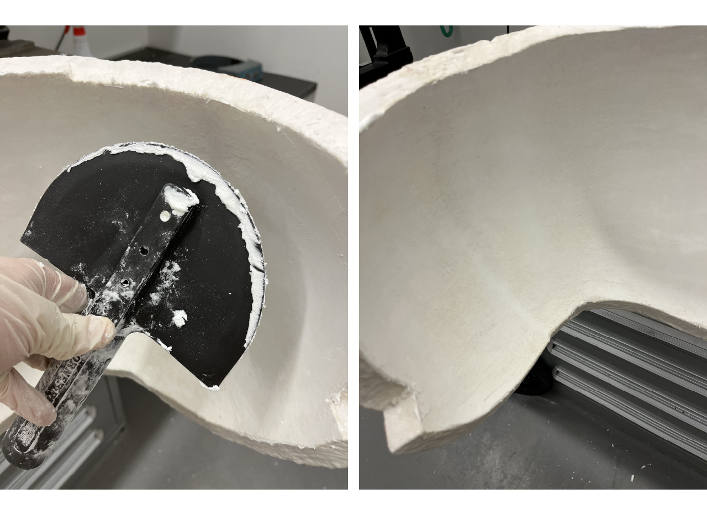
 </figure>

 ### Day 5 [time: ~1/2 hour each layer plus drying time]

 1. Paint the outer part of the screen with a black matte paint (we recommend the black paint on screen wall and ceiling ambien light rejectting acoustic dampening) using a 3" or 4" brush. Do not paint the edges of the screen yet. Apply 2 layers of paint to the outer part.

 2. Use a roller to paint the inner part of the screen. Apply 1 layer of primer (we recommend to use the paint on screen leveling primer) and 2 to 3 layers of silver paint (we use the paint on screen S1 Screen Plus).

 3. Using a 1" brush paint the edges of the sphere with black matte paint.

 <figure>
   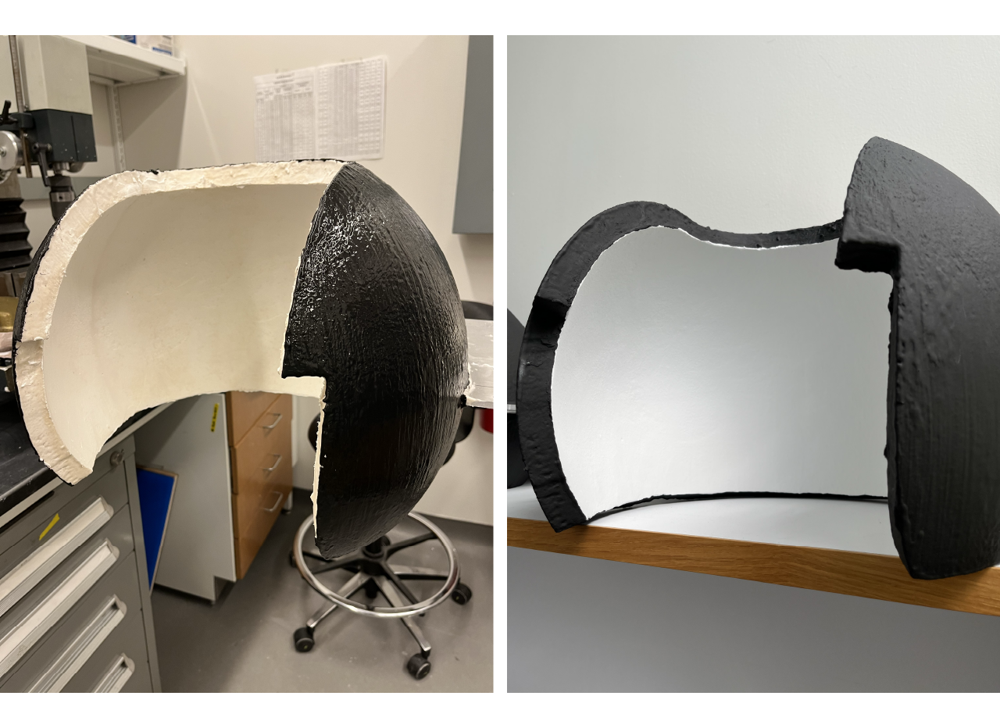
 </figure>

  ## Screen assembly

Once the screen is built, follow the isntructions to install them in the cabinet.

1. Assemble the 1.5" diameter 10" long posts (P10) by screwing a pair of mounting bases (BA2) from Thorlabs at the bottom. Then install the posts to the cabinet bottom plate using 1/4-20 screws at at the closest position to the projector as shown in the picture below.

 <figure>
   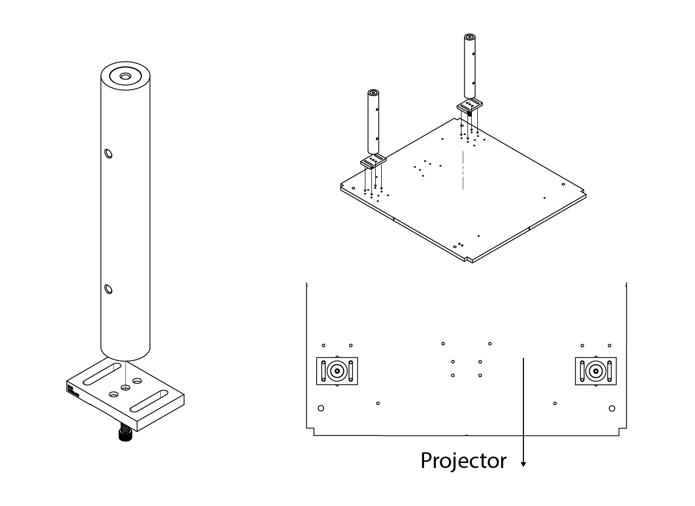
 </figure>

2. Have the custom made aluminum screen plate to post adapter in a machine shop, then screw it to the screen plate and place it over the posts. Tight screw the screen to the posts.

 <figure>
   
 </figure>

 <!-- ## Parts list

 1. 18" OD 16" ID Styrofoam half ball from Fifty-Five Manufacturing/Global Foam Company.
 2. Alignment Laser: 3 Beams, 0 Dots, 0 Lines, Red, 200 ft Range w/o Detector from [Grainger](https://www.grainger.com/product/BOSCH-Alignment-Laser-3-Beams-450W78?internalSearchTerm=Alignment+Laser%3A+3+Beams%2C+0+Dots%2C+0+Lines%2C+Red%2C+200+ft+Range+w%2Fo+Detector&suggestConfigId=8&searchBar=true&opr=THKS)
 3. 3M Foam Fast 74 CA spray adhesive from [Grainger](https://www.grainger.com/product/3M-Spray-Adhesive-3MA18)
 4. Lightweight Spackling from [Grainger](https://www.grainger.com/product/DAP-Lightweight-Spackling-Pail-5E113)
 5. Hand Applicator from [Grainger](https://www.grainger.com/product/3M-Hand-Applicator-Blue-6KHT0)
 6. Wipe Down Knife from [Grainger](https://www.grainger.com/product/KRAFT-TOOL-Wipe-Down-Knife-6-1-2-in-Blade-35EM57)
 7. Glue Gun from [Grainger](https://www.grainger.com/product/3M-Glue-Gun-AE-II-1VAK8)
 8. Hot Melt Adhesive from [Grainger](https://www.grainger.com/product/FASTENMASTER-Hot-Melt-Adhesive-FLEX40-52PF30)
 9. RoMech Foam Cutter - Pro Electric Hot Knife (200W) from [Amazon](https://www.amazon.com/RoMech-Foam-Cutter-Styrofoam-Accessories/dp/B07JBQ58L2)
 10. All purpose foam coat - 3 lbs are enough for ~3 rigs from [Hot wire factory](https://hotwirefoamfactory.com/025_All_Purp_FoamCoat.html)
 11. Bounce Rubberizer - 32 oz are enough for ~3 rigs from [Hot wire factory](https://hotwirefoamfactory.com/025B0-BounceRubberizer.html)
 12. Premium Lightweight Joint Compound from [Grainger](https://www.grainger.com/product/DAP-Premium-Lightweight-Joint-10L498)
 13. Black Wall and Ceiling Ambient Light Rejecting Acoustic Dampening from [Paint on screen](https://paintonscreen.com/products/wall-and-ceiling-ambient-light-rejecting-acoustic-dampening-studio-grey?variant=29416888893463)
 14. 3" or 4" Paint brush from [Grainger](https://www.grainger.com/product/WOOSTER-Paint-Brush-Flat-Sash-Brush-14A035)
 15. Leveling Primer from [Paint on screen](https://paintonscreen.com/products/leveling-primer?variant=1618182144029)
 16. S1 Screen Plus paint from [Paint on screen](https://paintonscreen.com/products/s1-screen-plus?variant=1616223731741) 
 17. Mini paint roller kit from [Grainger](https://www.grainger.com/product/PREMIER-Mini-Paint-Roller-Kit-3-in-29UT49)
 18. 1" Paint brush from [Grainger](https://www.grainger.com/product/SHUR-LINE-Paint-Brush-Angle-Sash-Brush-48WL96)

 ## Drawing 

 1. aluminum plate -->