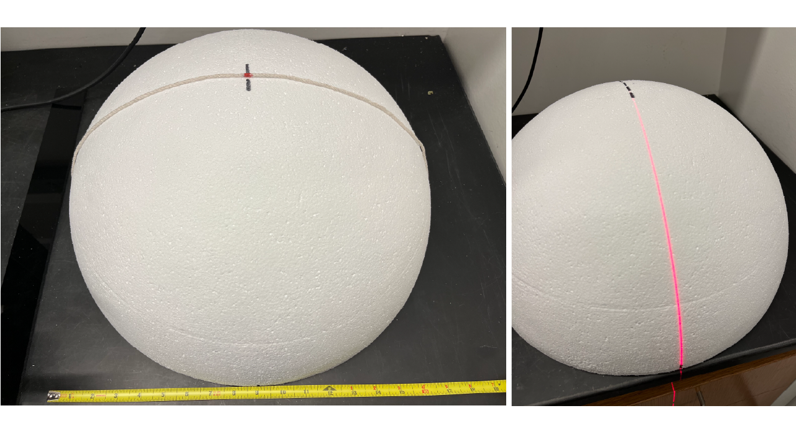
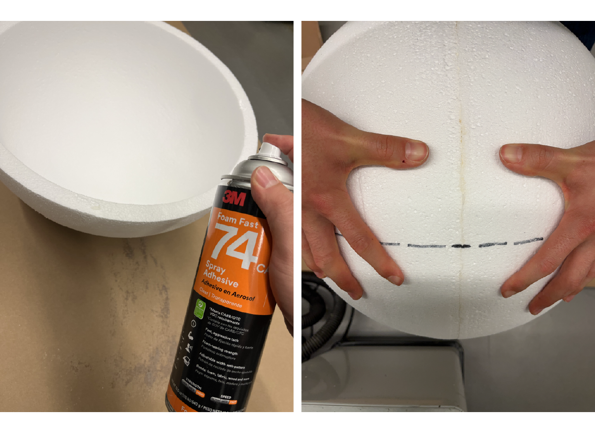
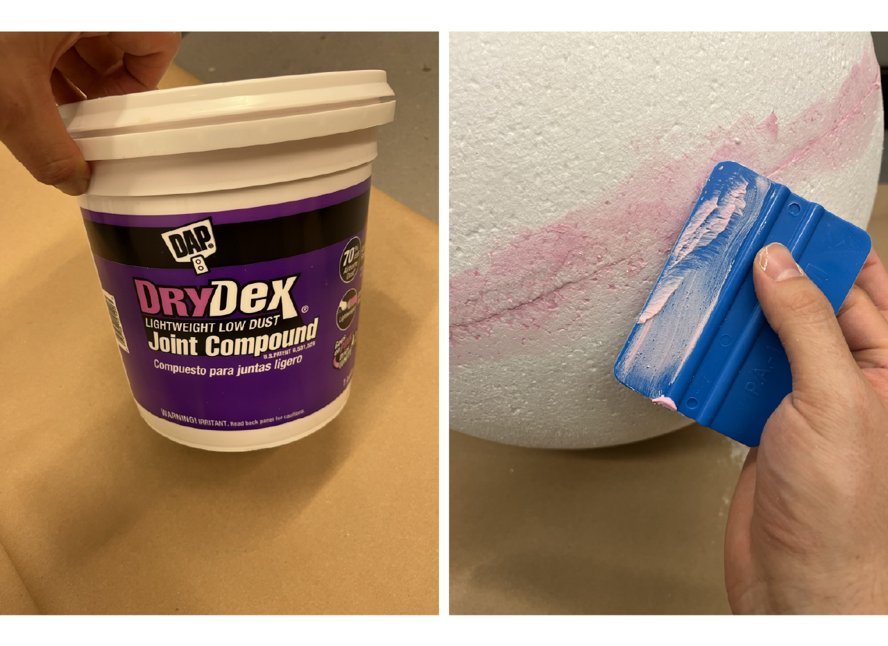
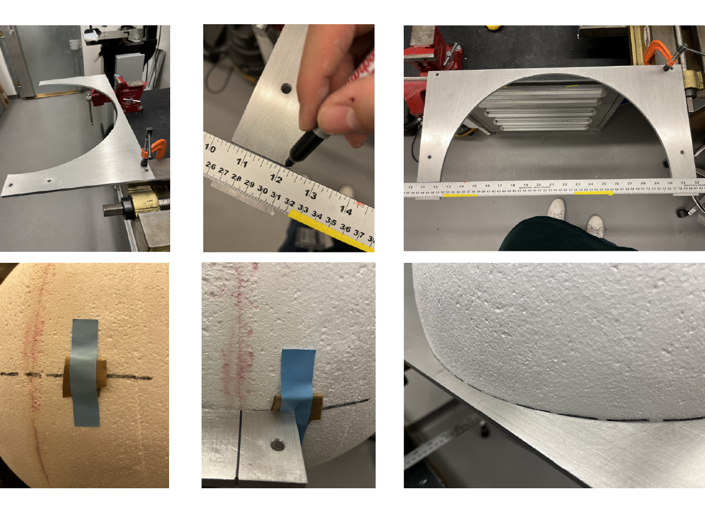
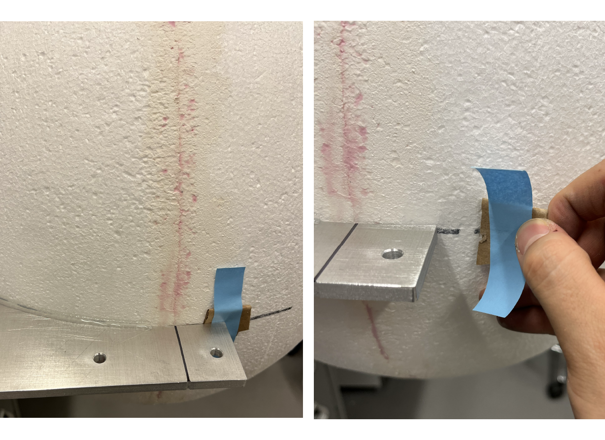
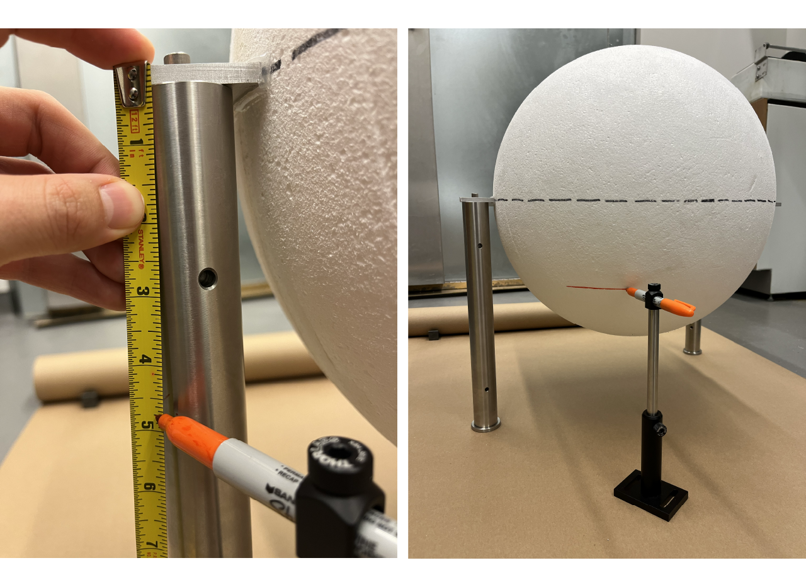
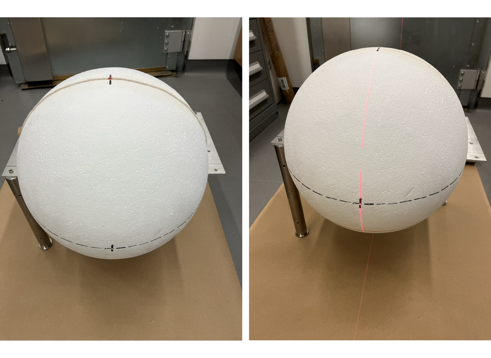
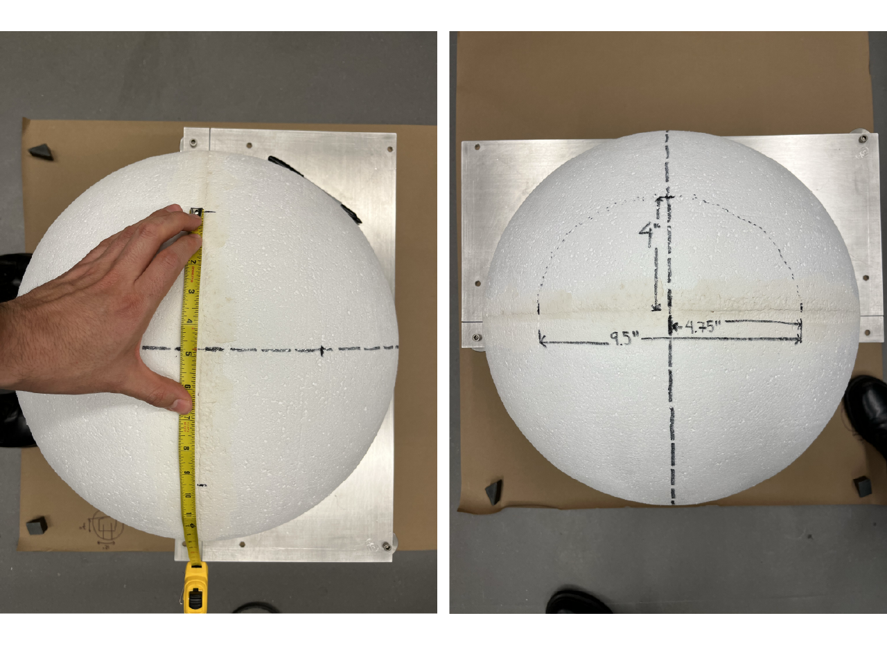

# {{ $frontmatter.title }}

 The projection module consist on the screen assembly inside the cabinet, a projector is positioned at the back of the exterior part of the cabinet and it throws the image towards an spherical mirror attached to the cabinet positioned in the bottom part of the screen. The spherical mirror reflects the image onto the dome screen.

 ## Screen building

 The whole process of screen building can take up to 5 days. We describe the whole process in steps, adding which steps we make in a day and the time it took for us to follow the steps. We recommend to do it this way to allow the materials to properly dry. You could use the time it takes to dry to parallelize the work and assembly other modules in the meantime.

 The first step for building the projection module consist on the fabrication of the dome screen. A styrofoam ball of 18" outer diameter and 16" inner diameter is being fabricated by an external provider. For ease of transportation the screens were sent as half spheres.

 ### Day 1 [time: ~3 hours].

 1. If the balls are shipped in halfs, first measure and mark the equator in each of the half spheres. Place a mark at the bottom of the sphere at 9 inches and at 14 inches from one of the sides to the pole using either a tread marked or a soft plastic ruler. We use a laser level to project a straight line through both marks and draw a line with a sharpie.

 <figure>
  
 </figure>

 2. Use 3M Foam Fast 74 CA spray adhesive to glue both half spheres. Spray from 3 to 5 inches away both surfaces and wait for 1 minute, then attach both half spheres making sure to match the equator drawed lines, apply pressure on the union and leave it to dry and harden for at least 15 min.

 <figure>
  
 </figure>

 3. Use lightweight joint compound to fill the line and the holes the adhesive might have caused, use a hand applicator to spread even on the surface trying to keep it as as smooth as possible. Let the joint compound dry from 30 min to 1 hour.

 <figure>
  
 </figure>

 4. Place the aluminum plate in a flat surface making sure is hanging with enough space to fit the screen. Use a sharpie to mark a straigth line by joining the marks in the aluminum plate as seen in the pictures. Place the screen in the plate, making sure to align the equator with the plate and the meridian (the mark where the half spheres where joined) with the plate markers.

    ::: tip
    Sometimes the diameter of the balls is different from the plate, you can use some paper or carboard and tape it to fill the space between the screen and the plate for it to hang properly.
    :::

 <figure>
  
 </figure>

 5. Glue about 5 inches of the sides and the back of the ball with an electric glue gun and wit for it to harden. Once cold, remove taped paper/cardboard and turn the plate around and glue the whole screen to the aluminum plate, wait for it to harden; turn once more time the plate and finish gluing the top part of the screen to the plate.

 <figure>
  
 </figure>

 ### Day 2 [time: ~2 hours]

 1. Place the screen with the plate on a flat surface. We use a couple 14" (1 inch diameter) pillars, other stuff could potentially be used just making sure the ball is freely hanguing from the plate and have enough space (at least ~6 inches) from the bottom of the screen to the flat surface. We place the pillars diagonally for stability.

    Mark a line below 4.75" from the equator of the screen. We use a set of Thorlabs BA2 and 1/2" post (with a post holder) with a 90 degrees 1/2" post holder to insert a sharpie marker as a tool to mark the line. We set the height of the post at 4.75" below the equator and then mark the screen by moving the shapie along making sure the tool is flat on the surface.

 <figure>
  
 </figure>

 2. Place a mark at the half of the scren across the meridian using the same tool as step 1 in day 1. The place the laser level in the flat surface facing the screen, use the vertical laser to throw a projection and align both marks at the half of the screen across the meridian. Mark a line from the top to the bottom of the screen (at least at the bottom line).

 <figure>
  
 </figure>
 
 3. Measure from the joint of the two half spheres 4" to the top and 4.75" to the sides, place a mark and draw by hand a half circle using those 3 points.

 <figure>
  
 </figure>

 

