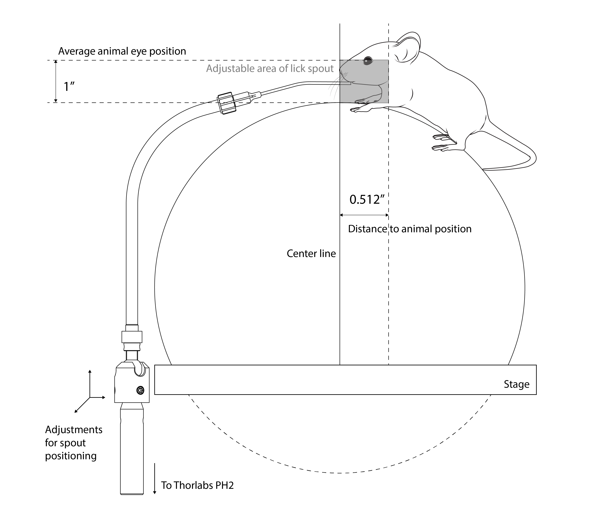

# {{ $frontmatter.title }}

The reward module has two main parts, the reward spout and the reward solenoid valve. The reward spout consist on a bended food grade stainles steel (2 inches and 75 degrees bend). Then, 10-32 UNF holes are made at the ends to attach a Luer lock tube coupling and a 1/16" barbed tube fitting. Curved feeding needles for mice are then attached to the Luer lock coupling. Using a custom made adapter, the tube is then fixed to a Thorlabs TRB1 locking ball and socket mount, this piece allows the spout to move freely to make fine adjustments to the position depending of animal idiosyncrasies. This is attached to a Thorlabs TR2 post that will be locked by a Thorlabs PH2 post holder, this will allow to adjust the height of the spout.

The angle, and the pieces used make it easy for the user to adjust the spout position for the animal, they are calculated to freely move before locking in an area delimited by the animal eye position and the headplate position (given by the positioning tool).

<figure>
  
  
<figcaption><small>Description of the reward spout (mouse drawing by <a href="https://doi.org/10.5281/zenodo.3926057">Ethan Tyler</a> )</small></figcaption>

</figure>

The reward solenoid valve is connected to the solenoid valve driver and controlled by ViRMEn with a NIDAQ device, the reward liquid is filled in a Srynge hanguing on top of the rig and connected to the solenoid valve using 1/16 ID Tygon tube, the same tubing is used to connect the solenoid valve to the reward spout.

## Parts list

### Reward spout

1. Corrosion-Resistant Round Tube 316 Stainless Steel, 0.065" Wall Thickness, 1/4" OD from [McMaster-Carr](https://www.mcmaster.com/89495K395/)
2. Plastic Quick-Turn Tube Coupling Plugs, 10-32 UNF Male, White Nylon Plastic from [McMaster-Carr](https://www.mcmaster.com/51525K428/), [Clear Polycarbonate Plastic](https://www.mcmaster.com/51525K431/) or [316 Stainless Steel](https://www.mcmaster.com/5194K43/) can be used too.
3. Curved Feeding Needles 18 Gauge (FNC-18-2-2) from [Kent Scientific](https://www.kentscientific.com/products/curved-feeding-needles/)
4. Stainless Steel High-Pressure Barbed Tube Fitting for Air and Water, 1/16" Tube ID x 10-32 UNF Male from [McMaster-Carr](https://www.mcmaster.com/4406T11/)
5. TRB1 Locking Ball and Socket Mount, 8-32 Threaded Base and Setscrew from [Thorlabs](https://www.thorlabs.com/thorproduct.cfm?partnumber=TRB1)
6. TR2 Ø1/2" Optical Post, SS, 8-32 Setscrew, 1/4"-20 Tap, L = 2" from [Thorlabs](https://www.thorlabs.com/thorproduct.cfm?partnumber=TR2)

### Reward solenoid valve

1. Any regular srynge according to the needed volume
2. Tight-Seal Moisture-Resistant Barbed Tube Fitting Plastic, for 1/16" Tube ID x 10-32 Thread Male Pipe from [McMaster-Carr](https://www.mcmaster.com/5047K11/)
3. Tygon PVC Tubing for Food, Beverage, and Dairy 1/16" ID, 1/8" OD from [McMaster-Carr](https://www.mcmaster.com/6546T33/)
4. 161T012 solenoid valve, 2-way, normally closed, isolation, 24vdc, PSIG 30 from [NResearch](https://www.nresearch.com/)

## Drawings

1. Reward stainless steel tube available <a href='./assets/pdf/reward/stainless_steel_tube.pdf' target='_blank'>here</a>
2. Tube to TRB1 aluminum adapter available <a href='./assets/pdf/reward/tube_to_trb1_adapter.pdf' target='_blank'>here</a>
3. <a href='./assets/drawings/reward.zip'>Download</a> complete inventor file drawings for the reward spout