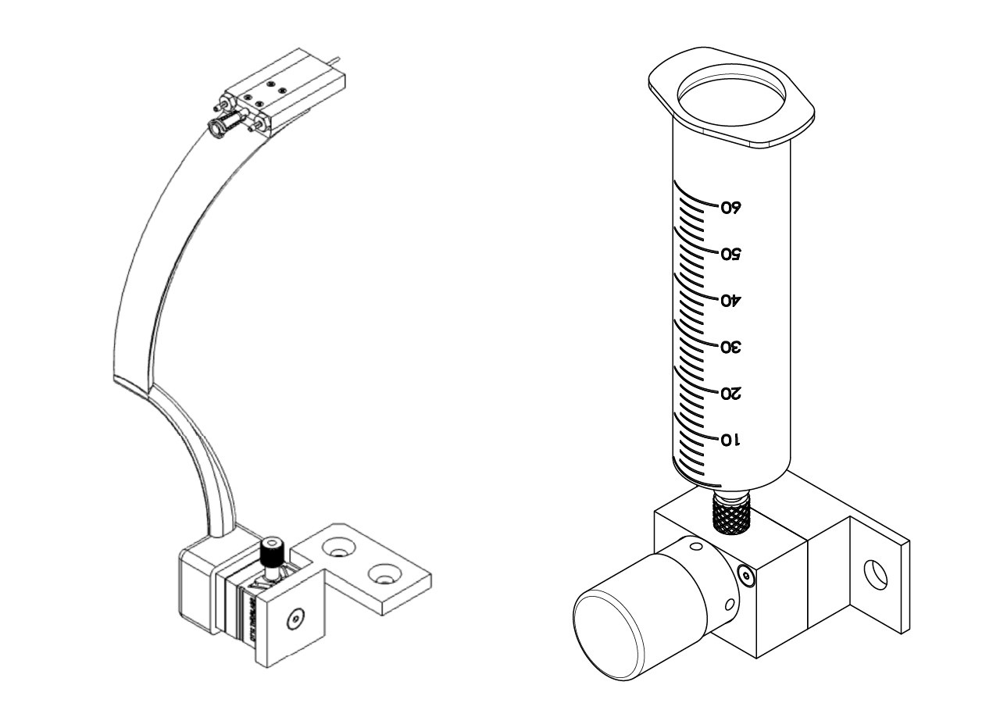
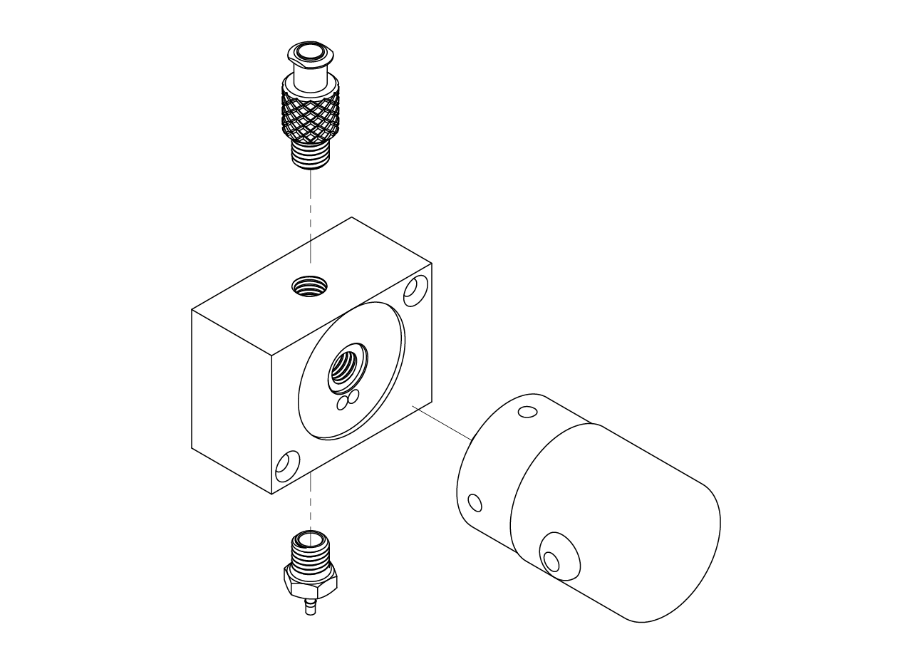
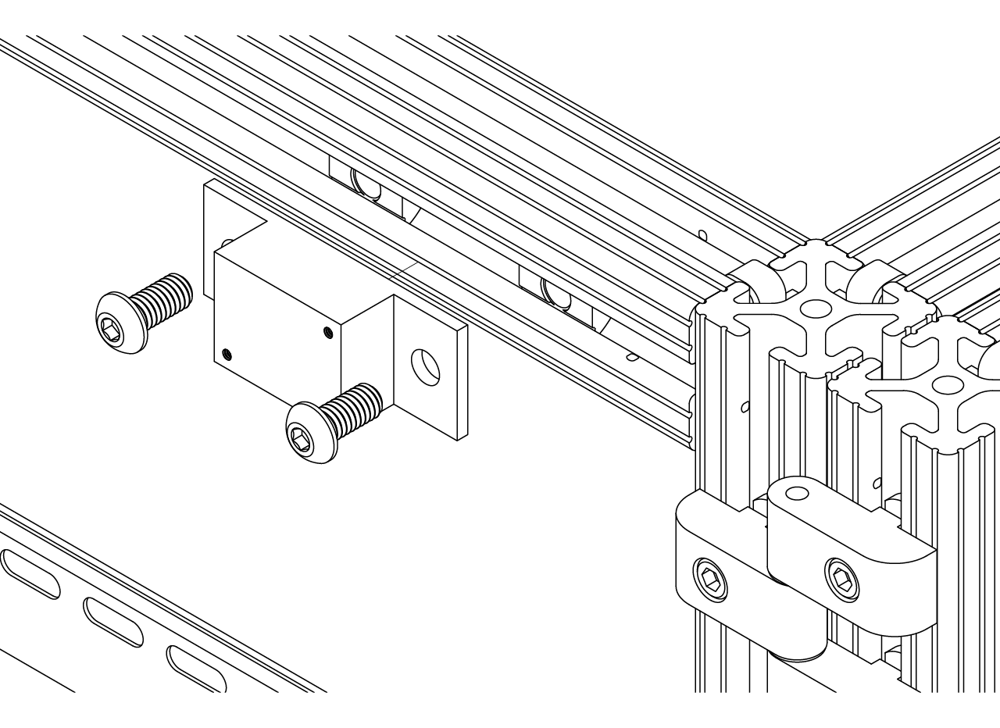
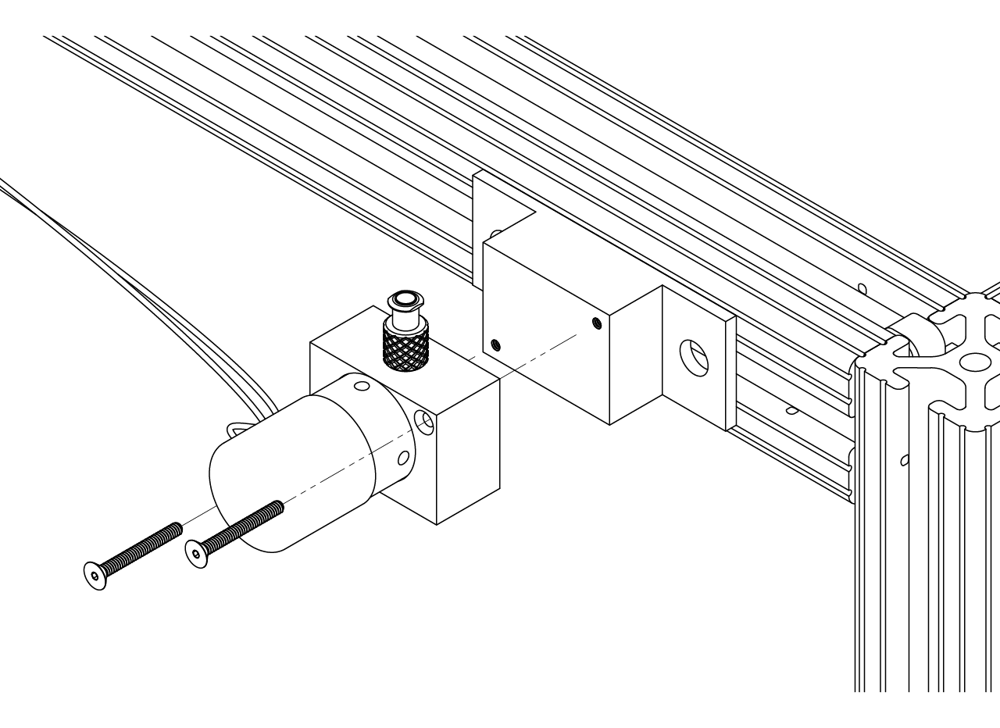
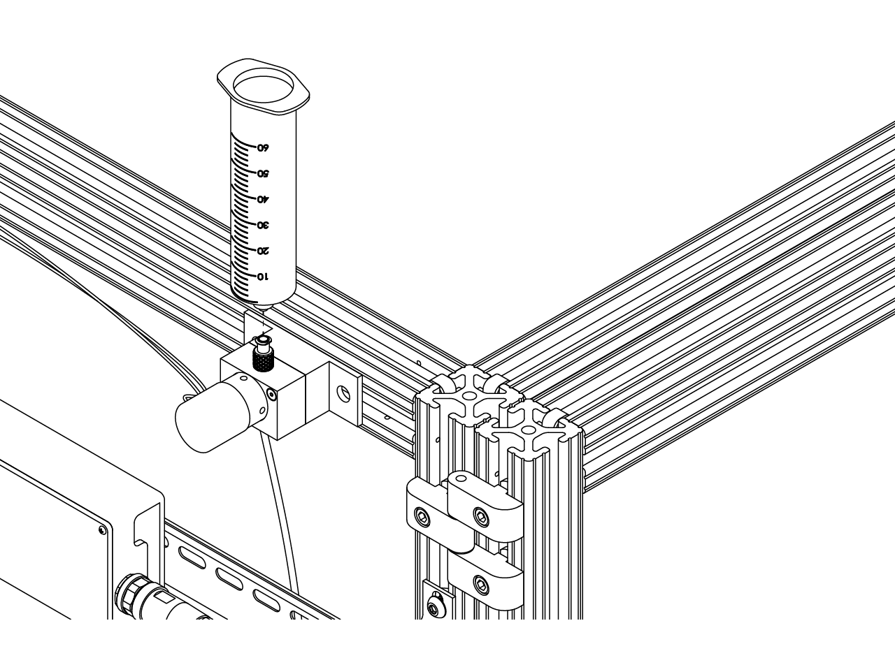

# {{ $frontmatter.title }}

The reward module consist on a open srynge that holds the reward liquid that will be dispensed to the mice through a lick spout controlled by a solenoid valve.

<figure>
  
  
<figcaption><small>Reward spout module</small></figcaption>

</figure>

## Solenoid valve manifold assembly

The solenoid valve dispensing component consist on a custom made stainless steel manifold that should be manufactured at a machine shop, it is designed following the recommendations from the solenoid valve manufacturer. We choose to use an isolation AS series solenoid valve from Gems sensors and controls because the body of the valve can be made of stainless steel, which is better in case a solution made out of condensed milk is used as a reward during training. The srynge is made out of glass and both the in and out connectors to the manifold are made of stainless steel, making the whole component less prone to corrotion or milk clog formation.

To assemble the manifold follow the next steps.

1. Have made in a machine shop the solenoid valve manifold in stainless steel (preferably 316) and the manifold to frame adapter. Screw at the top of the manifold a quick turn tube coupling for air made out of 316 stainless steel, socket for 1/4"-28 UN/UNF (SAE) threaded pipe. Screw at the bottom of the manifold a stainless steel barbed tube fitting, 1/16" tube ID x 1/4"-28 UNF male. Screw at the front of the manifold an isolation valve from Gems sensor and controls (AS2030-05MM-V-G5-204).

<figure>
  
</figure>

2. Use a pair of T-Slotted framing drop-in nuts with spring tab and place them in the upper profile on the right side of the rig (where the DIN rails are), attach the manifold to frame adapter.

<figure>
  
</figure>

3. Use a couple of 4-40 thread size, 1" long flat head screws and attach the manifold to the adapter.

<figure>
  
</figure>

4. Once the manifold is fixed into position, screw at the top luer lock connector a glass srynge.

<figure>
  
</figure>

## Lick spout holder assembly

The lick spout holder is designed to be fixed in the sagital and coronal position and adjustable in the Z (height) position. This way the variability in the position of both the mice and the spout is reduced. To this end, we designed a 3D printed arm that holds a spout holder, which also serves as the air puffs delivery system, that is attached to a kinetic base to make it easy to place and remove when the styrofoam ball need to be taken out. The kinetic base is screwed to a dovetail translation stage with 1/4" travel to adjust the height of the spout.

To assemble, follow the next steps.

1. Have printed the arm (we recommend an external service and PA12GB material) and install a 8-32 thread size, 0.312" installed length heath insert for plastic in the hole at the lower part of the arm that is going to be attached to the kinetic base. Then, screw the top part of the KB1X1 kinetic base from Thorlabs to the arm using an 8-32 thread size, 1/4" long low-profile screw.

:::tip
 To install the heat insert follow the instructions in the step 3 of the bottom plate assembly in the [stage](/building/stage) section.
:::

2. Install the 1/16" tube ID x 10-32 thread male pipe in the bottom part of the spout holder and place it into the arm using a pair of 2-56 thread size, 5/32" long screws. Put the FNS-18-2-2 straight feeding needle from Kent scientific on the spout holder and fix the top part of the holder using a four 100 degree countersink, 0-80 thread, 7/32" long screws.

3. Print or have printed the breadboard to DT12 adapter and screw the DT12 dovetail translation stage from Thorlabs to the adapter using a 8-32 thread size, 3/8" long flat head screw, making sure the screw to move the stage is facing up (to the ceiling of the rig). Attach at the other end the bottom part of the KB1X1 kinetic base from Thorlabs using an 8-32 thread size, 1/4" long low-profile screw. Finally, install into the breadboard using a pair of 1/4"-20 thread size, 11/16" long flat head screw.

3. Finally place the arm with the spout holder in place by connecting the top and bottom parts of the kinetic base.
