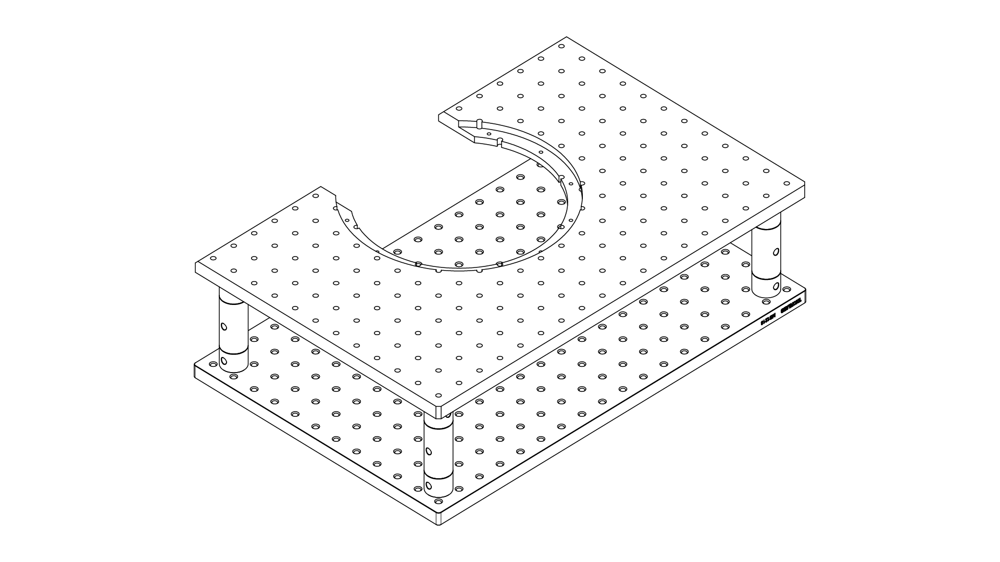
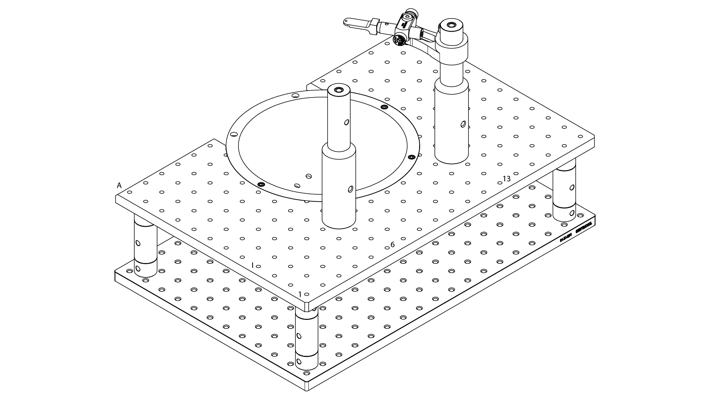

# {{ $frontmatter.title }}

The stage where the animal is going to be placed to run the experiments has 4 parts, the stage construction itself, the pillars that set the reference for the positioning tool and also hold the headplate holder to palce the animal in place, the 3D printed cup that holds the optical flow sensor and the base holder for the reward spout. All of this is mounted on a moving part that allows the stage to be pulled out of the box to easily manipulate the animal before and after training.

For the construction of the stage 4 pillars are formed by joining a 1" diameter 1" lenght pillar post with a 1" diameter 2" lenght pillar post. These pillars are then attached to the bottom 12" by 18", 1/2" width aluminum breadboard and to the top to a similar breadboard previously machined to fit the 3D printed cup (drawing available [here](../building/stage/#Drawings)).

<figure>
  
  
<figcaption><small>Stage construction</small></figcaption>

</figure>

The 3D printed cup is then attached to the top plate of the stage using 8-32 thread size stainless steel screws, the pillars are screwed at row I and column 6 and 13 each one. The pillars are formed by attaching a 1" diameter 3" long pillar to a 1.48" diameter 4" long aluminum pillar. For the headplate holder, an adjustable heigh post base is attached to the right pillar, with a 1/2" diameter 1" long post is attached to it. Using a right angle clamp, a 1/2" diameter with 2" long post is attached to the 1" long post, at the tip the headplate holder is screwed.

<figure>
  
  
<figcaption><small>Stage construction, 3D printed cup and pillars mounted</small></figcaption>

</figure>

## Drawings