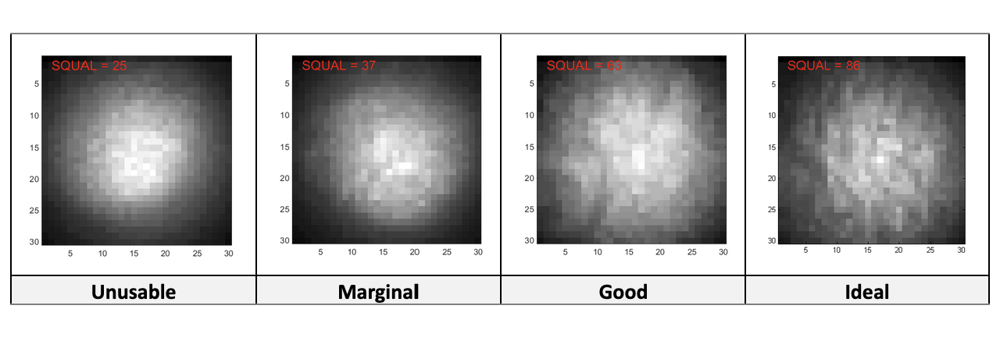
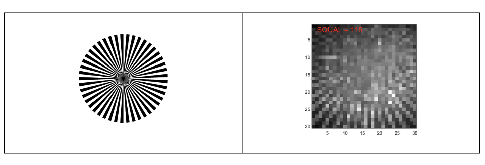
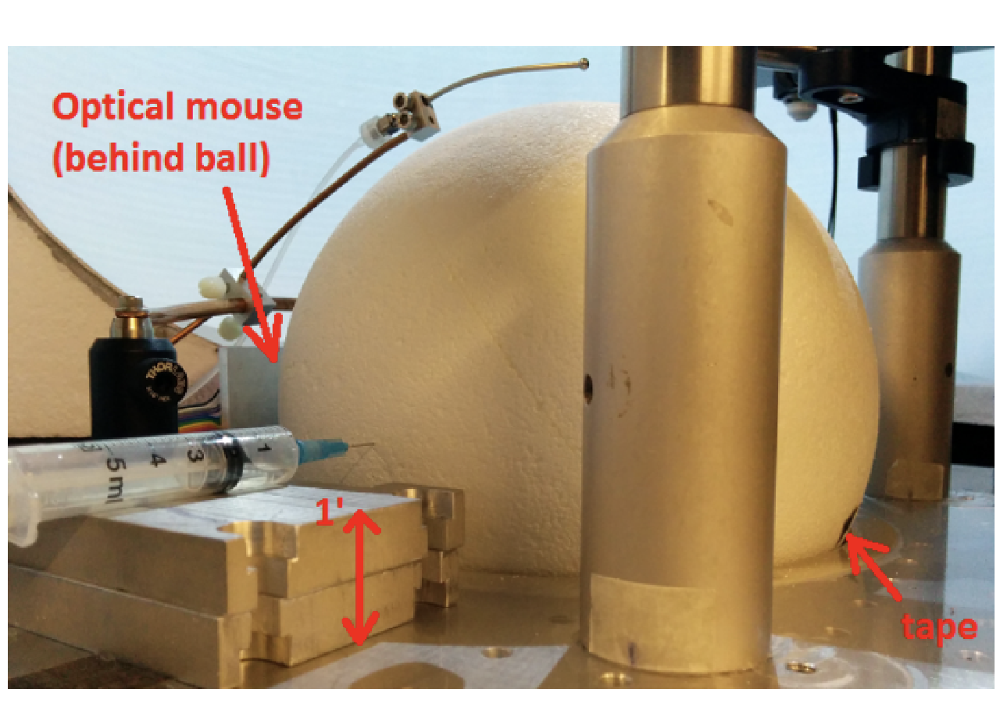
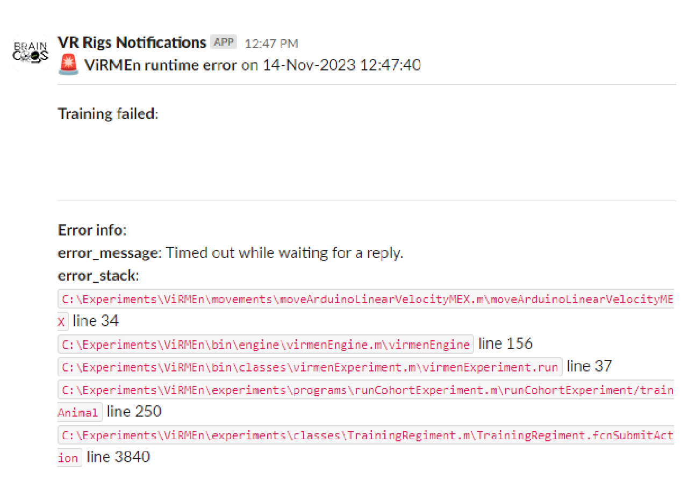

# {{ $frontmatter.title }}

The stage maintenance consist mainly on the replacement of the ball, and the optical flow sensor calibration.

## Running ball replacement

1. Glue two [8" diameter half balls](https://www.dickblick.com/items/smooth-foam-crafters-foam-half-ball-8-dia/) using [lightweight styrophoam glue](https://www.amazon.com/FloraCraft-Non-Toxic-Foam-Glue/dp/B000FFUCAI?th=1). Make sure to use a fair ammount of glue, press each half against each other (make sure to squeeze them together for a few seconds to make sure the ball halves remain stuck to each other) and use your finger to flat the excess of glue laong the edges. Let them sit for a few hours or overnight.

2. Once set, use an [abrasive brush](https://www.mcmaster.com/7451T32/) or a [sanding sponge](https://www.mcmaster.com/4023A79/) to slighlty rough the surface of the ball, this will make help improving the quality of motion detection by the optical flow sensor.

3. Once the Styrofoam ball is smoothed, use a red sharpie to label the ball, then use a black industrial sharpie to mark the ball with a cross-hatch design - try to ensure that there are no large white gaps in-between the cross-hatch design.

## Optical flow sensor calibration

### Image quality and lens focus

The image quality from the optical sensor should be maximized in order for it to obtain reliable measurements, which can be achieved by:

* Ensuring sufficient infrared (IR) illumination (but increasing it past a certain threshold does not help).

* Adjusting the focal plane of the M12 lens to be at the surface to be measured.

* Using a surface with more texture (of the appropriate size given the limited number of sensor pixels).

The ADNS-3080 chip reports a SQUAL value that can be read out using software as explained below. This value needs to be at least 30 if the velocities to be measured are around 100cm/s-150cm/s. For lower values of SQUAL, the sensor tends to under-measure the actual displacement, with the size of the effect increasing with higher surface velocities. The following are examples of images of a Styrofoam ball at various SQUAL values ranging from unusable to ideal (for velocities not far exceeding 100cm/s).

<figure>
  
</figure>

Follow the procedure below to adjust the focus of the optical flow sensor lens.

1. Load Arduino Code\ADNS_image_v1\ADNS_image_v1.ino in the Arduino IDE.

2. Edit the reset_pin to 6 and select_pin to 10 values (lines 20-24).

3. Upload the Arduino code to the board. Note that you will have to reprogram the board after this to use it as a displacement readout.

4. Print the left side of the following image (an optical spoke target) using a laser printer. The spoke target consists of lines of vanishing size towards the center, therefore allowing you to probe the single pixel limit of the optical sensor as shown in the calibrated image (from the sensor) in the right:

<figure>
  
</figure>

5. Find some way of placing the spoke target in front of the optical sensor at the same location and orientation as the actual surface to be measured. For example for the mouse virtual reality rig it can be taped onto a Styrofoam ball and the ball can be suspended at the height it would usually be at during experiments.

6. Run the Matlab Code\Calibration\display_image.m function. It is programmed to continuously display the sensor image for a predetermined amount of time, and can be terminated by pressing <Ctrl+C>.

7. Adjust the IR LED so that it points towards the center of the surface to be imaged. You should see the illuminated region shift around in the display_image figure.

8. The display_image figure is normalized so that the brightest regions appear white and the darkest regions appear black, i.e. absolute luminosity information is not available. You can change this behavior by editing the code to replace imagesc(im) (line 66) with image(im) and setting the color scale manually: set(gca, 'CLim', […])
Oblique illumination can help increase feature contrast on uneven surfaces, but in general just illuminating the largest amount of surface available is sufficient.

9. Adjust the focus of the optical sensor lens by rotating it. You should see the spoke target lines get sharper and the SQUAL value increase if you’re going in the right direction. You should be able to find a distance at which the SQUAL value is maximal (there is a decent amount of leeway).

10. Replace the spoke target with the actual surface to be measured, and verify that the SQUAL value is still high enough (>> 30). Values of 50-80 have been achieved with Styrofoam balls, the higher end if they have been “weathered” by running mice.

11. If the SQUAL value is 30-ish or worse, consider using a more textured surface. For example, scour the Styrofoam ball with steel wool.

### Lenght scale calibration

Follow the procedure below to calibrate the lenght scale of the optical flow sensor.

1. Load Arduino Code\ADNS_aout_wUSB_1sensor\ADNS_aout_wUSB_1sensor.ino in the Arduino IDE.

2. Upload the Arduino code to the board.

3. Suspend a Styrofoam ball on an axle, or a cylindrical Styrofoam wheel, at the position it would be in relative to the optical sensor in a real experiment. Mark a reference position on the ball, e.g. with a piece of black tape as shown in the mouse VR calibration photo below.

<figure>
  
</figure>

4. Ensure that Matlab Code\Calibration\calibrateBall.m is either in the current folder in the Matlab console, or otherwise in the Matlab path, before continuing the rest of this procedure.

5. While holding the ball in place, run the calibrateBall script.

6. Spin the ball 10 times (this can be done quickly), counting the number of times that the black tape returns to approximately its original location.

7. If necessary, a small correction can be made to rotate the ball further until the tape is exactly at its original position. This should cancel out errors incurred in the previous step.

8. Stop calibrateBall by pressing Ctrl+C.

9. Input fclose(instrfindall) at the Matlab command line to close Arduino communications.

10. Input [dx,dy] at the Matlab command line to view the accumulated displacements. If the optical sensor has been correctly aligned w.r.t. the axis of rotation of the ball, one of these displacements should be large (> thousands) and the other one small (< tens).

11. In the following the measured displacement along the axis of interest will be referred to as nDots, and the number of revolutions used as nRev.

12. Repeat this measurement until satisfied (with more rotations if necessary), then enter the obtained constants into RigParameters.m.

* **ballCircumference**: Actual displacement (e.g. in cm) of the calibration surface per revolution. For an 8-inch diameter Styrofoam ball, this is its circumference, 63.8cm.
* **sensorDotsPerRev**: This should be set directly to *nDots/nRev* in the case of a single sensor. In the case of two sensors, use the code `sensorDotsPerRev = RigParameters.sensorCalibration()` and set the latter as described below.
* **sensorCalibration**: This is only used for two sensors, which may have differing constants. In this case use the appropriate MovementSensor label for the sensor of interest to record dotsPerRev, e.g.: `dotsPerRev(MovementSensor.FrontVelocity) = nDots/nRev;`

## Troubleshooting

Troubleshooting should be done from cleaning the 3D cup and window first, making sure the ball is in proper conditions, and then the optical flow sensor replacement if necessary, then the arduino. If the arduino is the problem, refer to the troubleshooting guide in the control portion of the documentation.

### Arduino not recognized

If the arduino is not recognized by the rig tester arduino detection button follow the next steps:

1. First check if the arduino is being detected by the CPU by opening the device manager windows (typing device manager in the search bar) and clicking on the Ports (COM&LPT) label to display the list of devices connected.
  
    * If the Arduino is listed there, then the COM port might have changed. Make sure the COM port listed in the device manager matches the `arduinoPort` variable in the rig parameters file. Restart Matlab and try again.

2. If the Arduino is not listed on the device manager window it could be either a faulty cable or a broken Arduino. Start by troubleshooting the Arduino (cables might be harder to check since many times they have intricate paths behind the rig).

    ::: tip

    You can perform a quick check before removing the arduino from the box to discard that the cable is faulty. Unplug the arduino USB cable from the black box on the DIN rail and connect a new arduino, if this one is recognized in the device manager window, then proceed to the following steps, otherwise go ahead and change the cable.

    :::
    
    * Disconnect both the cable and the connector of the black box holding the arduino and take it out of the DIN rail (by slightly pushing it downwards and pulling the bottom part towards you).

    * Open the box by unscrewing the 4 screws holding the cover and the 2 screws holding the arduino to the 3D printed box.

    * Remove the arduino and replace it with a new one. Screw it to the box and screw the cover. Place the box with the new arduino into the DIN rail and connect first the sensor cable and then the US cable.

    * Program the arduino following this [instructions](/building/control.html#programming-the-arduino).

3. If the cable is malfunctioning, then replace the cable. We recommend to use a [USB Type-C male to micro-USB Type-B male cable](https://www.bhphotovideo.com/c/product/1387544-REG/tether_tools_cuc2515_blk_tetherpro_usb_c_to_2_0.html?sts=pi&pim=Y). Or any other cable matching your setup, but make sure it is a single tether cable or USB 3.0 cable, and avoid using either multiple cables or HUBs (or make sure everything is high speed rated).

### Timed out while waiting for a reply.

<figure>
  
</figure>

This error could be caused by a corrupted firmware in the Arduino. To solve follow the steps on [instructions](/building/control.html#programming-the-arduino) to program the arduino again.

[comment]: # (### Rig tester freeze when sensor quality button is clicked)

[comment]: # (1. Restart the computer. If the problem is not solved, then go to step 2.)

[comment]: # (### Rig tester sensor quality reading bad [motion sensor]: 0.0! all the time)
