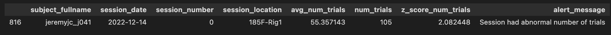
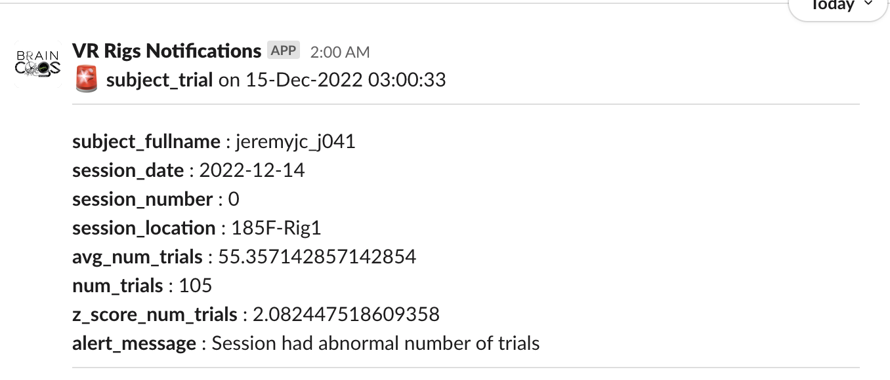

# {{ $frontmatter.title }}

 ## Set up custom slack alerts

 1. Follow  <a href="https://braincogs.github.io/software/db_access.html#db-access-for-python-repository">Database Access with Python instructions</a>
 2. On U19_pipeline_python repository open ```u19_pipeline/alert_system/custom_alerts directory```
 3. Create a new python file with a meaningful name for the alert: (e.g. `subject_bias.py`) 
 4. Copy skeleton code from ```u19_pipeline/alert_system/alert_code_skeleton.py```
  + All slack alert code has two parts: **a slack channel configuration** and a **main function** described on the next section:

 ### main function guide

 + This function should return a pandas DataFrame where each row will be a slack alert message on configured channels.
 + You can use datajoint to get data for the alert (e.g. custom_alerts/rig_bias.py) or simply call os scripts (e.g. custom_alerts/braininit_storage.py)
 + All columns of the dataframe will be included in the alert. (Don't add too many !!)
 + Dataframe Example with slack notification message:

  <figure>
  
  <center><figcaption>Example Dataframe for notification </figcaption></center>
 </figure>

 <figure>
  
  <center><figcaption>Example Notification from previous DataFrame</figcaption></center>
 </figure>


 + You can check examples of some alers in the u19_pipeline/alert_system/custom_alerts directory

 ### Slack channel dictionary configuration

 + The slack channel configuration is a dictionary to link corresponding slack channels and conversations with an specific alert.

 + The dictionary has two keys: `'slack_notification_channel'` and `'slack_users_channel'`
 + **slack_notification_channel** General channels names to send notifications.
 + **slack_users_channel** Private direct message to send notificatons.

 + You can add a list of channels to each of the keys: 
 + **slack_notification_channel** Any `webhook_name` (see next section)
 + **slack_users_channel** Any user_id with configured slack_weebhook (see next section)

 #### Check available notification channels:
 
 ##### MATLAB
 1. Execute ```fetch(lab.SlackWebhooks,'*')```

 ##### Python
 1. Execute: 
  + ```lab = dj.create_virtual_module('lab', 'u19_lab')```
  + ```lab.SlackWebhooks.fetch(as_dict=True)```

 #### Check available user channels:

 ##### MATLAB
 1. Execute ```fetch(lab.User & "slack_webhook <> ''",'slack_webhook')```

 ##### Python
 1. Execute: 
  + ```lab = dj.create_virtual_module('lab', 'u19_lab')```
  + ```(lab.User & "slack_webhook <> ''").fetch('KEY', 'slack_webhook', as_dict=True)```

### Create and register new webhooks for alerts:

1. Create a new slack channel if needed (for notification channels).
2. Follow instructions to create webhooks from: <a href="https://slack.com/help/articles/115005265063-Incoming-webhooks-for-Slack">Slack documentation</a> 
3. Copy slack webhook from slack API web page.

#### Add notification channels:

 ##### MATLAB
 
 ```
 new_slack_webhook = struct
 new_slack_webhook.webhook_name = (notification channel name)
 new_slack_webhook.webhook_url  = (webhook url from slack API)
 insert(lab.SlackWebhooks,new_slack_webhook)
 ```

 ##### Python

 ```
 lab = dj.create_virtual_module('lab', 'u19_lab')
 new_slack_webhook = dict()
 new_slack_webhook['webhook_name'] = (notification channel name)
 new_slack_webhook['webhook_url']  = (webhook url from slack API)
 lab.SlackWebhooks.insert1(new_slack_webhook)
 ```

 #### Update user channel webhook notification channels:

 ##### MATLAB
 
 ```
 user = struct
 user.user_id = (NETID of user)
 update(lab.User & user,'slack_webhook', (webhook url from slack API))
 ```

 ##### Python

 ```
 lab = dj.create_virtual_module('lab', 'u19_lab')
 user = dict()
 user['user_id'] = (NETID of user)
 user['slack_webhook'] = (webhook url from slack API)
 lab.User.update1(user)
 ```


 


 

