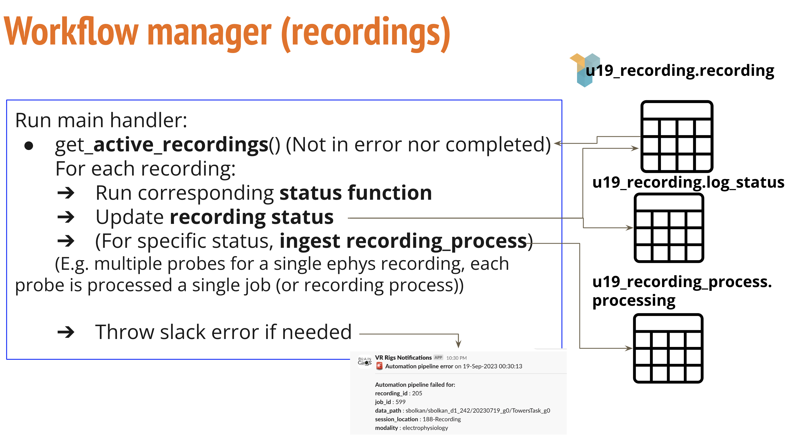
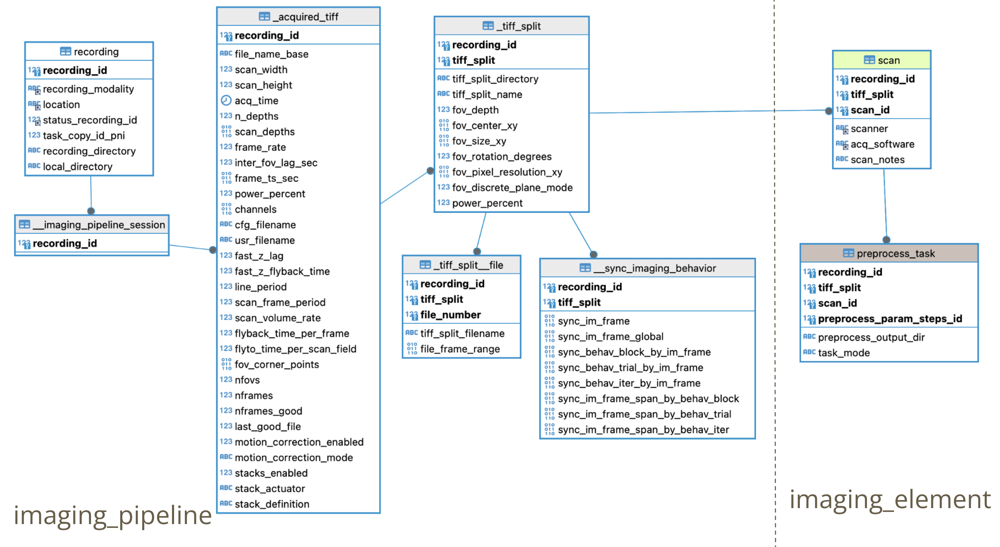
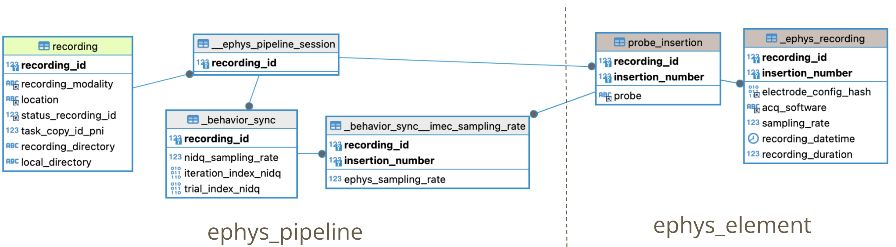
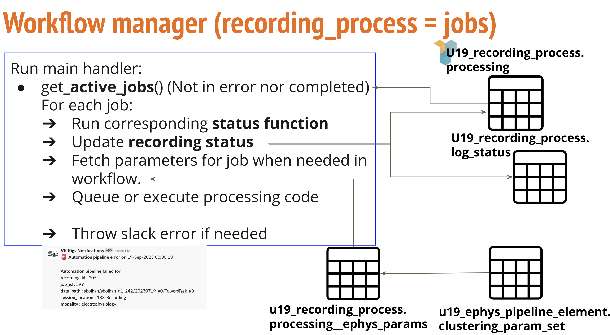
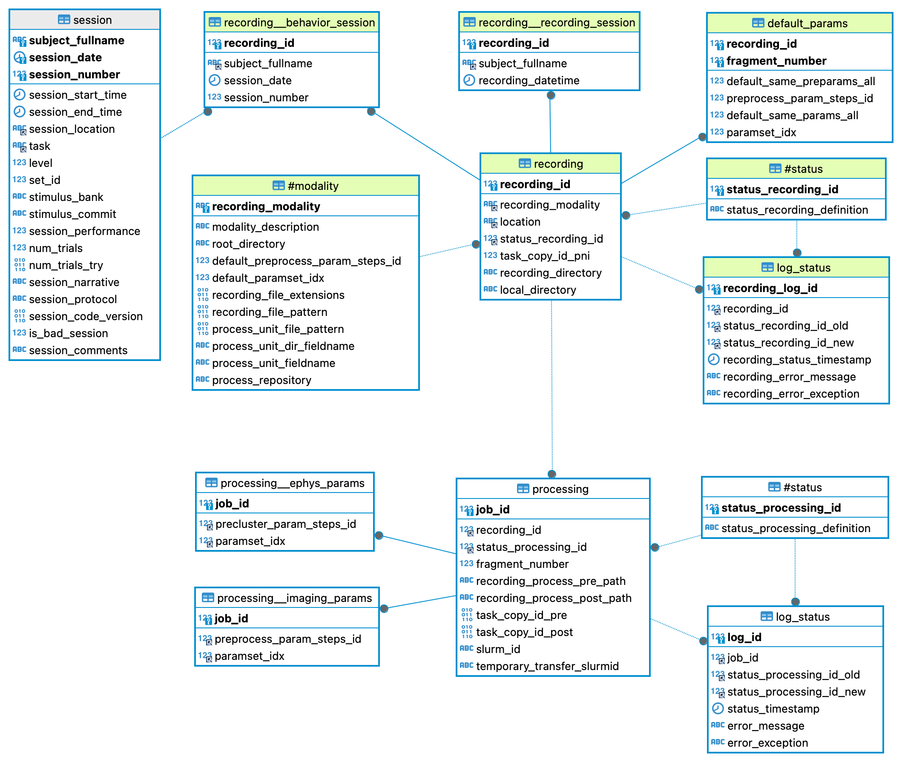

# {{ $frontmatter.title }}

The Ephys/Imaging Automation Pipeline in BRAINCoGS main goals are:

+ Automate spike sorting and imaging segmentation for all recordings
+ Centralize/Standardize paths for Recording Data Storage
+ Unify & Register Ephys/Imaging Processing
+ Store processed data in BRAINCoGS Database (DJ)

To accomplish this we developed three tools:

+ Ephys/Imaging Automation GUI (<a href="https://github.com/BrainCOGS/RecordingProcessJobGUI">RecordingProcessJobGUI</a>)
+ Recording Workflow management (<a href="https://github.com/BrainCOGS/U19-pipeline_python/tree/master/u19_pipeline/automatic_job">Automatic_job directory in U19-pipeline_python </a>)
+ Collab reposiotries to handle Ephys/Imaging Processing (<a href="https://github.com/BrainCOGS/BrainCogsEphysSorters">BrainCogsEphysSorters </a> and <a href="https://github.com/BrainCOGS/BrainCogsImagingSegmentation">BrainCogsImagingSegmentation </a>)

 ## Ephys/Imaging Automation GUI

 ## Workflow management description

Workflow management code creates and coordinates of a set of tasks for all recordings that were registered with the GUI to make sure they are entirely processed.

Shell code executed as a cronjob for workflow management:
(<a href="https://github.com/BrainCOGS/U19-pipeline_python/blob/master/u19_pipeline/automatic_job/call_cronjob_automatic_job.sh">call_cronjob_automatic_job.sh
</a>)

Workflow management is composed mainly by two classes that handles recordings and recording_processes  (recording_processes or jobs are how recordings are composed)
 + Ephys recordings are composed by one or many independent probe electrophysiology recordings. Each probe recording correspond to a job in the workflow management
 + Calcium imaging recordings are composed by one or many independent field of views image stacks. Each field of view image stack correspond to a job in the workflow management.

The class that manages workflow at the recording level is (<a href="https://github.com/BrainCOGS/U19-pipeline_python/blob/master/u19_pipeline/automatic_job/recording_handler.py">RecordingHandler</a>)

 <figure>

<figcaption>Workflow manager diagam at the recording level</figcaption>

 </figure>

### Main functions and variables in recording workflow manager

+ **recording_status_dict** in (<a href="https://https://github.com/BrainCOGS/U19-pipeline_python/blob/master/u19_pipeline/automatic_job/params_config.py">Params Config file</a>): This dictionary defines status definitions and corresponding functions to execute.
+ **pipeline_handler_main** in (<a href="https://github.com/BrainCOGS/U19-pipeline_python/blob/master/u19_pipeline/automatic_job/u19_pipeline/automatic_job/recording_handler.py">RecordingHandler</a>): Main function in recording workflow
1. Executes corresponding functions based in status.
2. Executed every 30 minutes to check for new recordings to be handled.
3. Send notifications for processed and failed functions.
+  **exception_handler** in (<a href="https://github.com/BrainCOGS/U19-pipeline_python/blob/master/u19_pipeline/automatic_job/u19_pipeline/automatic_job/recording_handler.py">RecordingHandler</a>): Python decorator for error handling.
+  **modality_preingestion** in (<a href="https://github.com/BrainCOGS/U19-pipeline_python/blob/master/u19_pipeline/automatic_job/u19_pipeline/automatic_job/recording_handler.py">RecordingHandler</a>): Main ingestion function from recording to recording_process tables. There are subcalls depending on modality of recording (ephys or imaging).

#### Imaging preingestion main steps:

+  **imaging_preingestion** in (<a href="https://github.com/BrainCOGS/U19-pipeline_python/blob/master/u19_pipeline/automatic_job/u19_pipeline/automatic_job/recording_handler.py">RecordingHandler</a>): Ingestion to recording_process table for an imaging recording. Get all FOVs (TIFF stacks) for the recording and assign a new job for each one with corresponding parameters fetched from selection done in automation GUI.
**AcquiredTiff populate function** in (<a href="https://github.com/BrainCOGS/U19-pipeline_python/blob/master/u19_pipeline/imaging_pipeline.py">Imaging pipeline</a>): Auxiliar script to call **populate_Imaging_AcquiredTiff** script in MATLAB.
+ **populate_Imaging_AcquiredTiff** in (<a href="https://github.com/BrainCOGS/U19-pipeline-matlab/blob/master/scripts/populate_Imaging_AcquiredTiff.m">populate_Imaging_AcquiredTiff</a>): Population calls to:
1. **u19_imaging_pipeline.AcquiredTiff**: Each recording is divided into Tiff Splits (e.g. Mesoscope recordings contain multiple tiff stacks that will be processed independently). (<a href="https://github.com/BrainCOGS/U19-pipeline-matlab/blob/master/schemas/%2Bimaging_pipeline/AcquiredTiff.m">Code here</a>)
2. **u19_imaging_pipeline.SyncImagingBehavior**: Find correspondence between virtual reality frame in the behavior experiment and Calcium Imaging frame in recording.
(<a href="https://github.com/BrainCOGS/U19-pipeline-matlab/blob/master/schemas/%2Bimaging_pipeline/SyncImagingBehavior.m">Code here</a>)

 <figure>

<figcaption>ERD for imaging pipeline at the recording level</figcaption>

 </figure>

#### Ephys preingestion main steps:

 +  **electrophysiology_preingestion** in (<a href="https://github.com/BrainCOGS/U19-pipeline_python/blob/master/u19_pipeline/automatic_job/u19_pipeline/automatic_job/recording_handler.py">RecordingHandler</a>): Ingestion to recording_process table for an ephys recording. Get all probes for the recording and assign a new job for each one with corresponding parameters fetched from selection done in automation GUI.
 1. Ingest **ephys_pipeline.EphysPipelineSession** table
 2. Ingest **ephys_element.ProbeInsertion** table
 3. Ingest **ephys_element.EphysRecording** table
 4. Ingest **ephys_pipeline.BehaviorSync** table: Find corresponding iteration in ephys recording with frame from Virmen behavior task (<a href="https://github.com/BrainCOGS/U19-pipeline_python/blob/master/u19_pipeline/ephys_pipeline.py">Code here </a>) (<a href="https://github.com/BrainCOGS/U19-pipeline_python/blob/master/u19_pipeline/utils/ephys_utils.py"> and here </a>).
5. For each probe (insertion_number) in EphysSession insert a Processing (job) in **u19_recording_process.Processing**

 <figure>

<figcaption>ERD for ephys pipeline at the recording level</figcaption>

 </figure>

 ### Main functions and variables in recording_process workflow manager

 + **recording_process_status_dict** in (<a href="https://https://github.com/BrainCOGS/U19-pipeline_python/blob/master/u19_pipeline/automatic_job/params_config.py">Params Config file</a>): This dictionary defines status definitions and corresponding functions to execute.
+ **pipeline_handler_main** in (<a href="https://github.com/BrainCOGS/U19-pipeline_python/blob/master/u19_pipeline/automatic_job/u19_pipeline/automatic_job/recording__process_handler.py">RecProcessHandler</a>): Main function in recording process workflow
1. Executes corresponding functions based in status.
2. Executed every 30 minutes to check for new recordings to be handled.
3. Send notifications for processed and failed functions.
+  **transfer check/review** in (<a href="https://github.com/BrainCOGS/U19-pipeline_python/blob/master/u19_pipeline/automatic_job/u19_pipeline/automatic_job/recording_process_handler.py">transfer_check/review</a>): Executes and monitors globus transfer from PNI to PrincetonUniversity clusters. (Deprecated)
+  **slurm_job_queue/check** in (<a href="https://github.com/BrainCOGS/U19-pipeline_python/blob/master/u19_pipeline/automatic_job/u19_pipeline/automatic_job/recording_process_handler.py">slurm_job_functions</a>): Generate slurm file and queue the job in the cluster that will process recording process. Monitor job to check if it has already finished.
+  **populate_element** in (<a href="https://github.com/BrainCOGS/U19-pipeline_python/blob/master/u19_pipeline/automatic_job/u19_pipeline/automatic_job/recording_process_handler.py">slurm_job_queuew</a>): After processing jobs populate imaging or ephys element tables downstream from results file.

 <figure>

<figcaption>Workflow manager diagam at the recording process level</figcaption>

 </figure>

  <figure>

<figcaption>ERD from behavior session to recording process tables</figcaption>

 </figure>

## Collab reposiotries to handle Ephys/Imaging Processing

### BrainCogsEphysSorters

#### Set up instructions for BrainCogsEphysSorters in cluster system

1.