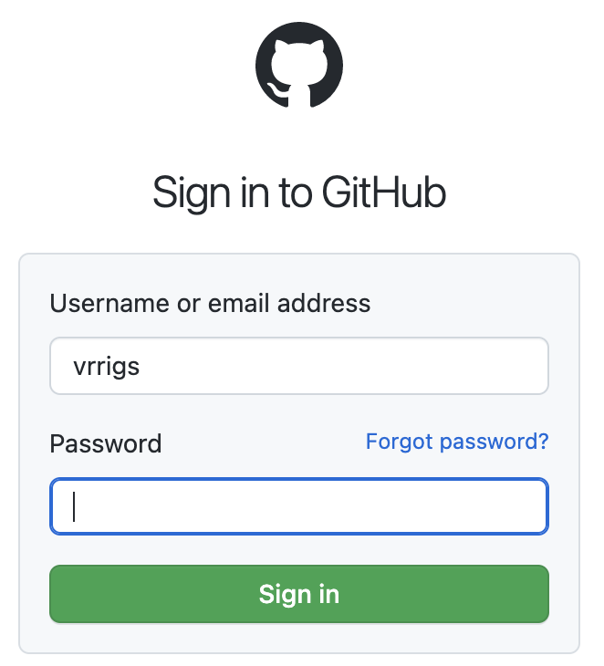
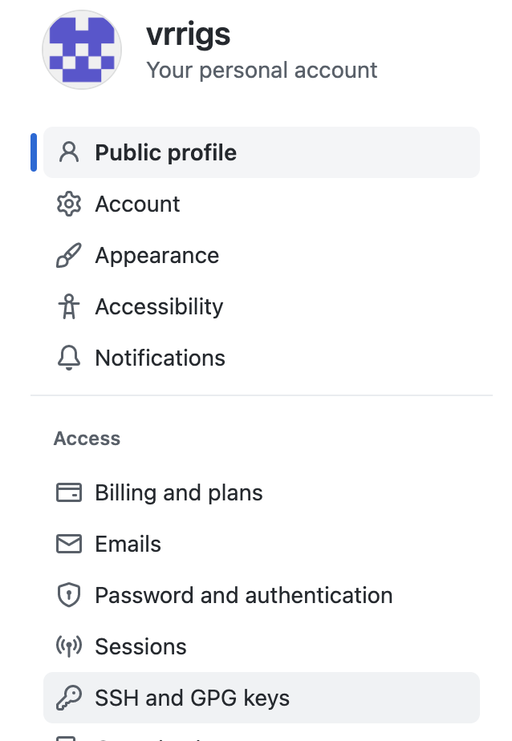
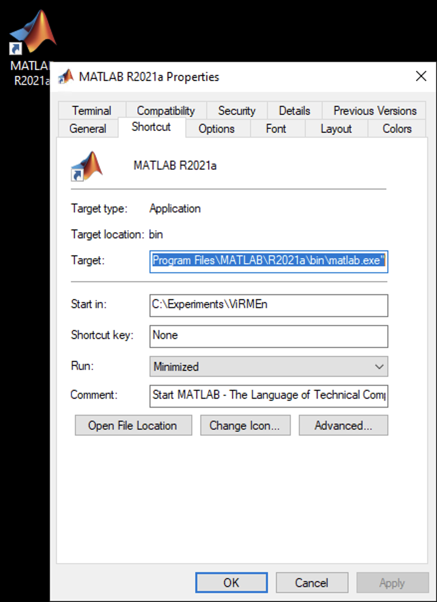
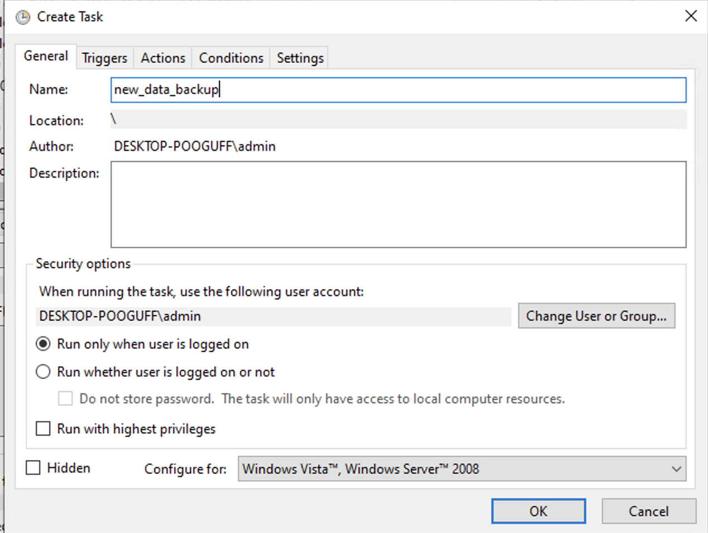
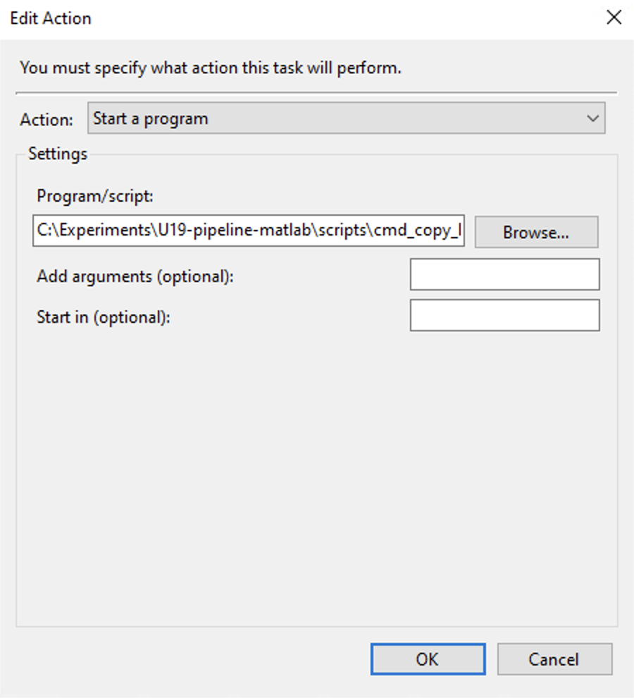
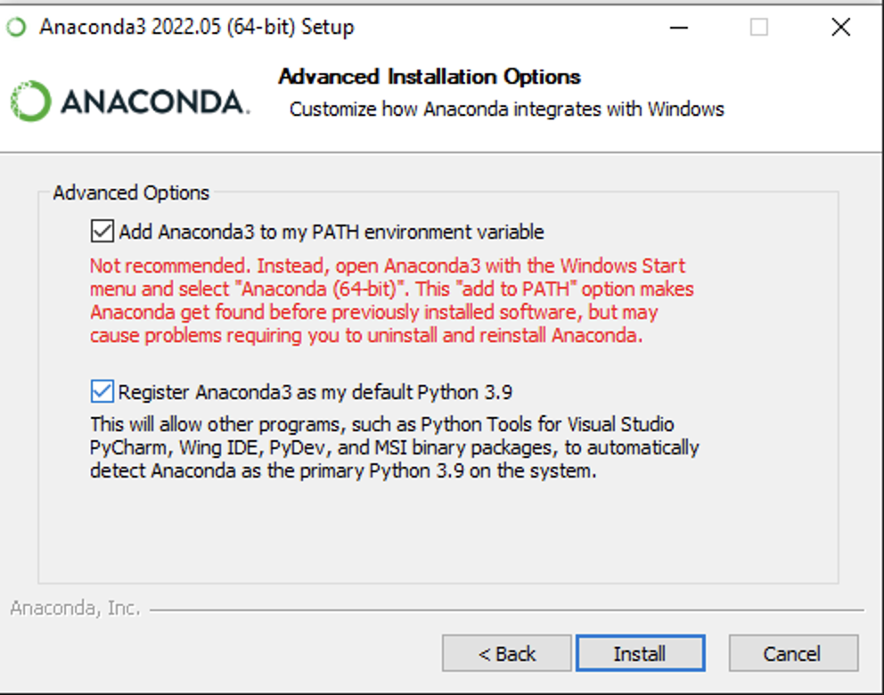
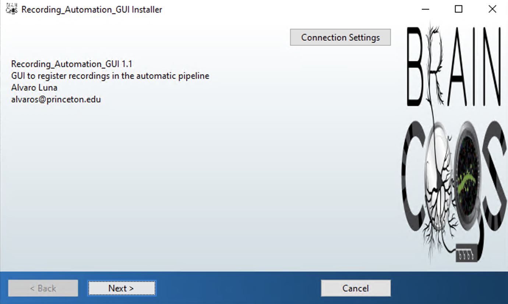

# {{ $frontmatter.title }}

 ## Configure new behavior rig system

 ### First steps
 
 #### Mount cup PNI drives

 1. From Windows Explorer, select "Map Network Drive" and enter:
  + `\\cup.pni.princeton.edu\braininit\` (for braininit)
  + `\\cup.pni.princeton.edu\u19_dj\` (for u19_dj)
 2. Authenticate with your NetID and PU password (NOT your PNI password, which may be different). When prompted for your username, enter PRINCETON\netid (note that PRINCETON can be upper or lower case) where netid is your PU NetID.

 #### Install MATLAB 2019 or higher

 #### Download and install NiDAQmx from <a href="ni.com/r/downloaddaqmx">National Instruments website </a>

 #### Download and install Microsoft visual studio community 2019. Make sure to select the option desktop development with C++

 #### Instal Git for Windows

 1. Install from this <a href="https://git-for-windows.github.io/">link</a> 
 ##### Installation options:
  + Use Git from the Windows Command Prompt (5th pane)
  + Checkout as-is, commit as-is (6th pane)

 #### Create ssh key to clone repositories

 1. Open Git Bash 
 2. `ssh-keygen -t ed25519 -C "vrrigsbi@princeton.edu"`
 3. Leave empty passphrase (Hit Enter two times)
 4. `eval "$(ssh-agent -s)"`
 5. `ssh-add ~/.ssh/id_ed25519`

#### Add key to virmen user in github

 1. Copy ssh public key to clipboard in Git Bash `clip < ~/.ssh/id_ed25519.pub`
 2. Open <a href="https://github.com/login`">https://github.com/login</a>
 2. Login with vrrigs user (ask your Lab Manager for password)

 <figure>
  
  <center><figcaption>Vrrigs GitHub login</figcaption></center>
 </figure>

 3. Access Settings -> SSH and GPG Keys

 <figure>
  
  <center><figcaption>Vrrigs ssh keys section</figcaption></center>
 </figure>

 4. Click `New SSH Key` button
 5. Add a meaningful title to the key and paste public key from the clipboard in "Key" text area.
 6. Click `Add SSH Key` button

 #### Compiler

 1. Install Visual Studio Code Compiler; make sure to select C++ support from the menu.  <a href="https://visualstudio.microsoft.com/downloads/`">https://visualstudio.microsoft.com/downloads/</a> 
 2. In MATLAB, Run `mex -setup -v`. This sets up the compiler. It should output something like found "Microsoft Visual C++ 2015" 


 ### U19-pipeline-matlab Repository

 1. Open Git Bash and execute: `cd /c/Experiments`
 2. Clone **U19-pipeline-matlab** Repository, `git clone git@github.com:BrainCOGS/U19-pipeline-matlab.git`
 #### MATLAB Instructions
 3. Run ```dj_initial_conf(0)```
 4. Insert user and password for the DB

 ### Virmen Repository

 1. Create `C:\Experiments` directory
 2. Open Git Bash and execute: `cd /c/Experiments`.
 3. Execute in `git config --global user.email "alvaroluna.pni@gmail.com"`.
 4. Clone Virmen Repository, called **TankMouseVR** `git clone https://github.com/BrainCOGS/TankMouseVR.git`.
 5. Rename directory `C:\Experiments\TankMouseVR` to `C:\Experiments\ViRMEn`.
 #### MATLAB Instructions
 6. run `install_virmen` inside `C:\Experiments\ViRMEn`
 + If compilation fails. Run `mex -setup c++` to select **Visual Studio C++ Compiler**
 7. Open file `C:\Experiments\ViRMEn\RigParameters.m` and edit corresponding variables:
  + **rig:** (RigName on the format: `Room#-"Rig"#-T`)
  + **rig_type:** (`miniVR` or `NormalVR`)
  + **add NIDAQ Channles in corresponding variables** (Ask lab manager about these parameters)
  + **Mini VR projection parameters** (Ask lab manager about these parameters)
 8. run `lab.utils.add_behavior_rig(RigParameters.rig)`.
 9. run `live_calibration` experiment  (Ask lab manager about this process).
 10. Create a MATLAB shortcut and set **Start in** as  `C:\Experiments\ViRMEn`. 
 11. Add this shortcut to the Windows task bar in the bottom.

 <figure>
  
  <center><figcaption>MATLAB Shorcut example</figcaption></center>
 </figure>

 ### Behavior data backup task schedule
 
 1. On Windows type **"Task Scheduler"**
 2. Open **Task Scheduler** "App"
 3. On right hand side menu, click on **"Create Task"** Action

 <figure>
  
  <center><figcaption>Task scheduler menu</figcaption></center>
 </figure>

 4. Name new task as **new_data_backup**

 <figure>
  
  <center><figcaption>Task scheduler General Tab</figcaption></center>
 </figure>

 5. Add a trigger to run task daily at 11:00 pm

 <figure>
  
  <center><figcaption>Task scheduler Trigger Tab</figcaption></center>
 </figure>

 6. Add an action: add this line to the Program/script edit: `C:\Experiments\U19-pipeline-matlab\scripts\cmd_copy_behavior_files`

 <figure>
  
  <center><figcaption>Task scheduler Action Tab</figcaption></center>
 </figure>
 
 7. Hit **OK** button


 ## Configure new recording system

 + First install all things necessary for appropiate recording modality. (Spike GLX for electrophysiology, ScanImage for imaging).

 1. From Windows Explorer, select "Map Network Drive" and enter:
  + `\\cup.pni.princeton.edu\braininit\` (for braininit)
  + `\\cup.pni.princeton.edu\u19_dj\` (for u19_dj)
 2. Authenticate with your NetID and PU password (NOT your PNI password, which may be different). When prompted for your username, enter PRINCETON\netid (note that PRINCETON can be upper or lower case) where netid is your PU NetID.
 3. Copy Automation GUI files: copy `\\cup.pni.princeton.edu\braininit\Shared\AutomationGUI_Installation\AutomationGUI_update` to the Desktop.
 4. Run `Desktop\AutomationGUI_update\firstTimeAutomationGUI.BAT`
  + Install git bash and anaconda from it.

 <figure>
  
  <center><figcaption>Anaconda avanced options step</figcaption></center>
 </figure>


  + On Anaconda advanced options step: check **"Add Anaconda3 to my PATH environment variable"** checkbox.
 5. Run `Desktop\AutomationGUI_update\update_AutomationGUI.BAT`
 6. Follow instructions to install Recording Automation GUI. (Also called Workflow Console GUI).

 <figure>
  
  <center><figcaption>Anaconda avanced options step</figcaption></center>
 </figure>

 ### Register recording system

  + On a computer with access to the database (e.g. any Rig Computer).
  1. Open MATLAB
  2. Execute: `lab.utils.add_recording_system((recording_system_name), (modality))` where:
   + **recording_system_name:** (on the format: `Room#-Recording`).
   + **modality:** (one of the following: `electrophysiology, 2photon, 3photon, mesoscope`).
