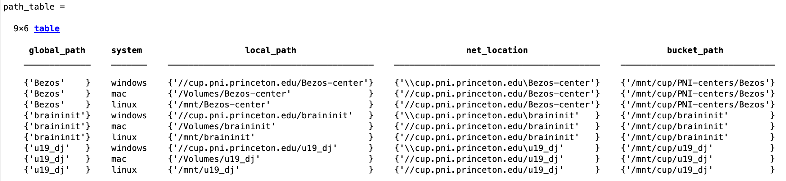

# {{ $frontmatter.title }}

 ## MATLAB

 ### Prerequesites
  1. U19-pipeline-matlab repo added to MATLAB path
  2. Mounted network cup drives (braininit, u19_dj)
  + Check (see <a href="https://braincogs.github.io/software/db_access.html">Database access section</a> ) for more info.
 
 ### Recommended tutorial

 + Go through ```U19-pipeline-matlab/tutorials/202103/session01_queries_fetches.mlx``` to learn basic tips on datajoint.


 + **Useful scripts and functions** for reseacher general use:

 ### Read behavior file:

 1. Execute: (change key for desired session)
 ```
 key = struct('subject_fullname', 'testuser_T06', 'session_date', '2022-04-20');
 [status,data] = lab.utils.read_behavior_file(key)
 ```
 2. If successful ```status = 1``` and ```data = log behavioral file```

 ### Get behavior file location (local & for spock/scotty)

 1. If you only need to know the path of behavior file use:
 ```
 key = struct('subject_fullname', 'testuser_T06', 'session_date', '2022-04-20');
 baseDir = fetch1(acquisition.SessionStarted & key, 'new_remote_path_behavior_file');
 [bucket_path, local_path] =  lab.utils.get_path_from_official_dir(baseDir)
 ```

 ### get_full_trial_data with SpatialTimeBlobs (position, velocity, etc) efficiently with DB

 + New method to retrieve all trial data for multiple sessions faster.
 1. Execute:
 ```
 key = struct('subject_fullname', 'testuser_T06', 'session_date', '2022-04-20');
 get_full_trial_data(key)
 ```

 + Get trial data from joined tables as well:
 1. Get also block data for all trials:
 ```
 key = struct('subject_fullname', 'testuser_T06', 'session_date', '2022-04-20');
 get_full_trial_data(key, behavior.TowersBlockTrial * behavior.TowersBlock)
 ```

 + Get data from subtasks as well
 ```
 key = struct('subject_fullname', 'efonseca_ef114_act114', 'session_date', '2023-01-11');
 all_tables = behavior.TowersBlockTrial * behavior.TowersBlock * behavior_subtask.TwolickspoutsBlockTrial * behavior_subtask.TwolickspoutsBlock
 get_full_trial_data(key, all_tables)
 ```

 ### get path table

 1. Get default paths for network cup drives for different OS and spock/scotty (bucket)
 ```
 key = struct('subject_fullname', 'testuser_T06', 'session_date', '2022-04-20');
 baseDir = fetch1(acquisition.SessionStarted & key, 'new_remote_path_behavior_file');
 [bucket_path, local_path] =  lab.utils.get_path_from_official_dir(baseDir)
 ```
 <figure>
  
  <center><figcaption>Path table data</figcaption></center>
 </figure>


 ### Common errors and troubleshooting

 + Only one session
 + Error using dj.internal.GeneralRelvar/fetch1 (line 250)
 + fetch1 can only retrieve a single existing tuple.