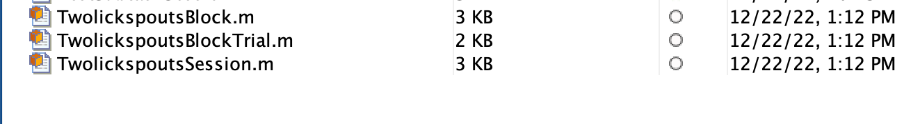
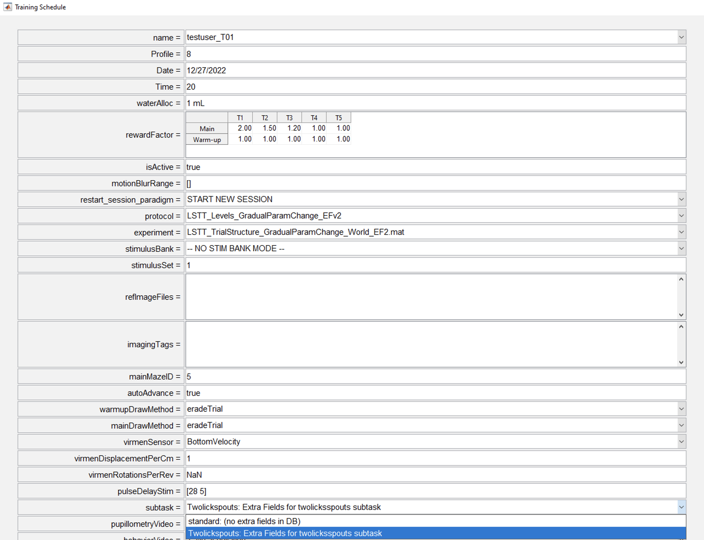

# {{ $frontmatter.title }}

 + This documentation will guide the researcher through the process of creating a new subtask pipeline.
 + Currently in BRAINCoGS data from our well known "VR Towers Task" is stored in the DB.
 + New behavior paradigms include new variables that are not included on our original design:
  + Context task
  + Doorstop task
  + Movie/Stationary task
 + This results on having only a subset of entire data stored on the DB.
 + The subtask pipeline was created to solve this issue. Its goal is to store specific subtask variables in a different subset of tables in the DB.

## What does the “subtask” pipeline include:

 + Minimum data framework to store in a DB all relevant data from "VR Towers Task" variants.
 + Behavior integration. Training system will include the subtask as an option to be selected for a behavior session.

## Prerequisites 

 + In order to create a new manipulation it’s assumed that:
 + The researcher is able to connect to <a href="https://braincogs.github.io/software/db_access.html#db-access-for-matlab-repository">datajoint00.pni.princeton.edu DB</a>
 + Latest version of u19_pipeline_matlab repository.

## Initial set-up 

 + Connect to database ```connect_datajoint00```
 + Create new subtask base code (substitute subtask_name with the real name of the subtask: ```create_new_subtask_classes('(subtask_name)')```
 + This will create table codes templates for subtask : **(Subtask)Session.m, (Subtask)Block.m & (Subtask)Trial.m** on the `U19-pipeline-matlab/schemas/+behavior_subtask` directory:
 + (We will use **“Twolickspouts” subtask** for this example).

 <figure>
  
  <center><figcaption>Files created for Twolickspouts subtask on U19-pipeline-matlab/schemas/+behavior_subtask directory</figcaption></center>
 </figure>

## Table description

 + Throughout the table description chapter we are going to give an example of an already working subtask pipeline. (Twolicksspouts).

 ### task.Subtask table

 + This table registers all subtasks being created with this pipeline.

 ### acquisition.SessionSubtask table

 + This table stores subtask register for a specific behavior session. This table “links” a Task.subtask table with acquisition.Sesison table.

 ### "Subtask" Session table
	
 + The Session table stores related information for the entire session (review acquisition.Session for a related example).

 ### "Subtask" Block table
	
 + The Block table stores related information for each block of the session (review behavior.TowersBlock for a related example).

 ### "Subtask" BlockTrial table
	
 + The BlockTrial table stores related information for each trial of the session (review behavior.TowersBlockTrial for a related example).

 ## Adding code to "Subtask" tables

 + For each subtask you can add all needed variables from the behavior file to the "Subtask" tables.
 + Example for **“Twolickspouts” subtask**

 ### TwolickspoutsSession table code

 ```
  %{
 # Session level data for a twolickspouts subtask session
 -> acquisition.Session
 ---
 %}
 
 classdef TwolickspoutsSession < dj.Imported
 ```

 + There is no extra field to add at session level, no code added to the file.

  ### TwolickspoutsBlock table code

 ```
%{
# Block level data for a twolickspouts subtask session
-> behavior_subtask.TwolickspoutsSession
-> acquisition.SessionBlock
---
sublevel                  : int                           # sublevel for the block
trial_params              : blob                          # maze features of current block
%}
 .
 .

 %%%%%%%%%%%%%%%%%%%%%%%%%%%%%%%%%%
 %%%% fill here read corresponding TestSubtask data for each block
 tuple.sublevel = block_data.sublevel;
 tuple.trial_params = block_data.trialParams;
 %%%%%%%%%%%%%%%%%%%%%%%%%%%%%%%%%%
 ```

 + In this example two fields were added to TwolickspoutsBlock table: (sublevel & trial_params)
 + Two things are needed: 
  1. Adding them to the table definition (1st part of the code block)
  2. Add how this fields are being set from **block_data** variable: (search for **fill here** section on the code). block_data has all block data from behavior file.

 ### TwolickspoutsBlockTrial table code

 ```    
  %{
  # Trial level data for a twolickspouts subtask session
  -> behavior_subtask.TwolickspoutsBlock
  -> acquisition.SessionBlockTrial
  ---
  licks                        : tinyblob                      # all iterations with lick detected and side
  trial_difficult_type         : varchar(16)                   # trial type label (easy, medium, difficult, etc)
  forced_automatic_reward=null : tinyint                       # 1 if reward was forced for trial 0 otherwise
  %}
  .
  .
  %%%%%%%%%%%%%%%%%%%%%%%
  %%%% fill here read corresponding Twolickspouts data for each trial
  trial_data.licks = curr_trial.licks;
  if isfield(curr_trial, 'forced_automatic_reward')
    trial_data.forced_automatic_reward = curr_trial.forced_automatic_reward;
  else
    trial_data.forced_automatic_reward = NaN;
  end
  if isfield(curr_trial, 'trialDifficultyType')
    trial_data.trial_difficult_type = curr_trial.trialDifficultyType;  
  else
    trial_data.trial_difficult_type = '';
  end
  %%%%%%%%%%%%%%%%%%%%%%%%
  ```
 
 + In this example three fields were added to TwolickspoutsBlockTrial table: (licks & trial_difficult_type, forced_automatic_reward)
 + Two things are needed: 
  1. Adding them to the table definition (1st part of the code block)
  2. Add how this fields are being set from **trial_data** variable: (search for **fill here** section on the code). trial_data has all trial data from behavior file.

 ### Create tables

 + After all code has been written on "Subtask"Session, "Subtask"Block & "Subtas"BlockTrial codebase it is needed to actually create the tables in the DB.
 + Execute: ```create_new_subtask_tables('(subtask_name)')```

 ### Training with new subtask

+ After all code for new sbutask has been set up and tables have been created the researcher will be able to select a specific subtask that will be associated with the schedule for a given animal. Subsequent behavior sessions will correspond to that selection.

 <figure>
  
  <center><figcaption>Subtask selection for a training schedule of a subject.</figcaption></center>
 </figure>

 ### Fetching Data

+ After training has occurred all relevant data will be accessible in the corresponding tables on the behavior_subtask DB.
+ <a href="https://docs.datajoint.org/matlab/queries/03-Fetch.html">Datajoint fetch guide</a> 
+ Example to fetch all Twolickspouts data for a single session:

```
key = struct('subject_fullname', 'testuser_T01', 'session_date', '2022-12-27', 'session_number', 1)
fetch(behavior_subtask.TwolickspoutsSession * behavior_subtask.TwolickspoutsBlock * behavior_subtask.TwolickspoutsBlockTrial & key, '*')

ans = 

  5×1 struct array with fields:

    subject_fullname
    session_date
    session_number
    subtask
    block
    trial_idx
    sublevel
    trial_params
    licks
    trial_difficult_type
    forced_automatic_reward
```