# {{ $frontmatter.title }}

 + This documentation will guide the researcher through all steps, tricks & tips to train within the ViRMEn/Datajoint Environment.

## New task Creation 

 ### Prerequisites

 + Read ViRMEn Manual. Access from virmen Repository (login to github first): <a href="https://github.com/BrainCOGS/TankMouseVR/blob/master/ViRMEn%20manual.pdf">Virmen Manual Link</a> 

 ### Initial set-up 

 + Each task is conformed by a group of files (2 .mat files and 4 .m functions) that make everything work. All files are described here:

 #### Experiment code file
 + Located in **ViRMEn\experiments** (Rigs) or **tankmousevr\experiments** (Personal computer) directory.
 + File that controls stimulus presentation and trial/block progression. Each frame this code is executed, it's general structure is a state machine that follow the trial schema.
 + Detailed guide on how to modify things on ViRMEn Manual.
 + Original file: ```C:\Experiments\ViRMEn\experiments\poisson_blocks.m```
 + Most common use: 
  1. Copy the existing Experiment code file from the most similar task.
  2. Rename file to descriptive name (e.g. **"TaskName"_ExperimentCode.mat**)
  3. Change Experiment code logic.
  4. Check "Tips and Tricks to modify Experiment Code" for detailed tips

 <figure>
  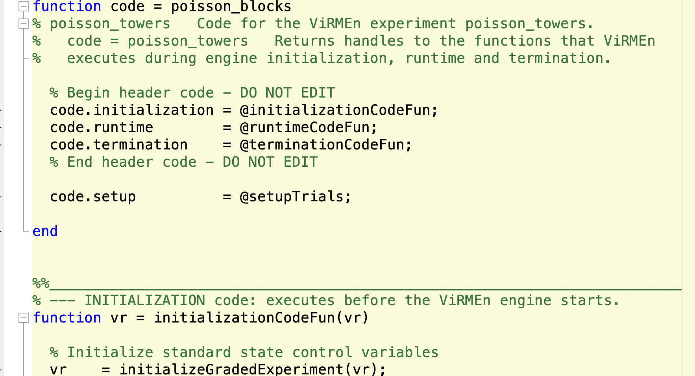
  <center><figcaption>ViRMEn Experiment Code</figcaption></center>
 </figure>

 #### World file
 + Located in **ViRMEn\experiments** (Rigs) or **tankmousevr\experiments** (Personal computer) directory.
 + File that defines the structure of the Virmen world(s) settings.
 + Detailed guide on how to modify things on ViRMEn Manual.
 + Original file: ```C:\Experiments\ViRMEn\experiments\poisson_blocks.mat```
 + Most common use: 
  1. Copy the existing World file from the most similar task.
  2. Rename file to descriptive name (e.g. **"TaskName"_World.mat**)
  3. Execute ```virmen``` in MATLAB and open world (Experiment->Open)
  4. If no object is going to change, just modify **Experiment code** dropdown (Bottom left corner) value to match your experiment code filename. 

 <figure>
  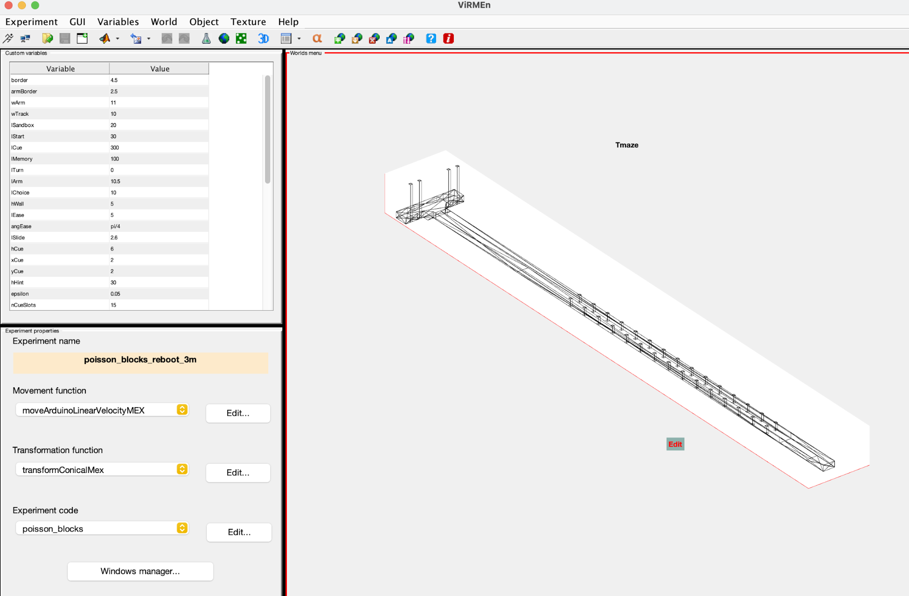
  <center><figcaption>ViRMEn GUI: to modify world files</figcaption></center>
 </figure>

 #### Protocol file
 + Located in **ViRMEn\experiments\protocols** (Rigs) or **tankmousevr\experiments\protocols** (Personal computer) directory.
 + File that declares the number of levels, mazes settings and criteria to decide when to advance subjects to next levels.
 + Original file: ```C:\Experiments\ViRMEn\experiments\protocols\PoissonBlocksCondensed3m.m```

 <figure>
  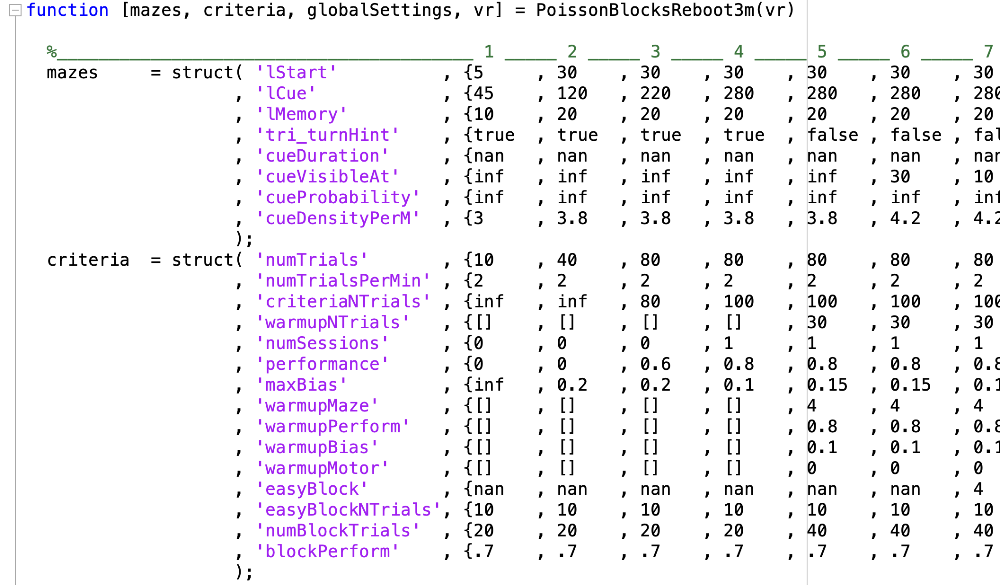
  <center><figcaption>Protocol file Code</figcaption></center>
 </figure>

 + Here are definition of structures and variables in protocol file:
 1. Maze structure:

 | Parameter name   | Definition                                                                                                                             | Values accepted                                                                                              |
 |------------------|----------------------------------------------------------------------------------------------------------------------------------------|--------------------------------------------------------------------------------------------------------------|
 | lStart           | Length of start region on track                                                                                                        | Real number (>0)                                                                                             |
 | lCue             | Length of cue region on track                                                                                                          | Real Number (>0)                                                                                             |
 | lMemory          | Length of delay region on track                                                                                                        | Real Number (>0)                                                                                             |
 | Tri_turnHint     | Are the turn hints present at all?                                                                                                     | logical                                                                                                      |
 | Tri_turnHint_Mem | Are turn hints present during delay period?                                                                                            | logical                                                                                                      |
 | cueDuration      | How long are towers present after they appear (i.e., do they disappear after they are passed, and if yes, after how much time)?        | Real Number (>0, in seconds)                                                                                 |
 | cueVisibleAt     | How far away from the navigator are towers visible?                                                                                    | Real Number (>0)                                                                                             |
 | cueProbability   | Probability parameter that defines the ratio of salient vs. distractor towers                                                          | Real Number (>0, lower numbers make the ratio smaller on average) or inf (places all towers on correct side) |
 | cueDensityPerM   | How many towers per meter in cue region are possible?                                                                                  | Real number                                                                                                  |
 | antiFraction     | Proportion of trials in which the correct choice is away from the side with more towers (i.e., fraction of trials with inverted reward | Real number ([0-1])                                                                                          |
 | world            | Index of Virmen world in vr.worlds for that Maze                                                                                       | Index of virmen world ([1-N], where N is the max number of worlds)                                           |

 2. Maze advancement criteria structure:

 | Parameter name   | Definition                                                                                                                         | Values accepted                                                    |
 |------------------|------------------------------------------------------------------------------------------------------------------------------------|--------------------------------------------------------------------|
 | numTrials        | Minimum number of trials the mouse must spend above performance                                                                    | Natural number                                                     |
 | numTrialsPerMin  | Number of trials required per minute to be considered maintaining “good” performance                                               | Natural number                                                     |
 | criteriaNTrials  | Number of trials in the running window used to measure performance for deciding whether to advance to the next maze                | Natural number                                                     |
 | numSessions      | Minimum number of sessions the navigator must have above criteria before advancing                                                 | Natural number                                                     |
 | Performance      | Minimum performance criterion to advance maze                                                                                      | Real number ([0-1])                                                |
 | maxBias          | Max allowed side bias to advance maze                                                                                              | Real number ([0-1])                                                |
 | warmupMaze       | Index of Virmen world in vr.worlds for the warmup maze for that particular main maze, which occurs at the start of a given session | Index of virmen world ([1-N], where N is the max number of worlds) |
 | warmupPerform    | Minimum performance allowed during warmup to advance to mainMaze                                                                   | Real number ([0-1])                                                |
 | warmupBias       | Max allowed side bias allowed during warmup to advance to main maze                                                                | Real number ([0-1])                                                |
 | warmupMotor      | Max percentage of trials to have "bad" motor quality. (Too much travel distance inside the maze)                                   | Real number ([0-1])                                                                                                                           |                                                      
 | easyBlock        | Index of Virmen world in vr.worlds for the easy block maze for that particular main maze                                           | Index of virmen world ([1-N], where N is the max number of worlds) |
 | easyBlockNTrials | Number of trials in an easy block                                                                                                  | Natural number                                                     |
 | numBlockTrials   | Number of trials within a block used to assess performance for demotion to an easy block                                           | Natural number                                                     |
 | blockPerform     | If running window performance (calculated over numBlockTrials) goes under this value, a switch to the easy block is triggered      | Real number ([0-1])                                                |

  3. Protocol extra variables:

  | Parameter name        | Definition                                                                                                                                                       | Values accepted                                             |
 |-----------------------|------------------------------------------------------------------------------------------------------------------------------------------------------------------|-------------------------------------------------------------|
 | globalSettings        | Defines global settings for all mazes                                                                                                                            | Cell array of name-value pairs (see below for more details) |
 | vr.numMazesInProtocol | Total number of mazes in protocol                                                                                                                                | Natural number (likely the length of mazeIDs)               |
 | vr.stimulusGenerator  | Function to generate stimuli (i.e., distribution of towers along the maze)                                                                                       | @stimulusGeneratorFunc (e.g., @PoissonStimulusTrain)        |
 | vr.stimulusParameters | Parameters for a stimulus inherited when running the experiment (so stimulus parameters that change between mazes but are not defined by the stimuli themselves) | Cell array (see below for more details)                     |
 | vr.inheritedVariables | Parameters for a maze inherited when running the experiment (so maze parameters that change between mazes but are not defined by the stimuli themselves)         | Cell array (see below for more details)                     |

 4. Global settings variables:

 | Parameter name   | Definition                                                                                                                                                                               | Values accepted     |
 |------------------|------------------------------------------------------------------------------------------------------------------------------------------------------------------------------------------|---------------------|
 | cueMinSeparation | Min distance between two towers on the same side                                                                                                                                         | Real number (>0)    |
 | fracDuplicated   | Proportion of trials that are duplicated                                                                                                                                                 | Real number ([0-1]) |
 | trialDuplication | Number of times each set of stimulus parameters are duplicated, for a given fracDuplicated (i.e., number of exact replications of each trial type for the duplicated fraction of trials) | Natural number      |

 #### Stimuli bank file

 + Located in **ViRMEn\experiments\protocols** (Rigs) or **tankmousevr\experiments\protocols** (Personal computer) directory.
 + File that contains stimuli sets that will be drawn for during session. It contains trial data: towers positions, number of towers for each maze level depending on protocol variables.
 + Original file: ```C:\Experiments\ViRMEn\experiments\protocols\stimulus_trains_PoissonBlocksCondensed3m.mat```
 + Most common use:
  1. Create protocol and world files.
  2. Run ```generatePoissonStimuli(('world_file'), @('protocol_file'))```. Substitute **world_file & protocol_file** with corresponding names.

 #### Program wrapper file

 + Located in **ViRMEn\experiments\programs** (Rigs) or **tankmousevr\experiments\programs** (Personal computer) directory.
 + File to set up a cohort of animals on the training GUI.
 + Original file: ```C:\Experiments\ViRMEn\experiments\programs\trainPoissonBlocks_lp_cohort1.m```
 + Most common use:
  1. Copy the existing Program wrapper file from the most similar task.
  2. Rename file to descriptive name (e.g. **train"TaskName"_cohort(n).m**)
  3. In the call to **runCohortExperiment** function rename first 3 parameters:
   + **dataPath:** should be ```C:\Data\(NETID)\(String to represent protocol, task or cohort)```
   + **experName** should be the Experiment Code name (without .m)
   + **cohortName** should be a string to identify Cohort.
  * **experName & cohortName** will be appended to behavior files.

 <figure>
  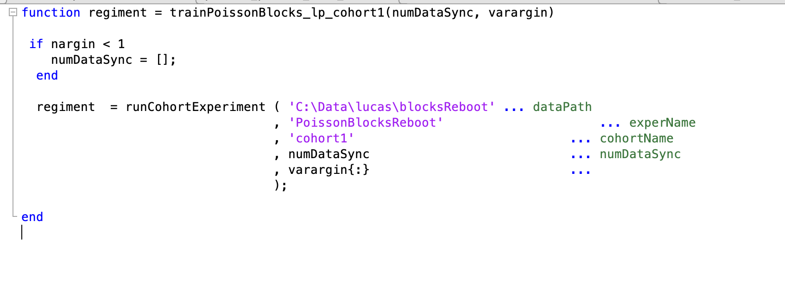
  <center><figcaption>Program Wrapper File</figcaption></center>
 </figure>

 #### RigParameters file

 + Located in **ViRMEn\extras** (Rigs) or **tankmousevr\extras** (Personal computer) directory.
 + File that defines a bunch of parameters to control/adjust hardware, display and motion in task.
 + Only file: ```C:\Experiments\extras\RigParameters.m```
 ##### If working on a rig computer:
  * Most likely that this file has been set up by Lab Manager. Do nothing. 
 ##### If working on a personal computer:
 * The most common use for this file when working on a personal computer is to run ViRMEn simulations without interacting with the hardware, to do this set:
 * ```simulationMode: = true```
 * ```hasDAQ: = false```
 * This will allow you to run simulations on any Windows computer and use the keyboard to simulate mouse movement.

 <figure>
  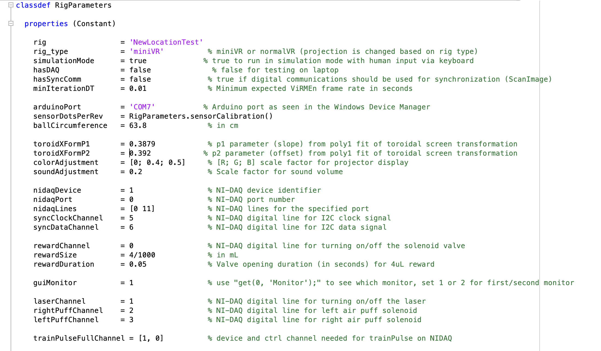
  <center><figcaption>RigParameters File</figcaption></center>
 </figure>

 ## Set up training 

  1. Make sure you have all files needed on the section above.
  2. Run your **Program wrapper file**  (e.g. ```trainPoissonBlocks_lp_cohort1()```).
  3. Training GUI will be shown:

 <figure>
  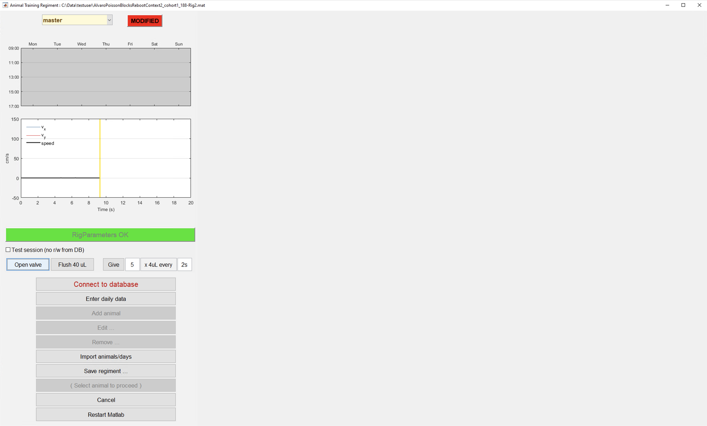
  <center><figcaption>Main screen training GUI</figcaption></center>
 </figure>

  4. Click on **Connect to Database** button.
  5. Click on **Add animal** button.

 <figure>
  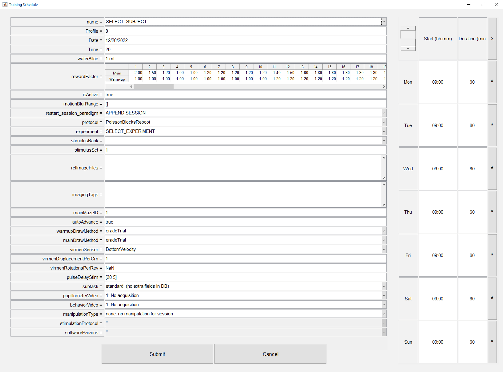
  <center><figcaption>Add animal dialog</figcaption></center>
 </figure>

  6. Fill corresponding information for animal to train (see next section).
  7. Click on **Submit** button.
  9. Repeat steps 5-7 to add all animals from the cohort.
  10. Click on **Save regiment** button.
  11. Click on **"Empty area" section** where desired subject to train is shown.
  12. Click on **TRAIN "SubjectFullname"** button 

 <figure>
  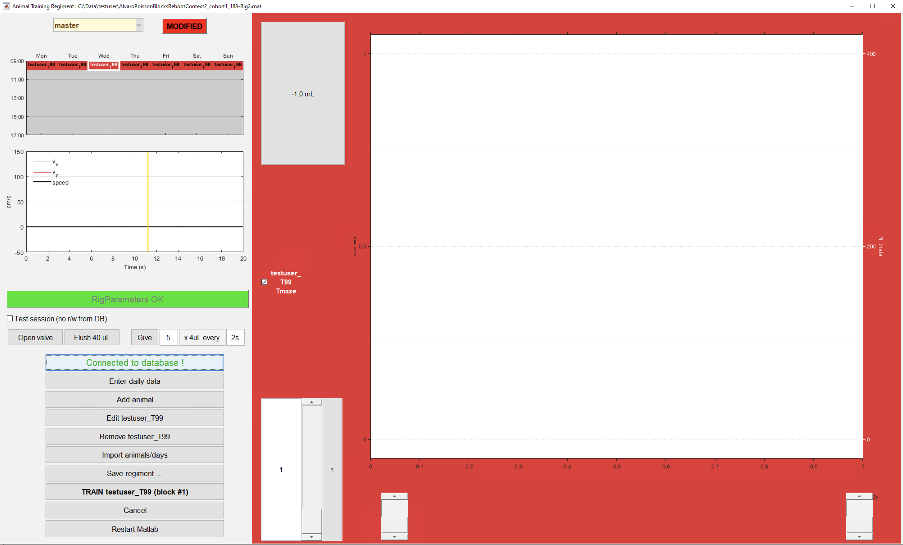
  <center><figcaption>Main screen training GUI with subject</figcaption></center>
 </figure>

 ### Set up motor positioning
  + If the rig where training is happening has a motor positioning system (ask lab manager about it). It is needed to set up initial coordinates for each subject training in the rig.

  1. Adjust subject positioning for the first time in the rig with the motor GUI (installed in the rig computer).

 <figure>
  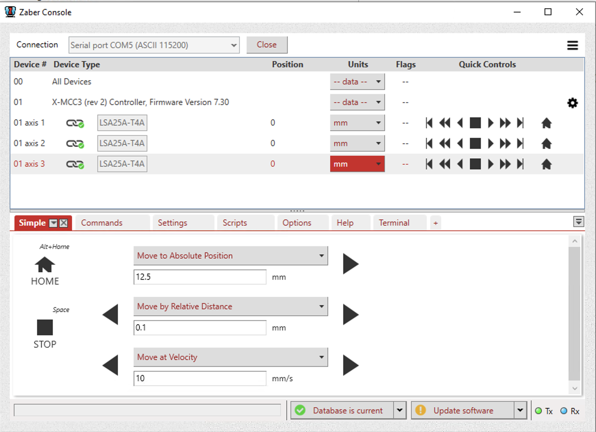
  <center><figcaption>Motor GUI</figcaption></center>
 </figure>

  2. In MATLAB write the following (replace code in brackets with corresponding info for the subject):
  ```
  new_record = struct
  new_record.subject_fullname = ['efonseca_ef481_actpg004']; # Subject fullname 
  new_record.ml_position = [17.5]   # ml position in mm (motor axis#1 position in GUI)
  new_record.ap_position = [10]     # ap position in mm (motor axis#2 position in GUI)
  new_record.dv_position = [15.3]    # dv position in mm (motor axis#3 position in GUI)
  insert(subject.LickometerMotorPosition, new_record)
  ```

 ## Training GUI detailed description

 In this section all elements of the training GUI will be described: 

 <figure>
  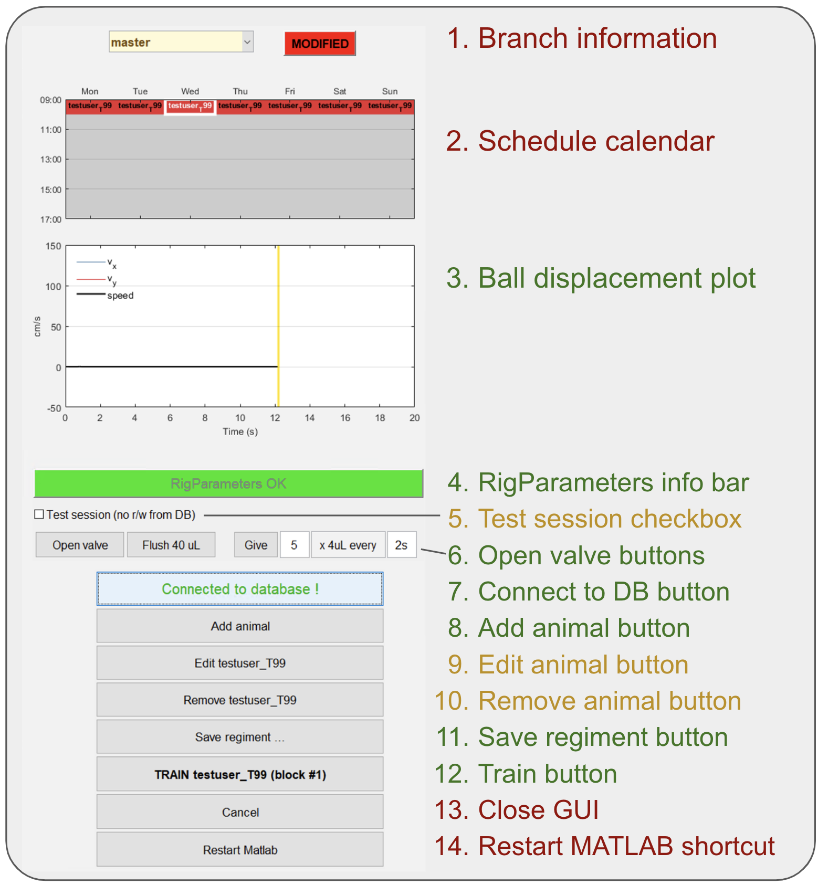
  <center><figcaption>Training GUI main screen parts</figcaption></center>
 </figure>

 + From the main screen we have divided all elements in three categories (<span style="color:red">*red* = rarely used or not used at all; </span><span style="color:rgb(184, 146, 68);">*yellow* = used in specific situations; </span><span style="color:green">*green* = widely used</span>). 
 1. **Branch information section:** For git users, informs which branch is checked out right now and if the current version code has current changes on it. The vast majority of the times it should be written "master" & "synced". Go to section pulling/pushing code if not the case.
 2. **Schedule calendar:** Day of the week & time when subjects should be trained. This information is not crucial for training at the moment.
 3. **Ball displacement plot:** Figure that shows real time velocity in X & Y for the subject in the rig. This plot is used to detect ball movement sensor issues. 
 4. **RigParameters info bar:** This bar is in red color whenever simulation mode is activated or hasDaq parameter is set to false. If this is the case both parameters should be reset for training to start. If simulation mode is intended ignore this bar.
 5. **Test session checkbox:** If next session goal will be to test code or behavior won't be analyzed check this box. Session will not be stored in our DB.
 6. **Open valve buttons:** These buttons are used to give a little reward to subject in rig and/or to test valve function.
 7. **Connect to DB button:** Use this button to connect to DB, it should be the first thing to do when training GUI is open. <a href="https://braincogs.github.io//software/virmen_guide.html#set-up-training">Check set up training seciton</a>  
 8. **Add animal button:** Use this button to add a new subject to cohort. <a href="https://braincogs.github.io//software/virmen_guide.html#set-up-training">Check set up training seciton</a>  and <a href="https://braincogs.github.io//software/virmen_guide.html#add-animal-dialog-detailed-description">Add animal dialog detailed description</a>
 9. **Edit animal button:** Button to change some parameter on the "add animal button" dialog for an already added subject to the cohort.
 10. **Remove animal button:** Button to remove subject from cohort (do this when animal has finished training).
 11. **Save regiment button:** Click this button whenever a subject is added, edited or removed to save changes.
 12. **Train button:** Click this button to start training of selected subject.
 13. **Close GUI:** Click to close GUI.
 14. **Restart MATLAB shortcut:** Click to restart MATLAB.

 ## Add animal dialog detailed description

 <figure>
  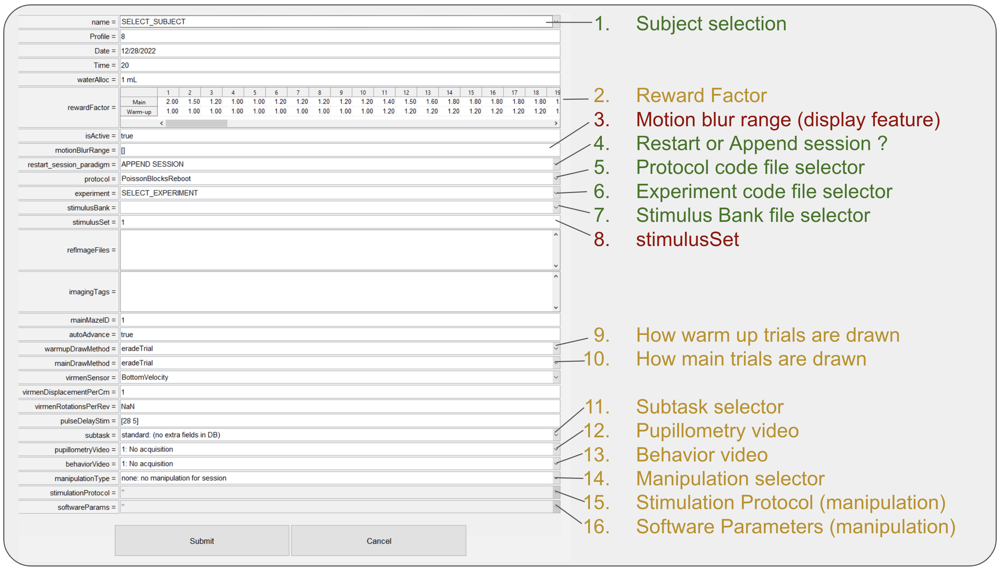
  <center><figcaption>Training GUI main screen parts</figcaption></center>
 </figure>

 + From the add animal dialog we have divided all elements in three categories (<span style="color:red">*red* = rarely used or not used at all; </span><span style="color:rgb(184, 146, 68);">*yellow* = used in specific situations; </span><span style="color:green">*green* = widely used</span>). Sections not described are not used.
 1. **Subject selection:** Dropdown list of all available for training subjects in BRAINCoGS.
 2. **Reward Factor:** Multiplier to be used for reward for each one of the warm-up & main mazes. Regularly reward is 4ul for each correct trial on Towers Task. (e.g. if Reward factor = 1.25 -> Reward = 4*1.25 = 5 ul).
 3. **Motion blur range:** Parameter to set up cue elongation effect opposite to direction of subject motion in virtual reality. 2x1 vector where first element is distance (in cm) from subject to tower cue to start elongation and second element is distance (in cm) to stop elongation effect. Common values: ```[], [28 5]```
 4. **Restart or append session:** Action to perform if a session is restarted. If APPEND SESSION is selected, every time session is restarted, the "new" session will be counted as new blocks of the same session. If START NEW SESSION is selected, every time session is restarted a new session will be created (recommended when physiology recordings are performed to facilitare syncing process)
 5. **Protocol code file selector:** Dropdown to select protocol code file, check <a href="https://braincogs.github.io/software/virmen_guide.html#new-task-creation">New task creation section for detailed information</a>
 6. **Experiment code file selector:** Dropdown to select experiment code file, check <a href="https://braincogs.github.io//software/virmen_guide.html#new-task-creation">New task creation section for detailed information</a>
 7. **Stimulus bank file selector:** Dropdown to select stimulus bank file, check <a href="https://braincogs.github.io//software/virmen_guide.html#new-task-creation">New task creation section for detailed information</a>
 8. **stimulus Set edit:** If stimulus bank has more than one set it can be set from here. Only change this if you know deeply the stimulus bank file and you know what you are doing.
 9. **How warm up trials are drawn:** Strategy to select left or right trials based on previous bias and performance. Default value eradeTrial described <a href=" https://pubmed.ncbi.nlm.nih.gov/11550944/">here</a>
 10. **How main trials are drawn:** Strategy to select left or right trials based on previous bias and performance. Default value eradeTrial described <a href=" https://pubmed.ncbi.nlm.nih.gov/11550944/">here</a>
 11. **Subtask selector:** If session is from a specific subtask you can select it here. Check <a href="https://braincogs.github.io//software/subtask_pipeline.html">subtask pipeline section</a> for more information.
 12. **Pupillometry video:** If pupillometry video is going to be captured, select video parameters here.
 13. **Behavior video:** If behavior video is going to be captured, select video parameters here.
 14. **Manipulation selector:** If session is from a specific manipulation you can select it here. Check <a href="https://braincogs.github.io/software/manipulation_pipeline.html">manipulation pipeline section</a> for more information.
 15. **Stimulation protocol:** If session is from a specific manipulation Select stimulation protocol in this dropdown. Check <a href="https://braincogs.github.io/software/manipulation_pipeline.html">manipulation pipeline section</a> for more information.
 16. **Software parameters:** If session is from a specific manipulation Select software parameters in this dropdown. Check <a href="https://braincogs.github.io/software/manipulation_pipeline.html">manipulation pipeline section</a> for more information.

 ## Tips and Tricks Experiment Code

 ### Add variables to behavior file

 + It is often needed to store more variables to behavior file for further analysis.
 #### Add variables on the trial level
 1. Go to function ```setupTrials``` on the Experiment code
 2. Find line like this: ```cfg.trialData         = { 'trialProb', 'trialType', 'choice', 'trialID' ... ```
 3. Add variable name at the end of **cfg.trialData** cell array.
 + Remember to define that variable as vr.(variableName) on ```initializationCodeFun()``` or ```runtimeCodeFun()``` before 1st trial is over.

  #### Add variables on the block level
 1. Go to function ```setupTrials``` on the Experiment code
 2. Find line like this: ```cfg.blockData         = { 'mazeID', 'mainMazeID', 'motionBlurRange', 'iterStr', 'shapingProtocol' ... ```
 3. Add variable name at the end of **cfg.trialData** cell array.
 + Remember to define that variable as vr.(variableName) on ```initializationCodeFun()``` or ```runtimeCodeFun()``` before 1st trial is over.

 ### Set code ready for simulation

 + It is useful to have Experiment code ready for simulations. To test all changes without interacting with the rig hardware.
 + Setting code for simulation also enable making trial by trial videos with <a href="https://github.com/BrainCOGS/ReproduceTrialTowers">ReproduceTrialTowers repository</a>
 1. Search all lines is experiment code that interact with hardware: (all lines starting with: **nidaq..** and **updateDAQSyncSignals** function. (hardware code lines)
 2. Add this line ```if RigParameters.hasDAQ``` before hardware code lines and close if after them.

 ### Solve common errors during training

 #### Arduino Serial communication error

 + Errors like these:
 ```
 Open failed: Port: COM7 is not available. Available ports: COM1.
 Use INSTRFIND to determine if other instrument objects are connected to the requested device.
 ```
 ```
 Serial communications have not been properly initiated.
 ```
 ```
 Device Error: Unanticipated host error
 ```
 + Are the most common error during training. Check if Arduino COM Port is found in device manager and restart MATLAB and/or system to solve this.

 #### virmen variable not properly set

 ```
 Reference to non-existent field (variable_name)...
 ```
 ```
 Unrecognized field name (variable_name).
 ```
 + This error is solved if variable is initialized in ```initializationCodeFun()``` (e.g: ```vr.(variable_name) = 0```)

 #### Nidaq channel is busy or not found

```
 [nidaqPulseRightReward:commit]  Requested operation could not be performed, because the specified digital lines are either reserved or the device is not present in NI-DAQmx.
 It is possible that these lines are reserved by another task or the device is being reset. If you are using these lines with another task, wait for the task to complete.  If you want to force the other task to relinquish the device, reset the device. If you are resetting the device, wait for the reset to finish.
 Device:  Dev1

 Task Name: RightReward

 Status Code: -200587
```
 + Review **RigParameters.m** file and check that there is no overlap between input/output channel variables: (rewardChannel, laserChannel, rightPuffChannel, leftPuffChannel,rightRewardChannel, leftRewardChannel, newIterationChannel, newTrialChannel, etc.)


